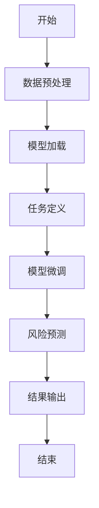
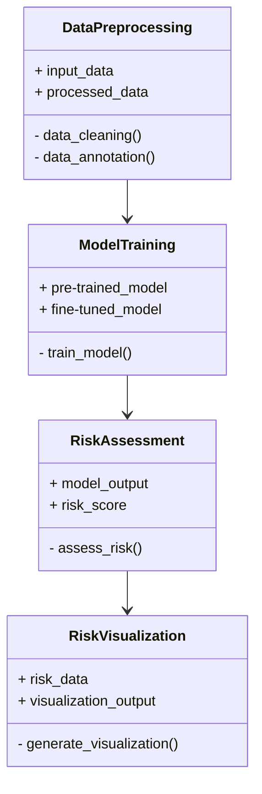
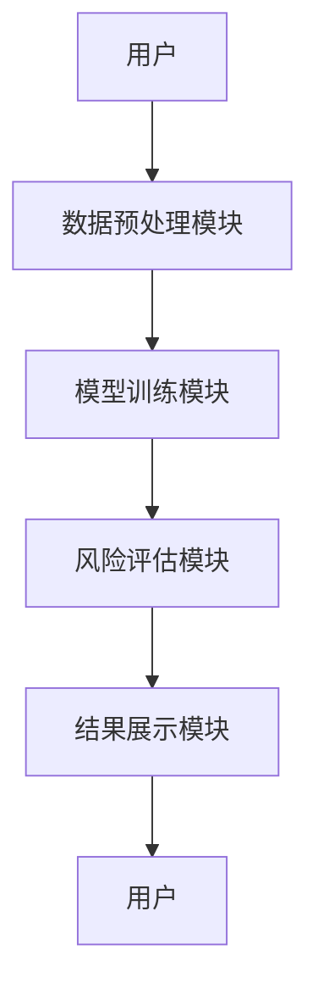
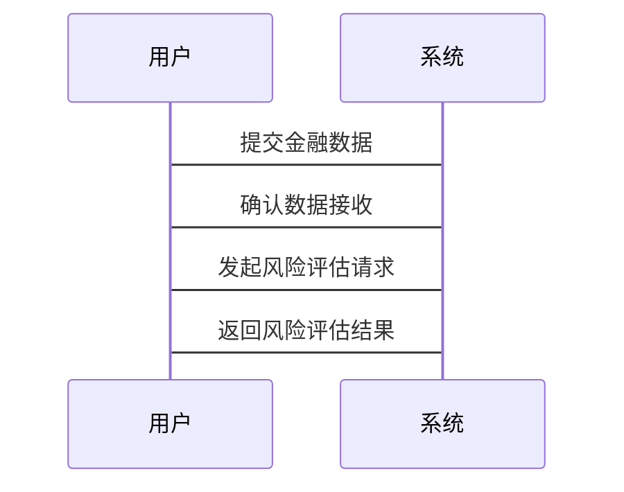

                 


# 大模型在金融风险控制中的创新应用案例

## 关键词：大模型，金融风险控制，创新应用，案例分析，机器学习

## 摘要：大模型在金融风险控制中的创新应用案例探讨了如何利用大模型技术来优化金融风险控制流程。本文首先介绍了大模型的基本概念和金融风险控制的核心概念，然后详细分析了大模型在金融风险控制中的算法原理，包括预训练和微调过程。接着，通过系统分析与架构设计，展示了如何构建一个基于大模型的金融风险控制系统。最后，通过项目实战和最佳实践，提供了具体的实现案例和应用建议，帮助读者更好地理解大模型在金融风险控制中的创新应用。

---

## 第一部分: 大模型在金融风险控制中的创新应用背景

### 第1章: 大模型与金融风险控制概述

#### 1.1 大模型的基本概念
##### 1.1.1 大模型的定义与特点
大模型（Large Language Model, LLM）是指基于深度学习的大型语言模型，通常使用Transformer架构进行训练。其特点包括：
- **大规模参数量**：通常拥有数亿甚至更多的参数。
- **预训练能力**：通过大量未标注数据进行预训练，能够捕捉语言的上下文关系。
- **通用性**：适用于多种任务，如文本生成、问答、分类等。
- **可微调性**：在特定任务上通过微调（Fine-tuning）进一步优化性能。

##### 1.1.2 金融风险控制的核心概念
金融风险控制是指通过分析和预测潜在的金融风险，采取措施以降低或规避风险的过程。核心概念包括：
- **风险识别**：识别潜在的金融风险来源。
- **风险评估**：量化风险的影响程度。
- **风险预测**：预测风险发生的概率和时间。
- **风险应对**：制定应对策略以降低风险。

##### 1.1.3 大模型在金融风险控制中的应用潜力
大模型在金融风险控制中的潜力主要体现在其强大的文本处理能力和对复杂金融数据的理解能力。例如：
- **文本分析**：对新闻、财报等文本数据进行情感分析和主题分类。
- **风险预测**：通过分析历史数据和市场动态，预测市场波动和潜在风险。
- **决策支持**：为金融决策者提供实时的分析和建议。

#### 1.2 金融风险控制的背景与挑战
##### 1.2.1 传统金融风险控制方法的局限性
传统金融风险控制方法主要依赖统计分析和专家经验，存在以下问题：
- **数据依赖性**：需要大量高质量的历史数据，但在某些情况下数据不足。
- **模型假设**：依赖于特定的假设条件，可能导致预测偏差。
- **实时性不足**：传统方法通常需要较长时间的计算，难以满足实时性要求。

##### 1.2.2 大模型在金融风险控制中的优势
大模型在金融风险控制中的优势包括：
- **数据处理能力**：能够处理大规模的非结构化数据，如新闻、社交媒体数据。
- **实时性**：通过在线推理，能够快速响应市场变化。
- **泛化能力**：能够同时处理多种类型的金融数据和任务。

##### 1.2.3 金融风险控制的边界与外延
金融风险控制的边界在于其应用场景和数据范围。外延则包括：
- **跨市场分析**：分析不同市场的相互影响。
- **实时监控**：对金融市场进行实时监控和预警。

#### 1.3 大模型与金融风险控制的结合
##### 1.3.1 大模型在金融风险控制中的核心要素
大模型在金融风险控制中的核心要素包括：
- **模型训练**：通过预训练和微调优化模型性能。
- **数据处理**：对金融数据进行清洗、预处理和标注。
- **任务定义**：明确模型在金融风险控制中的具体任务，如风险分类、预测等。

##### 1.3.2 大模型与金融数据的关系
大模型通过处理金融数据，提取有用的特征和模式，从而辅助风险控制。例如：
- **文本数据**：分析新闻、财报等文本数据，提取情感和主题信息。
- **结构化数据**：分析市场数据、交易数据等结构化数据，预测市场波动。

##### 1.3.3 大模型在金融风险控制中的创新点
大模型的创新点在于其能够同时处理多种类型的数据，并通过深度学习技术捕捉复杂的金融模式。例如：
- **多模态分析**：结合文本、图像等多种数据源进行分析。
- **动态预测**：基于实时数据进行动态预测和调整。

---

## 第二部分: 大模型在金融风险控制中的核心概念

### 第2章: 大模型在金融风险控制中的核心概念

#### 2.1 大模型的核心原理
##### 2.1.1 预训练语言模型的结构与特点
预训练语言模型通常采用Transformer架构，包括编码器和解码器两个部分。其结构特点包括：
- **自注意力机制**：能够捕捉文本中的长距离依赖关系。
- **位置编码**：通过位置编码引入位置信息，保持序列顺序。
- **并行计算**：通过并行计算提高训练效率。

##### 2.1.2 大模型在金融数据处理中的优势
大模型在金融数据处理中的优势包括：
- **非结构化数据处理**：能够处理新闻、社交媒体等非结构化数据。
- **多语言支持**：支持多种语言的金融数据处理。
- **实时推理**：能够快速响应实时查询。

##### 2.1.3 大模型与金融风险控制的结合机制
大模型通过以下机制与金融风险控制结合：
- **文本分析**：对金融文本进行情感分析和主题分类。
- **模式识别**：识别市场波动和风险模式。
- **预测与预警**：基于模型预测潜在风险并发出预警。

#### 2.2 金融风险控制的核心要素
##### 2.2.1 风险识别与评估
风险识别与评估是金融风险控制的第一步，包括：
- **数据收集**：收集相关金融数据，如市场数据、交易数据等。
- **特征提取**：从数据中提取有用的特征，如波动率、相关系数等。
- **风险评估**：评估风险的影响程度，如VaR（Value at Risk）。

##### 2.2.2 风险预测与预警
风险预测与预警是金融风险控制的关键环节，包括：
- **时间序列分析**：分析历史数据，预测未来趋势。
- **模型训练**：训练模型进行风险预测。
- **预警机制**：根据预测结果发出预警信号。

##### 2.2.3 风险应对与控制
风险应对与控制是金融风险控制的最终目标，包括：
- **策略制定**：制定应对风险的策略，如对冲、分散投资等。
- **实时监控**：实时监控市场动态，及时调整策略。
- **反馈机制**：根据实际效果调整模型和策略。

#### 2.3 大模型与金融风险控制的核心联系
##### 2.3.1 大模型在风险识别中的应用
大模型可以通过文本分析和模式识别，帮助识别潜在的金融风险。例如：
- **新闻分析**：分析新闻标题和内容，识别市场情绪。
- **社交媒体分析**：分析社交媒体上的讨论，预测市场趋势。

##### 2.3.2 大模型在风险预测中的应用
大模型可以通过时间序列分析和模型训练，进行风险预测。例如：
- **市场波动预测**：预测股票市场的波动性。
- **信用风险预测**：预测企业违约风险。

##### 2.3.3 大模型在风险应对中的应用
大模型可以通过实时监控和反馈机制，帮助制定和调整风险应对策略。例如：
- **实时监控**：实时监控市场动态，及时发现潜在风险。
- **策略调整**：根据市场变化调整投资组合。

---

## 第三部分: 大模型在金融风险控制中的算法原理

### 第3章: 大模型的算法原理

#### 3.1 大模型的训练过程
##### 3.1.1 预训练阶段
预训练阶段的目标是通过大量未标注数据训练模型，使其能够理解语言的上下文关系。通常采用的预训练任务包括：
- **遮蔽词任务（Masked Language Model）**：随机遮蔽部分词，模型预测被遮蔽的词。
- **下一个词预测任务（Next Sentence Prediction）**：预测句子之间的关系。

##### 3.1.2 微调阶段
微调阶段是根据具体任务对预训练模型进行进一步优化。例如：
- **文本分类任务**：在金融风险控制中，可以将任务定义为二分类问题，如预测某只股票是否为“高风险”。
- **序列标注任务**：对文本进行实体识别或情感分析。

##### 3.1.3 大模型在金融数据上的优化
在金融数据上优化大模型时，需要注意以下几点：
- **数据清洗**：去除噪声数据，确保数据质量。
- **数据增强**：通过数据增强技术增加数据多样性。
- **模型调优**：通过调整超参数优化模型性能。

#### 3.2 大模型的金融风险控制算法实现
##### 3.2.1 算法流程图
以下是一个基于大模型的金融风险控制算法的流程图：



##### 3.2.2 Python代码实现
以下是一个简单的基于大模型的金融风险预测代码示例：

```python
import torch
from torch import nn
import pandas as pd

# 数据预处理
data = pd.read_csv('financial_data.csv')
X = data['text'].values
y = data['risk_label'].values

# 模型定义
class RiskPredictionModel(nn.Module):
    def __init__(self, vocab_size, embedding_dim, hidden_dim):
        super(RiskPredictionModel, self).__init__()
        self.embedding = nn.Embedding(vocab_size, embedding_dim)
        self.lstm = nn.LSTM(embedding_dim, hidden_dim, batch_first=True)
        self.fc = nn.Linear(hidden_dim, 1)

    def forward(self, x):
        embeds = self.embedding(x)
        out, _ = self.lstm(embeds, None)
        out = self.fc(out[:, -1, :])
        return out.squeeze()

# 模型训练
model = RiskPredictionModel(vocab_size, embedding_dim, hidden_dim)
criterion = nn.BCEWithLogitsLoss()
optimizer = torch.optim.Adam(model.parameters(), lr=0.001)

for epoch in range(num_epochs):
    for i in range(len(X)):
        inputs = X[i]
        labels = y[i]
        outputs = model(inputs)
        loss = criterion(outputs, labels)
        optimizer.zero_grad()
        loss.backward()
        optimizer.step()
```

##### 3.2.3 算法数学模型
以下是一个简单的金融风险预测模型的数学表示：

$$
y = \text{sigmoid}(Wx + b)
$$

其中：
- \( y \) 是预测的风险概率。
- \( W \) 是权重矩阵。
- \( x \) 是输入特征向量。
- \( b \) 是偏置项。

---

## 第四部分: 大模型在金融风险控制中的系统分析与架构设计

### 第4章: 大模型的系统分析与架构设计

#### 4.1 金融风险控制系统的基本结构
##### 4.1.1 数据预处理模块
数据预处理模块负责将原始金融数据进行清洗和标注。例如：
- **文本清洗**：去除停用词、标点符号等。
- **数据标注**：根据风险等级对数据进行标注。

##### 4.1.2 模型训练模块
模型训练模块负责对大模型进行预训练和微调。例如：
- **预训练**：使用大规模金融文本数据进行预训练。
- **微调**：根据具体任务对模型进行微调。

##### 4.1.3 风险评估模块
风险评估模块负责根据模型输出结果进行风险评估。例如：
- **风险分类**：将风险分为高、中、低三个等级。
- **风险预测**：预测未来一段时间内的风险概率。

##### 4.1.4 结果展示模块
结果展示模块负责将风险评估结果以可视化形式展示给用户。例如：
- **风险热图**：显示不同资产的风险等级。
- **风险预警**：显示潜在风险的预警信息。

#### 4.2 系统架构设计
##### 4.2.1 系统功能设计
以下是一个基于大模型的金融风险控制系统的功能模块图：



##### 4.2.2 系统架构设计
以下是一个基于大模型的金融风险控制系统的架构图：



##### 4.2.3 系统接口设计
系统接口设计包括：
- **输入接口**：接收金融数据和用户查询。
- **输出接口**：输出风险评估结果和可视化报告。

##### 4.2.4 系统交互流程图
以下是一个基于大模型的金融风险控制系统的交互流程图：



---

## 第五部分: 大模型在金融风险控制中的项目实战

### 第5章: 大模型的项目实战

#### 5.1 项目环境安装
##### 5.1.1 安装必要的库
安装以下库：
```bash
pip install torch transformers pandas matplotlib
```

##### 5.1.2 环境配置
配置运行环境，确保GPU支持。

#### 5.2 系统核心实现
##### 5.2.1 数据预处理代码
以下是一个数据预处理代码示例：

```python
import pandas as pd
import re
from sklearn.preprocessing import LabelEncoder

# 数据加载
data = pd.read_csv('financial_data.csv')

# 文本清洗
def clean_text(text):
    text = re.sub(r'[^\w\s]', '', text)
    return text.lower()

data['cleaned_text'] = data['text'].apply(clean_text)

# 数据标注
labelencoder = LabelEncoder()
data['risk_label'] = labelencoder.fit_transform(data['risk_label'])
```

##### 5.2.2 模型训练代码
以下是一个模型训练代码示例：

```python
import torch
from torch import nn
import pandas as pd

# 数据加载
data = pd.read_csv('financial_data.csv')
X = data['cleaned_text'].values
y = data['risk_label'].values

# 模型定义
class RiskPredictionModel(nn.Module):
    def __init__(self, vocab_size, embedding_dim, hidden_dim):
        super(RiskPredictionModel, self).__init__()
        self.embedding = nn.Embedding(vocab_size, embedding_dim)
        self.lstm = nn.LSTM(embedding_dim, hidden_dim, batch_first=True)
        self.fc = nn.Linear(hidden_dim, 1)

    def forward(self, x):
        embeds = self.embedding(x)
        out, _ = self.lstm(embeds, None)
        out = self.fc(out[:, -1, :])
        return out.squeeze()

# 模型训练
model = RiskPredictionModel(vocab_size, embedding_dim, hidden_dim)
criterion = nn.BCEWithLogitsLoss()
optimizer = torch.optim.Adam(model.parameters(), lr=0.001)

for epoch in range(num_epochs):
    for i in range(len(X)):
        inputs = X[i]
        labels = y[i]
        outputs = model(inputs)
        loss = criterion(outputs, labels)
        optimizer.zero_grad()
        loss.backward()
        optimizer.step()
```

##### 5.2.3 风险评估与可视化
以下是一个风险评估与可视化的代码示例：

```python
import matplotlib.pyplot as plt

# 风险评估
predicted_risk = model.predict(X_test)
actual_risk = y_test

# 风险可视化
plt.scatter(predicted_risk, actual_risk)
plt.xlabel('Predicted Risk')
plt.ylabel('Actual Risk')
plt.title('Risk Prediction Visualization')
plt.show()
```

#### 5.3 实际案例分析
##### 5.3.1 案例背景
假设我们有一个股票市场的数据集，包含股票价格、新闻标题、社交媒体数据等。

##### 5.3.2 案例分析
通过大模型对新闻标题进行情感分析，预测股票价格波动。例如：
- **正面新闻**：预测股票价格上涨。
- **负面新闻**：预测股票价格下跌。

##### 5.3.3 案例结果
通过模型预测，我们可以看到新闻标题的情感与股票价格波动之间的关系。

#### 5.4 项目小结
通过项目实战，我们可以看到大模型在金融风险控制中的强大能力。然而，实际应用中还需要注意以下几点：
- **数据质量**：确保数据的准确性和完整性。
- **模型调优**：通过调整超参数优化模型性能。
- **实时性**：确保模型能够实时响应市场变化。

---

## 第六部分: 大模型在金融风险控制中的最佳实践

### 第6章: 最佳实践

#### 6.1 实践 tips
##### 6.1.1 数据处理 tips
- **数据清洗**：确保数据的准确性和一致性。
- **数据增强**：通过数据增强技术增加数据多样性。
- **数据标注**：确保标注的准确性和一致性。

##### 6.1.2 模型调优 tips
- **超参数调整**：通过网格搜索等方法优化模型性能。
- **模型融合**：通过集成学习提高模型的稳定性和准确性。
- **模型解释性**：通过模型解释性技术（如LIME）理解模型决策过程。

#### 6.2 小结
通过本文的介绍，我们可以看到大模型在金融风险控制中的巨大潜力。然而，实际应用中还需要注意数据质量、模型调优和实时性等问题。

#### 6.3 注意事项
##### 6.3.1 数据隐私
在处理金融数据时，需要注意数据隐私问题，确保数据的安全性和合规性。
##### 6.3.2 模型解释性
模型的解释性对于金融风险控制至关重要，需要通过模型解释性技术理解模型的决策过程。
##### 6.3.3 实时性
实时性是金融风险控制的核心要求，需要通过优化算法和架构提高模型的响应速度。

#### 6.4 拓展阅读
##### 6.4.1 推荐书籍
- 《Deep Learning》
- 《Financial Risk Management》
##### 6.4.2 推荐论文
- "Attention Is All You Need"
- "BERT: Pre-training of Deep Bidirectional Transformers for Natural Language Processing"

---

## 作者：AI天才研究院/AI Genius Institute & 禅与计算机程序设计艺术 /Zen And The Art of Computer Programming

