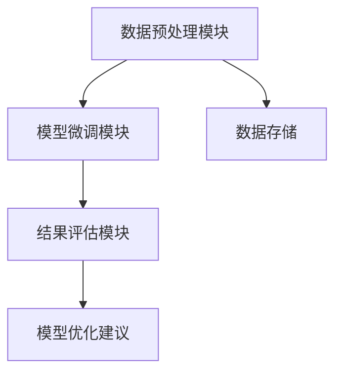

                 


# 大规模预训练模型在金融场景中的迁移学习实践

## 关键词：
大规模预训练模型, 迁移学习, 金融场景, 自然语言处理, 金融NLP, 参数微调

## 摘要：
本文探讨了大规模预训练模型在金融场景中的迁移学习实践，详细分析了迁移学习的基本原理、金融场景中的自然语言处理需求、大规模预训练模型的迁移学习方法，以及在实际项目中的应用。通过系统化的分析和实战案例，展示了如何有效利用迁移学习提升金融领域的NLP任务性能。

---

# 第一部分：大规模预训练模型在金融场景中的迁移学习背景

## 第1章：大规模预训练模型概述

### 1.1 大规模预训练模型的定义与特点

#### 1.1.1 大规模预训练模型的定义
大规模预训练模型是指在海量数据上预先训练的深度学习模型，如BERT、GPT等。这些模型通过自监督学习捕获语言的语法和语义特征，能够生成高质量的文本表示。

#### 1.1.2 大规模预训练模型的核心特点
- **大规模性**：使用海量数据进行预训练，参数量巨大（如BERT有 billions层参数）。
- **通用性**：适用于多种NLP任务，如文本分类、问答系统、机器翻译等。
- **迁移能力**：通过微调可以在特定领域任务中表现出色。

#### 1.1.3 大规模预训练模型与传统NLP模型的对比
| 特性               | 大规模预训练模型                 | 传统NLP模型                     |
|--------------------|----------------------------------|---------------------------------|
| 数据需求           | 需要大量标注或未标注数据         | 需要大量标注数据                 |
| 模型复杂度         | 参数量大，模型深                 | 参数量小，模型浅                 |
| 任务适应性         | 适用于多种任务，迁移能力强       | 适用于特定任务，迁移能力有限     |

### 1.2 迁移学习的背景与意义

#### 1.2.1 迁移学习的基本概念
迁移学习是指将一个领域中学到的知识迁移到另一个领域中，以提高目标领域任务的性能。其核心思想是利用源领域的知识来辅助目标领域的学习。

#### 1.2.2 迁移学习在AI中的重要性
在AI领域，迁移学习能够有效降低对新任务数据的依赖，减少训练时间，提高模型的泛化能力。

#### 1.2.3 迁移学习在金融领域的应用价值
在金融领域，迁移学习可以应用于股票预测、风险评估、欺诈检测等任务，帮助模型快速适应金融领域的特定需求。

## 第2章：金融场景中的自然语言处理需求

### 2.1 金融领域的NLP挑战

#### 2.1.1 金融文本的复杂性
金融文本通常包含大量的专业术语、复杂的句式结构以及隐含的语义信息，增加了NLP任务的难度。

#### 2.1.2 金融领域的专业术语与语义
金融领域有大量独特的术语，如“市盈率”、“ROE”等，这些术语在通用模型中可能未充分覆盖。

#### 2.1.3 金融数据的多样性与稀疏性
金融数据通常具有多样化的来源和格式，但高质量的标注数据往往稀缺。

### 2.2 大规模预训练模型在金融中的应用潜力

#### 2.2.1 金融文本分析的现状与挑战
目前，金融文本分析主要依赖于传统NLP方法，但效果有限。大规模预训练模型的引入为金融NLP带来了新的可能性。

#### 2.2.2 大规模预训练模型在金融NLP中的优势
- **强大的上下文理解能力**：预训练模型能够捕捉复杂的语义关系。
- **迁移能力**：通过微调可以快速适应金融领域任务。

#### 2.2.3 金融场景中迁移学习的必要性
金融场景中的数据通常有限，迁移学习可以帮助模型在有限数据下取得更好的性能。

---

# 第二部分：大规模预训练模型的迁移学习原理

## 第3章：迁移学习的基本原理

### 3.1 迁移学习的核心概念

#### 3.1.1 迁移学习的定义与分类
- **定义**：迁移学习是将源领域知识迁移到目标领域任务的过程。
- **分类**：根据知识的迁移方式，可分为基于特征的迁移和基于参数的迁移。

#### 3.1.2 迁移学习的关键要素
- **源任务**：提供知识的任务。
- **目标任务**：需要提升的任务。
- **共享特征**：源任务和目标任务之间的共同特征。

#### 3.1.3 迁移学习的数学模型
迁移学习的数学模型可以表示为：
$$ L_{\text{total}} = \lambda L_{\text{source}} + (1-\lambda)L_{\text{target}} $$
其中，$\lambda$ 是源任务损失的权重。

### 3.2 迁移学习的算法原理

#### 3.2.1 基于特征的迁移学习
- **特征提取**：提取源任务和目标任务的共享特征。
- **特征变换**：对目标任务的特征进行变换，使其与源任务的特征对齐。

#### 3.2.2 基于参数的迁移学习
- **参数微调**：在目标任务上微调预训练模型的参数。
- **参数适配**：通过适配层（Adapter）等方法，仅调整部分参数。

#### 3.2.3 基于分布的迁移学习
- **分布匹配**：通过对抗训练等方法，使源任务和目标任务的分布趋于一致。

---

## 第4章：大规模预训练模型的迁移学习方法

### 4.1 预训练模型的特征提取

#### 4.1.1 词嵌入的表示方法
预训练模型通过自监督学习生成词嵌入，这些嵌入能够捕捉词义信息。

#### 4.1.2 句子表示的构建
利用预训练模型生成句子或段落的表示，用于后续任务。

#### 4.1.3 文档表示的生成
通过预训练模型生成文档级的表示，用于文本分类等任务。

### 4.2 迁移学习中的参数微调

#### 4.2.1 参数微调的基本原理
在目标任务上对预训练模型进行微调，通常只调整最后一层或部分层的参数。

#### 4.2.2 微调策略的选择与优化
- **学习率调整**：通常使用较小的学习率进行微调。
- **数据增强**：通过数据增强技术提升模型的鲁棒性。

#### 4.2.3 微调过程中的挑战与解决方案
- **数据稀疏性**：目标任务数据不足时，可以通过数据增强或迁移学习解决。

### 4.3 金融场景中的迁移学习挑战

#### 4.3.1 金融领域的数据特点
- 数据标注成本高。
- 数据分布可能与预训练数据不同。

#### 4.3.2 金融场景中的迁移学习挑战
- 数据稀疏性。
- 领域特定的术语。

#### 4.3.3 解决方案
- 使用领域特定的预训练模型。
- 数据增强技术。

---

## 第5章：金融场景中的迁移学习策略

### 5.1 金融领域的数据特点

#### 5.1.1 金融数据的标注与清洗
- 数据清洗：去除噪声数据。
- 数据标注：对金融数据进行标注。

#### 5.1.2 金融数据的分布偏移
- 数据分布可能与预训练数据不同，导致模型性能下降。

#### 5.1.3 金融数据的隐私保护
- 数据隐私保护是金融场景中的重要问题。

### 5.2 金融场景中的迁移学习挑战

#### 5.2.1 数据
- 数据稀疏性：金融领域的标注数据通常有限。

#### 5.2.2 任务
- 任务的复杂性：金融任务通常涉及复杂的决策过程。

#### 5.2.3 模型
- 模型的适应性：需要模型能够适应金融领域的特定需求。

### 5.3 迁移学习在金融场景中的具体应用

#### 5.3.1 股票预测
- 使用预训练模型进行股票价格预测。
- 通过迁移学习提升预测准确性。

#### 5.3.2 风险评估
- 使用迁移学习对客户进行信用评估。

#### 5.3.3 欺诈检测
- 通过迁移学习检测金融交易中的欺诈行为。

---

# 第三部分：大规模预训练模型在金融场景中的迁移学习实践

## 第6章：系统架构与设计

### 6.1 系统功能设计

#### 6.1.1 数据预处理模块
- 数据清洗：去除噪声数据。
- 数据增强：增加数据多样性。

#### 6.1.2 模型微调模块
- 参数微调：在目标任务上微调预训练模型。
- 模型适配：通过适配层优化模型。

#### 6.1.3 结果评估模块
- 性能评估：使用准确率、F1分数等指标评估模型性能。

### 6.2 系统架构设计



---

## 第7章：项目实战

### 7.1 项目环境安装

#### 7.1.1 安装Python
```bash
python --version
pip install --upgrade pip
```

#### 7.1.2 安装TensorFlow
```bash
pip install tensorflow
pip install transformers
```

### 7.2 核心代码实现

#### 7.2.1 数据加载与预处理
```python
import pandas as pd
from transformers import AutoTokenizer, AutoModelForMaskedLM

# 加载预训练模型
model_name = "bert-base-cased"
tokenizer = AutoTokenizer.from_pretrained(model_name)
model = AutoModelForMaskedLM.from_pretrained(model_name)
```

#### 7.2.2 模型微调
```python
from transformers import TrainingArguments, Trainer

args = TrainingArguments(
    output_dir='./output',
    num_epochs=3,
    per_device_train_batch_size=16,
    per_device_eval_batch_size=16,
)

trainer = Trainer(
    model=model,
    args=args,
    tokenizer=tokenizer,
)
```

#### 7.2.3 模型评估
```python
results = trainer.evaluate()
print(results)
```

### 7.3 实际案例分析

#### 7.3.1 股票价格预测
- 数据来源：股票历史价格数据。
- 模型训练：使用迁移学习训练股票价格预测模型。
- 结果分析：评估模型的预测准确性。

#### 7.3.2 风险评估
- 数据来源：客户信用数据。
- 模型训练：使用迁移学习训练风险评估模型。
- 结果分析：评估模型的风险评估能力。

### 7.4 项目小结
通过实际案例分析，验证了迁移学习在金融场景中的有效性，迁移学习能够显著提升模型的性能。

---

## 第8章：总结与展望

### 8.1 迁移学习在金融场景中的总结
- 迁移学习能够有效提升金融场景中的NLP任务性能。
- 预训练模型的迁移能力是金融场景中的重要优势。

### 8.2 迁移学习的未来展望
- 更多领域的预训练模型将被开发。
- 迁移学习算法将更加高效和灵活。

### 8.3 最佳实践 tips
- 数据清洗与增强是关键。
- 模型选择与调优需要仔细考虑。

### 8.4 注意事项
- 数据隐私保护是重要问题。
- 模型的可解释性需要关注。

### 8.5 拓展阅读
建议阅读以下文献：
- "Pre-training of Textual Association for Financial Texts"。
- "Financial Text Classification Using Pre-trained Language Models"。

---

# 作者：AI天才研究院/AI Genius Institute & 禅与计算机程序设计艺术 /Zen And The Art of Computer Programming

