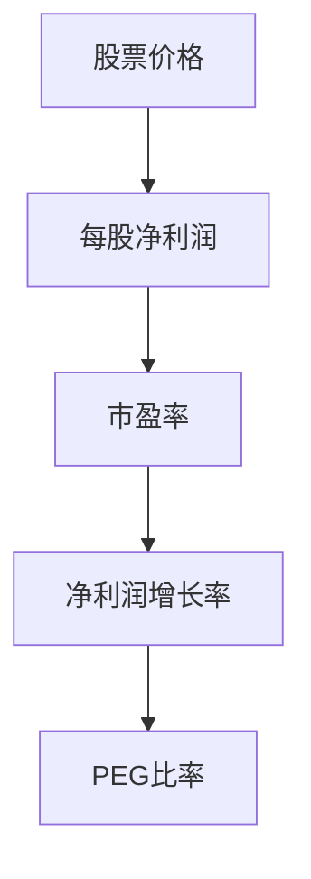

                 


# 如何利用PEG比率进行企业估值

> 关键词：PEG比率，企业估值，市盈率，净利润增长率，投资决策

> 摘要：PEG比率（Price/Earnings to Growth）是一种结合市盈率和净利润增长率的企业估值指标，能够更全面地评估企业的投资价值。本文将从PEG比率的定义、公式、计算方法、应用场景、实际案例分析以及与其他估值方法的对比等多个角度，深入探讨如何利用PEG比率进行企业估值，并通过可视化工具和代码实现进一步分析。

---

# 第一部分: PEG比率的基础知识

## 第1章: PEG比率的定义与背景

### 1.1 什么是PEG比率

PEG比率（Price/Earnings to Growth）是一种用于评估企业投资价值的指标，结合了市盈率（P/E）和净利润增长率（Earnings Growth）。其核心思想是：在评估企业价值时，不仅要考虑当前的盈利能力（市盈率），还要考虑企业的成长性（净利润增长率）。

- **市盈率（P/E）**：市盈率是衡量股票价格与每股净利润之间的关系，公式为：
  $$ P/E = \frac{股票价格}{每股净利润} $$
  市盈率反映了市场对公司净利润的估值倍数。

- **净利润增长率**：净利润增长率是衡量企业盈利能力增长的速度，公式为：
  $$ \text{净利润增长率} = \frac{\text{当年净利润} - \text{去年净利润}}{\text{去年净利润}} \times 100\% $$

PEG比率通过将市盈率与净利润增长率结合，旨在更全面地评估企业的估值。

### 1.2 PEG比率的公式与计算方法

PEG比率的公式为：
$$ PEG = \frac{P/E}{\text{净利润增长率}} $$

例如，假设某公司的市盈率为20，净利润增长率为10%，则其PEG比率为：
$$ PEG = \frac{20}{10\%} = 20 $$

---

## 第2章: PEG比率的理论基础

### 2.1 市盈率与PEG比率的关系

市盈率是PEG比率的基础，但市盈率本身存在一些局限性：
- **市盈率无法反映企业的成长性**：高市盈率的公司可能只是因为市场预期其未来盈利会增长，而当前盈利可能并不高。
- **市盈率受行业和经济周期影响**：不同行业和经济周期下，市盈率的合理区间差异较大。

PEG比率通过引入净利润增长率，弥补了市盈率无法反映成长性的缺陷。

### 2.2 PEG比率的数学模型

PEG比率的数学模型如下：
$$ PEG = \frac{P/E}{\text{净利润增长率}} $$

其中：
- **P/E**：市盈率
- **净利润增长率**：企业的净利润年增长率

### 2.3 PEG比率的属性特征对比

| 指标         | 市盈率（P/E）       | 净利润增长率         | PEG比率         |
|--------------|---------------------|--------------------|-----------------|
| 定义         | 股票价格/每股净利润 | 净利润增长速度       | 市盈率/净利润增长率 |
| 优点         | 反映市场对净利润的估值 | 反映企业的成长性     | 结合估值与成长性 |
| 缺点         | 无法反映成长性       | 无法反映估值倍数     | 取决于市盈率和净利润增长率的准确性 |
| 应用场景       | 初步估值            | 预测企业未来盈利     | 综合评估企业价值 |

---

## 第3章: PEG比率的可视化与实体关系分析

### 3.1 PEG比率的可视化分析

#### 3.1.1 PEG比率的流程图


#### 3.1.2 实体关系图


### 3.2 PEG比率的系统架构图


---

# 第二部分: PEG比率的算法原理

## 第4章: PEG比率的计算与应用

### 4.1 PEG比率的计算步骤

1. **计算市盈率（P/E）**：
   $$ P/E = \frac{\text{股票价格}}{\text{每股净利润}} $$
2. **计算净利润增长率**：
   $$ \text{净利润增长率} = \frac{\text{当年净利润} - \text{去年净利润}}{\text{去年净利润}} \times 100\% $$
3. **计算PEG比率**：
   $$ PEG = \frac{P/E}{\text{净利润增长率}} $$

### 4.2 PEG比率的应用场景

- **成长型企业的估值**：PEG比率特别适合评估成长型企业，因为这类企业通常具有较高的净利润增长率。
- **价值投资的筛选**：通过PEG比率，投资者可以筛选出估值低于行业平均水平的成长型企业。
- **行业间对比**：不同行业的PEG比率差异较大，因此在跨行业比较时需要结合行业特性。

---

## 第5章: PEG比率的实际案例分析

### 5.1 案例背景

假设我们有两家公司：A公司和B公司。

| 公司 | 股票价格 | 每股净利润 | 净利润增长率 |
|------|----------|------------|--------------|
| A    | 50       | 10         | 20%           |
| B    | 40       | 8          | 10%           |

### 5.2 计算PEG比率

对于A公司：
$$ P/E = \frac{50}{10} = 5 $$
$$ PEG = \frac{5}{20\%} = 25 $$

对于B公司：
$$ P/E = \frac{40}{8} = 5 $$
$$ PEG = \frac{5}{10\%} = 50 $$

### 5.3 分析与结论

- A公司的PEG比率为25，B公司的PEG比率为50。这意味着在相同市盈率下，A公司的PEG比率更低，说明其估值相对更合理，投资价值可能更高。

---

## 第6章: PEG比率的局限性与改进建议

### 6.1 PEG比率的局限性

- **净利润增长率的准确性**：净利润增长率需要依赖财务报表，可能存在会计操纵的风险。
- **行业差异**：不同行业的PEG比率差异较大，需要结合行业特性进行分析。
- **短期波动性**：净利润增长率可能受短期经济波动影响，无法完全反映企业的长期成长性。

### 6.2 改进建议

- **结合其他指标**：将PEG比率与其他估值指标（如市净率、股息率等）结合使用，以全面评估企业价值。
- **长期增长率分析**：关注企业的长期增长率，而不仅仅是短期数据。
- **行业基准对比**：在进行PEG比率分析时，应结合行业平均水平进行对比。

---

# 第三部分: PEG比率的代码实现与可视化

## 第7章: 使用Python进行PEG比率计算

### 7.1 环境安装

- **Python版本**：Python 3.9+
- **依赖库**：Pandas、Matplotlib、Seaborn

### 7.2 核心代码实现

```python
import pandas as pd
import matplotlib.pyplot as plt
import seaborn as sns

# 示例数据
data = {
    '公司': ['A', 'B', 'C'],
    '股票价格': [50, 40, 60],
    '每股净利润': [10, 8, 12],
    '净利润增长率': [0.2, 0.1, 0.15]
}

df = pd.DataFrame(data)

# 计算市盈率
df['市盈率'] = df['股票价格'] / df['每股净利润']

# 计算PEG比率
df['PEG比率'] = df['市盈率'] / df['净利润增长率']

print(df)
```

### 7.3 数据可视化

```python
plt.figure(figsize=(10, 6))
sns.barplot(x='公司', y='PEG比率', data=df)
plt.title('PEG比率对比')
plt.xlabel('公司')
plt.ylabel('PEG比率')
plt.show()
```

---

## 第8章: PEG比率的可视化与交互分析

### 8.1 使用Plotly进行交互式可视化

```python
import plotly.express as px

# 示例数据
data = {
    '公司': ['A', 'B', 'C'],
    'PEG比率': [25, 50, 15],
    '行业平均PEG': [20, 30, 25]
}

df = pd.DataFrame(data)

fig = px.bar(df, x='公司', y='PEG比率', title='PEG比率对比')
fig.add_scatter(x=df['公司'], y=df['行业平均PEG'], mode='lines', name='行业平均PEG')
fig.show()
```

---

## 第9章: PEG比率的扩展与优化

### 9.1 扩展：动态PEG比率

动态PEG比率考虑了企业未来盈利的预期增长率，公式为：
$$ \text{动态PEG} = \frac{P/E}{\text{未来预期净利润增长率}} $$

### 9.2 优化：结合ROE的PEG比率

结合ROE（净资产收益率）的PEG比率公式为：
$$ \text{优化PEG} = \frac{P/E}{\text{净利润增长率} \times \text{ROE}} $$

---

# 第四部分: 总结与展望

## 第10章: 总结与展望

### 10.1 总结

PEG比率是一种结合市盈率和净利润增长率的企业估值指标，能够更全面地评估企业的投资价值。通过本文的分析，我们了解了PEG比率的定义、公式、计算方法、应用场景以及实际案例分析。

### 10.2 展望

未来，随着大数据和人工智能技术的发展，PEG比率的计算和分析将更加智能化。投资者可以通过机器学习模型预测企业的未来净利润增长率，从而更精准地计算动态PEG比率，进一步优化投资决策。

---

# 作者：AI天才研究院/AI Genius Institute & 禅与计算机程序设计艺术 /Zen And The Art of Computer Programming

---

通过本文的系统讲解，我们深入探讨了如何利用PEG比率进行企业估值。从理论基础到实际应用，再到代码实现和可视化分析，相信读者能够全面掌握PEG比率的使用方法，并在实际投资中灵活运用。

