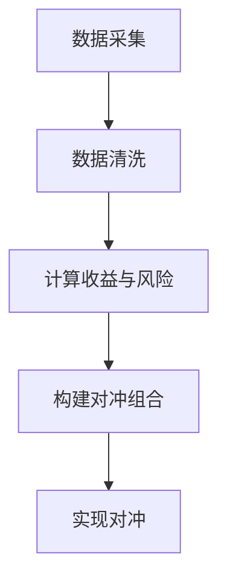
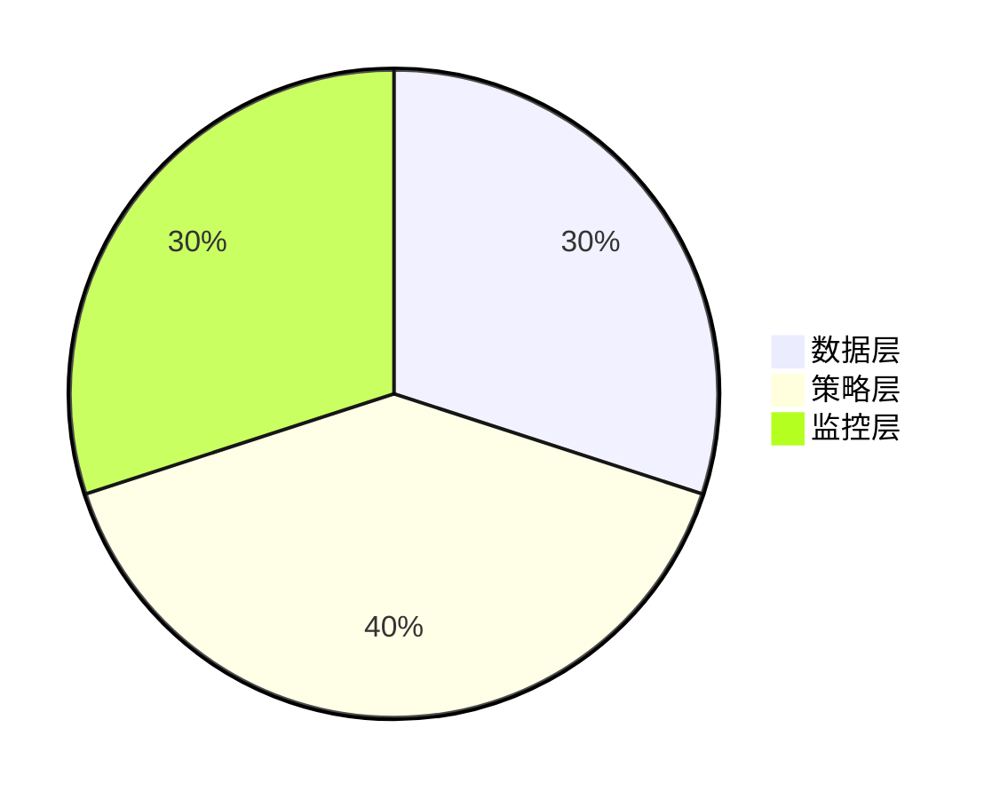

                 


# 如何利用特价股票策略构建长期数字主权与隐私保护对冲组合

## 关键词：特价股票策略、数字主权、隐私保护、对冲组合、风险管理、量化投资、金融建模

## 摘要：  
本文详细探讨如何利用特价股票策略构建长期数字主权与隐私保护对冲组合。通过对数字主权、隐私保护及对冲组合的深入分析，结合量化投资和金融建模，提出了一种基于特价股票策略的对冲组合构建方法。文章从背景介绍、核心概念与联系、算法原理、数学模型、系统分析与架构设计、项目实战到最佳实践，全面阐述了如何在保护隐私的前提下，利用特价股票策略实现长期投资目标。

---

## 第一部分：背景介绍

### 第1章：特价股票策略的背景与意义  
#### 1.1 特价股票策略的定义与特点  
- 特价股票策略是指通过分析市场波动、公司基本面和技术指标，寻找被低估的股票进行投资，以期获得超额收益。  
- 特价股票策略的特点包括低风险、高收益、周期性较强。  

#### 1.2 数字主权与隐私保护的重要性  
- 数字主权是指国家对数字资源和数字资产的自主控制权，是保障国家安全的重要组成部分。  
- 隐私保护是数字时代的基本人权，涉及个人数据的安全与合规性。  

#### 1.3 对冲组合的基本概念  
- 对冲组合是一种通过多空头寸组合来降低风险的投资策略。  
- 对冲组合的核心目标是通过风险对冲实现收益的最大化。  

---

## 第二部分：核心概念与联系  

### 第2章：特价股票策略与数字主权的关系  
#### 2.1 特价股票策略对数字主权的影响  
- 特价股票策略的应用需要依赖数据和技术，而数据的获取和使用可能涉及隐私问题。  
- 通过数字主权的保护，可以确保数据的合法性和合规性。  

#### 2.2 特价股票策略与隐私保护的联系  
- 隐私保护是实现数字主权的重要手段，也是特价股票策略实施的基础。  
- 通过隐私保护，可以避免数据泄露和滥用，确保投资策略的安全性。  

#### 2.3 对冲组合与数字主权的关系  
- 对冲组合需要依赖数据和技术，而数字主权的保护可以确保数据的合法性和合规性。  
- 通过对冲组合，可以在保护隐私的前提下实现收益的最大化。  

---

## 第三部分：算法原理  

### 第3章：基于特价股票策略的对冲组合算法  
#### 3.1 算法原理  
- 算法通过分析市场数据，寻找被低估的股票，构建多空头寸组合，实现对冲。  
- 算法的核心是基于量化投资和金融建模的技术，确保对冲组合的风险可控。  

#### 3.2 算法实现  
```python
import numpy as np
import pandas as pd

def calculate_return(prices):
    returns = prices.pct_change()
    return returns.dropna()

def calculate_volatility(returns):
    volatility = returns.std()
    return volatility

def optimize_portfolio(returns, weights):
    # 计算投资组合的收益和风险
    portfolio_return = np.dot(returns.mean(), weights)
    portfolio_risk = np.sqrt(np.dot(weights.T, np.dot(returns.cov(), weights)))
    return portfolio_return, portfolio_risk
```

#### 3.3 算法流程图  


---

## 第四部分：数学模型  

### 第4章：数学模型与公式  
#### 4.1 优化模型  
$$ \text{Maximize } \mu - \lambda \sigma^2 $$  
其中，$\mu$ 是收益，$\sigma^2$ 是风险，$\lambda$ 是风险偏好系数。  

#### 4.2 概率分布  
$$ P(r) = \frac{1}{\sqrt{2\pi\sigma^2}} e^{-\frac{(r-\mu)^2}{2\sigma^2}} $$  
其中，$r$ 是收益率，$\mu$ 是均值，$\sigma^2$ 是方差。  

---

## 第五部分：系统分析与架构设计  

### 第5章：系统分析与架构设计  
#### 5.1 问题场景  
- 数据来源：股票市场数据、公司基本面数据。  
- 问题：如何利用特价股票策略构建对冲组合，实现长期投资目标。  

#### 5.2 系统架构设计  


---

## 第六部分：项目实战  

### 第6章：项目实战  
#### 6.1 环境安装  
- Python 3.8+  
- Pandas、NumPy、Scipy 等库。  

#### 6.2 核心代码实现  
```python
import numpy as np
import pandas as pd

def calculate_return(prices):
    returns = prices.pct_change()
    return returns.dropna()

def calculate_volatility(returns):
    volatility = returns.std()
    return volatility

def optimize_portfolio(returns, weights):
    portfolio_return = np.dot(returns.mean(), weights)
    portfolio_risk = np.sqrt(np.dot(weights.T, np.dot(returns.cov(), weights)))
    return portfolio_return, portfolio_risk
```

---

## 第七部分：最佳实践  

### 第7章：总结与展望  
#### 7.1 总结  
- 特价股票策略是一种有效的投资工具，可以结合数字主权和隐私保护，构建对冲组合。  
- 对冲组合的构建需要依赖数据和技术，确保数据的合法性和合规性。  

#### 7.2 小结  
- 本文提出了基于特价股票策略的对冲组合构建方法，为投资者提供了一种新的投资思路。  
- 未来的研究方向包括数据隐私保护技术的应用和对冲组合优化算法的改进。  

---

## 注意事项：  
- 在实际操作中，需注意数据来源的合法性和合规性。  
- 风险管理是投资的重要环节，需时刻关注市场波动和数据安全。  

## 拓展阅读：  
- 《量化投资入门》  
- 《数据隐私保护技术与应用》  

---

## 作者：AI天才研究院/AI Genius Institute & 禅与计算机程序设计艺术 /Zen And The Art of Computer Programming  

--- 

**本文由AI天才研究院/AI Genius Institute及Zen And The Art of Computer Programming联合发布。**

