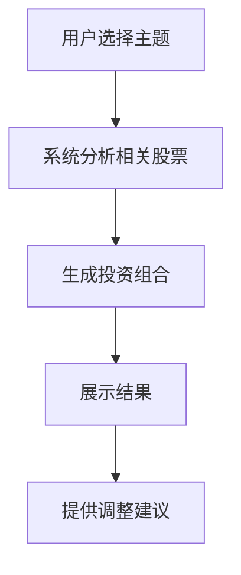

                 


# 如何利用特价股票策略进行全球主题性投资

> 关键词：特价股票，主题性投资，股票筛选，投资策略，全球市场

> 摘要：本文详细探讨了如何利用特价股票策略在全球范围内进行主题性投资。通过分析特价股票的特点、主题性投资的核心要素，结合数学模型和算法原理，提出了一种有效的投资策略。文章还设计了投资决策支持系统的架构，并通过实战案例展示了策略的应用，为投资者提供了实用的指导。

---

# 第一部分: 特价股票策略与全球主题性投资概述

## 第1章: 特价股票策略与主题性投资的背景

### 1.1 特价股票策略的定义与特点
#### 1.1.1 特价股票的定义
特价股票是指市场价格低于其内在价值的股票，通常用于形容那些价格被市场低估的股票。这些股票可能由于市场波动、行业周期或其他外部因素而导致价格暂时性下跌，但其内在价值并未受到影响。

#### 1.1.2 特价股票的核心特点
| 特点 | 描述 |
|------|------|
| 低估值 | 市盈率（P/E）和市净率（P/B）低于行业平均水平。 |
| 高股息率 | 通常提供较高的股息回报。 |
| 行业分布广泛 | 可分布在科技、金融、制造等多个行业。 |

#### 1.1.3 特价股票与普通股票的区别
| 维度 | 特价股票 | 普通股票 |
|------|--------|----------|
| 估值 | 低于内在价值 | 可能高于或等于内在价值 |
| 风险 | 较低，由于价格被低估 | 风险较高，价格可能被高估 |
| 投资策略 | 长期持有，等待价值回归 | 短期波动较大，适合高频交易 |

### 1.2 全球主题性投资的背景与趋势
#### 1.2.1 全球主题性投资的定义
主题性投资是指根据特定主题或趋势（如科技、环保、人工智能等）进行的投资。投资者选择与这些主题相关的公司股票，以期获得超额收益。

#### 1.2.2 全球经济与市场的主题性变化
随着全球经济的发展和技术的进步，新的主题不断涌现。例如，人工智能、5G通信、绿色能源等领域成为投资者关注的热点。

#### 1.2.3 主题性投资的潜在机会与挑战
- **机会**：能够捕捉到新兴行业的增长潜力。
- **挑战**：主题变化快，市场波动大，需要及时调整投资策略。

### 1.3 特价股票策略与主题性投资的结合
#### 1.3.1 特价股票策略在主题性投资中的作用
通过筛选特定主题下价格被低估的股票，投资者可以在主题性投资中获得更高的风险调整后收益。

#### 1.3.2 特价股票策略与主题性投资的协同效应
- **双重筛选**：首先根据主题筛选相关股票，再通过特价股票的估值指标进行进一步筛选。
- **风险分散**：通过结合主题和估值，降低单一主题风险。

#### 1.3.3 特价股票策略在不同市场环境下的应用
- **熊市**：寻找价格被严重低估的股票，等待市场回升。
- **牛市**：在热门主题中寻找低估股票，获得双重收益。

---

## 第2章: 特价股票策略的核心概念与分析框架

### 2.1 特价股票的筛选标准
#### 2.1.1 市净率（P/B）分析
市净率是股票的市场价格与每股净资产的比率。P/B < 1通常被视为低估的信号。

$$ P/B = \frac{\text{市场价格}}{\text{每股净资产}} $$

#### 2.1.2 市盈率（P/E）分析
市盈率是股票的市场价格与每股收益的比率。P/E < 行业平均P/E可能表示低估。

$$ P/E = \frac{\text{市场价格}}{\text{每股收益}} $$

#### 2.1.3 股息率与股息支付率分析
高股息率的股票通常被视为价值股，股息支付率高表明公司盈利稳定。

$$ \text{股息率} = \frac{\text{每股股息}}{\text{股价}} \times 100\% $$
$$ \text{股息支付率} = \frac{\text{股息支付总额}}{\text{净利润}} \times 100\% $$

### 2.2 主题性投资的核心要素
#### 2.2.1 主题性投资的驱动因素
- **技术进步**：如人工智能、区块链。
- **政策变化**：如环保政策、能源转型。
- **市场需求**：如消费升级、健康医疗。

#### 2.2.2 主题性投资的周期性分析
主题投资往往具有周期性，投资者需关注周期变化以调整投资策略。

### 2.3 特价股票与主题性投资的匹配策略
#### 2.3.1 特价股票的行业分布分析
通过分析特价股票的行业分布，选择具有增长潜力的主题行业。

#### 2.3.2 主题性投资的热点识别方法
- **市场研究报告**：关注行业分析报告。
- **新闻媒体跟踪**：及时捕捉市场热点。
- **投资者情绪分析**：利用大数据分析投资者情绪。

#### 2.3.3 特价股票与主题性投资的动态匹配
定期评估主题相关股票的估值指标，及时调整投资组合。

---

## 第3章: 特价股票策略的数学模型与算法原理

### 3.1 特价股票筛选的数学模型
#### 3.1.1 基于市净率的股票筛选模型
$$ \text{低估股票筛选}：P/B < 1 \text{且 P/E < 行业平均} $$

#### 3.1.2 基于市盈率的股票筛选模型
$$ \text{低估股票筛选}：P/E < 15 \text{且 P/B < 1} $$

#### 3.1.3 综合估值模型
$$ Z = \alpha \times P/E + \beta \times P/B + \gamma \times \text{股息率} $$
其中，$\alpha, \beta, \gamma$为权重系数。

### 3.2 主题性投资的量化分析方法
#### 3.2.1 主题性投资的因子分析
- **因子选择**：市盈率、市净率、股息率、行业景气度等。
- **因子权重**：根据主题相关性赋予不同权重。

#### 3.2.2 主题性投资的聚类分析
使用聚类算法将股票分为不同主题类别，识别潜在投资机会。

#### 3.2.3 主题性投资的回归分析
建立主题收益与市场收益的回归模型，评估主题的超额收益能力。

### 3.3 特价股票与主题性投资的组合优化
#### 3.3.1 基于现代投资组合理论（MPT）的组合优化
$$ \text{目标函数}：\min \sigma^2 $$
$$ \text{约束条件}：\sum w_i = 1, w_i \geq 0 $$

#### 3.3.2 基于风险中性定价的组合优化
$$ \text{目标函数}：\max \text{预期收益} $$
$$ \text{约束条件}：\sum w_i \times \text{风险} = 0 $$

---

## 第4章: 特价股票策略的系统分析与架构设计

### 4.1 投资决策支持系统的功能模块设计
#### 4.1.1 数据采集模块
- 数据来源：股票数据库、财经新闻、市场报告。
- 数据类型：股价、财务指标、行业数据。

#### 4.1.2 数据分析模块
- 数据清洗：处理缺失值、异常值。
- 数据分析：计算估值指标、主题相关性。

#### 4.1.3 投资策略模块
- 策略选择：基于低估和主题的双重筛选。
- 策略执行：生成投资组合。

#### 4.1.4 风险评估模块
- 风险评估：VaR、波动率等指标。
- 风险管理：动态调整投资组合。

### 4.2 系统架构设计
#### 4.2.1 分层架构设计
- 数据层：数据存储与管理。
- 业务逻辑层：数据处理与分析。
- 用户界面层：用户交互与展示。

#### 4.2.2 模块化设计
- 每个模块独立开发，便于维护和扩展。

#### 4.2.3 集成化设计
- 使用微服务架构，便于模块间通信。

### 4.3 系统接口设计
#### 4.3.1 数据接口设计
- 数据输入接口：从数据库获取数据。
- 数据输出接口：将结果返回给用户界面。

#### 4.3.2 用户接口设计
- 用户输入：选择主题和筛选条件。
- 用户输出：显示推荐股票和投资组合。

#### 4.3.3 系统交互流程设计
1. 用户选择投资主题。
2. 系统分析相关股票。
3. 生成投资组合。
4. 展示结果并提供调整建议。

### 4.4 系统交互流程图


---

## 第5章: 特价股票策略的项目实战

### 5.1 环境安装
- **工具选择**：Python、Pandas、Matplotlib、Scikit-learn。
- **数据源**：Yahoo Finance API。

### 5.2 核心实现
#### 5.2.1 数据采集
```python
import pandas as pd
import yfinance as yf

# 下载数据
data = yf.download(tickers='AAPL', period='5y')
```

#### 5.2.2 数据分析
```python
# 计算市盈率和市净率
data['PE'] = data['Close'] / data['EPS']
data['PB'] = data['Close'] / data['Book Value Per Share']
```

#### 5.2.3 策略执行
```python
# 筛选条件
data['is_cheap'] = (data['PE'] < data['PE'].mean()) & (data['PB'] < 1)
```

### 5.3 案例分析
#### 5.3.1 案例背景
假设当前市场主题为人工智能，寻找相关行业的低估股票。

#### 5.3.2 数据分析结果
- 符合条件的股票：如某人工智能公司，市盈率低于行业平均，市净率低于1。

#### 5.3.3 投资组合
建议投资该股票，并定期监控其估值指标和行业趋势。

### 5.4 项目小结
通过实战案例，验证了策略的有效性，但需持续监控市场变化。

---

## 第6章: 总结与注意事项

### 6.1 总结
本文详细探讨了如何利用特价股票策略进行全球主题性投资，结合数学模型和系统设计，为投资者提供了实用的指导。

### 6.2 投资建议
- **分散投资**：避免过度集中于单一主题。
- **长期持有**：特价股票通常需要时间来实现价值回归。
- **动态调整**：定期评估投资组合，及时调整策略。

### 6.3 注意事项
- **市场风险**：全球市场波动可能影响投资结果。
- **数据质量**：确保数据准确性和完整性。
- **道德风险**：遵守相关法律法规，避免不正当交易。

### 6.4 拓展阅读
- 建议阅读《投资学》、《股票技术分析》等书籍，深入理解投资理论和实践。

---

作者：AI天才研究院 & 禅与计算机程序设计艺术

---

以上是基于用户要求的详细思考过程和文章撰写。

