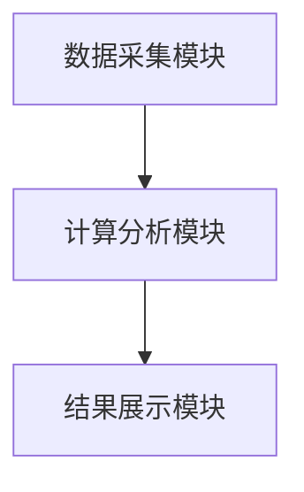

                 

# 如何在估值中考虑企业的环境足迹

## 关键词：
- 环境足迹
- 企业估值
- 环境影响
- 可持续发展
- 环境成本

## 摘要：
在当前全球关注可持续发展的背景下，企业的环境足迹已成为影响其估值的重要因素。本文从环境足迹的定义、量化方法、经济影响、系统设计及实际案例等方面，详细探讨如何在企业估值中考虑环境足迹，为企业提供全面的指导和解决方案。

---

## 第1章：环境足迹的背景与核心概念

### 1.1 环境足迹的定义与概念

环境足迹（Environmental Footprint）是指企业在整个生命周期中对环境造成的影响，包括资源消耗、污染排放、碳排放等。它量化了企业对地球生态系统的影响，是衡量企业可持续发展能力的重要指标。

#### 环境足迹的分类与特征

环境足迹可以分为以下几类：

- **碳足迹**：企业在生产、运营和产品生命周期中产生的温室气体排放总量。
- **水足迹**：企业在生产和供应链中消耗的水资源总量。
- **生态足迹**：企业对地球生态系统的影响，包括土地使用、能源消耗等。

环境足迹的特征包括：

1. **全面性**：涵盖企业所有环节，从原材料采购到产品报废。
2. **动态性**：随企业运营策略和外部环境变化而变化。
3. **可量化性**：通过指标和模型进行量化分析。

### 1.2 企业估值中的环境因素

传统的企业估值方法主要关注财务指标，如利润、现金流和资产价值。然而，随着环境问题的日益突出，环境足迹已成为影响企业价值的重要因素。

#### 环境因素对企业价值的影响

1. **环境风险**：环境法规的变化可能导致企业的额外成本或罚款。
2. **品牌价值**：企业对环境的责任感影响其品牌形象和客户忠诚度。
3. **成本优势**：通过减少环境足迹，企业可以降低运营成本并提高效率。

### 1.3 企业责任与环境足迹

企业对环境的影响不仅关乎自身的可持续发展，也影响社会和生态系统。企业需要通过减少环境足迹，履行社会责任，提升企业声誉。

---

## 第2章：环境足迹的量化方法

### 2.1 生命周期评估（LCA）

生命周期评估是一种系统的方法，用于评估产品或服务在整个生命周期中的环境影响。其步骤包括：

1. **定义目标与范围**：明确评估的对象和范围。
2. **数据收集**：收集各阶段的环境数据。
3. **评估与分析**：计算各阶段的环境影响。
4. **结果解释与优化**：提出改进建议。

#### LCA的数学模型

环境影响的计算公式为：

$$ \text{环境影响} = \sum_{i=1}^{n} w_i \times x_i $$

其中，\( w_i \) 是影响因子，\( x_i \) 是各阶段的环境数据。

### 2.2 碳足迹计算

碳足迹是衡量企业温室气体排放的重要指标。计算公式为：

$$ \text{碳足迹} = \sum_{j=1}^{m} c_j \times t_j $$

其中，\( c_j \) 是碳排放系数，\( t_j \) 是各环节的活动数据。

---

## 第3章：环境足迹的经济价值

### 3.1 环境成本的经济模型

环境成本包括预防成本、检测成本、内部失败成本和外部失败成本。计算公式为：

$$ \text{总环境成本} = \sum_{k=1}^{p} c_k $$

其中，\( c_k \) 是各环境成本项目。

### 3.2 环境效益的经济分析

环境效益包括节约资源、减少污染和提升品牌价值。计算公式为：

$$ \text{总环境效益} = \sum_{l=1}^{q} b_l $$

其中，\( b_l \) 是各环境效益项目。

---

## 第4章：系统架构与设计

### 4.1 系统功能设计

环境足迹评估系统包括数据采集、计算分析和结果展示三个模块。

#### 系统功能模块

- 数据采集模块：收集企业运营数据。
- 计算分析模块：计算环境足迹。
- 结果展示模块：展示评估结果。

#### 系统架构图

---

## 第5章：实战案例分析

### 5.1 案例分析

假设某制造企业，计算其碳足迹：

1. 数据采集：收集能源消耗数据。
2. 计算碳足迹：使用碳排放系数计算总排放量。
3. 结果应用：优化能源使用，减少排放。

### 5.2 工具与技术

常用的工具包括生命周期评估软件、碳足迹计算器和数据分析工具。

---

## 第6章：最佳实践与未来展望

### 6.1 最佳实践

1. 建立环境足迹评估体系。
2. 使用先进工具和技术优化评估过程。
3. 将环境足迹纳入企业战略。

### 6.2 未来展望

随着技术的发展，环境足迹评估将更加精准和智能化，成为企业估值的重要组成部分。

---

## 作者信息

作者：AI天才研究院/AI Genius Institute  
联系邮箱：contact@aigeniusinstitute.com  
文章来源：禅与计算机程序设计艺术 / Zen And The Art of Computer Programming

---

以上是《如何在估值中考虑企业的环境足迹》的详细目录和内容概览。通过逐步分析和详细讲解，这篇文章为企业提供了全面的指导，帮助其在估值中考虑环境足迹，实现可持续发展。

