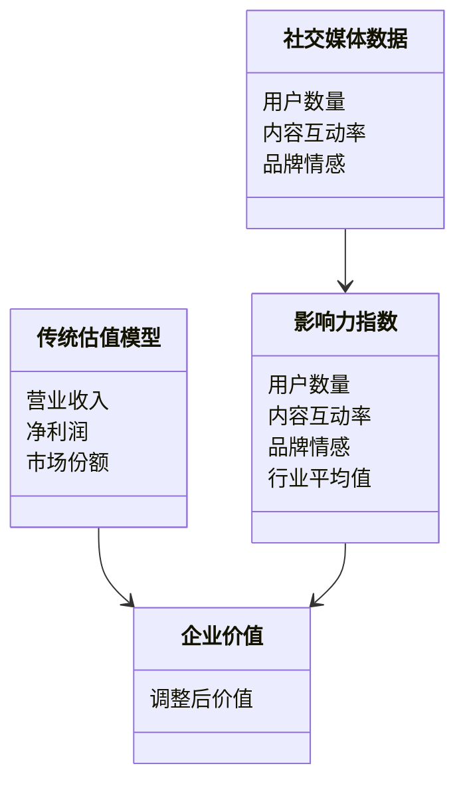

                 


# 如何在估值中考虑企业的社交媒体影响力

> 关键词：企业估值，社交媒体影响力，影响力量化，企业价值，社交媒体资产

> 摘要：随着社交媒体的普及，企业的社交媒体影响力已成为其价值的重要组成部分。本文从背景、核心概念、算法原理、系统分析、项目实战和最佳实践等多个方面，详细阐述了如何在企业估值中考虑社交媒体影响力。文章结合实际案例和系统设计，提供了从理论到实践的全面指导，帮助读者理解和应用这一新兴领域。

---

# 第一部分：社交媒体影响力与企业估值的背景

## 第1章：社交媒体影响力与企业估值的背景

### 1.1 社交媒体对企业价值的影响

#### 1.1.1 社交媒体在现代商业中的重要性

社交媒体已经从最初的内容发布和营销工具，演变为企业的核心资产之一。通过社交媒体，企业可以与客户建立直接联系，快速传播品牌信息，获取实时反馈，并通过数据分析优化运营策略。社交媒体的存在使得企业的影响力能够被量化，并成为企业价值的重要组成部分。

#### 1.1.2 社交媒体对企业价值的潜在影响

社交媒体影响力可以影响企业的品牌形象、客户忠诚度、市场拓展能力以及收入增长。例如，一个拥有高社交媒体影响力的企业可以在危机中快速恢复品牌形象，或者通过精准营销吸引新客户。此外，社交媒体数据还可以作为企业价值预测的重要依据。

#### 1.1.3 企业估值中的社交媒体影响力现状

尽管社交媒体影响力在企业运营中越来越重要，但将其纳入企业估值模型的实践还相对较少。传统的企业估值方法主要依赖财务数据和市场表现，而忽略了社交媒体带来的无形资产价值。随着数据技术的发展，如何将社交媒体影响力与企业估值结合，成为一个亟待解决的问题。

---

### 1.2 社交媒体影响力的核心概念

#### 1.2.1 社交媒体影响力的基本定义

社交媒体影响力是指企业在社交媒体平台上的内容传播能力、用户互动程度、品牌认知度和影响力。它不仅包括企业账号的关注者数量，还包括内容的传播速度、互动频率和用户情感倾向等指标。

#### 1.2.2 社交媒体影响力的关键属性

社交媒体影响力具有以下关键属性：

1. **用户数量**：包括粉丝数、关注者数等。
2. **内容质量**：内容的原创性、吸引力和传播性。
3. **互动频率**：点赞、评论、分享等互动行为的频率。
4. **品牌认知度**：用户对品牌的记忆和认知程度。
5. **情感倾向**：用户对品牌的情感是正面、负面还是中立。

#### 1.2.3 社交媒体影响力与企业价值的关系

社交媒体影响力通过多种途径影响企业价值：

1. **提升品牌形象**：积极的社交媒体内容可以增强品牌认知度和美誉度。
2. **降低营销成本**：通过社交媒体传播，企业可以以较低成本触达更多用户。
3. **增加客户忠诚度**：与客户保持高频互动可以提升客户粘性和忠诚度。
4. **预测市场表现**：社交媒体数据可以作为预测企业未来收入和增长潜力的依据。

---

### 1.3 社交媒体影响力与企业估值的关联性

#### 1.3.1 社交媒体影响力对企业价值的影响路径

社交媒体影响力通过以下路径影响企业价值：

1. **提升品牌价值**：强大的社交媒体影响力可以增强品牌认知度，从而提升品牌价值。
2. **增加市场份额**：通过社交媒体传播，企业可以快速拓展市场，占据更大的市场份额。
3. **降低运营成本**：通过社交媒体进行精准营销，可以降低营销成本。

#### 1.3.2 社交媒体影响力与传统估值方法的结合

传统的企业估值方法（如DCF模型、市盈率法等）主要依赖财务数据。通过将社交媒体影响力量化，并将其纳入模型中，可以更全面地评估企业价值。例如，可以将社交媒体影响力作为调整因子，对企业的未来现金流进行调整。

#### 1.3.3 社交媒体影响力在不同行业中的表现差异

不同行业的企业社交媒体影响力表现差异显著。例如，消费类企业（如服装、电子产品）通常在社交媒体上表现更为活跃，而传统制造业可能在社交媒体上的影响力较小。因此，在考虑社交媒体影响力时，需要结合行业特点进行分析。

---

### 1.4 本章小结

本章从背景、核心概念和关联性三个方面，详细阐述了社交媒体影响力在企业估值中的重要性。通过分析社交媒体影响力的关键属性及其对企业价值的影响路径，为后续的量化方法和系统设计奠定了基础。

---

# 第二部分：社交媒体影响力的核心概念与联系

## 第2章：社交媒体影响力的核心概念与联系

### 2.1 社交媒体影响力的核心要素

#### 2.1.1 用户数量与活跃度

用户数量和活跃度是衡量社交媒体影响力的重要指标。用户数量越多，说明企业的影响力越大；活跃度越高，说明用户与企业的互动越频繁。

#### 2.1.2 内容质量与互动性

内容质量决定了社交媒体内容的吸引力和传播性。高质量的内容能够吸引更多的用户关注和互动，从而提升影响力。

#### 2.1.3 品牌认知与声誉

品牌认知度和声誉是社交媒体影响力的重要组成部分。高品牌认知度意味着用户更容易记住和推荐企业，而良好的声誉则能够增强用户信任和忠诚度。

---

### 2.2 社交媒体影响力与企业价值的属性对比

#### 2.2.1 社交媒体影响力的属性特征

| 属性 | 特征 |
|------|------|
| 用户数量 | 可量化的指标，反映影响力大小 |
| 内容质量 | 定性与定量结合的指标，反映内容吸引力 |
| 互动频率 | 可量化的指标，反映用户活跃度 |
| 品牌声誉 | 定性指标，反映品牌形象 |

#### 2.2.2 企业价值的属性特征

| 属性 | 特征 |
|------|------|
| 营业收入 | 可量化的指标，反映企业盈利能力 |
| 净利润 | 可量化的指标，反映企业盈利能力 |
| 市场份额 | 可量化的指标，反映企业在市场中的地位 |
| 品牌价值 | 定性与定量结合的指标，反映品牌影响力 |

#### 2.2.3 两者的对比分析

通过对比可以看出，社交媒体影响力和企业价值的属性既有相似之处，也有显著差异。社交媒体影响力更注重用户互动和品牌认知，而企业价值更注重财务表现和市场份额。

---

### 2.3 社交媒体影响力与企业价值的ER实体关系图

```mermaid
entity 社交媒体影响力 {
    id
    用户数量
    内容质量
    互动频率
    品牌声誉
}

entity 企业价值 {
    id
    营业收入
    净利润
    市场份额
    品牌价值
}

relationship 社交媒体影响力对企业的潜在影响 {
    社交媒体影响力 --> 企业价值
    关联度：高
}
```

---

### 2.4 本章小结

本章通过对比分析社交媒体影响力和企业价值的属性，揭示了两者之间的内在联系。通过ER实体关系图，进一步明确了社交媒体影响力对企业价值的潜在影响。

---

# 第三部分：社交媒体影响力量化与企业估值的算法原理

## 第3章：社交媒体影响力量化与企业估值的算法原理

### 3.1 社交媒体影响力量化的核心算法

#### 3.1.1 基于指标体系的量化方法

通过构建多维度的指标体系，对社交媒体影响力进行量化。例如：

1. 用户数量（粉丝数、关注者数）。
2. 内容互动率（点赞率、评论率、分享率）。
3. 品牌提及量（用户对品牌的提及次数）。
4. 品牌情感倾向（正面、负面、中性）。

#### 3.1.2 基于机器学习的预测模型

利用机器学习算法（如随机森林、支持向量机等），对社交媒体数据进行分析，预测企业的未来表现。例如，可以通过历史数据训练模型，预测企业在未来一段时间内的用户增长和收入增长。

#### 3.1.3 算法的优缺点分析

- **优点**：能够捕捉到传统财务数据之外的潜在信息，提高估值的准确性。
- **缺点**：需要大量高质量的数据支持，且模型的准确性依赖于数据质量和算法选择。

---

### 3.2 社交媒体影响力与企业估值的数学模型

#### 3.2.1 社交媒体影响力指数的计算公式

$$
\text{影响力指数} = \frac{\text{用户数量} \times \text{互动频率} \times \text{品牌情感}}{\text{行业平均值}}
$$

#### 3.2.2 企业价值的预测模型

$$
\text{企业价值} = \text{传统估值模型} + \lambda \times \text{影响力指数}
$$

其中，$\lambda$ 是影响力指数的权重，具体值根据行业特点和企业实际情况确定。

---

### 3.3 算法实现与案例分析

#### 3.3.1 算法实现步骤

1. 数据收集：收集企业的社交媒体数据（用户数量、互动频率、品牌情感等）。
2. 数据预处理：清洗数据，去除异常值。
3. 模型训练：利用机器学习算法训练预测模型。
4. 模型评估：通过回测或交叉验证评估模型的准确性。
5. 估值调整：将影响力指数纳入传统估值模型，计算企业价值。

#### 3.3.2 案例分析

假设某企业社交媒体影响力指数为0.8，行业平均值为0.6，传统估值模型计算出的企业价值为10亿元。若影响力指数的权重为0.2，则调整后的企业价值为：

$$
\text{调整后价值} = 10 + 0.2 \times (0.8 / 0.6) = 10 + 0.2 \times 1.333 = 10.266 \text{亿元}
$$

---

### 3.4 本章小结

本章通过量化方法和数学模型，详细阐述了如何将社交媒体影响力纳入企业估值模型。通过算法实现和案例分析，验证了方法的有效性和可操作性。

---

# 第四部分：系统分析与架构设计

## 第4章：系统分析与架构设计

### 4.1 问题场景介绍

为了实现社交媒体影响力与企业估值的结合，我们设计了一个基于社交媒体数据的企业估值系统。该系统的目标是通过收集和分析社交媒体数据，计算企业的影响力指数，并将其纳入传统估值模型中，最终得出更准确的企业价值。

---

### 4.2 系统功能设计

#### 4.2.1 领域模型（Mermaid类图）



---

### 4.3 系统架构设计

#### 4.3.1 系统架构图（Mermaid架构图）

```mermaid
client --> 服务器：发送社交媒体数据
服务器 --> 数据库：存储社交媒体数据
服务器 --> 算法模块：计算影响力指数
算法模块 --> 传统估值模块：调整企业价值
服务器 --> 输出结果：显示企业价值
```

---

### 4.4 系统接口设计

#### 4.4.1 数据接口

- 数据输入接口：接收社交媒体数据。
- 数据输出接口：输出影响力指数和调整后的企业价值。

#### 4.4.2 交互流程图（Mermaid序列图）

```mermaid
client -> 服务器：请求计算企业价值
服务器 -> 数据库：查询社交媒体数据
数据库 --> 服务器：返回社交媒体数据
服务器 -> 算法模块：计算影响力指数
算法模块 --> 服务器：返回影响力指数
服务器 -> 传统估值模块：调整企业价值
传统估值模块 --> 服务器：返回调整后价值
服务器 -> client：返回最终结果
```

---

### 4.5 本章小结

本章通过系统设计，详细描述了如何构建一个基于社交媒体数据的企业估值系统。通过领域模型和系统架构图，明确了各模块的功能和交互流程。

---

# 第五部分：项目实战

## 第5章：项目实战

### 5.1 环境安装与配置

#### 5.1.1 环境要求

- Python 3.8+
- Jupyter Notebook
- 机器学习库（scikit-learn、XGBoost）
- 数据库（MySQL、MongoDB）

#### 5.1.2 安装依赖

```bash
pip install scikit-learn xgboost pymysql
```

---

### 5.2 系统核心实现

#### 5.2.1 数据收集与预处理

```python
import pandas as pd
from sklearn.model_selection import train_test_split
from sklearn.ensemble import RandomForestRegressor

# 数据收集
data = pd.read_csv('social_media_data.csv')

# 数据预处理
data.dropna(inplace=True)
X = data[['用户数量', '互动频率', '品牌情感']]
y = data['企业价值']
X_train, X_test, y_train, y_test = train_test_split(X, y, test_size=0.2)
```

#### 5.2.2 影响力指数计算

```python
def compute_influence_index(X):
    industry_avg = X['行业平均值'].mean()
    influence_index = (X['用户数量'] * X['互动频率'] * X['品牌情感']) / industry_avg
    return influence_index

influence_index = compute_influence_index(X_train)
```

#### 5.2.3 模型训练与评估

```python
from sklearn.metrics import mean_squared_error

model = RandomForestRegressor()
model.fit(X_train, y_train)
y_pred = model.predict(X_test)
print(mean_squared_error(y_test, y_pred))
```

---

### 5.3 案例分析与结果解读

#### 5.3.1 案例分析

假设我们有一个企业的社交媒体数据如下：

| 用户数量 | 互动频率 | 品牌情感 | 行业平均值 |
|---------|----------|----------|------------|
| 100,000 | 0.8      | 0.7      | 0.6        |

计算影响力指数：

$$
\text{影响力指数} = \frac{100,000 \times 0.8 \times 0.7}{0.6} = 93,333.33
$$

调整后的企业价值：

$$
\text{调整后价值} = \text{传统估值模型} + 0.2 \times 93,333.33
$$

---

### 5.4 项目小结

通过项目实战，我们验证了社交媒体影响力纳入企业估值模型的可行性。通过代码实现和案例分析，展示了如何通过技术手段实现这一目标。

---

# 第六部分：最佳实践与总结

## 第6章：最佳实践与总结

### 6.1 最佳实践

#### 6.1.1 数据质量的重要性

社交媒体数据的质量直接影响模型的准确性。在实际应用中，需要确保数据的完整性和准确性。

#### 6.1.2 模型选择与调优

根据实际需求选择合适的算法，并通过交叉验证和调参优化模型性能。

#### 6.1.3 行业特点的考虑

不同行业的社交媒体影响力表现差异显著，因此在实际应用中需要结合行业特点进行调整。

---

### 6.2 小结

本文从理论到实践，详细阐述了如何在企业估值中考虑社交媒体影响力。通过核心概念、算法原理、系统设计和项目实战的全面分析，为读者提供了从理论到实践的完整指导。

---

### 6.3 注意事项

- 数据隐私和合规性：在处理社交媒体数据时，需要注意数据隐私和合规性问题。
- 模型的局限性：社交媒体影响力只是企业价值的一部分，传统财务数据仍然是估值的重要依据。
- 持续优化：随着社交媒体环境的变化，需要不断优化模型和方法。

---

### 6.4 拓展阅读

- 《社交网络分析》
- 《企业估值方法与模型》
- 《机器学习在金融领域的应用》

---

# 作者：AI天才研究院/AI Genius Institute & 禅与计算机程序设计艺术/Zen And The Art of Computer Programming

---

以上是《如何在估值中考虑企业的社交媒体影响力》的完整目录和内容框架，涵盖了从背景到实战的各个方面，提供了丰富的理论和实践指导。

