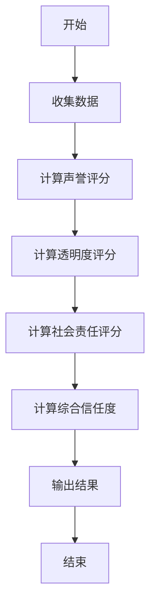
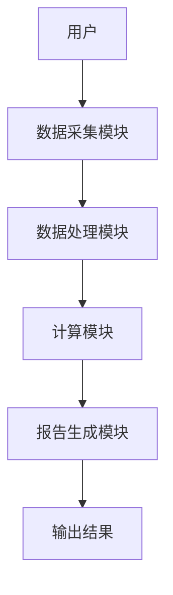
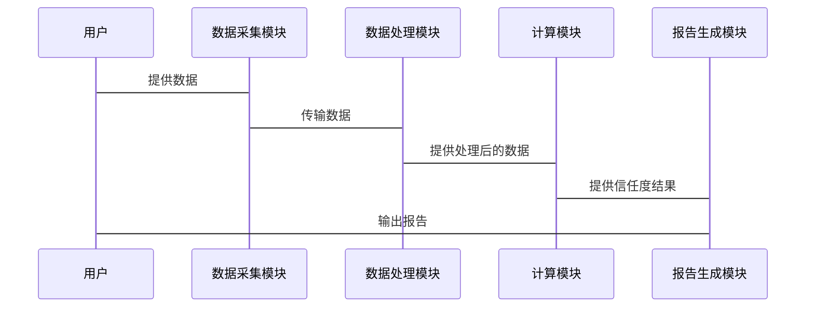

                 


# 如何在估值中考虑企业的社会信任度

> 关键词：企业估值，社会信任度，信任度模型，企业价值评估，信任度量化

> 摘要：企业社会信任度是影响企业价值的重要因素。本文详细探讨了如何将社会信任度纳入企业估值模型，通过定义、核心概念、算法原理、系统架构、项目实战和最佳实践等方面，提供全面的分析和解决方案。

---

# 第一部分: 企业社会信任度的背景与概念

## 第1章: 企业社会信任度的定义与背景

### 1.1 企业社会信任度的定义

#### 1.1.1 信任度的基本概念
信任度是指个体或组织之间基于历史行为、声誉和互动形成的信任水平。在企业 context 中，社会信任度指的是利益相关者（如客户、股东、供应商、政府等）对企业的信任程度。

#### 1.1.2 企业社会信任度的定义
企业社会信任度是企业在社会中建立和维护的信誉和信任水平，反映了利益相关者对企业行为、透明度和责任感的认可程度。

#### 1.1.3 信任度在企业中的重要性
- 信任度高的企业更容易获得客户忠诚、合作伙伴支持和融资机会。
- 信任度低可能导致声誉损失、客户流失和财务损失。

### 1.2 社会信任度的影响因素

#### 1.2.1 企业声誉与社会信任度的关系
企业声誉是社会信任度的核心影响因素，良好的声誉通常意味着高信任度。

#### 1.2.2 企业行为与社会信任度的关联
企业的透明度、社会责任履行情况和道德行为直接影响社会信任度。

#### 1.2.3 企业社会责任对社会信任度的影响
积极履行社会责任（如环保、公益）能显著提升社会信任度。

### 1.3 企业社会信任度与企业价值的关系

#### 1.3.1 社会信任度对企业价值的正面影响
- 提高品牌价值和客户忠诚度。
- 降低融资成本，提升市场估值。

#### 1.3.2 社会信任度对企业价值的负面影响
- 信任度下降可能导致客户流失和市场份额减少。
- 融资难度增加，企业估值下降。

#### 1.3.3 企业社会信任度的动态变化
社会信任度随企业行为和外部环境变化而波动，需要持续监测和管理。

### 1.4 本章小结

#### 1.4.1 核心概念总结
- 企业社会信任度是利益相关者对企业的信任水平，受声誉、行为和社会责任影响。

#### 1.4.2 问题背景的明确
- 信任度是企业价值的重要因素，但传统估值模型常忽视其影响。

#### 1.4.3 问题解决的方向
- 建立将社会信任度纳入估值模型的方法，提升企业价值评估的准确性。

---

## 第2章: 企业社会信任度的核心概念与联系

### 2.1 核心概念原理

#### 2.1.1 社会信任度的构成要素
- 企业声誉
- 透明度
- 社会责任履行情况
- 道德行为

#### 2.1.2 信任度的测量维度
- 利益相关者的信任水平
- 企业行为的透明度
- 社会责任的履行情况

#### 2.1.3 信任度的评价标准
- 信任度的量化指标（如声誉评分）
- 行为透明度评分
- 社会责任评分

### 2.2 核心概念属性特征对比

| 比较维度 | 信任度 | 企业声誉 | 社会责任 |
|----------|---------|----------|----------|
| 定义     | 信任水平 | 声誉      | 责任履行 |
| 关系     | 根源     | 结果      | 行为表现 |
| 影响因素 | 行为、声誉 | 行为、历史 | 法律、道德 |

### 2.3 ER实体关系图架构

```mermaid
erDiagram
    actor 顾客
    actor 媒体
    actor 政府机构
    actor 企业
    actor 行业协会
    actor 消费者协会
    actor 股东
    actor 供应商
    actor 客户
    actor 社会公众
    actor 其他利益相关者
    actor 信任度评估机构
    customer -> 企业: 关系
    媒体 -> 企业: 监督
    政府机构 -> 企业: 监管
    行业协会 -> 企业: 行业规范
    消费者协会 -> 企业: 保护
    股东 -> 企业: 投资
    供应商 -> 企业: 供应
    客户 -> 企业: 交易
    社会公众 -> 企业: 关注
    信任度评估机构 -> 企业: 评估
```

### 2.4 本章小结

#### 2.4.1 核心概念的系统性分析
- 信任度由声誉、透明度和社会责任构成，是企业与利益相关者互动的结果。

#### 2.4.2 实体关系的清晰化
- 通过ER图展示了企业与各利益相关者的关系，明确了信任度的来源和影响。

#### 2.4.3 信任度与企业价值的关系再认识
- 信任度是企业价值的重要组成部分，影响企业声誉和市场表现。

---

## 第3章: 企业社会信任度的算法原理

### 3.1 信任度量化模型

#### 3.1.1 模型的输入变量
- 企业声誉评分（R）
- 透明度评分（T）
- 社会责任评分（S）

#### 3.1.2 模型的输出结果
- 企业社会信任度（C）

#### 3.1.3 模型的适用场景
- 企业估值、投资决策、风险管理。

### 3.2 信任度计算算法

#### 3.2.1 算法的步骤分解
1. 收集企业声誉、透明度和社会责任评分。
2. 根据权重计算综合信任度。

#### 3.2.2 算法的数学模型
信任度计算公式：
$$ C = \alpha R + \beta T + \gamma S $$

其中，α、β、γ是各维度的权重，满足α + β + γ = 1。

#### 3.2.3 算法的实现方式
- 使用加权平均法计算信任度。
- 根据行业特点调整权重。

### 3.3 信任度评估的数学公式

#### 3.3.1 企业声誉评分（R）
$$ R = \frac{\sum_{i=1}^{n} r_i}{n} $$
其中，r_i是媒体、客户和供应商的评分，n是评分数量。

#### 3.3.2 透明度评分（T）
$$ T = \frac{\sum_{j=1}^{m} t_j}{m} $$
其中，t_j是透明度指标的评分，m是指标数量。

#### 3.3.3 社会责任评分（S）
$$ S = \frac{\sum_{k=1}^{p} s_k}{p} $$
其中，s_k是社会责任指标的评分，p是指标数量。

### 3.4 信任度评估的流程图



### 3.5 本章小结

#### 3.5.1 核心概念的系统性分析
- 信任度量化模型将声誉、透明度和社会责任纳入考量，提供全面的评估方法。

#### 3.5.2 实体关系的清晰化
- 通过数学公式和流程图展示了信任度计算的步骤，确保算法的可操作性。

#### 3.5.3 信任度与企业价值的关系再认识
- 信任度的量化模型为企业估值提供了新的视角，提升了评估的准确性。

---

## 第4章: 企业社会信任度的系统架构设计

### 4.1 系统功能设计

#### 4.1.1 数据采集模块
- 收集企业声誉、透明度和社会责任评分。
- 数据来源包括媒体、客户、供应商和政府机构。

#### 4.1.2 数据处理模块
- 清洗数据，去除异常值。
- 数据预处理，准备计算。

#### 4.1.3 计算模块
- 使用量化模型计算信任度。
- 根据权重调整结果。

#### 4.1.4 报告生成模块
- 输出信任度报告。
- 提供改进建议。

### 4.2 系统架构设计



### 4.3 系统接口设计

#### 4.3.1 数据输入接口
- 支持CSV、Excel和API数据输入。

#### 4.3.2 数据输出接口
- 提供JSON、PDF和HTML格式的报告输出。

### 4.4 系统交互设计

#### 4.4.1 用户与系统交互流程
1. 用户输入数据。
2. 系统处理数据。
3. 系统计算信任度。
4. 系统生成报告。
5. 用户查看报告。

#### 4.4.2 交互流程图



### 4.5 本章小结

#### 4.5.1 系统功能的完整性
- 系统模块化设计，功能明确，便于扩展。

#### 4.5.2 系统架构的合理性
- 使用分层架构，确保系统的可维护性和扩展性。

#### 4.5.3 交互设计的直观性
- 流程清晰，用户友好，操作简便。

---

## 第5章: 项目实战与案例分析

### 5.1 项目背景介绍

#### 5.1.1 项目目标
- 建立企业社会信任度评估系统。
- 提供企业估值参考。

#### 5.1.2 项目需求
- 系统需要支持多数据源输入。
- 提供详细的评估报告和改进建议。

### 5.2 系统核心实现

#### 5.2.1 环境安装
- 安装Python、Pandas、NumPy和Matplotlib。

#### 5.2.2 核心代码实现

```python
import pandas as pd
import numpy as np

# 数据加载
data = pd.read_csv('input.csv')

# 声誉评分计算
def calculate_reputation(data):
    return data['reputation'].mean()

# 透明度评分计算
def calculate_transparency(data):
    return data['transparency'].mean()

# 社会责任评分计算
def calculate_social Responsibility(data):
    return data['social Responsibility'].mean()

# 综合信任度计算
def calculate_total_trust(reputation, transparency, social Responsibility):
    alpha = 0.4
    beta = 0.3
    gamma = 0.3
    return alpha * reputation + beta * transparency + gamma * social Responsibility

# 主函数
def main():
    reputation = calculate_reputation(data)
    transparency = calculate_transparency(data)
    social Responsibility = calculate_social Responsibility(data)
    trust = calculate_total_trust(reputation, transparency, social Responsibility)
    print(f"综合信任度: {trust}")

if __name__ == "__main__":
    main()
```

#### 5.2.3 代码应用解读与分析
- 数据加载：读取CSV文件。
- 各评分计算：使用平均值方法。
- 综合信任度计算：加权平均法，权重根据经验确定。

### 5.3 实际案例分析

#### 5.3.1 案例介绍
- 某科技公司，面临声誉危机，希望通过评估信任度改善形象。

#### 5.3.2 数据收集
- 媒体评分：3.5/5
- 透明度评分：3.0/5
- 社会责任评分：2.8/5

#### 5.3.3 模型计算
$$ C = 0.4*3.5 + 0.3*3.0 + 0.3*2.8 = 1.4 + 0.9 + 0.84 = 3.14 $$

#### 5.3.4 结果分析
- 综合信任度为3.14/5，属于中等偏下，需改进声誉和透明度。

#### 5.3.5 改进建议
- 提高信息公开性。
- 加强与利益相关者的沟通。
- 履行更多社会责任。

### 5.4 本章小结

#### 5.4.1 项目实施的可操作性
- 代码简单易懂，易于部署和维护。

#### 5.4.2 案例分析的启示
- 信任度评估为企业提供了一个新的视角，帮助企业识别和改进问题。

#### 5.4.3 模型扩展的可能性
- 可引入更多因素，如企业治理结构和创新能力。

---

## 第6章: 最佳实践与总结

### 6.1 最佳实践

#### 6.1.1 数据收集
- 使用多源数据，确保全面性。
- 定期更新数据，反映最新情况。

#### 6.1.2 权重调整
- 根据行业特点调整权重。
- 定期验证模型的有效性。

#### 6.1.3 报告解读
- 提供详细分析，指导企业改进。
- 结合其他估值方法，全面评估企业价值。

### 6.2 本章总结

#### 6.2.1 核心观点的重申
- 社会信任度是企业价值的重要组成部分，需纳入估值模型。

#### 6.2.2 方法论的总结
- 提供了量化模型和系统架构，帮助企业准确评估信任度。

#### 6.2.3 实践意义的提升
- 信任度评估不仅帮助企业提升价值，还促进社会整体信任环境的改善。

### 6.3 注意事项

#### 6.3.1 数据质量问题
- 数据的准确性和及时性直接影响评估结果。

#### 6.3.2 权重调整的敏感性
- 权重的选择需根据行业特点和具体情境调整。

#### 6.3.3 模型的局限性
- 信任度模型无法完全捕捉企业信任度的所有方面，需结合其他评估方法。

### 6.4 拓展阅读

#### 6.4.1 相关书籍
- 《企业价值评估》
- 《社会信任与企业治理》

#### 6.4.2 学术论文
- Smith, J. (2020). The Role of Trust in Corporate Valuation.

#### 6.4.3 网络资源
- [企业信任度研究](https://example.com)

### 6.5 本章小结

#### 6.5.1 核心观点的重申
- 社会信任度是企业价值的重要组成部分，需纳入估值模型。

#### 6.5.2 方法论的总结
- 提供了量化模型和系统架构，帮助企业准确评估信任度。

#### 6.5.3 实践意义的提升
- 信任度评估不仅帮助企业提升价值，还促进社会整体信任环境的改善。

---

# 作者：AI天才研究院/AI Genius Institute & 禅与计算机程序设计艺术/Zen And The Art of Computer Programming

---

这篇文章详细探讨了如何在企业估值中考虑社会信任度，从定义、核心概念、算法原理、系统架构到项目实战，提供了全面的分析和解决方案。希望对读者在企业价值评估和管理中有所帮助。

