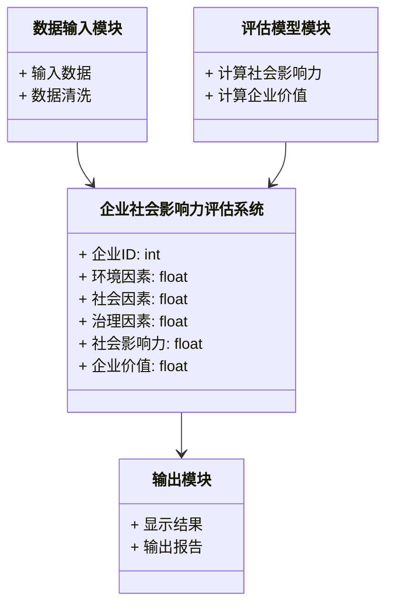
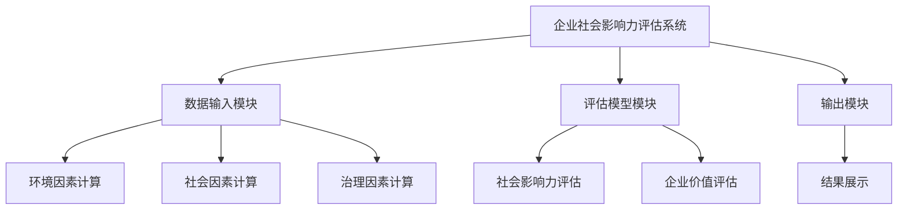

                 


# 如何在估值中考虑企业的社会影响力

## 关键词：企业估值、社会影响力、社会责任、ESG、企业价值

## 摘要：
在当前全球化和可持续发展的背景下，企业的社会影响力对企业价值的影响日益显著。传统的估值方法往往忽略了企业社会责任（CSR）和社会治理（ESG）因素，导致评估结果的片面性。本文系统地探讨了如何在企业估值中纳入社会影响力这一关键因素，构建了一个综合考虑财务指标和社会影响力的社会价值评估模型。通过定义社会影响力的核心要素，分析其对企业声誉、运营效率和财务表现的影响路径，并结合数学模型和实际案例，本文旨在为投资者和企业管理者提供更全面的决策支持工具。

---

## 第1章：社会影响力与企业估值的背景

### 1.1 什么是社会影响力
- **1.1.1 社会影响力的基本定义**
  社会影响力是指企业在经营过程中对社会、环境和治理等方面产生的正面或负面影响，包括员工福祉、环境保护、社会公正和公司治理等维度。

- **1.1.2 社会影响力的核心要素**
  社会影响力由环境（Environmental）、社会（Social）和治理（Governance）三个核心要素组成，简称ESG。

- **1.1.3 社会影响力与企业价值的关系**
  社会影响力不仅是企业社会责任的体现，更是企业长期价值的驱动因素。良好的社会影响力能够提升品牌价值、降低经营风险并增强投资者信心。

### 1.2 为什么要在估值中考虑社会影响力
- **1.2.1 传统估值方法的局限性**
  传统财务估值方法主要关注企业的财务指标，忽略了企业在社会、环境和治理方面的影响，可能导致评估结果的片面性。

- **1.2.2 社会影响力对企业长期价值的影响**
  社会影响力通过提升企业声誉、优化供应链管理和推动创新，间接影响企业的财务表现，进而影响其市场价值。

- **1.2.3 全球化背景下社会影响力的重要性**
  在全球化和可持续发展的背景下，社会影响力已成为投资者和消费者决策的重要考量因素，企业忽视这一因素可能导致竞争优势的丧失。

---

## 第2章：社会影响力对企业价值的影响路径

### 2.1 社会影响力如何影响企业声誉
- **2.1.1 品牌价值的提升**
  企业通过积极履行社会责任，提升品牌形象，从而增加品牌价值。例如，可口可乐通过支持环保项目提升了品牌忠诚度。

- **2.1.2 公共关系管理**
  社会影响力良好的企业更容易获得媒体和公众的支持，在危机中也能更快恢复形象。

- **2.1.3 社会影响力对企业形象的影响**
  社会影响力直接影响企业的社会形象，良好的形象有助于吸引优秀人才和合作伙伴。

### 2.2 社会影响力如何影响企业运营
- **2.2.1 供应链管理的社会化**
  企业通过推动供应链的可持续发展，降低了生产成本，并提升了供应链的稳定性。

- **2.2.2 社会责任与企业效率**
  履行社会责任不仅提升了企业的社会形象，还可能通过优化资源利用提高运营效率。

- **2.2.3 社会影响力对企业创新的推动**
  社会影响力驱动企业进行创新，例如开发环保产品或采用绿色生产技术。

### 2.3 社会影响力如何影响企业财务表现
- **2.3.1 社会影响力与企业成本**
  社会责任项目可能导致短期成本增加，但长期来看，通过品牌溢价和效率提升，企业整体成本可能降低。

- **2.3.2 社会影响力与企业收入**
  良好的社会影响力有助于吸引更多的消费者和市场份额，进而提升收入。

- **2.3.3 社会影响力与企业风险**
  社会影响力降低了企业面临的声誉风险和法律风险，尤其是在环境和社会治理方面表现优异的企业。

---

## 第3章：社会影响力在企业估值中的边界与外延

### 3.1 社会影响力在企业估值中的边界
- **3.1.1 企业社会影响力的作用范围**
  社会影响力主要影响企业的长期价值，短期内可能对财务指标影响有限，但长期积累会显著影响企业价值。

- **3.1.2 社会影响力与企业估值的关联性**
  社会影响力通过影响企业声誉、运营效率和财务表现，间接影响企业估值。

- **3.1.3 社会影响力在不同行业中的差异**
  不同行业对社会影响力的需求和敏感度不同，例如能源行业对环境因素的关注度更高。

### 3.2 社会影响力在企业估值中的外延
- **3.2.1 社会影响力与企业社会责任报告**
  社会责任报告是衡量企业社会影响力的重要工具，通过报告可以量化企业在社会、环境和治理方面的表现。

- **3.2.2 社会影响力与企业治理结构**
  良好的治理结构是企业社会影响力的基础，高效的治理能够确保社会责任的有效实施。

- **3.2.3 社会影响力与企业创新战略**
  社会影响力驱动企业创新，例如开发绿色产品或采用可持续生产技术。

---

## 第4章：社会影响力的核心要素与概念结构

### 4.1 社会影响力的核心要素
- **4.1.1 环境因素**
  包括能源消耗、碳排放、资源利用效率等，反映了企业在环境保护方面的表现。

- **4.1.2 社会因素**
  包括员工权益、社区参与、社会公正等，反映了企业在社会责任方面的努力。

- **4.1.3 治理因素**
  包括公司治理结构、董事会构成、透明度等，反映了企业在内部管理和社会责任方面的表现。

### 4.2 社会影响力的概念结构
- **4.2.1 社会影响力与企业战略的关系**
  社会影响力是企业战略的重要组成部分，通过影响企业声誉、运营效率和财务表现，进而影响企业战略的选择和执行。

- **4.2.2 社会影响力与企业文化的互动**
  企业文化是社会影响力的重要载体，良好的企业文化能够促进社会责任的实施，进而提升社会影响力。

- **4.2.3 社会影响力与企业创新的结合**
  社会影响力驱动企业创新，创新是实现社会责任和提升社会影响力的重要途径。

### 4.3 社会影响力的核心要素组成
- **4.3.1 核心要素的相互作用**
  环境、社会和治理三个要素相互作用，共同影响企业的社会影响力。例如，良好的环境表现可以提升企业的社会声誉，进而增强企业的治理能力。

- **4.3.2 核心要素的量化方法**
  通过建立量化指标体系，对环境、社会和治理三个维度进行量化评估，例如使用碳排放指标、员工满意度指标和治理结构指标。

- **4.3.3 核心要素在不同企业中的表现**
  不同行业和不同规模的企业在环境、社会和治理三个维度的表现可能差异较大，需要根据具体情况选择合适的评估指标。

---

## 第5章：社会影响力的核心概念原理

### 5.1 社会影响力的定义与分类
- **5.1.1 社会影响力的定义**
  社会影响力是指企业在经营过程中对社会、环境和治理等方面产生的正面或负面影响。

- **5.1.2 社会影响力的分类**
  社会影响力可以分为正面影响力和负面影响力，分别对应企业在社会、环境和治理方面的积极和消极表现。

- **5.1.3 社会影响力的关键特征**
  社会影响力具有广泛性、长期性和动态性，它不仅影响企业的外部环境，还影响企业的内部管理。

### 5.2 社会影响力与企业价值的关系
- **5.2.1 社会影响力对企业价值的正向影响**
  良好的社会影响力能够提升企业的品牌价值、降低经营风险并增强投资者信心，从而提升企业市场价值。

- **5.2.2 社会影响力对企业价值的负向影响**
  如果企业社会影响力表现不佳，可能导致品牌贬值、声誉损失和投资者信任度下降，进而影响企业价值。

- **5.2.3 社会影响力与企业价值的动态关系**
  社会影响力与企业价值之间的关系是动态变化的，受到外部环境、企业战略和市场参与者行为的影响。

### 5.3 社会影响力与企业估值的联系
- **5.3.1 社会影响力在企业估值中的地位**
  社会影响力是企业估值的重要组成部分，通过影响企业的长期价值和风险水平，进而影响企业的整体估值。

- **5.3.2 社会影响力对估值模型的调整**
  在传统的财务估值模型中，需要引入社会影响力相关指标，例如ESG指标，对企业的财务表现进行调整。

- **5.3.3 社会影响力与估值结果的反馈机制**
  社会影响力评估结果可以作为企业估值的反馈，反过来影响企业的战略决策和管理行为。

---

## 第6章：社会影响力的核心属性特征对比

| **维度**         | **环境因素**          | **社会因素**          | **治理因素**          |
|-------------------|-----------------------|-----------------------|-----------------------|
| **定义**         | 企业在环境保护方面   | 企业在社会责任方面   | 企业在公司治理方面   |
| **核心指标**     | 碳排放、能源消耗      | 员工满意度、社区参与  | 董事会结构、透明度    |
| **影响因素**     | 政策法规、技术进步    | 员工权益、社会公正    | 公司治理结构、监管环境 |
| **权重**         | 高（能源行业）       | 中（消费品行业）      | 高（金融行业）        |
| **动态性**       | 高（受政策影响）     | 中（受员工行为影响）  | 高（受监管变化影响）  |

---

## 第7章：社会影响力与企业估值的算法设计

### 7.1 社会影响力评估模型

$$
\text{社会影响力} = \alpha \times \text{环境因素} + \beta \times \text{社会因素} + \gamma \times \text{治理因素}
$$

其中，$\alpha$、$\beta$和$\gamma$是各维度的权重系数，通常通过行业基准或专家评分确定。

### 7.2 企业价值评估模型

$$
\text{企业价值} = \text{财务价值} + \lambda \times \text{社会影响力}
$$

其中，$\lambda$是社会影响力对价值的影响程度，通常通过回归分析确定。

### 7.3 代码实现

```python
import pandas as pd
import numpy as np

# 示例数据：企业社会影响力评估
data = {
    '企业ID': [1, 2, 3, 4, 5],
    '环境因素': [80, 60, 70, 90, 50],
    '社会因素': [70, 85, 65, 75, 90],
    '治理因素': [85, 70, 90, 60, 80]
}

df = pd.DataFrame(data)

# 计算社会影响力
alpha = 0.4
beta = 0.3
gamma = 0.3

df['社会影响力'] = alpha * df['环境因素'] + beta * df['社会因素'] + gamma * df['治理因素']

# 计算企业价值
df['财务价值'] = np.random.normal(100, 20, len(df))
lambda_coeff = 0.25

df['企业价值'] = df['财务价值'] + lambda_coeff * df['社会影响力']

print(df)
```

---

## 第8章：社会影响力评估系统的架构设计

### 8.1 系统功能设计



### 8.2 系统架构设计



---

## 第9章：项目实战与案例分析

### 9.1 环境安装与数据准备
- **环境安装**：
  - 安装Python、Pandas、NumPy。
- **数据准备**：
  - 收集企业ESG数据、财务数据和其他相关信息。

### 9.2 核心实现

```python
import pandas as pd
import numpy as np

# 数据准备
data = {
    '企业ID': [1, 2, 3, 4, 5],
    '环境因素': [80, 60, 70, 90, 50],
    '社会因素': [70, 85, 65, 75, 90],
    '治理因素': [85, 70, 90, 60, 80],
    '财务价值': [150, 120, 130, 160, 110]
}

df = pd.DataFrame(data)

# 计算社会影响力
alpha = 0.4
beta = 0.3
gamma = 0.3

df['社会影响力'] = alpha * df['环境因素'] + beta * df['社会因素'] + gamma * df['治理因素']

# 计算企业价值
lambda_coeff = 0.25

df['企业价值预测'] = df['财务价值'] + lambda_coeff * df['社会影响力']

print(df)
```

---

## 第10章：最佳实践与小结

### 10.1 最佳实践
- **数据质量**：确保输入数据的准确性和完整性。
- **模型调优**：根据行业特点调整权重系数，提高评估结果的准确性。
- **持续监测**：定期更新数据和模型，确保评估结果的时效性。

### 10.2 小结
在企业估值中纳入社会影响力，不仅能够更全面地评估企业价值，还能够引导企业向更可持续的方向发展。通过建立科学的评估模型和系统，投资者和企业管理者可以更好地识别和管理与社会影响力相关的风险和机会。

### 10.3 注意事项
- 社会影响力评估需要结合企业的实际情况，避免一刀切。
- 数据收集和处理可能面临挑战，需要投入足够的资源。
- 模型的权重系数需要根据行业特点和具体情况进行调整。

### 10.4 拓展阅读
- 建议进一步研究如何将社会影响力与企业创新战略相结合。
- 探讨不同行业中的社会影响力评估方法和最佳实践。

---

## 作者：AI天才研究院/AI Genius Institute & 禅与计算机程序设计艺术 /Zen And The Art of Computer Programming

