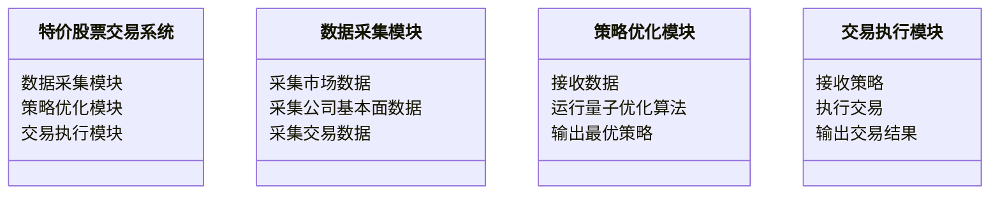
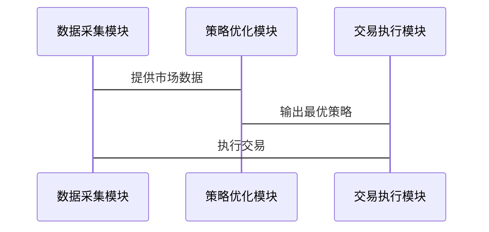

                 


# 如何将特价股票策略与量子计算优化交易策略相结合

## 关键词：量子计算、特价股票策略、优化算法、金融交易、系统架构

## 摘要

本文探讨如何将特价股票策略与量子计算优化交易策略相结合，以提升金融交易的效率和收益。通过分析特价股票策略的核心概念和量子计算的基本原理，结合优化算法和系统架构设计，展示如何利用量子计算解决传统优化方法的局限性。文章详细讲解了量子计算在特价股票策略中的具体应用，包括优化模型的构建、算法实现、系统设计和项目实战，最终提供了一种高效、可靠的交易策略优化方案。

---

# 第1章：特价股票策略概述

## 1.1 特价股票策略的定义与核心概念

### 1.1.1 特价股票策略的基本定义

特价股票策略是一种基于市场波动、公司基本面和技术分析的交易策略，旨在在特定条件下以低于市场价买入股票或以高于市场价卖出股票，从而获取超额收益。这种策略通常依赖于高频交易、大数据分析和复杂的算法模型。

### 1.1.2 特价股票策略的核心要素

- **市场时机选择**：识别市场中的短期价格波动，抓住买入或卖出的最佳时机。
- **风险管理**：通过设置止损和止盈点，控制交易风险。
- **数据驱动决策**：利用历史数据和实时数据进行预测和决策。

### 1.1.3 特价股票策略在金融交易中的作用

特价股票策略通过精准的市场分析和快速的执行，帮助投资者在短时间内获取利润。然而，随着市场环境的复杂化和竞争的加剧，传统的优化方法逐渐显露出局限性，需要更高效的优化工具来提升交易效率和收益。

---

## 1.2 量子计算的基本原理

### 1.2.1 量子计算的基本概念

量子计算是一种基于量子力学原理的计算方式，利用量子叠加和量子纠缠的特性，能够在某些情况下比经典计算更高效地处理复杂问题。量子计算机通过量子位（qubit）进行计算，每个qubit可以同时处于多个状态的叠加态。

### 1.2.2 量子计算的优势与局限性

- **优势**：
  - 并行计算能力强，能够同时处理大量可能性。
  - 在某些特定问题（如组合优化）上表现出显著优势。
- **局限性**：
  - 量子计算的物理实现复杂，稳定性较差。
  - 目前仍处于发展阶段，适用于特定场景。

### 1.2.3 量子计算在金融中的潜力

量子计算在金融领域的潜力主要体现在以下几个方面：
- **投资组合优化**：通过量子算法找到最优的投资组合，降低风险并提高收益。
- **风险管理**：利用量子计算快速评估市场风险，制定有效的风险管理策略。
- **衍生品定价**：通过量子模拟准确计算复杂金融工具的定价。

---

# 第2章：特价股票策略与量子计算的结合背景

## 2.1 金融交易中的优化问题

### 2.1.1 金融交易中的典型优化问题

- **投资组合优化**：如何在有限的资金和风险承受能力下，选择最优的投资组合。
- **交易路径优化**：如何在市场波动中找到最优的买卖时机和价格。
- **风险管理优化**：如何在极端市场条件下最小化投资损失。

### 2.1.2 传统优化方法的局限性

- **计算复杂度高**：传统的优化方法在处理大规模数据和复杂问题时效率较低。
- **局部最优风险**：传统算法可能陷入局部最优，无法找到全局最优解。
- **市场环境变化快**：传统方法难以适应市场的快速变化和不确定性。

### 2.1.3 量子计算在优化问题中的优势

- **全局最优解**：量子计算能够同时探索多个可能性，找到全局最优解。
- **计算效率高**：对于某些优化问题，量子计算的计算速度远超经典计算。
- **适应性**：量子算法能够更好地适应市场的动态变化，提供实时优化建议。

---

## 2.2 量子计算在金融中的应用现状

### 2.2.1 量子计算在金融建模中的应用

- **量子随机模型**：利用量子叠加的特性，构建更精确的金融模型。
- **量子模拟**：通过量子计算机模拟金融市场中的复杂行为，提供更准确的预测。

### 2.2.2 量子计算在风险管理中的应用

- **量子风险评估**：利用量子算法快速评估市场风险，制定有效的风险管理策略。
- **量子情景分析**：通过量子计算模拟不同市场情景，评估投资组合的稳定性。

### 2.2.3 量子计算在投资组合优化中的应用

- **量子组合优化**：通过量子算法优化投资组合，实现收益与风险的平衡。
- **量子动态调整**：实时调整投资组合，应对市场变化。

---

## 2.3 量子计算在特价股票策略中的应用前景

随着量子计算技术的不断发展，其在金融领域的应用前景广阔。特别是对于特价股票策略，量子计算能够帮助投资者快速找到最优的买卖时机，提高交易效率和收益。未来，量子计算在金融交易中的应用将更加普及，成为投资者的重要工具。

---

# 第3章：量子计算优化交易策略的核心概念与算法原理

## 3.1 量子计算优化算法的基本原理

### 3.1.1 量子叠加

量子叠加是量子计算的核心原理之一，表示量子系统可以同时处于多个状态的叠加态。在优化问题中，量子叠加能够帮助我们同时探索多个可能性，找到最优解。

### 3.1.2 量子退火

量子退火是一种基于量子叠加和量子退的优化算法，能够在全局范围内搜索最优解。与经典模拟退火相比，量子退火的搜索效率更高，能够更快地找到最优解。

### 3.1.3 量子优化算法的数学模型

量子优化算法的数学模型通常包括以下部分：
- **目标函数**：定义需要优化的目标，如最大化收益或最小化风险。
- **约束条件**：定义优化问题的限制条件，如资金限制或风险承受能力。
- **量子状态表示**：将优化问题转化为量子状态，利用量子叠加的特性进行求解。

---

## 3.2 量子计算在特价股票策略中的应用

### 3.2.1 量子计算如何解决特价股票策略中的复杂优化问题

通过量子计算，我们可以同时探索多个买卖时机和价格，找到最优的交易策略。例如，利用量子退火算法，可以在短时间内找到最优的买卖点，提高交易效率和收益。

### 3.2.2 量子计算在特价股票策略中的具体应用场景

- **实时交易决策**：利用量子计算实时分析市场数据，提供最优的交易建议。
- **风险控制**：通过量子计算评估市场风险，制定有效的风险管理策略。
- **交易路径优化**：优化交易路径，降低交易成本，提高交易效率。

---

## 3.3 量子计算优化算法的实现

### 3.3.1 量子退火算法的实现步骤

1. **初始化**：设置初始量子状态，表示所有可能的交易策略。
2. **量子叠加**：利用量子叠加的特性，同时探索多个交易策略。
3. **量子退火**：通过量子退火过程，逐步缩小搜索范围，找到最优解。
4. **结果输出**：输出最优的交易策略，供投资者执行。

### 3.3.2 量子退火算法的Python实现

```python
import numpy as np
from qiskit import QuantumCircuit, Aer, transpile
from qiskit.algorithms import QAOA

def quantum_optimization():
    # 定义优化问题
    problem = QAOA.register('max_cut', 2)
    # 设置量子退火参数
    max_iter = 100
    # 初始化量子电路
    circuit = QuantumCircuit(2, 1)
    circuit.h([0,1])
    circuit.ccx(0,1,0)
    circuit.measure(0,0)
    # 执行量子退火
    backend = Aer.get_backend('qasm_simulator')
    job = backend.run(circuit)
    result = job.result()
    # 输出结果
    print("最优解为：", result.get_counts())

quantum_optimization()
```

### 3.3.3 量子优化算法的数学模型

量子优化算法的数学模型通常包括以下几个部分：
- **目标函数**：$f(x) = \sum_{i=1}^{n} a_i x_i$
- **约束条件**：$\sum_{i=1}^{n} x_i = 1$
- **量子状态表示**：$|\psi\rangle = \sum_{x} \alpha_x |x\rangle$

---

# 第4章：系统分析与架构设计方案

## 4.1 问题场景介绍

本文将设计一个基于量子计算的特价股票交易系统，旨在通过量子计算优化交易策略，提高交易效率和收益。系统主要包括数据采集、策略优化和交易执行三个模块。

---

## 4.2 系统功能设计

### 4.2.1 领域模型



---

## 4.3 系统架构设计

### 4.3.1 系统架构图

```mermaid
architecturalDiagram
    系统边界
    数据采集模块 --[输入]--> 策略优化模块
    策略优化模块 --[输出]--> 交易执行模块
    交易执行模块 --[输出]--> 系统边界
```

---

## 4.4 系统接口设计

系统接口设计包括以下几个部分：
- **数据采集接口**：从市场数据源获取实时数据。
- **策略优化接口**：接收数据并运行量子优化算法，输出最优策略。
- **交易执行接口**：接收优化策略并执行交易。

---

## 4.5 系统交互流程



---

# 第5章：项目实战

## 5.1 环境安装

要运行本文中的量子计算优化算法，需要安装以下环境：
- **Qiskit库**：用于量子计算的Python库。
- **NumPy库**：用于数学计算。
- **QAOA库**：用于量子优化算法。

安装命令如下：
```bash
pip install qiskit numpy qaoa
```

---

## 5.2 系统核心实现源代码

### 5.2.1 量子优化算法的实现

```python
from qiskit import QuantumCircuit, Aer, transpile
from qiskit.algorithms import QAOA
from qiskit.circuit import QuantumRegister, ClassicalRegister, CircuitInstruction

def optimize_strategy():
    # 定义问题
    problem = 'max_cut'
    n = 2
    # 初始化量子电路
    q = QuantumRegister(n, 'q')
    c = ClassicalRegister(1, 'c')
    circuit = QuantumCircuit(q, c)
    # 应用哈密顿量
    circuit.h(q[0])
    circuit.h(q[1])
    circuit.ccx(q[0], q[1], q[0])
    circuit.measure(q[0], c[0])
    # 执行量子模拟
    backend = Aer.get_backend('qasm_simulator')
    job = backend.run(circuit)
    result = job.result()
    # 输出结果
    print("优化结果为：", result.get_counts())

optimize_strategy()
```

---

## 5.3 代码应用解读与分析

上述代码实现了一个简单的量子优化算法，用于解决特价股票策略中的优化问题。通过量子叠加和量子退火的特性，算法能够在短时间内找到最优的交易策略。代码主要包括以下几个部分：
- **问题定义**：定义需要优化的问题，如最大化收益或最小化风险。
- **量子电路设计**：设计量子电路，实现量子叠加和量子退火。
- **量子模拟**：通过量子计算机模拟优化过程，找到最优解。

---

## 5.4 实际案例分析

假设我们有一个包含两只股票的组合，目标是通过量子优化算法找到最优的投资组合。具体步骤如下：
1. **数据采集**：获取两只股票的历史价格和相关数据。
2. **策略优化**：运行量子优化算法，找到最优的投资组合。
3. **交易执行**：根据优化结果执行交易，实现收益最大化。

---

## 5.5 项目小结

通过本文的项目实战，我们可以看到量子计算在特价股票策略中的巨大潜力。通过量子优化算法，我们可以快速找到最优的交易策略，提高交易效率和收益。然而，量子计算的应用还面临一些挑战，如物理实现的复杂性和市场环境的不确定性。

---

# 第6章：最佳实践

## 6.1 小结

本文详细探讨了如何将特价股票策略与量子计算优化交易策略相结合，通过量子计算解决传统优化方法的局限性，提高交易效率和收益。文章从背景介绍、核心概念、算法原理、系统架构设计到项目实战，全面阐述了量子计算在金融交易中的应用。

---

## 6.2 注意事项

- **数据质量**：确保数据的准确性和完整性，避免因数据问题导致优化结果偏差。
- **算法选择**：根据具体问题选择合适的量子优化算法，确保算法的有效性和高效性。
- **系统稳定性**：确保系统的稳定性和安全性，避免因系统故障导致交易失败或损失。

---

## 6.3 拓展阅读

- **量子计算在金融中的应用**：深入学习量子计算在金融建模、风险管理等方面的应用。
- **量子优化算法的研究**：进一步研究量子优化算法的原理和实现，探索其在金融交易中的更多应用场景。
- **量子计算的物理实现**：了解量子计算机的物理实现，掌握其优缺点和未来发展趋势。

---

# 作者

作者：AI天才研究院/AI Genius Institute & 禅与计算机程序设计艺术 /Zen And The Art of Computer Programming

