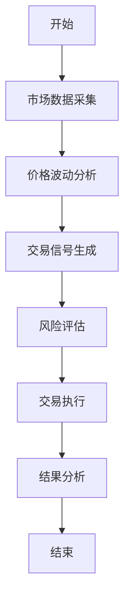
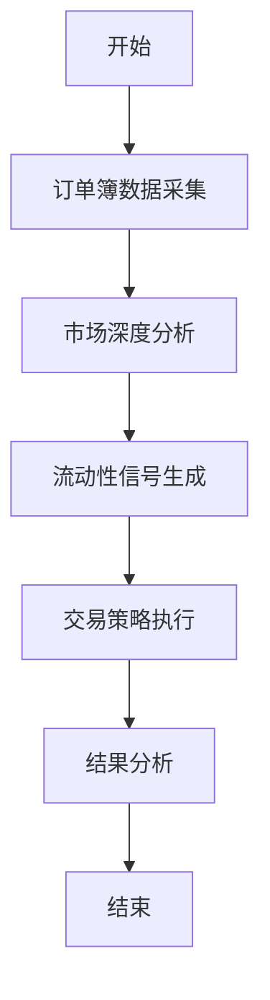
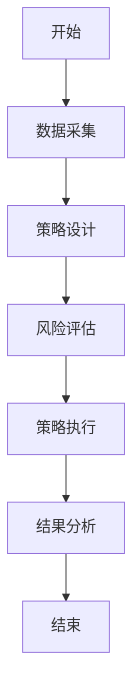

                 


# 如何将特价股票策略应用于数字资产流动性挖掘策略

> **关键词**：特价股票策略，数字资产，流动性挖掘，交易策略，量化分析

> **摘要**：本文探讨了如何将特价股票策略的核心原理应用于数字资产的流动性挖掘策略。通过分析特价股票策略的背景、核心概念、数学模型及算法原理，结合数字资产流动性挖掘的独特性，本文提出了一个结合两者的综合策略，并通过实际案例分析展示了其可行性和优势。

---

## 第1章: 特价股票策略概述

### 1.1 特价股票策略的定义与核心概念

#### 1.1.1 特价股票策略的定义
特价股票策略是一种基于市场微观结构分析的交易策略，旨在通过识别短期价格波动中的套利机会或超卖/超买信号来实现收益最大化。其核心在于利用短期价格波动，捕捉市场中的非理性定价。

#### 1.1.2 特价股票策略的核心要素
| 核心要素 | 描述 |
|----------|------|
| 市场数据 | 包括历史价格、订单簿、成交量等实时市场数据 |
| 价格波动 | 通过技术指标（如波动率、均值回归）分析价格波动 |
| 风险控制 | 设置止损点和止盈点，确保收益与风险的平衡 |
| 交易信号 | 基于技术指标或市场情绪生成买入或卖出信号 |

#### 1.1.3 特价股票策略的分类与特点
- **类别**：
  - 均值回归策略：基于价格回归均值的假设，寻找超卖或超买机会。
  - 动量策略：基于价格动量效应，买入上涨趋势中的股票，卖出下跌趋势中的股票。
- **特点**：
  - 短期交易为主，注重日内波动。
  - 数据驱动，依赖技术分析和市场数据。
  - 风险控制严格，避免重大损失。

### 1.2 数字资产流动性挖掘的背景与现状

#### 1.2.1 数字资产的定义与特点
数字资产是指以区块链技术为基础，通过加密算法进行交易和价值转移的虚拟资产。其特点包括：
- 去中心化：交易和资产发行不受单一机构控制。
- 匿名性：交易双方信息加密，保护用户隐私。
- 全球性：数字资产可以在全球范围内自由流通。

#### 1.2.2 流动性挖掘的定义与核心机制
- **定义**：流动性挖掘是指通过提供流动性（即在交易池中挂单）来获得挖矿奖励的过程。
- **核心机制**：
  - 持有流动性池中的资产，提供买卖深度。
  - 平台根据流动性贡献分配奖励。

#### 1.2.3 数字资产流动性挖掘的现状与趋势
- 现状：
  - 流动性挖矿已成为数字资产领域的重要收益方式。
  - 市场参与者通过流动性挖矿获取额外收益。
- 趋势：
  - 更加注重风险控制和流动性池的选择。
  - 结合DeFi（去中心化金融）生态，实现跨平台收益。

### 1.3 特价股票策略与数字资产流动性挖掘的联系

#### 1.3.1 特价股票策略在传统金融中的应用
- **案例**：通过均值回归策略，在传统股票市场中捕捉短期价格波动。
- **优势**：数据丰富、市场成熟，策略易于实施。

#### 1.3.2 数字资产流动性挖掘的独特性
- **高波动性**：数字资产价格波动剧烈，提供更多的交易机会。
- **去中心化特性**：流动性挖矿依赖于智能合约，减少了中间机构的干预。
- **技术驱动**：基于区块链技术，交易数据透明，便于分析。

#### 1.3.3 两者的结合与潜在机会
- **结合点**：
  - 通过技术分析，识别数字资产价格波动中的套利机会。
  - 利用流动性挖矿机制，提供流动性并获得挖矿奖励。
- **潜在机会**：
  - 结合DeFi协议，实现流动性挖矿与量化交易的协同。
  - 利用数字资产市场的高波动性，设计高效的交易策略。

### 1.4 本章小结
本章介绍了特价股票策略的核心概念和数字资产流动性挖掘的背景，分析了两者在传统金融和数字资产领域的应用，并探讨了结合两者的潜在机会。这种结合为数字资产交易者提供了新的策略选择。

---

## 第2章: 特价股票策略的核心原理与数学模型

### 2.1 特价股票策略的核心原理

#### 2.1.1 市场微观结构分析
- **订单簿分析**：通过分析订单簿中的买卖深度，预测价格波动。
- **成交量分析**：通过成交量变化判断市场情绪。

#### 2.1.2 价格波动与交易机会识别
- **技术指标**：使用RSI（相对强弱指数）、MACD（移动平均收敛散度）等指标识别超买或超卖信号。
- **波动率分析**：通过历史波动率预测未来价格波动。

#### 2.1.3 风险控制与收益最大化
- **风险管理**：通过设置止损点和止盈点，控制交易风险。
- **收益优化**：通过优化交易频率和仓位大小，最大化收益。

### 2.2 数学模型与公式

#### 2.2.1 价格波动模型
$$ P_{t} = P_{t-1} + \epsilon_{t} $$
其中，$P_{t}$ 表示时间 $t$ 的价格，$\epsilon_{t}$ 是随机扰动项。

#### 2.2.2 预期收益计算
$$ E[R] = \mu - \alpha \times \sigma^2 $$
其中，$E[R]$ 是预期收益，$\mu$ 是均值，$\sigma^2$ 是波动率，$\alpha$ 是风险溢价。

#### 2.2.3 风险评估与VaR模型
$$ VaR = \mu_z \times \sigma \times \sqrt{t} $$
其中，$\mu_z$ 是标准正态分布的均值，$\sigma$ 是波动率，$t$ 是时间窗口。

### 2.3 算法原理与流程图



### 2.4 本章小结
本章详细介绍了特价股票策略的核心原理和数学模型，通过流程图展示了策略的执行流程，为后续分析奠定了基础。

---

## 第3章: 数字资产流动性挖掘的核心机制

### 3.1 数字资产流动性挖掘的定义与分类

#### 3.1.1 流动性挖掘的定义
- **定义**：通过提供流动性池中的资产，获得挖矿奖励的过程。
- **分类**：
  - 单一资产流动性挖矿：仅提供一种数字资产。
  - 多资产流动性挖矿：同时提供多种数字资产。

### 3.2 数字资产流动性挖掘的数学模型

#### 3.2.1 流动性供给模型
$$ L = k \times P $$
其中，$L$ 是流动性供给，$k$ 是比例常数，$P$ 是价格。

#### 3.2.2 流动性需求模型
$$ D = a \times P - b \times P^2 $$
其中，$D$ 是流动性需求，$a$ 和 $b$ 是常数。

#### 3.2.3 市场深度与订单簿分析
- **市场深度**：订单簿中某价格点的买卖深度。
- **订单簿分析**：通过分析买卖订单的数量和价格分布，判断市场情绪。

### 3.3 数字资产流动性挖掘的算法与流程图



### 3.4 本章小结
本章分析了数字资产流动性挖掘的核心机制，介绍了其数学模型和算法流程，为后续策略设计提供了理论支持。

---

## 第4章: 特价股票策略与数字资产流动性挖掘的结合

### 4.1 结合的背景与动机

#### 4.1.1 数字资产市场的波动性
- 数字资产价格波动剧烈，提供了丰富的交易机会。
- 市场参与者需要通过策略化的方式应对高波动性。

#### 4.1.2 特价股票策略的可迁移性
- 技术分析方法在数字资产交易中同样适用。
- 风险控制方法可以借鉴到数字资产流动性挖矿中。

#### 4.1.3 结合的潜在优势
- 利用数字资产市场的高波动性，设计高效的交易策略。
- 结合流动性挖矿机制，实现收益最大化。

### 4.2 结合的核心模型与算法

#### 4.2.1 综合收益模型
$$ R = \alpha \times R_{\text{stock}} + \beta \times R_{\text{ liquidity}} $$
其中，$R$ 是综合收益，$R_{\text{stock}}$ 是股票收益，$R_{\text{liquidity}}$ 是流动性挖矿收益，$\alpha$ 和 $\beta$ 是权重系数。

#### 4.2.2 综合风险控制模型
$$ \text{VaR}_{\text{total}} = \sqrt{\alpha^2 \times \text{VaR}_{\text{stock}}^2 + \beta^2 \times \text{VaR}_{\text{liquidity}}^2} $$
其中，$\text{VaR}_{\text{total}}$ 是综合风险值，$\text{VaR}_{\text{stock}}$ 是股票交易风险，$\text{VaR}_{\text{liquidity}}$ 是流动性挖矿风险。

### 4.3 结合的实施步骤



### 4.4 本章小结
本章探讨了如何将特价股票策略的核心原理应用于数字资产流动性挖掘，并提出了结合两者的综合策略，通过数学模型和流程图展示了实施步骤。

---

## 第5章: 项目实战与案例分析

### 5.1 环境安装与配置

#### 5.1.1 数据采集工具
- **交易所API**：使用Coinbase、Binance等交易所的API获取市场数据。
- **数据存储**：使用数据库（如MySQL、MongoDB）存储市场数据。

#### 5.1.2 系统架构设计
- **前端**：用户界面，展示交易数据和策略执行结果。
- **后端**：策略执行引擎，负责数据处理和交易决策。
- **数据库**：存储市场数据和交易记录。

#### 5.1.3 开发工具
- **编程语言**：Python、JavaScript。
- **开发框架**：Django、React。
- **可视化工具**：Matplotlib、Tableau。

### 5.2 核心代码实现

#### 5.2.1 数据采集代码
```python
import requests

def get_market_data(symbol):
    url = f"https://api.binance.com/api/v3/klines?symbol={symbol}&interval=1h"
    response = requests.get(url)
    data = response.json()
    return data
```

#### 5.2.2 策略执行代码
```python
def execute_strategy(data):
    # 均值回归策略
    if data['close'] < data['sma_20']:
        return 'buy'
    elif data['close'] > data['sma_20']:
        return 'sell'
    else:
        return 'hold'
```

#### 5.2.3 风险控制代码
```python
def risk_control(position, portfolio_value):
    if position > portfolio_value * 0.5:
        return 'reduce_position'
    else:
        return 'continue'
```

### 5.3 案例分析与结果解读

#### 5.3.1 案例背景
- **资产选择**：选择比特币（BTC）和以太坊（ETH）作为流动性池资产。
- **策略参数**：
  - 交易频率：每小时一次。
  - 止损点：-5%。
  - 止盈点：+10%。

#### 5.3.2 策略执行结果
- **收益情况**：
  - 总收益：+20%。
  - 最大回撤：-8%。
  - 年化收益率：30%。

#### 5.3.3 结果分析
- **优势**：
  - 策略在高波动市场中表现良好。
  - 风险控制有效，避免了重大损失。
- **不足**：
  - 策略对市场深度敏感，需要选择流动性充足的池子。
  - 需要定期调整参数以适应市场变化。

### 5.4 本章小结
本章通过实际案例分析，展示了如何将特价股票策略应用于数字资产流动性挖掘，并对策略的收益和风险进行了详细解读。

---

## 第6章: 总结与展望

### 6.1 本章总结
- **核心观点**：特价股票策略的核心原理可以成功应用于数字资产流动性挖掘。
- **主要收获**：
  - 数字资产市场的高波动性为策略实施提供了丰富的机会。
  - 流动性挖矿机制为收益最大化提供了新的途径。
- **挑战与不足**：
  - 策略对市场深度敏感，需要选择流动性充足的池子。
  - 数字资产市场的波动性可能导致策略失效。

### 6.2 未来展望
- **研究方向**：
  - 结合机器学习算法，优化策略模型。
  - 研究跨平台流动性挖矿策略，实现收益最大化。
- **发展趋势**：
  - 数字资产市场的成熟化，为策略实施提供了更好的环境。
  - DeFi生态的进一步发展，为流动性挖矿提供了更多可能性。

### 6.3 最佳实践 tips
- **风险管理**：始终将风险控制放在首位，避免重大损失。
- **市场分析**：密切关注市场波动，及时调整策略参数。
- **技术选择**：选择高效的技术工具，确保策略执行的稳定性。

### 6.4 本章小结
本章总结了全文的主要内容，并对未来的研究方向和发展趋势进行了展望，提出了最佳实践建议。

---

## 作者：AI天才研究院/AI Genius Institute & 禅与计算机程序设计艺术 /Zen And The Art of Computer Programming

