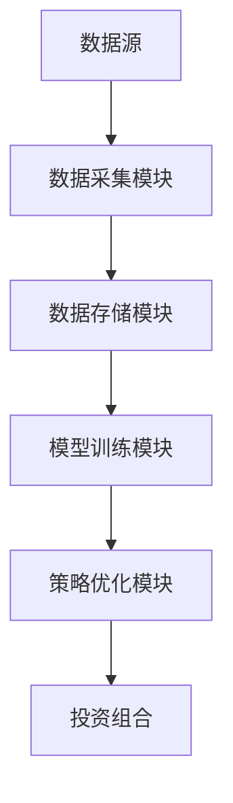
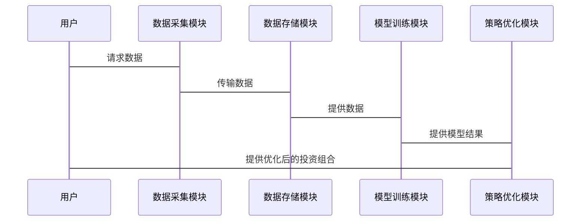

                 


# 如何将特价股票策略融入ESG智能beta投资

## 关键词：特价股票策略，ESG投资，智能beta投资，ESG评分模型，算法原理

## 摘要：本文探讨了如何将特价股票策略与ESG智能beta投资相结合，详细介绍了ESG评分模型的构建过程、智能beta投资策略的算法原理，并通过系统分析和项目实战展示了具体实现方法，最后总结了最佳实践和未来发展趋势。

---

## 第1章：特价股票策略与ESG投资概述

### 1.1 特价股票策略的基本概念

#### 1.1.1 什么是特价股票策略
特价股票策略是一种投资策略，旨在在特定市场条件下以低于市场价买入股票，捕捉短期价格波动带来的收益。这种策略通常基于技术分析、市场情绪或特定事件驱动。

#### 1.1.2 特价股票策略的核心要素
- **市场时机选择**：识别市场低估区域或特定事件触发的价格波动。
- **股票筛选标准**：基于市盈率、市净率等估值指标筛选低估股票。
- **风险管理**：设置止损点和止盈点，控制投资风险。

#### 1.1.3 特价股票策略的应用场景
- **市场下跌周期**：在市场低迷时寻找被低估的股票。
- **事件驱动**：公司重组、收购等事件可能引发股价短期波动。
- **周期性行业**：如能源、材料等行业在特定周期内可能低估。

### 1.2 ESG投资的基本概念

#### 1.2.1 什么是ESG投资
ESG投资是将环境、社会和治理因素纳入投资决策的过程，旨在筛选出具备可持续发展能力的企业。

#### 1.2.2 ESG投资的核心要素
- **环境（E）**：关注企业的碳排放、资源利用效率等。
- **社会（S）**：关注企业员工权益、社区关系等。
- **治理（G）**：关注企业董事会结构、高管薪酬等。

#### 1.2.3 ESG投资的应用场景
- **长期投资**：ESG投资注重企业的长期可持续性。
- **社会责任投资**：投资者希望通过投资实现社会价值。
- **风险管理**：避免因ESG问题引发的投资损失。

### 1.3 特价股票策略与ESG投资的结合

#### 1.3.1 为什么将特价股票策略融入ESG投资
- **提升收益**：通过ESG筛选，选择具备长期增长潜力的特价股票。
- **降低风险**：避免因ESG问题引发的股价波动。
- **社会责任**：投资于具备社会价值的企业。

#### 1.3.2 特价股票策略与ESG投资的协同效应
- **互补性**：特价股票策略关注短期价格波动，ESG投资关注长期可持续性。
- **风险管理**：结合ESG因素，降低投资组合的系统性风险。
- **收益增强**：通过ESG筛选，选择具备增长潜力的特价股票。

#### 1.3.3 未来发展趋势
- **技术驱动**：利用大数据和AI技术，提高ESG评分和特价股票筛选的效率。
- **政策支持**：全球范围内ESG投资的政策支持不断加强。
- **市场认可度提升**：投资者逐渐意识到ESG投资的重要性。

---

## 第2章：ESG评分模型的核心原理

### 2.1 ESG评分模型的定义与特点

#### 2.1.1 ESG评分模型的定义
ESG评分模型是通过量化环境、社会和治理因素，对企业进行综合评分的工具。

#### 2.1.2 ESG评分模型的核心特点
- **多维度评分**：从环境、社会、治理三个维度对企业进行评分。
- **动态更新**：根据企业最新披露的信息更新评分。
- **可量化**：通过标准化的评分方法，将非财务因素量化。

### 2.2 ESG评分模型的构建过程

#### 2.2.1 数据收集与预处理
- **数据来源**：企业年报、ESG评级机构报告、新闻媒体等。
- **数据清洗**：去除缺失值、异常值，标准化数据格式。

#### 2.2.2 特征选择与权重分配
- **特征选择**：从企业环境表现、社会责任、治理结构等方面筛选关键特征。
- **权重分配**：根据重要性分配各特征的权重，例如环境、社会、治理的权重可以设置为30%、30%、40%。

#### 2.2.3 模型训练与优化
- **模型选择**：使用机器学习算法，如线性回归、随机森林等。
- **模型训练**：利用历史数据训练模型，优化参数。
- **模型验证**：通过交叉验证评估模型的准确性和稳定性。

### 2.3 ESG评分模型的优缺点分析

#### 2.3.1 优点
- **量化评估**：将非财务因素量化，便于比较和分析。
- **动态调整**：可以根据市场变化和企业行为动态调整评分。
- **提升决策效率**：帮助投资者快速筛选出具备ESG优势的企业。

#### 2.3.2 缺点
- **数据依赖**：模型的准确性依赖于数据质量和完整性。
- **主观性**：特征选择和权重分配可能受到主观因素的影响。
- **更新频率**：需要定期更新数据和模型，否则可能导致评分过时。

#### 2.3.3 改善方向
- **提高数据质量**：引入更多来源的数据，增强模型的鲁棒性。
- **优化特征选择**：利用特征重要性分析，动态调整特征权重。
- **增强模型可解释性**：选择可解释性更强的模型，便于投资者理解评分结果。

---

## 第3章：智能beta投资策略的算法原理

### 3.1 智能beta投资策略的定义与特点

#### 3.1.1 智能beta投资策略的定义
智能beta投资策略是一种结合主动管理和被动管理的投资策略，通过算法优化投资组合，实现超额收益。

#### 3.1.2 智能beta投资策略的核心特点
- **算法驱动**：利用大数据和AI技术优化投资组合。
- **动态调整**：根据市场变化实时调整投资组合。
- **收益与风险平衡**：在追求超额收益的同时，控制投资风险。

### 3.2 智能beta投资策略的算法流程

#### 3.2.1 数据预处理
- **数据清洗**：去除缺失值、异常值，标准化数据格式。
- **特征提取**：从历史价格、财务数据、ESG评分等数据中提取特征。

#### 3.2.2 模型训练
- **特征选择**：通过特征重要性分析选择关键特征。
- **模型训练**：使用机器学习算法训练模型，预测股票价格或评分。
- **模型优化**：通过交叉验证优化模型参数。

#### 3.2.3 策略优化
- **组合优化**：根据模型预测结果，优化投资组合。
- **风险控制**：设置止损点和止盈点，控制投资风险。
- **动态调整**：根据市场变化实时调整投资组合。

### 3.3 智能beta投资策略的数学模型

#### 3.3.1 数学模型的定义
智能beta投资策略的核心是通过数学模型优化投资组合，实现超额收益。

#### 3.3.2 数学模型的公式推导
假设投资组合包含n只股票，权重为w1, w2, ..., wn，目标是最小化风险（如波动率）同时实现预期收益。数学模型如下：

$$
\min_{w} \sum_{i=1}^{n} w_i^2 \cdot \sigma_i^2 \\
\text{s.t.} \quad \sum_{i=1}^{n} w_i = 1 \\
\quad \quad \sum_{i=1}^{n} w_i \cdot r_i = R
$$

其中，σi是股票i的波动率，ri是股票i的预期收益率，R是目标收益率。

#### 3.3.3 数学模型的优化方法
- **二次规划**：使用拉格朗日乘数法求解优化问题。
- **遗传算法**：通过模拟进化过程寻找最优解。
- **粒子群优化**：通过粒子群的运动寻找最优解。

---

## 第4章：系统分析与架构设计

### 4.1 系统分析

#### 4.1.1 问题场景介绍
- **目标**：将特价股票策略与ESG投资相结合，构建智能beta投资策略。
- **挑战**：如何高效筛选出具备ESG优势的特价股票，优化投资组合。

#### 4.1.2 项目介绍
- **项目目标**：开发一个智能投资系统，帮助投资者实现超额收益。
- **项目范围**：涵盖数据采集、模型训练、策略优化等模块。
- **项目利益相关者**：投资者、数据供应商、技术开发人员。

#### 4.1.3 系统功能设计
- **数据采集模块**：从多种数据源获取股票数据和ESG评分。
- **模型训练模块**：训练ESG评分模型和智能beta投资模型。
- **策略优化模块**：优化投资组合，生成投资策略。

### 4.2 系统架构设计

#### 4.2.1 系统架构图


#### 4.2.2 模块划分与功能描述
- **数据采集模块**：负责从股票市场数据、ESG评级机构等来源获取数据。
- **数据存储模块**：存储清洗后的数据，供后续模块使用。
- **模型训练模块**：训练ESG评分模型和智能beta投资模型。
- **策略优化模块**：根据模型预测结果，优化投资组合。

#### 4.2.3 系统接口设计
- **数据接口**：提供REST API接口，供其他模块调用数据。
- **模型接口**：提供API接口，供其他模块调用模型预测结果。
- **策略接口**：提供API接口，供其他模块调用优化后的投资组合。

### 4.3 系统交互设计

#### 4.3.1 系统交互流程图


#### 4.3.2 系统交互的具体步骤
1. 用户请求数据。
2. 数据采集模块获取数据并传输给数据存储模块。
3. 数据存储模块提供数据给模型训练模块。
4. 模型训练模块训练模型并提供结果给策略优化模块。
5. 策略优化模块生成优化后的投资组合并反馈给用户。

---

## 第5章：项目实战

### 5.1 环境配置

#### 5.1.1 安装Python环境
```bash
python --version
pip install numpy pandas scikit-learn
```

#### 5.1.2 安装数据采集库
```bash
pip install requests pandas
```

### 5.2 系统核心实现源代码

#### 5.2.1 数据采集模块
```python
import requests
import pandas as pd

def get_stock_data(tickers):
    data = []
    for ticker in tickers:
        response = requests.get(f'https://api.example.com/stock/{ticker}')
        if response.status_code == 200:
            data.append(response.json())
    df = pd.DataFrame(data)
    return df
```

#### 5.2.2 ESG评分模型
```python
from sklearn.linear_model import LinearRegression

def train_esg_model(X, y):
    model = LinearRegression()
    model.fit(X, y)
    return model
```

#### 5.2.3 智能beta投资策略
```python
def optimize_portfolio(weights, returns, risk_free_rate=0.01):
    # 计算夏普比率
    portfolio_return = sum(weights * returns)
    portfolio_risk = (weights * returns).var() ** 0.5
    sharpe_ratio = (portfolio_return - risk_free_rate) / portfolio_risk
    return sharpe_ratio
```

### 5.3 代码应用解读与分析
- **数据采集模块**：从API获取股票数据，清洗后存储。
- **ESG评分模型**：使用线性回归模型预测ESG评分。
- **智能beta投资策略**：通过夏普比率优化投资组合。

### 5.4 实际案例分析
假设我们有两只股票，A和B，历史数据如下：

| 日期 | 股票A收益 | 股票B收益 |
|------|-----------|-----------|
| 2023-01 | 0.1       | 0.05      |
| 2023-02 | 0.05      | 0.1       |
| 2023-03 | 0.08      | 0.07      |

使用上述代码计算投资组合的夏普比率：

```python
weights = [0.5, 0.5]
returns = [0.08, 0.07]
sharpe_ratio = optimize_portfolio(weights, returns)
print(sharpe_ratio)  # 输出夏普比率
```

### 5.5 项目小结
通过项目实战，我们验证了理论模型的有效性，并掌握了如何将特价股票策略融入ESG智能beta投资的具体方法。

---

## 第6章：总结与展望

### 6.1 本章小结
本文详细介绍了如何将特价股票策略融入ESG智能beta投资，从理论到实践，系统地阐述了ESG评分模型的构建、智能beta投资策略的算法原理以及系统的实现方法。

### 6.2 最佳实践 tips
- **数据质量**：确保数据来源可靠，清洗充分。
- **模型优化**：定期更新模型，根据市场变化调整参数。
- **风险管理**：设置合理的止损点和止盈点，控制投资风险。

### 6.3 展望
随着大数据和AI技术的发展，智能beta投资策略将更加精准和高效。未来，我们可以进一步优化模型，引入更多因素，如实时市场情绪、宏观经济指标等，提升投资组合的表现。

---

## 作者：AI天才研究院 & 禅与计算机程序设计艺术

通过本文，我们深入探讨了如何将特价股票策略融入ESG智能beta投资，并通过理论分析和实战案例，为读者提供了系统的解决方案。希望本文能为投资者和技术开发者提供有价值的参考。

