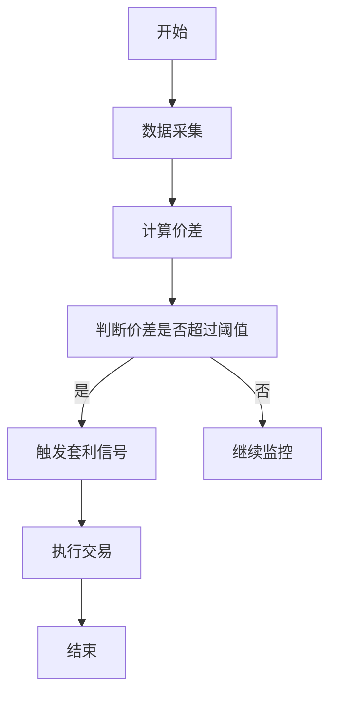
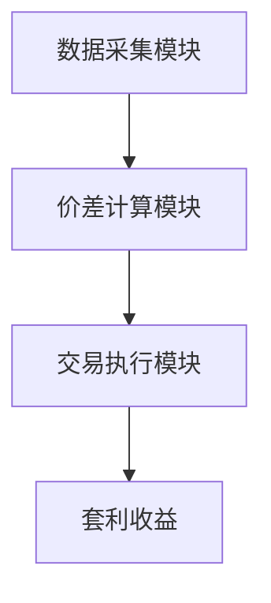

                 


# 如何构建基于特价股票的跨时区套利系统

> 关键词：特价股票、跨时区套利、算法交易、统计套利、数学模型

> 摘要：本文将详细介绍如何构建基于特价股票的跨时区套利系统。我们将从背景介绍、算法原理、数学模型、系统架构设计、项目实战等多个方面进行深入分析，帮助读者理解并掌握跨时区套利的核心技术与实现方法。

---

# 第1章: 特价股票跨时区套利概述

## 1.1 特价股票套利的定义与背景

### 1.1.1 什么是特价股票

特价股票是指在特定时间点或特定市场环境下，由于市场波动、信息不对称或其他因素导致股票价格出现显著波动，从而产生短期套利机会的股票。这些价格波动通常是短期的，且具有较高的交易机会。

### 1.1.2 跨时区套利的定义

跨时区套利是指利用不同时区股票市场的价格差异，通过在不同市场之间进行买卖操作，从而获取无风险或低风险收益的一种套利策略。由于不同市场的交易时间不同，同一股票在不同市场的价格可能会出现差异，这种差异为套利者提供了机会。

### 1.1.3 套利在金融市场的应用价值

套利在金融市场中具有重要的应用价值，主要包括：

1. **价格发现**：套利活动有助于消除不同市场之间的价格差异，促进市场价格的合理化。
2. **风险管理**：套利可以帮助投资者在不同市场之间分散风险。
3. **收益增强**：通过套利，投资者可以在不承担额外风险的情况下获得额外收益。

## 1.2 跨时区套利的核心概念

### 1.2.1 跨时区市场差异

不同时区的股票市场在交易时间、市场参与者、交易规则等方面存在差异，这些差异可能导致同一股票在不同市场的价格出现差异。例如，纽约市场和香港市场的交易时间不同，可能导致同一股票在两个市场的价格差异。

### 1.2.2 套利机会的产生机制

套利机会的产生机制主要包括以下步骤：

1. **价格差异的发现**：通过数据采集和分析，发现同一股票在不同市场的价格差异。
2. **套利信号的触发**：当价格差异超过一定阈值时，触发套利信号。
3. **交易执行**：根据套利信号，在相关市场进行买卖操作，以获取收益。

### 1.2.3 套利风险与收益的平衡

套利虽然可以在短期内带来收益，但也存在一定的风险。例如，由于市场波动、交易成本和监管风险等因素，套利可能会导致亏损。因此，在进行套利操作时，需要对风险和收益进行平衡，确保套利活动的可持续性。

## 1.3 特价股票的市场分析

### 1.3.1 全球主要股票市场的时区分布

全球主要股票市场的时区分布如下：

- 纽约证券交易所（NYSE）：东部时区（EST）
- 伦敦证券交易所（LSE）：格林威治时区（GMT）
- 香港证券交易所（HKEx）：香港时区（HKT）
- 日本证券交易所（JPX）：日本时区（JST）

### 1.3.2 不同时区市场的价格差异分析

不同市场的价格差异主要由以下因素引起：

1. **交易时间差异**：不同市场的交易时间不同，导致同一股票在不同市场的价格差异。
2. **市场参与者差异**：不同市场的参与者可能不同，导致价格差异。
3. **市场信息差异**：由于时差，投资者在不同市场可能获得的信息不同，导致价格差异。

### 1.3.3 特价股票的市场波动特征

特价股票的市场波动特征主要包括：

1. **短期波动性**：特价股票的价格通常在短期内波动较大。
2. **市场深度有限**：特价股票的交易量可能较小，市场深度有限。
3. **价格敏感性**：特价股票的价格对市场信息变化非常敏感。

## 1.4 本章小结

本章主要介绍了特价股票跨时区套利的基本概念、核心机制和市场分析。通过本章的学习，读者可以理解套利的基本原理以及跨时区套利的市场背景。

---

# 第2章: 跨时区套利的算法与数学模型

## 2.1 套利机会检测算法

### 2.1.1 统计套利算法

统计套利算法是一种基于统计学的套利方法，主要包括以下步骤：

1. **数据采集**：采集不同市场中同一股票的价格数据。
2. **价差计算**：计算同一股票在不同市场的价格差异。
3. **统计分析**：通过统计方法判断价差是否显著，从而决定是否进行套利。

### 2.1.2 时间序列分析算法

时间序列分析算法是一种基于时间序列数据的套利方法，主要包括以下步骤：

1. **数据采集**：采集同一股票在不同市场中的价格数据。
2. **数据预处理**：对数据进行清洗和标准化处理。
3. **模型训练**：训练时间序列模型，预测未来的价格走势。
4. **套利信号生成**：根据模型预测结果，生成套利信号。

### 2.1.3 基于机器学习的套利信号识别

基于机器学习的套利信号识别方法是一种高级套利方法，主要包括以下步骤：

1. **数据采集**：采集同一股票在不同市场中的价格数据。
2. **特征提取**：提取影响股票价格的特征，如市场波动率、交易量等。
3. **模型训练**：训练机器学习模型，识别套利信号。
4. **信号生成**：根据模型预测结果，生成套利信号。

## 2.2 算法实现的数学模型

### 2.2.1 均值回归模型

均值回归模型是一种常用的统计套利模型，其基本假设是价格会回归其均值。模型公式如下：

$$ r_t = \alpha + \beta t + \epsilon_t $$

其中，$r_t$ 表示第 $t$ 时刻的价格收益率，$\alpha$ 是截距，$\beta$ 是回归系数，$\epsilon_t$ 是误差项。

### 2.2.2 方差分析模型

方差分析模型是一种常用的统计套利模型，其基本假设是不同市场的价格波动具有不同的方差。模型公式如下：

$$ \sigma^2 = E[r_t^2] $$

其中，$\sigma^2$ 表示价格收益率的方差，$r_t$ 表示第 $t$ 时刻的价格收益率。

### 2.2.3 距离度量算法

距离度量算法是一种常用的机器学习套利模型，其基本假设是价格差异可以通过距离度量进行分类。模型公式如下：

$$ spread = |p_t - p_{t-1}| $$

其中，$spread$ 表示价格差异，$p_t$ 表示第 $t$ 时刻的价格，$p_{t-1}$ 表示第 $t-1$ 时刻的价格。

## 2.3 算法实现的流程图

### 2.3.1 算法流程图（使用 Mermaid）



## 2.4 算法实现的Python代码示例

### 2.4.1 数据采集与处理

```python
import pandas as pd
import numpy as np

# 示例数据采集代码
def get_stock_data(ticker, start_date, end_date):
    # 数据获取逻辑
    pass
```

### 2.4.2 价差计算与分析

```python
def calculate_spread(data):
    return data['price'].diff().abs()
```

## 2.5 本章小结

本章主要介绍了套利机会检测算法及其数学模型。通过本章的学习，读者可以理解套利算法的基本原理以及如何通过数学模型实现套利信号的检测。

---

# 第3章: 跨时区套利系统架构设计

## 3.1 系统功能模块划分

### 3.1.1 数据采集模块

数据采集模块负责从不同市场中采集同一股票的价格数据，包括实时数据和历史数据。

### 3.1.2 价差计算模块

价差计算模块负责计算同一股票在不同市场的价格差异，生成套利信号。

### 3.1.3 交易执行模块

交易执行模块负责根据套利信号，在相关市场中执行买卖操作，实现套利收益。

## 3.2 系统架构设计

### 3.2.1 系统功能设计

系统功能设计包括以下模块：

1. **数据采集模块**：负责从不同市场中采集同一股票的价格数据。
2. **价差计算模块**：负责计算同一股票在不同市场的价格差异，生成套利信号。
3. **交易执行模块**：负责根据套利信号，在相关市场中执行买卖操作。

### 3.2.2 系统架构图（使用 Mermaid）



## 3.3 本章小结

本章主要介绍了跨时区套利系统的架构设计，包括系统功能模块划分和系统架构图。通过本章的学习，读者可以理解套利系统的基本架构以及各模块之间的关系。

---

# 第4章: 跨时区套利系统实现

## 4.1 项目实战

### 4.1.1 环境安装

为了实现跨时区套利系统，首先需要安装以下环境：

1. **编程语言**：Python
2. **数据采集工具**：如 Yahoo Finance API 或其他股票数据接口。
3. **数据处理工具**：Pandas、NumPy 等。
4. **可视化工具**：Matplotlib 或 Seaborn。

### 4.1.2 核心代码实现

以下是套利系统的核心代码实现：

```python
import pandas as pd
import numpy as np

# 数据采集函数
def get_stock_data(ticker, start_date, end_date):
    # 数据获取逻辑
    pass

# 价差计算函数
def calculate_spread(data):
    return data['price'].diff().abs()

# 套利信号生成函数
def generate_signal(data):
    threshold = 0.05
    spread = calculate_spread(data)
    return spread > threshold

# 交易执行函数
def execute_trade(signal, price):
    if signal:
        return '买入'
    else:
        return '卖出'
```

### 4.1.3 案例分析

以下是一个具体的案例分析：

假设我们在纽约市场和香港市场同时交易同一股票，纽约市场的价格为 $100，香港市场的价格为 $98。根据价差计算，价格差异为 $2，超过阈值 $1.5，触发套利信号。因此，我们需要在香港市场买入股票，并在纽约市场卖出股票，从而获得套利收益。

## 4.2 本章小结

本章通过实际案例分析，详细介绍了跨时区套利系统的实现过程，包括环境安装、核心代码实现和案例分析。通过本章的学习，读者可以掌握套利系统的核心实现方法。

---

# 第5章: 最佳实践与注意事项

## 5.1 最佳实践

1. **数据质量控制**：确保数据采集的准确性和及时性。
2. **风险控制**：设置合理的止损和止盈机制，避免亏损。
3. **交易成本控制**：尽量降低交易成本，如佣金、滑点等。

## 5.2 注意事项

1. **市场风险**：套利活动存在市场风险，需谨慎操作。
2. **监管风险**：不同市场的监管政策可能不同，需遵守相关法规。
3. **技术风险**：套利系统可能存在技术故障，需做好应急预案。

## 5.3 拓展阅读

1. **统计套利的经典文献**：如《统计套利：算法交易者的圣经》。
2. **机器学习在金融中的应用**：如《机器学习在金融中的应用》。

---

# 作者：AI天才研究院/AI Genius Institute & 禅与计算机程序设计艺术 /Zen And The Art of Computer Programming

---

以上是《如何构建基于特价股票的跨时区套利系统》的完整目录和文章内容。通过本文，读者可以系统地了解跨时区套利的核心技术与实现方法，并掌握如何利用这些技术构建一个高效的套利系统。

