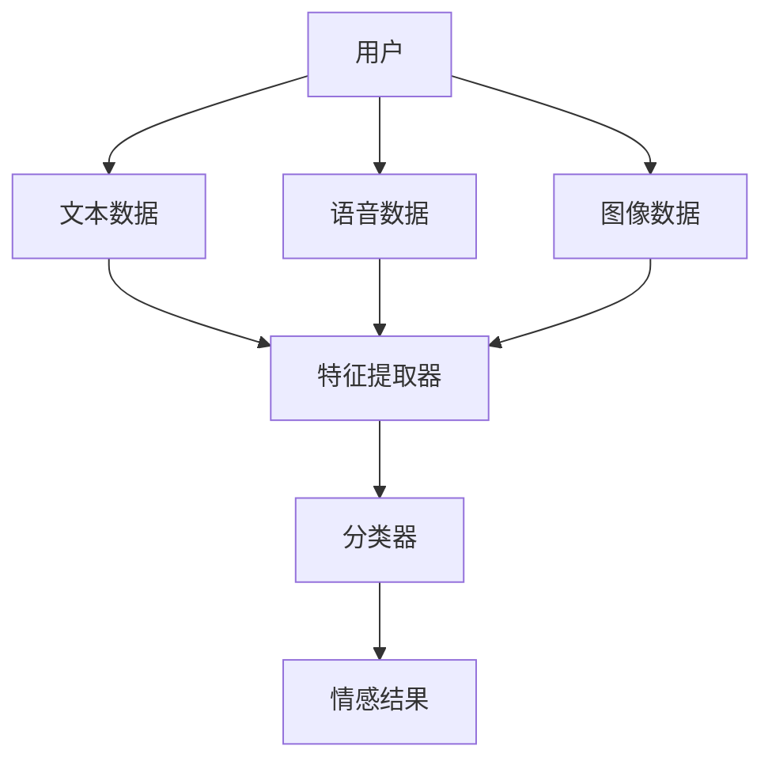
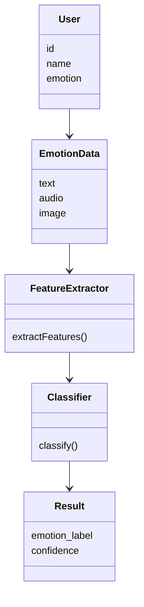
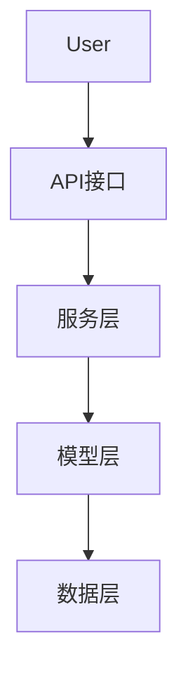
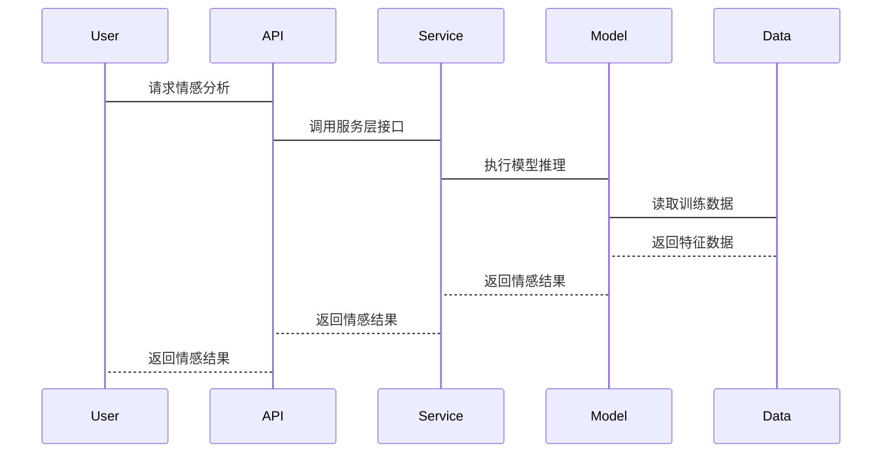

                 


# 如何评估企业的AI驱动的情感计算技术

> 关键词：情感计算，AI驱动，企业评估，技术分析，系统架构，算法原理

> 摘要：本文将深入探讨如何评估企业中的AI驱动的情感计算技术。通过分析情感计算的核心概念、算法原理、系统架构以及实际项目案例，帮助读者全面理解情感计算技术的评估方法和实现细节。文章从背景介绍、核心概念、算法原理、系统设计、项目实战到最佳实践，层层递进，为读者提供一个完整的评估框架。

---

## 第1章: 情感计算技术的背景与定义

### 1.1 情感计算的定义与核心概念

情感计算（Affective Computing）是一种利用人工智能技术来识别、理解和模拟人类情感状态的计算方式。它通过分析面部表情、语音语调、文本内容等多模态数据，提取情感特征，并进行情感分类、预测和反馈。

#### 1.1.1 情感计算的定义
情感计算的核心目标是理解人类的情感状态，并将其应用于人机交互、个性化推荐、心理健康评估等领域。情感计算不仅仅是对情感的简单识别，还包括对情感的深度理解和动态分析。

#### 1.1.2 情感计算的核心概念
- **情感数据**：包括文本、语音、图像等多模态数据。
- **情感特征**：从情感数据中提取的具有代表性的特征，如文本中的情感关键词、语音中的语调特征、图像中的面部表情特征。
- **情感分类**：将情感特征映射到特定的情感类别，如积极、消极、中性等。
- **情感预测**：基于历史数据预测未来的情感状态。

#### 1.1.3 情感计算的边界与外延
情感计算的边界在于如何准确地提取和分析情感特征，以及如何将情感理解应用于实际场景。其外延则涉及多模态数据融合、实时情感反馈等高级功能。

### 1.2 情感计算的技术背景

#### 1.2.1 人工智能与情感计算的关系
情感计算是人工智能（AI）的一个重要分支，它依赖于自然语言处理（NLP）、计算机视觉（CV）、机器学习（ML）等技术。情感计算的发展离不开AI技术的进步，尤其是在深度学习模型的推动下，情感计算的准确性和实时性得到了显著提升。

#### 1.2.2 情感计算在企业中的应用场景
- **客户情绪分析**：帮助企业了解客户对产品或服务的满意度，优化客户体验。
- **情感驱动的个性化推荐**：根据用户的情感状态推荐相关内容或产品。
- **心理健康评估**：通过分析用户的社交网络数据，评估其心理健康状态。
- **智能客服**：通过实时情感分析，提供更智能化的客户服务。

#### 1.2.3 情感计算的行业发展趋势
随着AI技术的不断进步，情感计算正在从实验室研究走向实际应用。企业对情感计算技术的需求日益增长，尤其是在金融、教育、医疗等领域。

### 1.3 问题背景与问题描述

#### 1.3.1 情感计算技术的核心问题
- 如何准确提取和分析情感特征？
- 如何提高情感分类的准确性和实时性？
- 如何将情感计算技术应用于实际场景？

#### 1.3.2 企业评估情感计算技术的必要性
企业在引入情感计算技术时，需要评估其技术可行性、应用效果和成本效益。只有通过有效的评估，才能确保技术的正确引入和应用。

#### 1.3.3 情感计算技术的边界与限制
情感计算技术目前仍存在一些限制，如情感特征的多样性、情感分类的模糊性、多模态数据的融合难度等。这些问题需要企业在评估时加以考虑。

### 1.4 情感计算技术的解决方案

#### 1.4.1 情感计算技术的基本原理
情感计算的基本原理包括数据采集、特征提取、情感分类和反馈优化。通过这些步骤，情感计算技术能够实现对情感状态的准确识别和分析。

#### 1.4.2 情感计算技术的核心要素
- **数据采集**：获取多模态情感数据，如文本、语音、图像等。
- **特征提取**：从数据中提取具有代表性的特征，如文本中的情感词、语音中的语调特征。
- **情感分类**：基于特征进行情感分类，如积极、消极、中性。
- **反馈优化**：根据情感分析结果优化系统输出，提供更智能化的服务。

#### 1.4.3 情感计算技术的实现框架
情感计算的实现框架通常包括数据预处理、特征提取、模型训练、结果分析等模块。每个模块的具体实现方法需要根据实际应用场景进行调整。

---

## 第2章: 情感计算技术的核心概念与联系

### 2.1 情感计算的核心原理

#### 2.1.1 情感数据的采集与处理
情感数据的采集包括文本、语音、图像等多种形式。在采集后，需要对数据进行预处理，如去噪、归一化等，以便后续分析。

#### 2.1.2 情感特征的提取与分析
特征提取是情感计算的核心步骤。通过提取文本中的情感词、语音中的语调特征、图像中的面部表情特征等，可以为情感分类提供有效的输入。

#### 2.1.3 情感分类与预测的算法原理
情感分类可以通过机器学习算法实现，如支持向量机（SVM）、随机森林（RF）、深度学习模型（如LSTM、BERT）等。不同算法适用于不同的应用场景，需要根据具体需求选择合适的模型。

### 2.2 情感计算技术的关键属性对比

#### 2.2.1 不同情感计算技术的特征对比
| 技术 | 数据类型 | 特征提取 | 分类算法 | 优点 | 缺点 |
|------|----------|----------|----------|------|------|
| 文本情感分析 | 文本 | 情感词、句法结构 | SVM、LSTM | 高精度 | 实时性差 |
| 语音情感分析 | 语音 | 语调、音量 | KNN、SVM | 实时性好 | 精度受背景噪声影响 |
| 图像情感分析 | 图像 | 面部表情、颜色特征 | CNN、SVM | 多模态融合 | 数据量需求大 |

#### 2.2.2 情感计算技术的性能指标
- **准确率（Accuracy）**：分类正确的情感样本数占总样本数的比例。
- **召回率（Recall）**：分类为积极的情感样本中实际为积极的比例。
- **F1值（F1 Score）**：准确率和召回率的调和平均数，综合考虑分类的精确性和召回率。

#### 2.2.3 情感计算技术的优缺点分析
- **优点**：情感计算可以帮助企业更好地理解用户需求，提升客户体验。
- **缺点**：情感计算技术目前仍存在数据依赖性强、情感特征提取困难等问题。

### 2.3 情感计算技术的ER实体关系图



---

## 第3章: 情感计算技术的算法原理

### 3.1 支持向量机（SVM）算法原理

#### 3.1.1 算法概述
支持向量机是一种常用的分类算法，适用于线性可分和非线性数据的分类。通过构建超平面，将数据分为不同的类别。

#### 3.1.2 算法流程
1. 数据预处理：对数据进行归一化、降维等处理。
2. 核心计算：通过优化目标函数，找到最优超平面。
3. 模型训练：使用训练数据训练SVM模型。
4. 模型预测：将测试数据输入模型，输出分类结果。

#### 3.1.3 数学公式
支持向量机的优化目标如下：
$$
\text{minimize} \quad \frac{1}{2} \lVert w \rVert^2 + C \sum_{i=1}^{n} \xi_i
$$
其中，$w$ 是权重向量，$C$ 是惩罚系数，$\xi_i$ 是松弛变量。

### 3.2 卷积神经网络（CNN）算法原理

#### 3.2.1 算法概述
卷积神经网络是一种常用的图像处理算法，适用于图像分类、目标检测等任务。

#### 3.2.2 算法流程
1. 数据预处理：对图像进行归一化、裁剪等处理。
2. 卷积操作：通过卷积核提取图像特征。
3. 池化操作：对特征图进行降维处理。
4. 模型训练：使用反向传播算法训练CNN模型。
5. 模型预测：将测试图像输入模型，输出分类结果。

#### 3.2.3 数学公式
卷积操作的数学表达式如下：
$$
f_i(j) = \sum_{k=1}^{n} w_{i,j,k} \cdot x_{i,j,k}
$$
其中，$f_i(j)$ 是输出特征图的像素值，$w_{i,j,k}$ 是卷积核的权重，$x_{i,j,k}$ 是输入图像的像素值。

### 3.3 长短期记忆网络（LSTM）算法原理

#### 3.3.1 算法概述
长短期记忆网络是一种常用的序列模型，适用于时间序列数据的分析。

#### 3.3.2 算法流程
1. 数据预处理：对序列数据进行归一化、分割等处理。
2. LSTM单元操作：通过输入门、遗忘门、输出门进行特征提取。
3. 模型训练：使用反向传播算法训练LSTM模型。
4. 模型预测：将测试序列输入模型，输出分类结果。

#### 3.3.3 数学公式
LSTM单元的遗忘门计算公式如下：
$$
f_t = \sigma(w_f \cdot [h_{t-1}, x_t] + b_f)
$$
其中，$f_t$ 是遗忘门的输出，$\sigma$ 是sigmoid函数，$w_f$ 是遗忘门的权重，$h_{t-1}$ 是前一时刻的隐藏状态，$x_t$ 是当前时刻的输入，$b_f$ 是偏置项。

---

## 第4章: 情感计算技术的系统架构设计

### 4.1 系统功能设计

#### 4.1.1 领域模型设计


#### 4.1.2 系统架构设计


#### 4.1.3 系统交互设计


### 4.2 系统性能分析

#### 4.2.1 系统响应时间
系统响应时间是评估情感计算技术的重要指标之一。需要确保系统在实时应用中的响应时间满足需求。

#### 4.2.2 系统资源消耗
系统资源消耗包括CPU、GPU、内存等的使用情况。需要确保系统在高负载下的稳定运行。

#### 4.2.3 系统扩展性
系统扩展性是评估情感计算技术的重要指标之一。需要确保系统能够支持大规模数据处理和多模态数据融合。

---

## 第5章: 情感计算技术的项目实战

### 5.1 项目环境安装

```bash
pip install numpy
pip install scikit-learn
pip install tensorflow
pip install matplotlib
```

### 5.2 项目核心实现

#### 5.2.1 文本情感分析实现
```python
from sklearn.feature_extraction.text import TfidfVectorizer
from sklearn.svm import SVC
from sklearn.metrics import accuracy_score

# 数据预处理
text_data = [...]  # 文本数据
labels = [...]     # 情感标签

# 特征提取
vectorizer = TfidfVectorizer()
features = vectorizer.fit_transform(text_data)

# 模型训练
model = SVC()
model.fit(features, labels)

# 模型预测
test_features = vectorizer.transform(new_text_data)
predictions = model.predict(test_features)

# 结果评估
print("Accuracy:", accuracy_score(new_labels, predictions))
```

#### 5.2.2 语音情感分析实现
```python
import librosa
import numpy as np

# 数据预处理
audio_path = "audio.wav"
audio_data, sample_rate = librosa.load(audio_path, sr=None)

# 特征提取
features = librosa.feature.mfcc(y=audio_data, sr=sample_rate)

# 模型训练
model = KNNClassifier()
model.fit(features, labels)

# 模型预测
test_features = ...  # 测试语音特征
predictions = model.predict(test_features)

# 结果评估
print("Accuracy:", accuracy_score(test_labels, predictions))
```

### 5.3 项目案例分析

#### 5.3.1 情感计算在智能客服中的应用
通过情感计算技术，智能客服可以实时分析用户的情绪状态，提供更智能化的服务。例如，当用户情绪激动时，系统可以自动升级到人工客服。

#### 5.3.2 情感计算在个性化推荐中的应用
通过分析用户的文本、语音、图像等多模态数据，系统可以为用户提供更个性化的推荐内容。例如，根据用户的喜好推荐情感相符的电影、音乐等。

### 5.4 项目总结与优化

#### 5.4.1 项目总结
通过项目实战，我们掌握了情感计算技术的实现方法和应用技巧。同时，也发现了当前技术的一些局限性，如情感特征提取的多样性、情感分类的模糊性等。

#### 5.4.2 项目优化
未来可以通过引入更先进的算法（如深度学习模型）、优化特征提取方法、融合多模态数据等方式，进一步提升情感计算技术的准确性和实时性。

---

## 第6章: 情感计算技术的最佳实践与小结

### 6.1 最佳实践

#### 6.1.1 技术评估
在引入情感计算技术时，需要从技术可行性、应用效果、成本效益等多个方面进行评估，确保技术的正确引入和应用。

#### 6.1.2 数据管理
情感计算技术依赖于多模态数据，需要建立高效的数据管理系统，确保数据的安全性、可靠性和可扩展性。

#### 6.1.3 系统优化
通过优化算法、改进模型、提升系统性能等方式，不断优化情感计算技术的应用效果。

### 6.2 小结

通过本文的深入分析，我们了解了如何评估企业的AI驱动的情感计算技术。从背景介绍、核心概念、算法原理、系统架构到项目实战，我们系统地探讨了情感计算技术的评估方法和实现细节。未来，随着AI技术的不断进步，情感计算技术将在更多领域得到广泛应用。

---

## 作者信息

作者：AI天才研究院/AI Genius Institute & 禅与计算机程序设计艺术 /Zen And The Art of Computer Programming

---

以上是关于如何评估企业的AI驱动的情感计算技术的技术博客文章的详细大纲和部分章节内容。如果需要进一步扩展具体章节的内容或补充更多细节，请随时告知！

