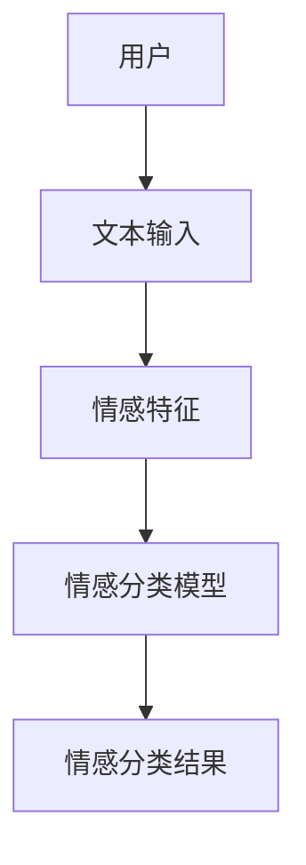
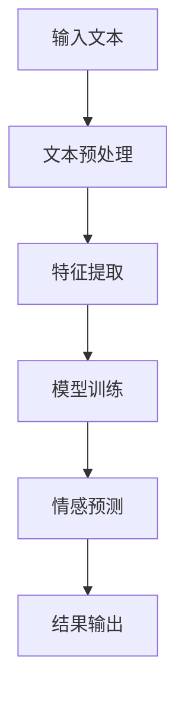
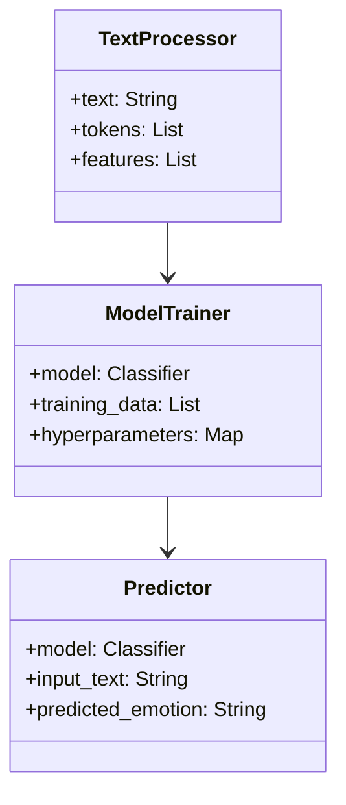
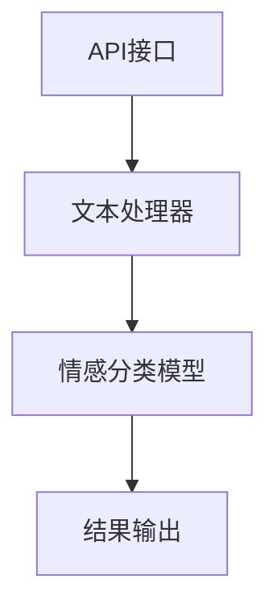
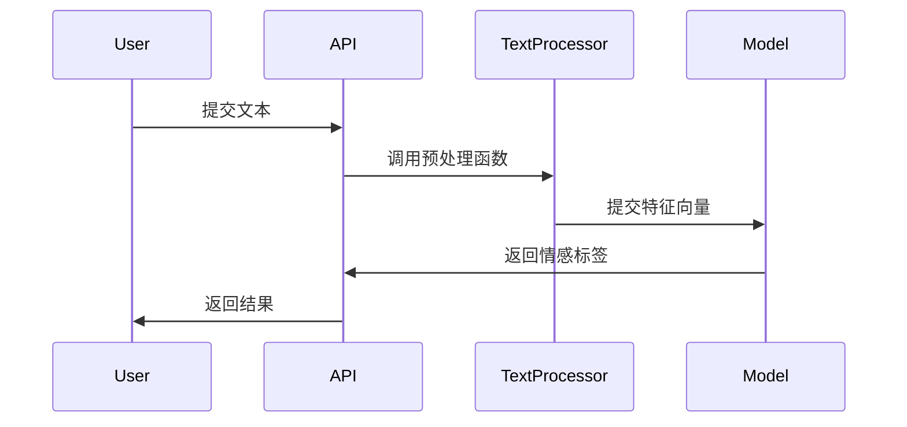

                 


# 如何评估企业的AI驱动的情感识别技术

> 关键词：AI情感识别技术、自然语言处理、机器学习、深度学习、情感分类、评估方法

> 摘要：本文深入探讨了如何评估企业中的AI驱动情感识别技术，从背景介绍、核心概念、算法原理、系统架构到项目实战，全面分析了情感识别技术的关键要素、算法原理和实际应用。通过详细的技术分析和实际案例，帮助读者理解如何选择和优化情感识别技术，以提升企业的智能化水平。

---

# 第1章 情感识别技术的背景与应用

## 1.1 情感识别技术的定义与核心概念

### 1.1.1 情感识别技术的定义

情感识别技术是一种利用人工智能技术，从文本、语音或图像中识别和分析人类情感状态的技术。它通过自然语言处理（NLP）、机器学习（ML）和深度学习（DL）等方法，将非结构化的数据转化为可量化的指标，帮助企业更好地理解用户情感。

### 1.1.2 情感识别的核心要素

- **数据特征**：情感识别的核心在于从数据中提取特征，例如文本中的词汇、语调、语气等。
- **算法模型**：选择合适的算法模型是情感识别的关键，常见的算法包括朴素贝叶斯、支持向量机（SVM）、卷积神经网络（CNN）等。
- **评估指标**：准确率、召回率、F1分数等是评估情感识别模型性能的重要指标。

### 1.1.3 情感识别与企业AI技术的关联

情感识别是企业AI技术的重要组成部分，它能够帮助企业更好地理解用户需求、优化客户服务、提升用户体验。通过情感识别技术，企业可以实时分析用户反馈，快速调整产品策略。

## 1.2 情感识别技术的应用场景

### 1.2.1 客户服务中的情感识别

在客户服务中，情感识别技术可以实时分析客户的反馈，帮助客服人员更好地理解客户情绪，提供个性化的服务。例如，在在线聊天中，系统可以根据客户的话语判断其情绪状态，自动调整回应方式。

### 1.2.2 企业营销中的情感分析

企业可以通过情感识别技术分析社交媒体上的用户评论，了解用户对产品的看法。这种分析可以帮助企业在市场推广中制定更有针对性的策略。

### 1.2.3 人力资源管理中的情感评估

在招聘过程中，企业可以利用情感识别技术分析候选人的简历和面试表现，评估其情绪稳定性、工作态度等，从而做出更准确的录用决策。

## 1.3 情感识别技术的技术发展与挑战

### 1.3.1 情感识别技术的历史发展

情感识别技术的发展经历了从基于规则的传统方法到深度学习的现代方法的转变。早期的情感识别主要依赖于预定义的规则和关键词匹配，而现代方法则利用机器学习和深度学习技术，能够更准确地识别复杂的情感状态。

### 1.3.2 当前技术的主要挑战

- **数据多样性**：情感识别技术需要处理不同类型的数据，如文本、语音和图像，这增加了模型训练的复杂性。
- **情感粒度**：情感识别通常将情感分为正面、负面和中性三种，但实际应用中可能需要更细粒度的情感分类。
- **文化差异**：不同文化背景下，情感表达方式可能有所不同，这会影响模型的通用性。

### 1.3.3 未来技术的潜在突破

随着深度学习技术的不断发展，情感识别技术将更加智能化和精准化。未来，模型将能够更好地理解上下文，识别隐含情感，并在多语言、多文化环境下实现高效的情感识别。

---

# 第2章 情感识别技术的核心概念与联系

## 2.1 情感识别的核心原理

### 2.1.1 文本预处理与特征提取

文本预处理包括分词、去除停用词、词干提取等步骤。特征提取则通过TF-IDF、Word2Vec等方法将文本转换为数值特征。

### 2.1.2 情感分类算法原理

情感分类算法通过训练数据学习情感特征，利用这些特征对新的文本进行分类。常见的算法包括朴素贝叶斯、SVM和深度学习模型如LSTM、Transformer等。

### 2.1.3 模型训练与优化

模型训练过程中，需要选择合适的算法、调整超参数，并通过交叉验证优化模型性能。

## 2.2 情感识别技术的关键要素对比

### 2.2.1 不同情感分类算法的对比

| 算法类型         | 优点                           | 缺点                           |
|------------------|--------------------------------|--------------------------------|
| 朴素贝叶斯       | 计算简单，适合小数据集           | 对特征独立性假设严格             |
| SVM              | 分离能力强，适合高维数据         | 计算复杂，不适合大数据集           |
| LSTM             | 能够处理序列数据，捕捉上下文信息   | 训练时间长，需要大量计算资源       |
| Transformer       | 并行处理能力强，效果优秀           | 参数多，计算资源消耗大             |

### 2.2.2 数据特征与模型性能的关系

特征的选择和提取对模型性能有直接影响。例如，使用TF-IDF特征提取可以提高模型的分类准确性，而使用词嵌入（如Word2Vec）则可以捕捉更丰富的语义信息。

### 2.2.3 情感识别的准确率与召回率对比

准确率和召回率是评估分类模型性能的重要指标。在情感识别中，准确率衡量整体分类的正确性，而召回率则衡量模型识别正面样本的能力。

## 2.3 情感识别的ER实体关系图



---

# 第3章 情感识别技术的算法原理

## 3.1 情感识别的主要算法

### 3.1.1 基于规则的分类算法

基于规则的分类算法依赖于预定义的规则，例如通过关键词匹配来判断文本的情感倾向。

### 3.1.2 基于机器学习的分类算法

机器学习算法通过训练数据学习情感特征，例如使用SVM进行分类。

### 3.1.3 基于深度学习的分类算法

深度学习算法如LSTM和Transformer能够更好地捕捉文本的语义信息，提高分类的准确性。

## 3.2 情感分类算法的流程图



## 3.3 情感分类算法的数学模型

### 3.3.1 朴素贝叶斯分类器

朴素贝叶斯分类器基于概率论，通过计算条件概率来分类文本。其数学公式如下：

$$ P(c|x) = \frac{P(x|c)P(c)}{P(x)} $$

其中，\( P(c|x) \) 是给定输入 \( x \) 的情况下，类别 \( c \) 的概率。

### 3.3.2 支持向量机（SVM）

SVM通过找到一个超平面，将数据分为两类。其优化目标为：

$$ \min_{w, b, \xi} \frac{1}{2}||w||^2 + C \sum_{i=1}^{n} \xi_i $$

约束条件为：

$$ y_i (w \cdot x_i + b) \geq 1 - \xi_i $$

### 3.3.3 长短期记忆网络（LSTM）

LSTM通过门控机制处理序列数据，其核心公式包括输入门、遗忘门和输出门：

$$ i_t = \sigma(w_i x_t + u_i h_{t-1} + b_i) $$
$$ f_t = \sigma(w_f x_t + u_f h_{t-1} + b_f) $$
$$ o_t = \sigma(w_o x_t + u_o h_{t-1} + b_o) $$
$$ h_t = i_t \cdot \cosh_t + f_t \cdot \sinh_t $$
$$ \tanh_t = \tanh(h_t) $$

---

# 第4章 系统分析与架构设计

## 4.1 系统功能设计

### 4.1.1 领域模型类图



## 4.2 系统架构设计



## 4.3 系统接口设计

系统接口设计包括文本输入、特征提取、模型调用和结果输出四个步骤。

## 4.4 系统交互序列图



---

# 第5章 项目实战

## 5.1 环境安装

安装必要的Python库，如`numpy`、`scikit-learn`、`tensorflow`等。

## 5.2 核心代码实现

### 5.2.1 文本预处理

```python
import numpy as np
from sklearn.feature_extraction.text import TfidfVectorizer

def preprocess(text):
    # 分词处理
    tokens = text.split()
    return tokens
```

### 5.2.2 模型训练

```python
from sklearn.naive_bayes import MultinomialNB

def train_model(X, y):
    model = MultinomialNB()
    model.fit(X, y)
    return model
```

### 5.2.3 情感预测

```python
def predict_emotion(model, vectorizer, text):
    processed_text = preprocess(text)
    X = vectorizer.transform([" ".join(processed_text)])
    return model.predict(X)[0]
```

## 5.3 案例分析与总结

通过实际案例分析，总结情感识别技术在企业中的应用效果，并提出改进建议。

---

# 第6章 最佳实践与未来展望

## 6.1 评估方法与注意事项

选择合适的评估指标，如准确率、召回率和F1分数，并结合业务需求进行模型优化。

## 6.2 未来技术发展

随着深度学习技术的进步，情感识别将更加智能化和精准化，同时在多语言、多模态情感识别方面也将取得更多突破。

## 6.3 小结

情感识别技术在企业中的应用前景广阔，但需要企业在技术选型、数据处理和模型优化等方面进行深入思考和实践。

---

# 作者：AI天才研究院 & 禅与计算机程序设计艺术

---

以上是完整的技术博客文章，涵盖情感识别技术的各个方面，内容详实且结构清晰。

