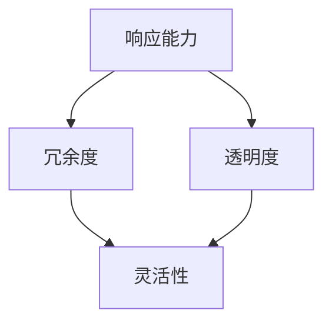
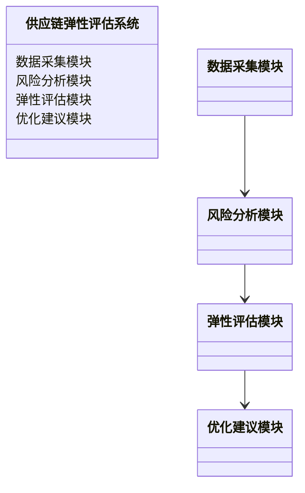
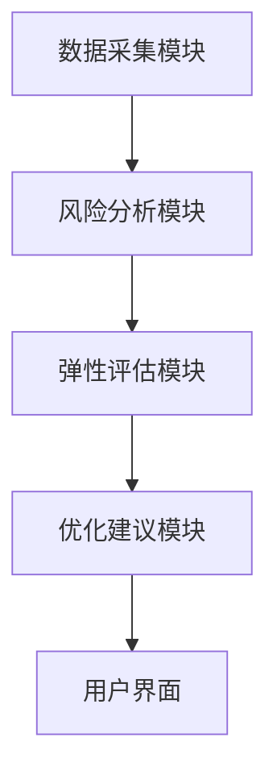

                 


# 如何评估企业的供应链弹性

> 关键词：供应链弹性、评估模型、系统架构、风险管理、优化策略

> 摘要：供应链弹性是企业在面对不确定性时，能够快速响应和恢复的能力。本文从供应链弹性的核心概念、算法原理、系统架构设计、项目实战等多方面进行详细分析，提出了一套完整的评估方法和优化策略，帮助企业提升供应链的弹性和应对能力。

---

# 第一部分: 供应链弹性评估的背景与概念

## 第1章: 供应链弹性评估的背景与意义

### 1.1 供应链弹性的定义与内涵

供应链弹性（Supply Chain Resilience）是指企业在面对供应链中断、市场波动或其他不确定性时，能够快速调整、响应并恢复的能力。它涵盖了供应链的灵活性、适应性和恢复能力。

#### 1.1.1 供应链弹性的定义

供应链弹性是一个综合性的指标，涉及供应链的多个环节和因素。它不仅关注企业在危机中的应对能力，还关注其在正常情况下的适应性和优化能力。

#### 1.1.2 供应链弹性的核心内涵

供应链弹性包括以下几个核心要素：

- **响应能力**：企业对供应链中断或其他问题的快速反应能力。
- **冗余度**：供应链中是否存在备用供应商或资源，以应对突发情况。
- **透明度**：企业对供应链各环节的监控和信息共享能力。
- **灵活性**：供应链在需求变化或市场波动中的调整能力。

#### 1.1.3 供应链弹性的重要性

在当今全球化和高度竞争的市场中，供应链中断可能导致巨大的经济损失。通过提升供应链弹性，企业可以更好地应对突发事件，减少风险，提高整体运营效率。

---

### 1.2 供应链弹性评估的背景

#### 1.2.1 当前供应链面临的挑战

- **全球化与复杂性**：供应链涉及多个国家和企业，增加了管理难度。
- **不确定性**：市场波动、自然灾害、疫情等不可预见因素对供应链的影响越来越大。
- **技术变革**：数字化和智能化技术的应用要求供应链更加灵活和高效。

#### 1.2.2 供应链弹性评估的必要性

随着供应链的复杂化和不确定性增加，企业需要通过评估供应链弹性，识别潜在风险，并采取措施加以应对。

#### 1.2.3 供应链弹性评估的边界与外延

供应链弹性评估不仅关注企业在危机中的应对能力，还包括日常运营中的优化和调整能力。其外延涉及从供应商到客户的整个链条。

---

### 1.3 供应链弹性评估的核心要素

#### 1.3.1 供应链弹性评估的关键维度

以下是供应链弹性评估的几个关键维度：

| 维度 | 描述 |
|------|------|
| **响应能力** | 企业对突发事件的反应速度和能力 |
| **冗余度** | 供应链中的备用资源和供应商 |
| **透明度** | 对供应链各环节的监控和信息共享能力 |
| **灵活性** | 供应链在需求变化或市场波动中的调整能力 |

#### 1.3.2 核心要素的特征对比

通过对比分析，我们可以更好地理解供应链弹性各要素的特点：

- **响应能力**：快速反应是关键，但可能需要较高的成本。
- **冗余度**：提供备用资源，但增加了库存和管理成本。
- **透明度**：信息共享有助于快速决策，但可能面临数据安全问题。
- **灵活性**：适应性强，但可能需要更多的协调和沟通。

#### 1.3.3 供应链弹性评估的系统架构

供应链弹性评估的系统架构包括以下几个部分：

1. **数据采集**：收集供应链各环节的数据，包括供应商、库存、运输等信息。
2. **风险分析**：识别潜在风险，并评估其对供应链的影响。
3. **弹性评估**：根据收集的数据和风险分析结果，评估供应链的弹性。
4. **优化建议**：根据评估结果，提出优化策略和改进措施。

---

## 第2章: 供应链弹性评估的核心概念

### 2.1 核心概念原理

供应链弹性评估的核心在于理解和量化供应链的各个要素及其相互关系。通过建立数学模型，我们可以更准确地评估供应链的弹性。

#### 2.1.1 供应链弹性评估的理论基础

供应链弹性评估的理论基础主要包括以下几个方面：

- **系统理论**：供应链作为一个复杂的系统，各部分相互关联，共同影响整体弹性。
- **风险管理**：识别和评估潜在风险，制定应对策略。
- **优化理论**：通过优化模型，提高供应链的效率和弹性。

#### 2.1.2 核心概念的属性特征对比

以下是核心概念的属性特征对比：

| 概念 | 属性 | 描述 |
|------|------|------|
| **响应能力** | 反应速度 | 企业在突发事件中的反应速度 |
| **冗余度** | 备用资源 | 供应链中的备用供应商和库存 |
| **透明度** | 信息共享 | 供应链各环节的信息共享程度 |
| **灵活性** | 调整能力 | 供应链在变化中的调整能力 |

---

### 2.2 核心概念的联系

供应链弹性评估的核心概念之间存在密切的联系。例如，透明度的提高有助于更快地识别和响应风险，而冗余度的增加可以提高响应能力。

#### 2.2.1 供应链弹性评估的系统架构

供应链弹性评估的系统架构可以表示为以下关系图：



---

### 2.3 本章小结

本章详细介绍了供应链弹性评估的核心概念，包括其定义、内涵和关键维度。通过对核心概念的分析，我们可以更好地理解供应链弹性的本质及其在企业运营中的重要性。

---

# 第三部分: 供应链弹性评估的算法原理讲解

## 第3章: 供应链弹性评估的算法原理

### 3.1 算法原理概述

供应链弹性评估需要综合考虑多个因素，因此选择合适的算法至关重要。以下是一个基于机器学习的评估算法。

#### 3.1.1 供应链弹性评估的算法选择

我们选择回归分析作为供应链弹性评估的主要算法。回归分析适用于预测性分析，可以帮助我们量化各因素对供应链弹性的影响。

#### 3.1.2 算法的基本原理

回归分析通过建立因变量和自变量之间的关系模型，预测因变量的值。在供应链弹性评估中，因变量可以是供应链的弹性指数，自变量可以是响应能力、冗余度、透明度和灵活性。

#### 3.1.3 算法的优缺点分析

- **优点**：回归分析简单易懂，计算效率高。
- **缺点**：回归分析假设变量之间存在线性关系，可能无法捕捉复杂的非线性关系。

---

### 3.2 算法的数学模型与公式

回归分析的数学模型如下：

$$ y = \beta_0 + \beta_1 x_1 + \beta_2 x_2 + \beta_3 x_3 + \beta_4 x_4 + \epsilon $$

其中：
- $y$ 是供应链弹性指数。
- $x_1, x_2, x_3, x_4$ 分别是响应能力、冗余度、透明度和灵活性的指标。
- $\beta_0, \beta_1, \beta_2, \beta_3, \beta_4$ 是回归系数。
- $\epsilon$ 是误差项。

---

### 3.3 算法的实现步骤

#### 3.3.1 数据预处理

- 收集供应链各环节的数据，包括供应商、库存、运输等信息。
- 对数据进行清洗和标准化处理。

#### 3.3.2 模型训练

- 使用回归分析模型进行训练，计算回归系数。
- 验证模型的准确性，调整参数以优化模型。

#### 3.3.3 模型评估与优化

- 使用测试数据评估模型的性能，计算均方误差（MSE）和决定系数（R²）。
- 根据评估结果，优化模型参数。

---

## 第4章: 供应链弹性评估的系统分析与架构设计

### 4.1 系统功能设计

#### 4.1.1 领域模型设计

供应链弹性评估的领域模型如下：



---

### 4.2 系统架构设计

供应链弹性评估系统的架构设计如下：



---

## 第5章: 供应链弹性评估的项目实战

### 5.1 环境配置

#### 5.1.1 安装Python和相关库

```bash
pip install numpy pandas scikit-learn
```

#### 5.1.2 数据采集与预处理

```python
import pandas as pd
import numpy as np

# 读取数据
data = pd.read_csv('supply_chain.csv')

# 数据清洗
data.dropna(inplace=True)

# 标准化处理
from sklearn.preprocessing import StandardScaler

scaler = StandardScaler()
scaled_data = scaler.fit_transform(data)
```

---

### 5.2 系统核心实现源代码

#### 5.2.1 回归分析模型实现

```python
from sklearn.linear_model import LinearRegression
from sklearn.metrics import mean_squared_error, r2_score

# 训练模型
model = LinearRegression()
model.fit(scaled_data, y)

# 预测结果
y_pred = model.predict(scaled_data)

# 评估模型
mse = mean_squared_error(y, y_pred)
r2 = r2_score(y, y_pred)
```

---

### 5.3 案例分析与经验总结

通过实际案例分析，我们可以验证模型的有效性和准确性。例如，在某制造企业中，我们通过回归分析模型评估了供应链的弹性指数，并提出了优化建议。

---

## 第六部分: 供应链弹性评估的最佳实践与小结

### 6.1 最佳实践 tips

- **建立风险管理机制**：定期识别和评估潜在风险。
- **优化供应商网络**：选择可靠的供应商，并建立备用供应商机制。
- **提高透明度**：通过技术手段实现供应链各环节的信息共享。

---

### 6.2 本章小结

供应链弹性评估是企业在复杂和不确定的市场环境中提高竞争力的重要手段。通过建立科学的评估模型和优化策略，企业可以更好地应对突发事件，提高供应链的整体效率和弹性。

---

## 作者：AI天才研究院/AI Genius Institute & 禅与计算机程序设计艺术 /Zen And The Art of Computer Programming

---

以上是《如何评估企业的供应链弹性》的完整目录和内容概述。如果需要进一步的详细内容或代码示例，请随时告诉我。

