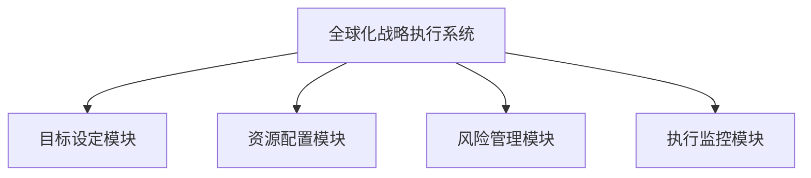
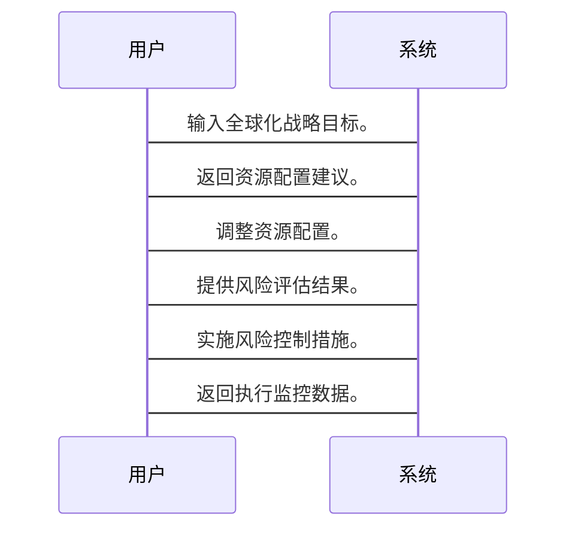

                 

# 如何评估企业的全球化战略执行力

## 关键词：企业全球化，战略执行力，评估模型，系统分析，项目实战，最佳实践

## 摘要：在全球化浪潮中，企业的全球化战略执行能力决定了其在国际市场中的竞争力。本文将从背景、核心概念、评估模型、系统分析、项目实战和最佳实践等多方面，详细阐述如何有效评估和提升企业的全球化战略执行力，为企业的全球化发展提供实用的指导和建议。

---

# 第1章: 全球化战略执行力的背景与概念

## 1.1 全球化战略的定义与内涵
### 1.1.1 全球化战略的定义
全球化战略是指企业在全球范围内进行市场拓展、资源配置和运营管理的综合策略，旨在利用全球资源和市场机会，实现企业的长期发展目标。

### 1.1.2 全球化战略的核心要素
- **市场定位**：明确目标市场和客户群体。
- **资源配置**：合理分配人力、资金、技术和信息资源。
- **风险管理**：识别并应对全球化过程中的潜在风险。

### 1.1.3 全球化战略的实施目标
- **市场扩展**：开拓新的国际市场。
- **资源优化**：实现资源的全球最优配置。
- **竞争力提升**：增强企业在全球市场的竞争力。

## 1.2 企业全球化战略的重要性
### 1.2.1 全球化对企业发展的意义
全球化为企业提供了更大的市场空间和资源获取渠道，同时要求企业具备更强的适应能力和创新能力。

### 1.2.2 全球化战略在现代企业中的地位
全球化战略是企业实现可持续发展的重要驱动力，决定了企业在国际市场中的地位和影响力。

### 1.2.3 全球化战略对企业竞争力的影响
有效的全球化战略能够提升企业的品牌价值、成本优势和市场响应能力。

## 1.3 企业全球化战略执行力的内涵
### 1.3.1 执行力的定义
执行力是指企业在制定战略后，将其转化为具体行动并实现目标的能力。

### 1.3.2 全球化战略执行力的特点
- **复杂性**：涉及多个国家和市场的协调。
- **动态性**：需要快速响应市场变化。
- **协同性**：依赖各部门和团队的高效协作。

### 1.3.3 全球化战略执行力的核心要素
- **组织结构**：扁平化管理，高效决策。
- **文化整合**：处理跨国文化差异。
- **人才管理**：吸引和留住国际化人才。

## 1.4 本章小结
本章从全球化战略的定义、核心要素和实施目标入手，阐述了其对企业发展的意义，为后续的执行评估奠定了基础。

---

# 第2章: 全球化战略执行力的核心概念

## 2.1 全球化战略目标的设定与分解
### 2.1.1 全球化战略的总体目标
总体目标通常包括市场占有率提升、品牌影响力扩大和利润率增长等。

### 2.1.2 目标分解的步骤
1. 确定核心目标。
2. 分解目标到具体部门或业务单元。
3. 设定时间表和衡量标准。

### 2.1.3 目标与执行的关系
目标是执行的方向，执行是目标实现的手段，两者相辅相成。

## 2.2 全球化战略的实施过程
### 2.2.1 战略规划阶段
制定详细的全球化市场进入策略和资源配置计划。

### 2.2.2 资源配置阶段
优化人力、财务和技术资源，确保全球化战略的顺利实施。

### 2.2.3 执行监控阶段
实时跟踪执行情况，及时调整策略。

## 2.3 全球化战略执行力的评估维度
### 2.3.1 战略目标达成度
通过定量和定性指标评估目标实现程度。

### 2.3.2 资源配置效率
分析资源使用效率，优化资源配置。

### 2.3.3 执行过程的可控性
通过监控和调整确保执行过程在可控范围内。

## 2.4 本章小结
本章详细探讨了全球化战略执行力的核心概念，包括目标设定、实施过程和评估维度，为后续的评估模型构建提供了理论支持。

---

# 第3章: 全球化战略执行力的评估模型

## 3.1 评估模型的基本框架
### 3.1.1 模型的设计思路
采用层次分析法（AHP）构建评估模型，结合定量和定性分析。

### 3.1.2 模型的构成要素
- **目标层**：全球化战略执行力。
- **准则层**：目标达成度、资源配置效率、风险管理能力。
- **指标层**：市场份额增长率、成本控制能力、风险事件数量。

### 3.1.3 模型的应用范围
适用于跨国企业、大型企业和全球化初创企业。

## 3.2 评估指标的选择与权重分配
### 3.2.1 指标选择的原则
- **相关性**：指标与目标密切相关。
- **可测性**：指标可以量化或定性描述。
- **独立性**：指标之间相对独立。

### 3.2.2 指标权重的计算方法
使用层次分析法确定各指标的权重，权重范围为0到1，总和为1。

## 3.3 评估模型的构建与应用
### 3.3.1 模型构建的步骤
1. 确定目标和准则。
2. 构建层次结构。
3. 确定准则间的相对权重。
4. 计算各指标的综合权重。

### 3.3.2 模型的应用案例
以某跨国企业为例，计算其全球化战略执行力的综合得分。

### 3.3.3 模型的优化与改进
根据实际应用结果，调整指标和权重，提高模型的准确性和实用性。

## 3.4 本章小结
本章通过层次分析法构建了全球化战略执行力的评估模型，为企业提供了一个科学的评估工具。

---

# 第4章: 全球化战略执行力的系统分析与架构设计

## 4.1 系统分析的基本方法
### 4.1.1 系统分析的定义
系统分析是通过分解和综合，理解系统各部分的相互关系和整体功能。

### 4.1.2 系统分析的步骤
1. 明确问题。
2. 收集数据。
3. 建立模型。
4. 分析和优化。
5. 实施和监控。

### 4.1.3 系统分析的应用
应用于企业的全球化战略执行中的资源配置、风险管理等方面。

## 4.2 系统架构设计
### 4.2.1 功能模块设计
- **目标设定模块**：设定和分解全球化战略目标。
- **资源配置模块**：优化资源配置。
- **风险管理模块**：识别和应对风险。
- **执行监控模块**：实时跟踪执行情况。

### 4.2.2 系统架构图

### 4.2.3 接口设计
- **内部接口**：模块之间的数据传递。
- **外部接口**：与企业现有系统的集成。

## 4.3 系统交互设计
### 4.3.1 系统交互流程

## 4.4 本章小结
本章通过系统分析和架构设计，为企业全球化战略执行提供了一个全面的解决方案。

---

# 第5章: 全球化战略执行力的项目实战

## 5.1 项目背景与目标
### 5.1.1 项目背景
某跨国企业计划进入新兴市场，需评估其全球化战略执行力。

### 5.1.2 项目目标
通过评估模型和系统分析，优化资源配置，降低风险，确保战略目标的实现。

## 5.2 环境分析与目标分解
### 5.2.1 市场环境分析
- **目标市场**：新兴市场。
- **竞争对手**：主要竞争对手的市场份额和策略。

### 5.2.2 目标分解
将总体目标分解为市场份额提升10%，成本控制优化5%，风险事件减少20%。

## 5.3 资源配置与实施步骤
### 5.3.1 资源配置
- **人力**：组建本地团队。
- **财务**：增加市场进入资金。
- **技术**：引入本地化技术解决方案。

### 5.3.2 实施步骤
1. 市场调研与分析。
2. 制定详细的市场进入计划。
3. 配置资源并启动项目。
4. 实施风险管理措施。
5. 监控执行情况并及时调整。

## 5.4 实施结果与分析
### 5.4.1 实施结果
- 市场份额提升8%。
- 成本控制优化4%。
- 风险事件减少15%。

### 5.4.2 结果分析
资源配置和风险管理的优化对目标实现有显著影响，但市场环境的不确定性仍需进一步关注。

## 5.5 本章小结
本章通过具体案例分析，展示了如何将理论应用于实际项目中，为企业的全球化战略执行提供了实用的指导。

---

# 第6章: 全球化战略执行力的最佳实践与总结

## 6.1 最佳实践
### 6.1.1 小结
全球化战略执行的关键在于目标设定、资源配置和风险管理的有机整合。

### 6.1.2 注意事项
- **文化差异**：尊重和适应当地文化。
- **法律法规**：遵守各国的法律法规。
- **团队协作**：加强跨部门和跨国团队的协作。

### 6.1.3 拓展阅读
推荐阅读《全球战略管理》和《跨文化管理》等书籍，深入了解全球化战略的理论和实践。

## 6.2 本章总结
本文从全球化战略的背景、核心概念、评估模型、系统分析、项目实战和最佳实践等多个方面，全面探讨了如何评估和提升企业的全球化战略执行力，为企业在全球化进程中提供了有价值的指导和建议。

---

# 作者：AI天才研究院/AI Genius Institute & 禅与计算机程序设计艺术 /Zen And The Art of Computer Programming

---

本文通过系统化的分析和实际案例的探讨，为企业在全球化战略执行中提供了实用的评估工具和方法，帮助企业更好地应对全球化挑战，实现可持续发展。

