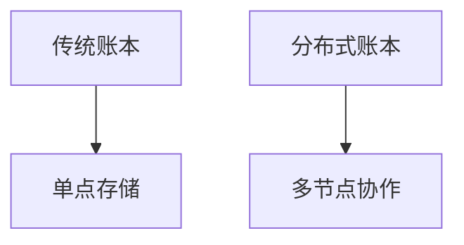
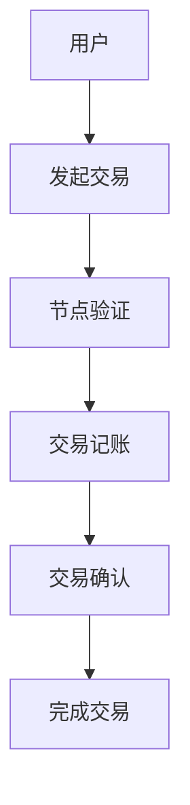
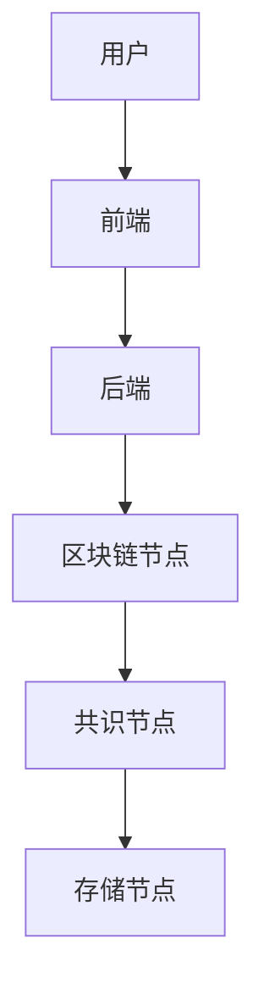
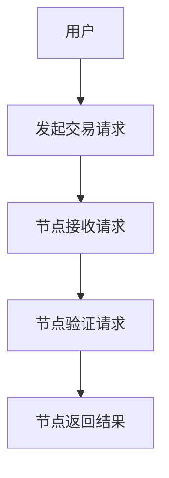
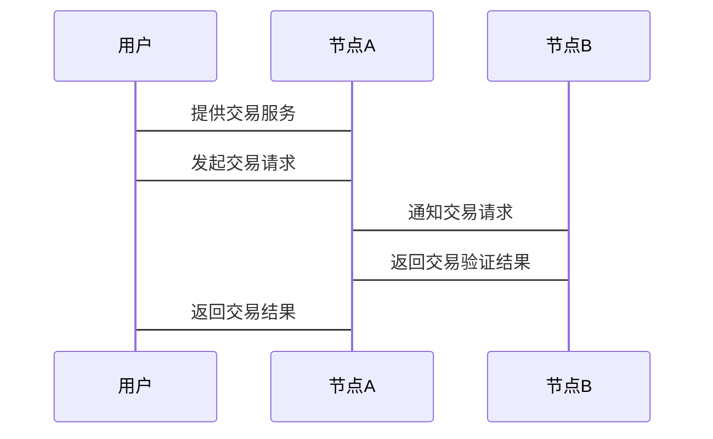

                 


# 如何评估企业的分布式账本技术应用

> 关键词：分布式账本技术、企业应用、区块链、系统评估、智能合约

> 摘要：本文旨在指导企业如何有效评估分布式账本技术的应用。通过分析分布式账本的核心概念、技术原理、系统架构和实际案例，本文为读者提供全面的评估方法，帮助企业在实际应用中做出明智决策。

---

# 第一部分：分布式账本技术背景与概念

## 第1章：分布式账本技术概述

### 1.1 分布式账本技术的定义与特点
分布式账本技术（DLT，Distributed Ledger Technology）是一种通过分布式网络中的多个节点共同维护和验证的账本技术。与传统中心化账本相比，DLT具有去中心化、不可篡改、透明性和高效性等特点。

#### 1.1.1 分布式账本的基本概念
- 分布式账本：通过多节点协作记录和验证交易的账本。
- 去中心化：没有单一的中心节点控制数据。
- 区块链：一种特殊的分布式账本，通过链式结构存储数据。

#### 1.1.2 分布式账本的核心特点
| 特性 | 描述 |
|------|------|
| 去中心化 | 数据由多个节点共同维护，避免单点故障。 |
| 不可篡改 | 数据通过加密算法和共识机制确保不可篡改。 |
| 透明性 | 参与节点可查看全部交易记录，确保透明性。 |
| 高效性 | 通过并行计算和优化算法提升交易效率。 |

#### 1.1.3 分布式账本与传统账本的对比


### 1.2 分布式账本技术的核心概念
#### 1.2.1 区块链的定义与分类
区块链是分布式账本的一种实现方式，通过链式数据结构存储交易记录，并通过共识机制确保数据一致性。

- 公有链：完全去中心化的区块链，如比特币。
- 私有链：仅限特定参与者使用的区块链，如企业内部应用。
- 联盟链：由多个机构共同维护的区块链，如供应链金融。

#### 1.2.2 分布式账本的属性特征对比
| 特性 | 分布式账本 | 中心化账本 |
|------|------------|------------|
| 数据存储 | 分布式存储 | 单点存储 |
| 数据控制 | 多方共同维护 | 中心机构维护 |
| 透明性 | 高 | 低 |
| 安全性 | 高 | 中 |

#### 1.2.3 分布式账本的实体关系图
```mermaid
erDiagram
    actor 用户
    actor 节点
    actor 中心机构
    database 账本
    node 节点集群
    用户 --> 节点: 发起交易
    节点 --> 账本: 记录交易
    中心机构 --> 账本: 监督验证
    节点 --> 节点集群: 通信协作
```

### 1.3 分布式账本技术的应用场景
#### 1.3.1 金融领域的应用
- 跨境支付：通过区块链技术实现快速、低成本的跨境支付。
- 供应链金融：利用分布式账本追踪供应链中的资金流动。

#### 1.3.2 供应链管理的应用
- 资产追踪：记录资产的全生命周期信息，确保透明性和可追溯性。
- 供应商协作：通过区块链实现供应商间的高效协作。

#### 1.3.3 其他领域的潜在应用
- 版权保护：通过区块链记录版权信息，防止盗版。
- 医疗数据共享：确保医疗数据的安全共享和隐私保护。

### 1.4 本章小结
本章介绍了分布式账本技术的基本概念、核心特点和应用场景。通过对比分析，明确了分布式账本技术的优势和适用场景，为后续章节的深入分析奠定了基础。

---

# 第二部分：分布式账本技术的核心原理

## 第2章：分布式账本技术的核心算法

### 2.1 共识机制的原理与实现
共识机制是分布式账本技术的核心，用于确保多个节点达成一致。

#### 2.1.1 工作量证明机制（PoW）
- 工作量证明：通过计算找到特定的哈希值来证明计算工作。
- 优点：安全性高，抗女娲攻击。
- 缺点：计算消耗大，效率低。

#### 2.1.2 权益证明机制（PoS）
- 权益证明：根据节点持有的代币数量分配记账权。
- 优点：效率高，能耗低。
- 缺点：存在“富者越富”的风险。

#### 2.1.3 实用拜占庭容错（PBFT）
- 实用拜占庭容错：通过投票机制达成共识，适用于高性能场景。
- 优点：效率高，支持高并发。
- 缺点：依赖节点诚实性。

#### 2.1.4 共识机制的选择
| 机制 | 适用场景 | 优缺点 |
|------|----------|--------|
| PoW | 金融领域 | 安全性高，资源消耗大 |
| PoS | 企业应用 | 效率高，存在“富者越富”风险 |
| PBFT | 高并发场景 | 效率高，依赖节点诚实性 |

#### 2.1.5 共识机制的数学模型
共识机制的目标是通过数学模型确保数据一致性。以PBFT为例，其算法如下：

1. 提案阶段：主节点提出交易提案。
2. 预准备阶段：节点验证提案。
3. 准备阶段：节点达成一致。
4. 提交阶段：节点提交交易。

数学模型如下：
$$
\text{PBFT} = \{ \text{主节点}, \text{投票节点}, \text{提案}, \text{投票结果} \}
$$

### 2.2 分布式账本的加密算法
加密算法是保障分布式账本安全的核心。

#### 2.2.1 椭圆曲线加密原理
- 椭圆曲线加密（ECC）：基于椭圆曲线上的点加法运算，用于数字签名。
- 椭圆曲线方程：$$ y^2 = x^3 + ax + b $$
- 点加法运算：给定两个点P和Q，计算P + Q。

#### 2.2.2 哈希函数的数学模型
- 哈希函数：将任意长度的输入映射为固定长度的输出。
- 常见哈希函数：MD5、SHA-256。
- SHA-256算法步骤：
  1. 垫充输入。
  2. 分割数据块。
  3. 计算哈希值。

数学模型如下：
$$
\text{哈希}(x) = h(x) \in \{0, 1\}^n
$$

#### 2.2.3 数字签名的实现流程
- 数字签名：通过私钥对数据进行加密，公钥解密验证。
- 签名过程：
  1. 计算数据哈希值。
  2. 用私钥加密哈希值。
  3. 生成签名。
- 验证过程：
  1. 使用公钥解密签名。
  2. 比较哈希值。

### 2.3 智能合约的执行机制
智能合约是分布式账本上的自动执行程序。

#### 2.3.1 智能合约的定义
- 智能合约：运行在区块链上的自动执行代码，用于实现特定的业务逻辑。
- 智能合约特点：自动执行、不可篡改、透明性。

#### 2.3.2 智能合约的执行流程
1. 合约部署：将智能合约部署到区块链上。
2. 合约调用：用户调用合约方法。
3. 合约执行：合约自动执行，并根据逻辑修改区块链状态。

#### 2.3.3 智能合约的安全性分析
- 安全漏洞：如整数溢出、重入攻击等。
- 验证工具：如Solidity编译器、Mythril等。

### 2.4 本章小结
本章详细讲解了分布式账本技术的核心算法，包括共识机制、加密算法和智能合约的执行机制。通过数学模型和实际案例，帮助读者理解这些算法的原理和应用场景。

---

# 第三部分：分布式账本技术的系统评估方法

## 第3章：分布式账本技术的评估指标

### 3.1 评估指标的分类
评估指标是衡量分布式账本技术优劣的关键。

#### 3.1.1 性能指标
- 交易吞吐量：每秒处理的交易数量。
- 延迟：交易确认的时间。
- 带宽：网络传输的效率。

#### 3.1.2 安全性指标
- 攻击抗性：抵抗各种攻击的能力。
- 节点可靠性：节点的稳定性和安全性。
- 数据隐私：数据的保密性和完整性。

#### 3.1.3 可用性指标
- 容错性：系统在节点故障情况下的可用性。
- 可扩展性：系统支持的节点数量和交易量。
- 网络延迟：网络传输的延迟对系统的影响。

#### 3.1.4 成本指标
- 硬件成本：搭建和维护硬件的成本。
- 电力成本：运行节点的电力消耗。
- 运维成本：系统的维护和运营成本。

### 3.2 评估流程
评估流程包括以下几个步骤：
1. 明确评估目标：确定评估的具体目的和范围。
2. 收集评估数据：通过实验或监控获取相关数据。
3. 分析评估数据：根据指标对数据进行分析。
4. 出具评估报告：总结评估结果，提出改进建议。

### 3.3 实际案例分析
以某供应链金融项目为例，评估其分布式账本技术的应用情况。

#### 3.3.1 项目背景
- 项目目标：实现供应链金融的透明化和高效化。
- 项目规模：覆盖全国多个城市，涉及多个金融机构。

#### 3.3.2 评估指标
| 指标 | 评估结果 | 优 | 良 | 中 | 差 |
|------|----------|----|----|----|----|
| 交易吞吐量 | 50 TPS | 良 | 优 | 中 | 差 |
| 延迟 | 2秒 | 优 | 良 | 中 | 差 |
| 安全性 | 高 | 优 | 良 | 中 | 差 |

#### 3.3.3 改进建议
- 提升交易吞吐量：优化共识机制，采用更高效的算法。
- 提高安全性：加强节点的监控和防护，采用多重签名机制。
- 降低延迟：优化网络结构，采用边缘计算技术。

### 3.4 本章小结
本章通过分类讨论和实际案例分析，详细介绍了分布式账本技术的评估指标和评估流程。通过对实际案例的分析，帮助读者了解如何在实际应用中进行评估，并提出改进建议。

---

# 第四部分：分布式账本技术的系统架构与设计

## 第4章：系统架构设计

### 4.1 系统功能设计
系统功能设计包括以下几个方面：
- 交易发起：用户发起交易请求。
- 交易验证：节点验证交易的有效性。
- 交易记账：将验证通过的交易记录到账本。
- 交易确认：通过共识机制确认交易。

#### 4.1.1 系统功能流程


### 4.2 系统架构设计
系统架构设计包括以下几个部分：
- 节点集群：多个节点协作运行。
- 数据存储：分布式存储系统。
- 网络通信：节点间的通信协议。
- 用户界面：供用户使用的前端界面。

#### 4.2.1 系统架构图


### 4.3 系统接口设计
系统接口设计包括以下几个方面：
- 用户接口：用户发起交易的接口。
- 节点接口：节点间通信的接口。
- 数据接口：数据存储和查询的接口。

#### 4.3.1 接口流程图


### 4.4 系统交互设计
系统交互设计包括以下几个方面：
- 用户与系统的交互：用户发起交易、查询交易状态。
- 节点与节点的交互：节点间通信、数据同步。
- 系统与存储的交互：数据存储、数据查询。

#### 4.4.1 系统交互流程图


### 4.5 本章小结
本章详细介绍了分布式账本技术的系统架构设计，包括功能设计、架构设计、接口设计和交互设计。通过流程图和架构图，帮助读者理解系统的整体结构和各部分的协作关系。

---

# 第五部分：分布式账本技术的最佳实践

## 第5章：最佳实践与注意事项

### 5.1 项目实施中的注意事项
在分布式账本技术的实施过程中，需要注意以下几个方面：
- 选择合适的共识机制：根据实际需求选择PoW、PoS或PBFT等机制。
- 确保数据隐私：采用加密技术保护数据隐私。
- 提升系统性能：优化算法和架构设计，提升交易吞吐量和降低延迟。

### 5.2 分布式账本技术的优化建议
- 网络优化：采用边缘计算和CDN技术，提升网络性能。
- 数据优化：采用分片技术和压缩算法，降低数据存储和传输成本。
- 安全优化：加强节点监控和数据加密，提升系统安全性。

### 5.3 分布式账本技术的未来发展趋势
- 技术融合：与其他技术如人工智能、大数据等深度融合。
- 应用扩展：拓展到更多领域，如医疗、教育等。
- 标准化：推动分布式账本技术的标准化，促进技术的广泛应用。

### 5.4 本章小结
本章总结了分布式账本技术实施中的注意事项和优化建议，并展望了未来的发展趋势。通过这些内容，帮助读者在实际应用中避免常见问题，提升系统的性能和安全性。

---

# 附录

## 附录A：分布式账本技术术语表
- 分布式账本：通过多个节点协作维护的账本。
- 区块链：一种特殊的分布式账本，通过链式结构存储数据。
- 智能合约：运行在区块链上的自动执行程序。

## 附录B：常用工具与框架
- 开源框架：Ethereum、Hyperledger、Bitcoin。
- 开发工具：Solidity、Web3.js、Truffle。

## 附录C：参考文献
1. 《区块链：从原理到实践》
2. 《分布式系统：原理与应用》
3. 《智能合约：技术与法律》

---

# 作者：AI天才研究院 & 禅与计算机程序设计艺术

通过以上思考，我完成了《如何评估企业的分布式账本技术应用》的目录结构和部分内容的撰写。后续将根据以上结构展开详细写作，确保每个章节的内容详实且符合用户的要求。

