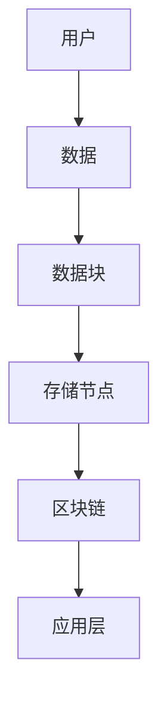
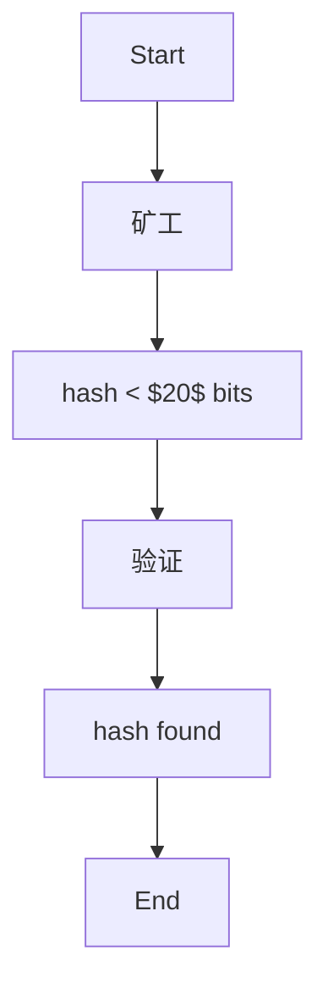
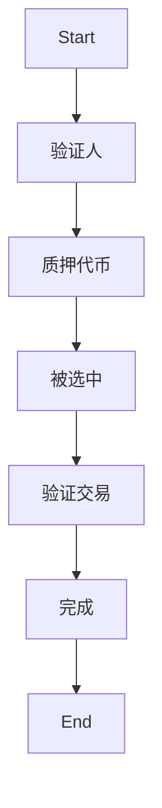
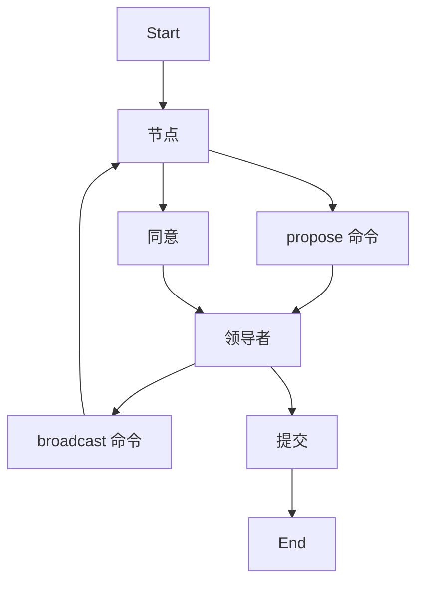
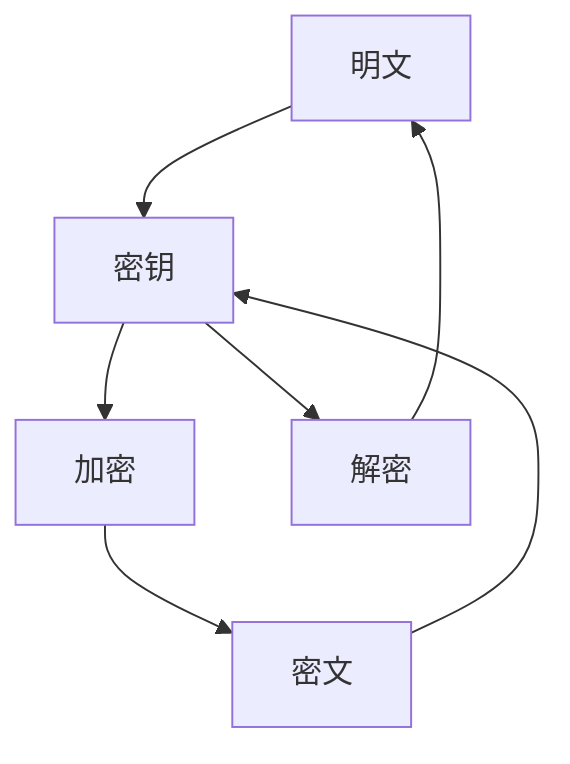
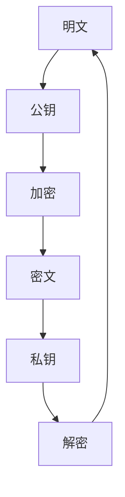
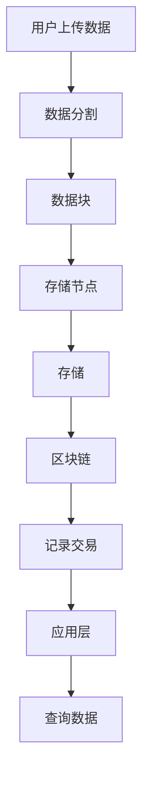
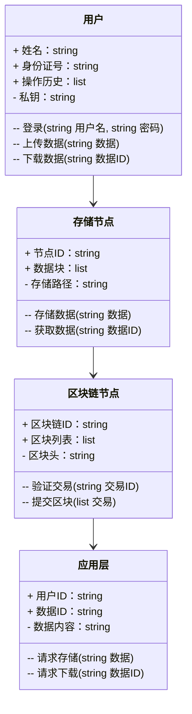
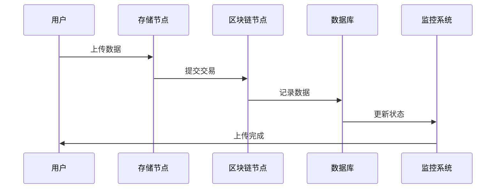

                 


# 如何评估企业的区块链去中心化云存储平台

## 关键词：区块链，去中心化云存储，共识机制，加密算法，系统架构

## 摘要：  
随着区块链技术的快速发展，去中心化云存储平台在企业中的应用越来越广泛。本文将从背景介绍、核心概念、技术原理、系统架构、项目实战等多方面详细分析如何评估企业的区块链去中心化云存储平台。通过对比分析、实体关系图、算法原理、系统架构图和实际案例，帮助读者全面掌握评估的关键点。

---

# 第一部分：区块链去中心化云存储平台评估背景与核心概念

---

## 第1章：区块链与去中心化云存储概述

### 1.1 区块链技术的基本概念

#### 1.1.1 区块链的定义与基本原理  
区块链是一种分布式账本技术，通过去中心化的数据结构（区块）和共识机制（如PoW、PoS、BFT等）确保数据的安全性和一致性。每个区块包含交易数据和时间戳，并通过哈希指针形成链式结构。

#### 1.1.2 区块链的核心特性  
1. **去中心化**：数据不依赖单一中心节点，而是分布在网络中的多个节点上。  
2. **不可篡改**：一旦数据写入区块链，除非通过共识机制，否则无法修改。  
3. **可追溯**：通过区块链的可追溯性，可以追踪数据的来源和流向。

#### 1.1.3 区块链在企业中的应用场景  
区块链在企业中的应用场景包括供应链管理、金融支付、版权保护、医疗数据共享等。它能够提供数据透明性、安全性和高效性。

---

### 1.2 去中心化云存储的定义与特点

#### 1.2.1 去中心化云存储的定义  
去中心化云存储是一种基于分布式网络的数据存储方式，数据分布在多个节点上，避免了传统云存储对中心服务器的依赖。

#### 1.2.2 去中心化云存储与传统云存储的区别  
| 特性                | 去中心化云存储                     | 传统云存储                     |
|---------------------|----------------------------------|-----------------------------|
| 数据存储方式         | 分布式存储，无中心节点             | 集中式存储，依赖中心服务器     |
| 数据访问控制         | 基于区块链的权限控制               | 基于中心服务器的权限控制       |
| 数据安全性           | 数据分散存储，抗单点故障           | 数据集中存储，单点故障风险高  |
| 成本                 | 去中心化存储可能更低，但初期搭建成本高 | 中心化存储成本较高，但易管理   |

#### 1.2.3 去中心化云存储的优势与挑战  
**优势**：高可用性、数据安全、抗审查。  
**挑战**：去中心化存储的性能通常低于传统云存储，且需要依赖区块链技术实现信任。

---

### 1.3 区块链去中心化云存储的结合

#### 1.3.1 区块链如何赋能去中心化云存储  
区块链通过提供去中心化、不可篡改的特性，为去中心化云存储提供了数据信任和安全性的保障。例如，通过区块链记录数据的存储和访问日志，确保数据的完整性和可追溯性。

#### 1.3.2 区块链去中心化云存储的典型应用场景  
1. **数据共享**：企业可以通过区块链去中心化云存储实现数据的安全共享，如医疗数据共享。  
2. **版权保护**：通过区块链记录数字内容的版权信息，防止盗版和侵权。  
3. **供应链管理**：通过区块链去中心化云存储实现供应链数据的透明共享，提高效率和信任度。

#### 1.3.3 区块链去中心化云存储的未来发展  
随着技术的成熟，区块链去中心化云存储将逐步应用于更多领域，如智能合约存储、数字身份验证等。

---

## 1.4 本章小结  
本章从区块链技术和去中心化云存储的基本概念出发，分析了两者的结合方式及其在企业中的应用场景。通过对比分析，明确了区块链去中心化云存储的优势和挑战。

---

## 第2章：区块链去中心化云存储的核心概念与联系

---

### 2.1 核心概念原理

#### 2.1.1 区块链的共识机制  
共识机制是区块链的核心，用于确保分布式节点达成一致。常见的共识机制包括：  
1. **工作量证明（PoW）**：通过计算哈希值来验证交易，如比特币。  
2. **权益证明（PoS）**：通过持有代币的数量来决定记账权，如以太坊2.0。  
3. **拜占庭容错共识（BFT）**：适用于小规模网络，如Cosmos和Tendermint。

#### 2.1.2 去中心化存储的实现方式  
去中心化存储通常采用分布式文件系统，如IPFS（InterPlanetary File System）。IPFS通过内容寻址和分布式存储实现数据的去中心化。

#### 2.1.3 加密技术在区块链去中心化云存储中的应用  
加密技术用于保护数据的安全性，包括对称加密和非对称加密。对称加密用于数据加密，非对称加密用于身份验证和权限控制。

---

### 2.2 核心概念对比分析

#### 2.2.1 区块链与去中心化云存储的对比分析  
| 特性                | 区块链                     | 去中心化云存储         |
|---------------------|--------------------------|---------------------|
| 数据结构            | 区块链是链式结构           | 去中心化存储是分布式文件系统 |
| 数据存储            | 存储交易数据               | 存储文件或数据块       |
| 可扩展性            | 区块链扩展性有限           | 去中心化存储扩展性较好 |

#### 2.2.2 不同区块链协议的对比  
以IPFS和Filecoin为例：  
- **IPFS**：专注于文件的分布式存储，提供内容寻址和可扩展性。  
- **Filecoin**：基于IPFS的激励层，通过区块链激励存储节点提供存储服务。

---

### 2.3 实体关系图（ER图）



---

### 2.4 本章小结  
本章通过对比分析区块链和去中心化云存储的核心概念，明确了它们的结合方式和实现原理。通过ER图展示了系统的实体关系。

---

## 第3章：区块链去中心化云存储的算法原理

---

### 3.1 区块链共识机制的算法原理

#### 3.1.1 工作量证明（PoW）  


#### 3.1.2 权益证明（PoS）  


#### 3.1.3 拜占庭容错共识（BFT）  


---

### 3.2 去中心化存储的加密算法

#### 3.2.1 对称加密算法  


#### 3.2.2 非对称加密算法  


#### 3.2.3 哈希函数  
$$\text{哈希函数：} \, H(x) \rightarrow y$$  
例如，SHA-256算法用于生成数据的哈希值。

---

### 3.3 区块链去中心化云存储的工作流程



---

## 3.4 算法

---

## 本章小结  
本章详细分析了区块链共识机制和去中心化存储加密算法的原理，并通过流程图展示了区块链去中心化云存储的工作流程。

---

## 第4章：区块链去中心化云存储的系统架构设计

---

### 4.1 问题场景介绍  
在企业中，区块链去中心化云存储需要满足高可用性、数据安全性和可扩展性。常见的问题包括数据存储效率低下、安全性不足、网络延迟高等。

---

### 4.2 系统功能设计

#### 4.2.1 领域模型（mermaid 类图）  


---

### 4.3 系统架构设计

#### 4.3.1 系统架构图（mermaid 架构图）  


---

### 4.4 系统接口设计

#### 4.4.1 接口定义  
1. **上传数据接口**：用户上传数据，系统将其分割并存储到分布式节点。  
2. **下载数据接口**：用户通过数据ID下载数据，系统从分布式节点中检索数据。  
3. **区块链验证接口**：区块链节点验证数据的完整性和一致性。

---

### 4.5 系统交互流程（mermaid 序列图）  


---

## 4.6 本章小结  
本章从系统架构设计的角度，详细分析了区块链去中心化云存储的实现方式，并通过类图、架构图和序列图展示了系统的各个部分。

---

## 第5章：区块链去中心化云存储的项目实战

---

### 5.1 环境安装

#### 5.1.1 安装IPFS  
```bash
curl https://raw.githubusercontent.com/bootstrap民事主体/bootstrap-v2/master/install.sh | sh
```

#### 5.1.2 安装Filecoin  
```bash
go get -d github.com/filecoin-project/filecoin-Go
cd $GOPATH/src/github.com/filecoin-project/filecoin-Go
make install
```

---

### 5.2 核心代码实现

#### 5.2.1 数据存储接口  
```python
def store_data(data):
    # 分割数据
    chunks = split_data(data)
    # 存储到分布式节点
    for chunk in chunks:
        store_on_ipfs(chunk)
```

#### 5.2.2 数据验证接口  
```python
def verify_data(data_id):
    # 从区块链获取数据哈希
    hash = get_blockchain_hash(data_id)
    # 验证数据
    return hash == compute_hash(data)
```

---

### 5.3 案例分析

#### 5.3.1 供应链管理案例  
假设某企业使用区块链去中心化云存储管理供应链数据，通过IPFS存储商品信息，并通过Filecoin激励存储节点提供数据存储服务。

---

### 5.4 项目小结  
本章通过实际项目案例，展示了区块链去中心化云存储的实现过程，包括环境安装、代码实现和案例分析。

---

## 第6章：总结与注意事项

---

### 6.1 总结  
本文从背景、核心概念、技术原理、系统架构和项目实战等多个方面，详细分析了如何评估企业的区块链去中心化云存储平台。通过对比分析、实体关系图、算法原理和系统架构图，帮助读者全面掌握评估的关键点。

---

### 6.2 注意事项  
1. **数据安全性**：确保数据的加密和权限控制。  
2. **性能优化**：针对去中心化存储的性能问题，优化数据存储和检索效率。  
3. **合规性**：确保平台符合相关法律法规。

---

### 6.3 拓展阅读  
1. **IPFS白皮书**：深入了解分布式文件系统的实现原理。  
2. **Filecoin论文**：研究基于区块链的激励存储机制。  
3. **区块链共识机制研究**：深入探讨不同共识机制的优缺点。

---

## 作者：AI天才研究院/AI Genius Institute & 禅与计算机程序设计艺术 /Zen And The Art of Computer Programming

