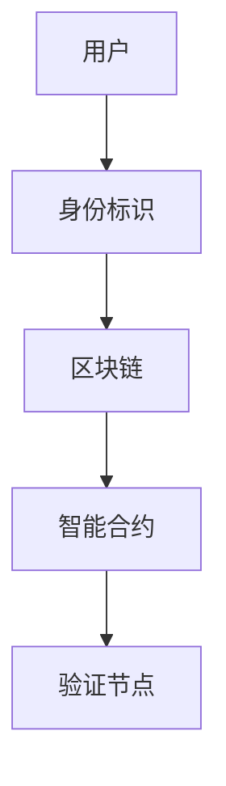
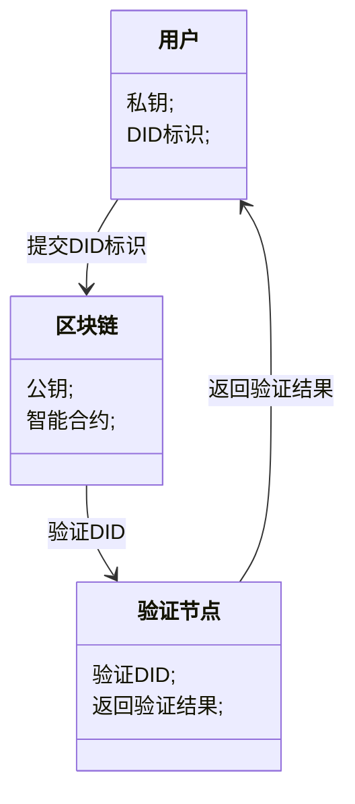
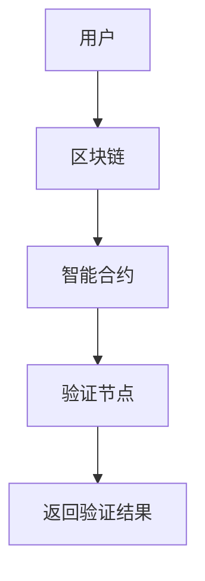

                 


# 如何评估企业的区块链去中心化身份验证平台

> 关键词：区块链，去中心化身份验证，DID，智能合约，安全评估

> 摘要：本文详细探讨了如何评估企业区块链去中心化身份验证平台的关键因素，包括平台的技术架构、安全性、可扩展性、合规性以及实际应用场景。文章从DID（Decentralized Identity）的核心原理出发，分析了区块链在去中心化身份验证中的作用，并通过实际案例和系统架构设计，为读者提供了全面的评估方法和工具。

---

# 第一部分：区块链去中心化身份验证平台概述

## 第1章：区块链与去中心化身份验证概述

### 1.1 区块链技术基础

#### 1.1.1 区块链的基本概念

区块链是一种分布式账本技术，通过去中心化的共识机制（如工作量证明或权益证明）实现数据的安全存储和不可篡改性。区块链的核心特性包括：

- **去中心化**：数据不由单一机构控制，而是分布在网络中的多个节点上。
- **不可篡改性**：一旦数据被记录在区块链上，无法被修改或删除。
- **透明性**：所有交易记录对参与者公开，但隐私数据可以通过加密技术保护。
- **智能合约**：区块链上的自动化程序，能够根据预设条件自动执行操作。

#### 1.1.2 区块链的核心特点

- **去中心化**：避免了单点故障，提高了系统的容错性和抗攻击能力。
- **安全性**：通过加密算法和共识机制，确保数据的安全性和完整性。
- **可扩展性**：区块链技术可以通过侧链、分片等方法提高处理能力。

#### 1.1.3 区块链在企业中的应用

区块链在企业中的应用广泛，包括供应链管理、金融支付、身份验证等领域。其中，区块链的去中心化特性使其在身份验证领域具有独特优势。

### 1.2 去中心化身份验证的基本概念

#### 1.2.1 去中心化身份验证的定义

去中心化身份验证（Decentralized Identity Verification，DIV）是一种基于区块链的技术，允许用户在无需依赖中心化机构的情况下证明自己的身份。用户可以通过私钥控制自己的身份信息，并在需要时通过智能合约进行验证。

#### 1.2.2 去中心化身份验证的特点

- **用户控制**：用户完全掌握自己的身份信息，无需依赖第三方机构。
- **隐私保护**：身份信息可以通过零知识证明等技术实现隐私保护。
- **全球可用**：用户可以在全球范围内使用其身份信息进行验证。

#### 1.2.3 去中心化身份验证与传统身份验证的区别

传统的身份验证依赖于中心化机构（如银行、社交平台等）来验证用户身份。而去中心化身份验证通过区块链技术实现了去中心化的验证过程，避免了对第三方机构的依赖。

### 1.3 区块链去中心化身份验证平台的背景与意义

#### 1.3.1 问题背景

传统的身份验证系统存在以下问题：

- **数据泄露风险**：用户信息集中存储在中心化机构中，容易成为黑客攻击的目标。
- **隐私问题**：用户无法完全控制自己的数据，机构可能滥用用户信息。
- **信任问题**：用户需要完全信任中心化机构，否则身份验证过程可能不可靠。

#### 1.3.2 问题描述

去中心化身份验证平台的目标是通过区块链技术解决上述问题，实现用户对自身身份信息的完全控制。

#### 1.3.3 问题解决

区块链去中心化身份验证平台通过以下方式解决问题：

- **去中心化存储**：用户身份信息分散存储在区块链网络中，避免了数据集中存储的风险。
- **自主验证**：用户可以通过私钥直接验证自己的身份，无需依赖第三方机构。
- **隐私保护**：通过零知识证明等技术，用户可以在不泄露敏感信息的情况下完成身份验证。

#### 1.3.4 边界与外延

区块链去中心化身份验证平台的边界包括：

- **身份信息的生成与管理**：用户如何生成和管理自己的身份信息。
- **身份验证的流程**：用户如何通过智能合约完成身份验证。
- **平台的安全性**：如何确保平台的安全性和抗攻击能力。

#### 1.3.5 概念结构与核心要素组成

区块链去中心化身份验证平台的核心要素包括：

- **用户身份信息**：用户的唯一标识和相关属性。
- **区块链网络**：分布式账本，用于存储和验证身份信息。
- **智能合约**：自动化验证规则和流程。
- **私钥**：用户控制身份信息的唯一凭证。
- **验证节点**：区块链网络中的节点，负责验证交易和身份信息。

---

## 第2章：区块链去中心化身份验证的核心概念与联系

### 2.1 DID（Decentralized Identity）的核心原理

#### 2.1.1 DID的定义与特点

DID（Decentralized Identity）是一种基于区块链的去中心化身份标识系统。DID的核心原理是通过区块链技术实现身份信息的去中心化存储和验证。

- **定义**：DID是一种用户自主控制的身份标识，用户可以通过私钥生成和验证DID。
- **特点**：
  - 用户自主控制身份信息。
  - 身份信息存储在区块链上，具有不可篡改性。
  - 支持零知识证明，确保隐私安全。

#### 2.1.2 DID的生成与管理

DID的生成过程通常包括以下步骤：

1. **用户申请DID**：用户通过区块链平台申请一个DID标识。
2. **生成私钥**：用户生成一对公私钥，私钥用于控制DID，公钥用于验证DID。
3. **存储在区块链**：DID标识和公钥存储在区块链上，私钥由用户自行保存。

#### 2.1.3 DID的安全性与隐私保护

DID通过区块链技术和零知识证明等加密技术实现身份信息的安全性和隐私保护。

### 2.2 区块链在DID中的作用

#### 2.2.1 区块链的去中心化特性与DID的结合

区块链的去中心化特性使得DID能够在没有中心化机构的情况下实现身份信息的存储和验证。

#### 2.2.2 区块链的不可篡改性与DID的结合

区块链的不可篡改性确保了DID标识的安全性和唯一性。

#### 2.2.3 区块链的智能合约与DID的结合

智能合约可以用于自动化DID验证流程，例如自动验证用户的身份信息是否有效。

### 2.3 DID与区块链的实体关系图



### 2.4 DID与传统身份验证的对比

#### 2.4.1 对比表格

| 对比维度 | DID | 传统身份验证 |
|----------|------|--------------|
| 中心化程度 | 去中心化 | 中心化       |
| 安全性     | 高     | 中等         |
| 隐私性     | 高     | 中等         |
| 可扩展性   | 高     | 中等         |

---

## 第3章：区块链去中心化身份验证的算法原理

### 3.1 DID的生成与签名算法

#### 3.1.1 DID的生成流程

DID的生成过程包括以下步骤：

1. **用户申请DID**：用户通过区块链平台申请一个DID标识。
2. **生成私钥**：用户生成一对公私钥，私钥用于控制DID，公钥用于验证DID。
3. **存储在区块链**：DID标识和公钥存储在区块链上，私钥由用户自行保存。

#### 3.1.2 DID的签名算法

DID的签名算法通常基于椭圆曲线加密（ECC）技术，例如ECDSA（椭圆曲线数字签名算法）。以下是DID签名的流程：

1. **用户生成私钥**：用户生成椭圆曲线私钥。
2. **生成公钥**：通过私钥生成对应的公钥。
3. **签名DID标识**：用户使用私钥对DID标识进行签名。
4. **验证签名**：验证节点通过公钥验证签名的有效性。

#### 3.1.3 DID的数学模型和公式

椭圆曲线数字签名算法（ECDSA）的核心公式包括：

- **私钥**：`d`，随机生成的私钥。
- **公钥**：`Q = d * G`，其中`G`是椭圆曲线上的基点。
- **签名**：`R = k * G`，`S = k^{-1} * (h + d * R)`，其中`k`是随机数，`h`是哈希值。
- **验证**：验证签名是否有效，即`h = H(R, S)`，其中`H`是哈希函数。

---

### 3.2 区块链智能合约的实现原理

#### 3.2.1 智能合约的定义与特点

智能合约是区块链上的自动化程序，用于执行预设的规则和流程。其特点包括：

- **自动化**：智能合约可以自动执行预设的规则。
- **透明性**：智能合约的代码对所有参与者公开。
- **不可篡改性**：智能合约一旦部署到区块链上，无法被修改。

#### 3.2.2 智能合约在DID中的应用

智能合约在DID中的应用包括：

- **身份验证**：智能合约可以根据用户的公钥验证DID的签名。
- **权限管理**：智能合约可以控制用户对某些资源的访问权限。
- **自动化流程**：智能合约可以自动化DID的生成和验证流程。

#### 3.2.3 智能合约的实现代码示例

以下是一个简单的智能合约代码示例（以Solidity为例）：

```solidity
// SPDX-License-Identifier: MIT
pragma solidity ^0.8.0;

contract DIDVerifier {
    // 用户公钥
    mapping(address => bytes) public publicKey;

    // 验证DID签名
    function verifyDID(
        bytes memory signature,
        bytes memory message,
        address signer
    ) public pure returns (bool) {
        // 验证签名是否有效
        return Message.verify(signature, message, signer);
    }
}
```

---

### 3.3 区块链去中心化身份验证的安全性分析

#### 3.3.1 安全性分析的核心要点

- **私钥的安全性**：私钥是用户控制身份信息的关键，必须妥善保存。
- **区块链的安全性**：区块链网络的安全性直接影响DID的安全性。
- **智能合约的漏洞**：智能合约的漏洞可能被利用，导致身份验证失败或信息泄露。

#### 3.3.2 安全性评估的步骤

1. **私钥管理**：确保私钥的安全性，防止私钥泄露。
2. **区块链网络的安全性**：评估区块链网络的抗攻击能力。
3. **智能合约审计**：检查智能合约是否存在漏洞，确保其安全性和可靠性。

---

## 第4章：区块链去中心化身份验证平台的系统架构设计

### 4.1 系统功能设计

#### 4.1.1 系统功能模块划分

- **用户身份管理**：用户可以生成、管理和验证自己的DID。
- **身份验证**：通过智能合约完成DID的验证。
- **权限管理**：管理用户的权限和访问控制。
- **日志与审计**：记录和审计身份验证过程。

#### 4.1.2 系统功能设计的领域模型



### 4.2 系统架构设计

#### 4.2.1 系统架构设计的总体思路

- **去中心化存储**：用户身份信息存储在区块链上。
- **智能合约验证**：通过智能合约完成DID的验证。
- **用户交互**：用户通过钱包或其他工具完成身份管理。

#### 4.2.2 系统架构设计的详细步骤

1. **区块链网络的选择**：选择适合的区块链平台（如以太坊、Hyperledger Fabric等）。
2. **智能合约开发**：根据需求开发智能合约。
3. **用户界面设计**：设计用户友好的界面，方便用户管理DID。
4. **验证节点部署**：部署验证节点，确保DID验证的高效性和可靠性。

#### 4.2.3 系统架构图



---

## 第5章：区块链去中心化身份验证平台的项目实战

### 5.1 项目背景与目标

#### 5.1.1 项目背景

随着区块链技术的快速发展，去中心化身份验证的需求日益增长。

#### 5.1.2 项目目标

通过实际案例，展示如何评估和实现一个区块链去中心化身份验证平台。

### 5.2 项目环境与工具

#### 5.2.1 项目环境

- **操作系统**：Windows/Mac/Linux
- **区块链平台**：以太坊、Hyperledger Fabric等
- **智能合约开发语言**：Solidity、Golang等
- **开发工具**：Remix、VS Code、Postman等

### 5.3 核心代码实现

#### 5.3.1 智能合约实现

以下是一个简单的智能合约实现示例（Solidity）：

```solidity
// SPDX-License-Identifier: MIT
pragma solidity ^0.8.0;

contract DIDVerifier {
    mapping(address => bytes) public publicKey;

    function verifyDID(
        bytes memory signature,
        bytes memory message,
        address signer
    ) public pure returns (bool) {
        return Message.verify(signature, message, signer);
    }
}
```

#### 5.3.2 用户端实现

以下是用户端的实现示例（以Python为例）：

```python
from web3 import Web3

def verify_did(signature, message, signer_address):
    # 初始化区块链节点
    w3 = Web3(Web3.HTTPProvider("http://localhost:8545"))
    # 获取智能合约实例
    contract = w3.eth.contract(address='0x...', abi='...')
    # 调用智能合约方法
    result = contract.functions.verifyDID(signature, message, signer_address).call()
    return result

# 示例调用
signature = '...'
message = '...'
signer_address = '0x...'
print(verify_did(signature, message, signer_address))
```

---

### 5.4 项目部署与测试

#### 5.4.1 项目部署

1. **智能合约部署**：将智能合约部署到区块链网络上。
2. **用户界面部署**：部署用户界面，方便用户管理DID。
3. **验证节点部署**：部署验证节点，确保DID验证的高效性。

#### 5.4.2 项目测试

1. **功能测试**：测试DID的生成、签名和验证功能。
2. **安全性测试**：测试系统的安全性，确保私钥和身份信息的安全。
3. **性能测试**：测试系统的性能，确保在高并发情况下的稳定性。

---

## 第6章：区块链去中心化身份验证平台的安全性与合规性

### 6.1 平台的安全性评估

#### 6.1.1 安全性评估的核心要点

- **私钥安全性**：确保私钥的安全性，防止私钥泄露。
- **区块链网络的安全性**：评估区块链网络的抗攻击能力。
- **智能合约的安全性**：检查智能合约是否存在漏洞。

#### 6.1.2 安全性评估的步骤

1. **私钥管理**：确保私钥的安全性，防止私钥泄露。
2. **区块链网络的安全性**：评估区块链网络的抗攻击能力。
3. **智能合约审计**：检查智能合约是否存在漏洞，确保其安全性和可靠性。

---

## 第7章：总结与展望

### 7.1 全文总结

区块链去中心化身份验证平台通过区块链技术和智能合约实现了身份信息的去中心化存储和验证。其核心优势包括用户自主控制身份信息、高安全性、高隐私保护和高可扩展性。

### 7.2 对未来的展望

随着区块链技术的不断发展，去中心化身份验证平台将在更多领域得到应用。未来的研究方向包括：

- **隐私保护技术**：进一步提升隐私保护技术，如零知识证明的优化。
- **智能合约的优化**：优化智能合约的性能和安全性。
- **跨链技术**：实现不同区块链平台之间的互操作性。

---

# 作者

作者：AI天才研究院/AI Genius Institute  
禅与计算机程序设计艺术/Zen And The Art of Computer Programming

