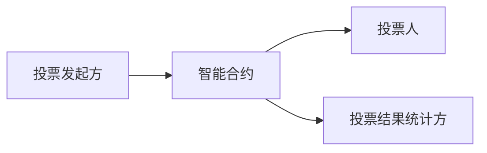
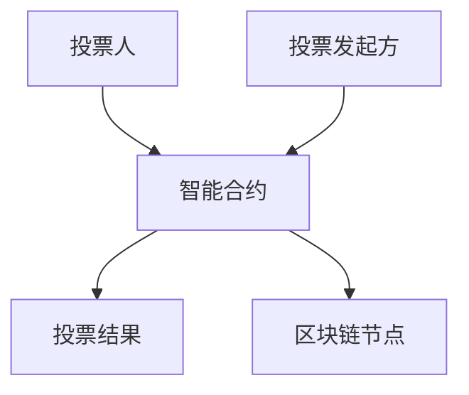
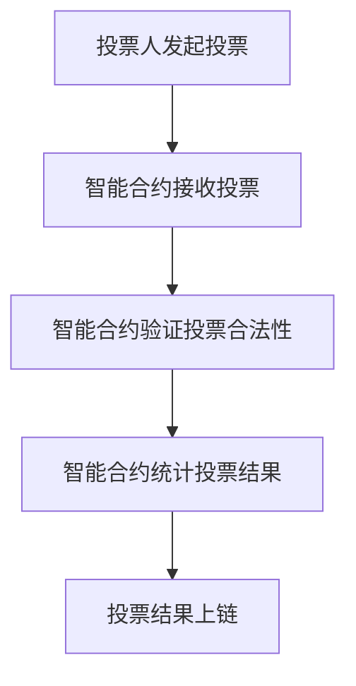
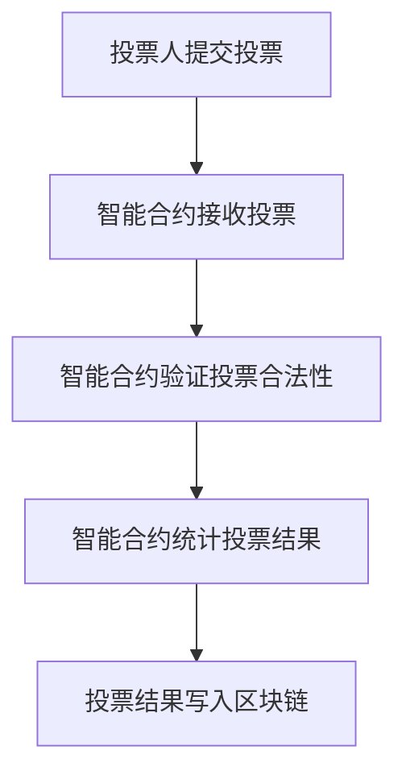
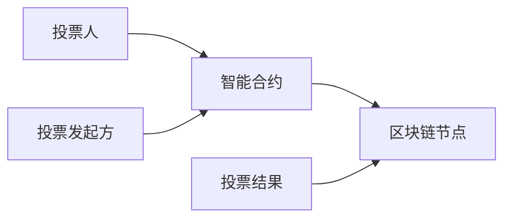

                 


# 如何评估企业的区块链投票系统应用

## 关键词：区块链，投票系统，企业应用，评估标准，智能合约，共识机制

## 摘要：区块链技术的引入为企业投票系统带来了更高的透明度和安全性。本文将详细分析区块链投票系统的核心概念、评估标准和实现方法，帮助企业有效评估和优化其区块链投票系统应用。

---

# 第一部分：区块链投票系统概述

## 第1章：区块链投票系统的背景与概念

### 1.1 区块链技术基础
#### 1.1.1 区块链的基本概念
区块链是一种去中心化的分布式账本技术，通过密码学保证数据的安全性和不可篡改性。它通过共识机制实现数据的一致性，并通过区块结构存储数据。

#### 1.1.2 区块链的核心特点
- **去中心化**：无需信任的第三方机构，通过分布式节点实现数据一致性和可靠性。
- **不可篡改性**：通过链式结构和加密算法，确保数据一旦写入区块链不可更改。
- **透明性**：所有交易记录公开透明，参与方可以实时查看数据状态。

#### 1.1.3 区块链的分类与应用场景
区块链主要分为公链、私链和联盟链。在企业投票系统中，通常使用私链或联盟链，以确保数据的隐私性和可控性。

---

### 1.2 投票系统的基本原理
#### 1.2.1 投票系统的定义与组成
投票系统是指通过一定规则和流程，收集、统计和分析投票结果的系统。其主要组成包括投票发起方、投票人、投票结果统计方和验证方。

#### 1.2.2 投票系统的常见类型
- **单轮投票**：简单多数制，如一人一票，得票最多者胜出。
- **多轮投票**：逐步淘汰候选人，直到选出最终结果。
- **加权投票**：根据投票人权重分配，如股东按持股比例投票。

#### 1.2.3 投票系统的优缺点分析
优点：公平、透明、高效；缺点：易受外部攻击、数据篡改风险、系统复杂性高。

---

### 1.3 区块链与投票系统的结合
#### 1.3.1 区块链投票系统的概念
区块链投票系统是利用区块链技术构建的投票系统，通过智能合约实现投票过程的自动化和不可篡改性。

#### 1.3.2 区块链投票系统的优缺点
优点：高安全性、透明性、抗篡改；缺点：技术复杂、开发成本高、用户教育成本高。

#### 1.3.3 区块链投票系统的应用场景
- **企业内部投票**：如股东大会、项目决策投票。
- **选举投票**：如政府选举、行业协会选举。
- **供应链投票**：如供应商选择、合同审批。

---

## 第2章：区块链投票系统的核心概念与联系

### 2.1 区块链投票系统的核心概念
#### 2.1.1 区块链投票系统的实体关系
使用Mermaid图表示区块链投票系统的主要实体关系：



#### 2.1.2 区块链投票系统的属性特征对比
通过表格对比区块链投票系统与传统投票系统的优缺点：

| 特性                | 区块链投票系统          | 传统投票系统          |
|---------------------|-------------------------|-----------------------|
| 安全性              | 高，不可篡改            | 中，依赖第三方机构      |
| 透明性              | 高，公开透明            | 低，依赖信任           |
| 效率                | 高，自动化处理          | 低，人工操作           |
| 成本                | 中，开发成本较高        | 低，依赖现有系统       |

#### 2.1.3 区块链投票系统的概念结构
通过Mermaid图表示区块链投票系统的概念结构：



---

### 2.2 区块链投票系统的核心原理
#### 2.2.1 区块链投票系统的算法流程
通过Mermaid图表示智能合约的执行流程：



#### 2.2.2 区块链投票系统的数据结构
区块链中的数据结构主要由区块和链式结构组成，每个区块包含投票记录、时间戳和哈希值。

#### 2.2.3 区块链投票系统的共识机制
常用的共识机制包括PoW（工作量证明）、PoS（权益证明）和RAFT。

---

## 第3章：区块链投票系统的评估标准与方法

### 3.1 区块链投票系统的评估维度
#### 3.1.1 安全性评估
- 数据完整性：确保投票数据不可篡改。
- 系统抗攻击性：防止DDoS攻击、节点故障等。

#### 3.1.2 可靠性评估
- 系统可用性：确保系统在高负载下的稳定运行。
- 系统容错性：处理节点故障和网络分区的能力。

#### 3.1.3 性能评估
- 响应时间：投票操作的延迟。
- 处理能力：每秒处理的投票数。

---

### 3.2 区块链投票系统的评估指标
#### 3.2.1 系统性能指标
- TPS（每秒交易数）：衡量系统的处理能力。
- 延迟：投票操作的响应时间。

#### 3.2.2 系统安全指标
- 攻击 resistance：系统抵御攻击的能力。
- 数据完整性：数据是否被篡改。

#### 3.2.3 系统可用性指标
- MTBF（平均故障间隔时间）：系统运行的稳定性。
- HA（高可用性）：系统在节点故障下的可用性。

---

### 3.3 区块链投票系统的评估方法
#### 3.3.1 定性评估方法
- 需求分析：明确投票系统的功能需求。
- 概念验证：通过小规模测试验证系统可行性。

#### 3.3.2 定量评估方法
- 性能测试：通过压力测试评估系统性能。
- 安全测试：通过渗透测试评估系统安全性。

#### 3.3.3 综合评估方法
- 综合评分：结合定性和定量评估结果，给出综合评分。

---

## 第4章：区块链投票系统的算法原理与实现

### 4.1 区块链投票系统的算法原理
#### 4.1.1 智能合约的工作原理
智能合约是区块链上的自动执行程序，用于处理投票逻辑和数据存储。其核心流程如下：



#### 4.1.2 共识机制的实现
共识机制确保所有节点达成一致，常用算法包括PoW、PoS和RAFT。

#### 4.1.3 区块链数据结构的实现
区块包含投票记录、时间戳和哈希值，链式结构保证数据不可篡改。

---

### 4.2 区块链投票系统的数学模型与公式
#### 4.2.1 智能合约的数学模型
智能合约的状态可以表示为一个函数，输入为投票人提交的投票，输出为投票结果。

#### 4.2.2 共识机制的数学公式
RAFT算法中的选举逻辑可以通过数学公式表示：

$$ \text{投票数} = \sum_{i=1}^{n} \text{votes}_i $$

---

## 第5章：区块链投票系统的系统架构与设计

### 5.1 区块链投票系统的系统架构
#### 5.1.1 系统模块划分
- 用户界面：投票人提交投票。
- 智能合约：处理投票逻辑和数据存储。
- 区块链节点：维护区块链账本。

#### 5.1.2 系统功能设计
- 投票发起：投票发起方部署智能合约。
- 投票提交：投票人通过智能合约提交投票。
- 结果统计：智能合约统计投票结果并写入区块链。

#### 5.1.3 系统架构图
通过Mermaid图表示系统架构：



---

### 5.2 区块链投票系统的接口设计
#### 5.2.1 系统接口定义
- `submit_vote`：投票人提交投票。
- `get_vote_count`：获取某候选人的票数。
- `get_result`：获取投票结果。

#### 5.2.2 接口交互序列图
通过Mermaid图表示接口交互流程：

```mermaid
sequenceDiagram
A[投票人] ->+> B[智能合约]: submit_vote
B ->+> C[区块链节点]: validate_vote
C ->+> B: vote_validated
B ->+> A: vote_success
```

---

## 第6章：区块链投票系统的项目实战

### 6.1 项目背景与需求分析
- **项目背景**：企业股东大会投票。
- **需求分析**：实现股东大会投票的透明化和安全性。

### 6.2 系统设计与实现
- **智能合约实现**：使用Solidity语言编写智能合约，实现投票逻辑。
- **区块链节点部署**：搭建私有区块链网络，部署智能合约。

### 6.3 项目测试与优化
- **功能测试**：测试投票提交、结果统计功能。
- **性能测试**：评估系统在高负载下的表现。
- **安全测试**：测试系统抵御攻击的能力。

### 6.4 项目总结
- **成功经验**：区块链投票系统显著提高了投票的透明度和安全性。
- **改进建议**：进一步优化智能合约的性能和安全性。

---

## 第7章：最佳实践与小结

### 7.1 最佳实践
- **选择合适的区块链平台**：根据需求选择公链、私链或联盟链。
- **制定详细的评估计划**：从需求分析到系统测试，确保每一步都到位。
- **注重用户体验**：设计友好的投票界面，降低用户使用门槛。

### 7.2 小结
区块链投票系统通过结合区块链技术和投票系统，为企业提供了高效、透明和安全的投票解决方案。本文详细分析了区块链投票系统的核心概念、评估标准和实现方法，帮助企业有效评估和优化其区块链投票系统应用。

---

## 作者：AI天才研究院/AI Genius Institute & 禅与计算机程序设计艺术 /Zen And The Art of Computer Programming

---

**Note:** 由于篇幅限制，上述目录大纲未包含所有细节内容，实际撰写时需要根据每个章节进一步扩展和详细阐述。

