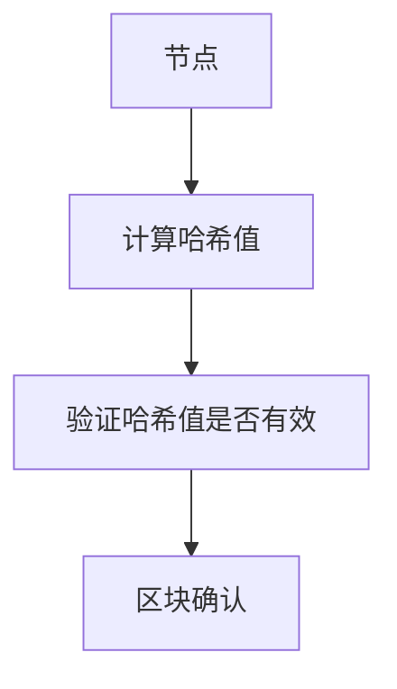
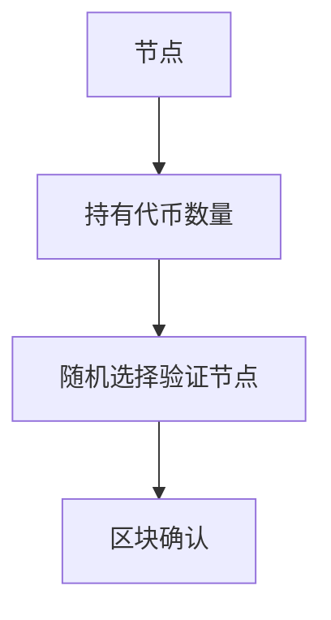
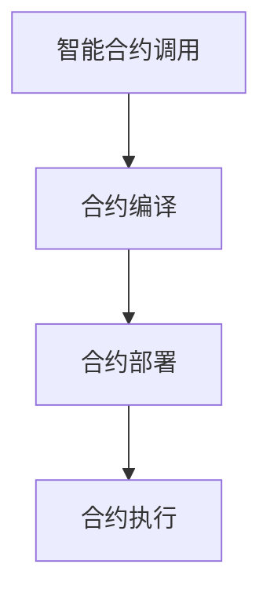
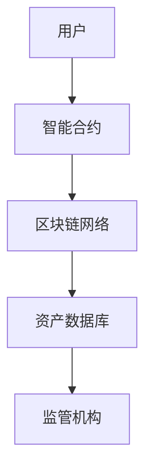

                 


# 如何评估企业的区块链数字资产管理平台

> **关键词**: 区块链, 数字资产管理, 平台评估, 共识机制, 智能合约, 企业应用, 数字经济

> **摘要**: 区块链技术在数字资产管理中的应用正变得越来越重要，本文将从技术原理、系统架构、项目实施等多个角度，详细分析如何评估企业区块链数字资产管理平台的可行性、安全性和高效性。通过对比不同共识机制、智能合约实现原理以及系统架构设计，本文将为企业提供一套全面的评估方法和最佳实践。

---

## 第1章: 区块链与数字资产管理平台的背景

### 1.1 区块链技术的基本概念

区块链是一种去中心化的分布式账本技术，通过密码学和共识机制确保数据的安全性和不可篡改性。其核心特点包括：

1. **去中心化**: 无需依赖中心化机构，数据由所有参与者共同维护。
2. **可追溯性**: 每一笔交易都可以被追踪和记录，确保数据的透明性。
3. **安全性**: 通过密码学算法和共识机制，防止数据篡改和攻击。

区块链技术的架构通常包括以下几个部分：
- **节点**: 网络中的参与者，负责验证和传播交易。
- **区块**: 存储交易数据的结构，由哈希指针连接成链。
- **共识机制**: 确保所有节点达成一致的规则，如PoW、PoS等。
- **智能合约**: 自动执行的脚本，用于实现复杂的业务逻辑。

### 1.2 数字资产管理的核心概念

数字资产是指以数字化形式存在的资产，包括加密货币（如比特币）、代币（如ERC-20）以及其他形式的数字权益证明。数字资产管理的核心任务包括：

1. **资产发行**: 通过智能合约定义资产的发行规则。
2. **资产转让**: 在区块链网络中实现资产的转移和交易。
3. **资产监管**: 通过区块链的可追溯性，实现资产的监管和审计。

数字资产管理平台的典型应用场景包括供应链金融、知识产权保护、数字版权交易等。

### 1.3 区块链数字资产管理平台的背景与发展趋势

随着数字经济的快速发展，区块链技术在企业中的应用逐渐普及。数字资产管理平台通过区块链技术，能够实现资产的高效管理、透明监管和智能合约执行。然而，企业在选择和实施区块链数字资产管理平台时，需要考虑以下几个关键问题：

1. **技术可行性**: 区块链技术是否能够满足企业的业务需求。
2. **安全性**: 平台是否能够抵御攻击和漏洞利用。
3. **合规性**: 平台是否符合相关法律法规和行业标准。

未来，区块链数字资产管理平台将朝着更加智能化、高效化和合规化的方向发展。

---

## 第2章: 区块链数字资产管理的核心概念

### 2.1 区块链数字资产管理的核心要素

区块链数字资产管理的核心要素包括：

1. **去中心化特性**: 区块链通过去中心化的架构，确保资产的安全性和透明性。
2. **数字资产的唯一性**: 每个数字资产都有唯一的标识和所有权记录。
3. **隐私保护**: 通过零知识证明等技术，保护用户的隐私。

### 2.2 区块链数字资产管理的关键技术

区块链数字资产管理的关键技术包括：

1. **共识机制**: 通过PoW、PoS等共识机制，确保网络的安全性。
2. **智能合约**: 通过智能合约实现资产的发行、转让和监管。
3. **可扩展性优化**: 通过侧链、分片等技术，提升区块链的性能。

### 2.3 区块链数字资产管理的核心属性对比

以下是对不同共识机制的对比分析：

| **共识机制** | **特点** | **适用场景** |
|--------------|----------|--------------|
| PoW          | 安全性高，但效率低 | 适用于比特币等加密货币 |
| PoS          | 效率高，但安全性依赖于质押资产 | 适用于以太坊2.0等项目 |

---

## 第3章: 区块链数字资产管理的核心算法原理

### 3.1 共识机制的算法原理

#### 3.1.1 工作量证明（PoW）机制



PoW机制通过节点计算哈希值来验证区块的有效性，确保网络安全。

#### 3.1.2 权益证明（PoS）机制



PoS机制通过节点质押代币来验证区块，相比PoW更高效。

### 3.2 智能合约的执行流程

智能合约的执行流程包括以下步骤：

1. **合约编译**: 将智能合约代码编译为 bytecode。
2. **合约部署**: 将合约部署到区块链网络中。
3. **合约调用**: 用户调用合约的函数，执行特定的逻辑。



---

## 第4章: 区块链数字资产管理系统的架构设计

### 4.1 系统功能设计

典型的区块链数字资产管理系统包括以下功能模块：

- **资产发行模块**: 实现数字资产的发行和分配。
- **资产转让模块**: 实现数字资产的转移和交易。
- **智能合约模块**: 实现智能合约的编写和执行。
- **监管模块**: 实现资产的监管和审计。

### 4.2 系统架构设计

以下是一个典型的区块链数字资产管理系统的架构图：



---

## 第5章: 项目实战与案例分析

### 5.1 环境配置

以下是区块链数字资产管理平台的环境配置示例：

```bash
# 安装以太坊环境
sudo apt-get update
sudo apt-get install -y git python3 python3-dev
git clone https://github.com/ethereum/go-ethereum.git
cd go-ethereum && make
```

### 5.2 核心实现

以下是智能合约的实现代码：

```solidity
// SPDX-License-Identifier: MIT
pragma solidity ^0.8.0;

contract DigitalAsset {
    mapping(address => uint256) public balances;

    function mint(address _to, uint256 _amount) public {
        balances[_to] += _amount;
    }

    function transfer(address _to, uint256 _amount) public {
        balances[msg.sender] -= _amount;
        balances[_to] += _amount;
    }
}
```

### 5.3 案例分析

以下是一个数字资产管理平台的案例分析：

**项目背景**: 某企业希望通过区块链技术实现数字版权的管理。

**解决方案**: 使用以太坊平台，通过智能合约实现数字版权的发行和转让。

**实施步骤**:
1. 部署智能合约到以太坊网络。
2. 用户通过合约进行数字版权的发行和转让。
3. 监管机构通过区块链浏览器进行监管和审计。

---

## 第6章: 最佳实践与小结

### 6.1 最佳实践

1. **技术选型**: 根据企业需求选择合适的区块链技术。
2. **安全性**: 通过多重签名和权限控制确保平台的安全性。
3. **合规性**: 确保平台符合相关法律法规和行业标准。

### 6.2 小结

本文从技术原理、系统架构、项目实施等多个角度，详细分析了如何评估企业区块链数字资产管理平台的可行性、安全性和高效性。通过对比不同共识机制、智能合约实现原理以及系统架构设计，本文为企业提供了一套全面的评估方法和最佳实践。

---

**作者**: AI天才研究院/AI Genius Institute & 禅与计算机程序设计艺术 /Zen And The Art of Computer Programming

