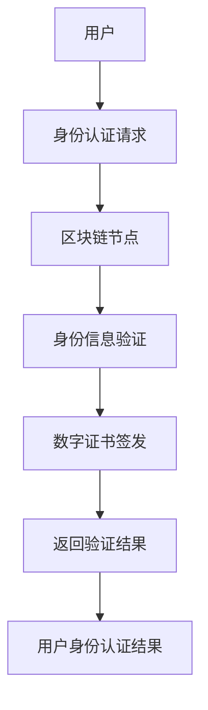
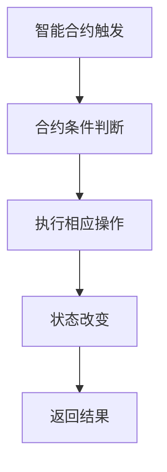
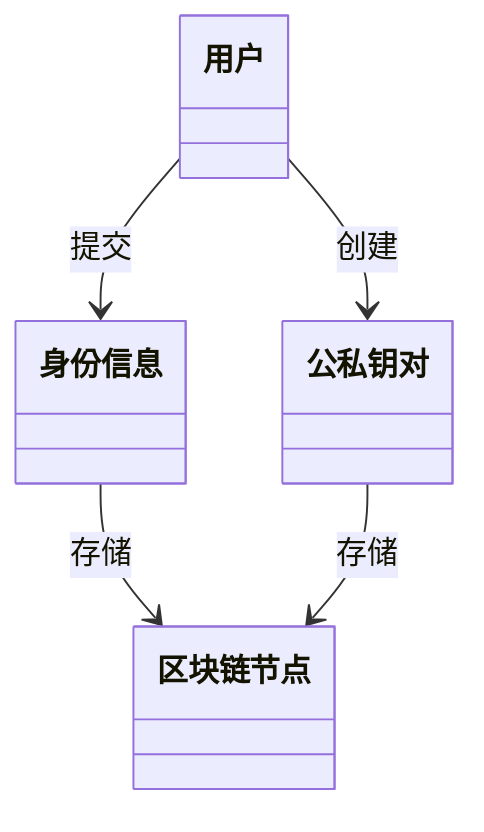
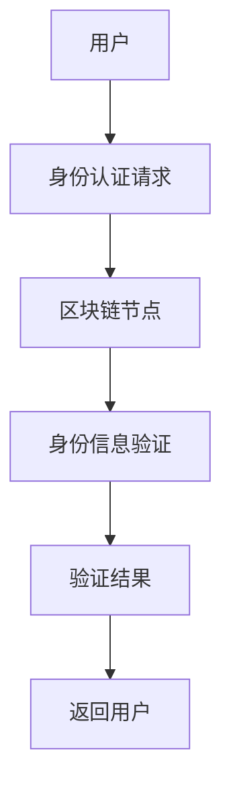
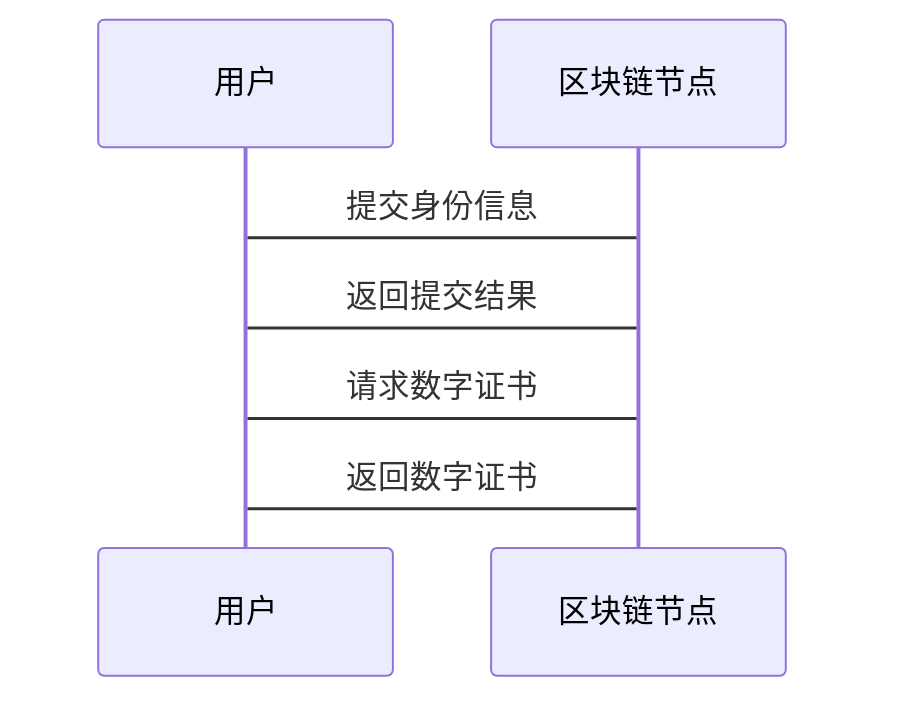

                 


# 如何评估企业的区块链数字身份认证应用

> 关键词：区块链，数字身份认证，企业应用，系统评估，安全性，隐私保护

> 摘要：本文将详细介绍如何评估企业中的区块链数字身份认证应用。从区块链与数字身份认证的基本概念出发，分析其核心原理、系统架构、算法原理及实际项目案例。通过对实际项目的系统分析与架构设计，阐述如何进行系统功能设计、接口设计及交互设计，最后结合具体案例进行详细讲解与剖析。

---

# 第1章 区块链数字身份认证的背景与问题背景

## 1.1 区块链技术的概述

### 1.1.1 区块链的基本概念
区块链是一种去中心化的分布式账本技术，通过密码学保证数据的安全性，通过共识算法实现数据的分布式存储和一致性。

### 1.1.2 区块链的核心特点
- 去中心化：无须信任第三方机构，通过点对点网络实现数据的直接交互。
- 不可篡改性：数据一旦写入区块链，就无法被修改或删除。
- 可追溯性：每一条数据都可以追溯其来源和流向。
- 安全性：通过加密算法和共识机制保证数据的安全性。

### 1.1.3 区块链在企业中的应用潜力
区块链技术在企业中的应用潜力主要体现在数据的安全性、透明性和高效性上。通过区块链技术，企业可以实现数据的可信共享和高效协作。

## 1.2 数字身份认证的概述

### 1.2.1 数字身份认证的基本概念
数字身份认证是指通过数字技术对用户身份进行验证的过程。常见的数字身份认证方式包括基于密码的认证、基于数字证书的认证、基于生物特征的认证等。

### 1.2.2 数字身份认证的常见方式
- 基于密码的认证：通过用户名和密码进行身份验证。
- 基于数字证书的认证：通过数字证书和公私钥对进行身份验证。
- 基于生物特征的认证：通过指纹、面部识别等生物特征进行身份验证。

### 1.2.3 数字身份认证在企业中的重要性
在企业中，数字身份认证是保障企业数据安全、防止身份盗窃和欺诈的重要手段。通过数字身份认证，企业可以实现对内部员工、合作伙伴和客户的身份管理。

## 1.3 区块链与数字身份认证的结合

### 1.3.1 区块链在数字身份认证中的优势
- 数据不可篡改：通过区块链技术，数字身份信息可以被安全地存储和共享。
- 去中心化：区块链技术可以实现去中心化的身份认证，避免单点故障。
- 可扩展性：区块链技术可以支持大规模的身份认证需求。

### 1.3.2 区块链数字身份认证的应用场景
- 企业内部员工身份认证
- 企业合作伙伴身份认证
- 客户身份认证
- 物联网设备身份认证

### 1.3.3 区块链数字身份认证的边界与外延
区块链数字身份认证的边界在于其技术实现的范围和应用场景的限制。其外延则包括与区块链技术相关的其他应用，如供应链管理、智能合约等。

## 1.4 本章小结
本章主要介绍了区块链技术和数字身份认证的基本概念、特点及其在企业中的应用潜力。通过区块链技术，数字身份认证可以实现更高的安全性、可靠性和可扩展性。

---

# 第2章 区块链数字身份认证的核心概念与联系

## 2.1 核心概念的定义与原理

### 2.1.1 区块链数字身份认证的核心要素
- 用户身份信息：包括用户的姓名、身份证号、邮箱地址等。
- 用户公私钥对：用于数字签名和身份验证。
- 数字证书：用于验证用户身份信息的真实性。
- 区块链账本：用于存储用户身份信息和交易记录。

### 2.1.2 区块链数字身份认证的属性特征对比
| 属性 | 特征 |
|------|------|
| 安全性 | 高 |  
| 可追溯性 | 高 |
| 去中心化 | 是 |
| 可扩展性 | 高 |

### 2.1.3 区块链数字身份认证的ER实体关系图

```mermaid
erDiagram
    actor 用户
    actor 系统管理员
    actor 合法机构
    identify 区块链节点 : 节点
    identify 用户身份信息 : 身份信息
    identify 用户公私钥对 : 公私钥对
    identify 数字证书 : 数字证书
    用户 --> 用户身份信息 : 提交
    用户 --> 公私钥对 : 创建
    用户 --> 数字证书 : 请求
    系统管理员 --> 区块链节点 : 部署
    合法机构 --> 区块链节点 : 验证
    区块链节点 --> 用户身份信息 : 存储
    区块链节点 --> 公私钥对 : 存储
    区块链节点 --> 数字证书 : 存储
```

## 2.2 核心概念的联系与对比

### 2.2.1 区块链数字身份认证与传统身份认证的对比

| 对比维度 | 区块链数字身份认证 | 传统身份认证 |
|----------|---------------------|---------------|
| 中心化 | 去中心化 | 中心化 |
| 数据存储 | 分布式存储 | 集中存储 |
| 安全性 | 高 | 中等 |
| 可扩展性 | 高 | 中等 |

### 2.2.2 区块链数字身份认证与其他技术的联系
区块链数字身份认证可以与其他技术如大数据、人工智能等结合，进一步提升身份认证的智能化和安全性。

### 2.2.3 区块链数字身份认证的系统架构图



---

# 第3章 区块链数字身份认证的算法原理

## 3.1 区块链数字身份认证的核心算法

### 3.1.1 共识算法（如PoW、PoS）

- 工作量证明（PoW）：通过计算哈希值来证明工作量，确保区块链的安全性。
- 权益证明（PoS）：通过持有代币的数量来决定记账权，减少能源消耗。

### 3.1.2 加密算法（如RSA、椭圆曲线加密）

- RSA加密算法：基于大整数分解的公钥加密算法，常用于数字签名和数据加密。
- 椭圆曲线加密（ECC）：基于椭圆曲线数学的公钥加密算法，安全性更高，计算效率更快。

### 3.1.3 智能合约的工作原理

智能合约是一种自动执行的计算机程序，运行在区块链上，根据预设的规则自动执行合同条款。

## 3.2 算法原理的数学模型与公式

### 3.2.1 共识算法的数学模型
以工作量证明（PoW）为例，哈希值计算公式如下：
$$ H = \text{Hash}(D + nonce) $$
其中，$D$是数据块，$nonce$是非ceasing值，$H$是目标哈希值。

### 3.2.2 加密算法的数学公式
以RSA加密算法为例，公钥和私钥的生成过程如下：
$$ \text{公钥} = (e, n) $$
$$ \text{私钥} = (d, n) $$
其中，$e$是加密指数，$d$是解密指数，$n$是模数。

### 3.2.3 智能合约的执行流程



---

# 第4章 区块链数字身份认证的系统分析与架构设计

## 4.1 系统分析

### 4.1.1 问题场景介绍
假设某企业需要实现员工身份认证系统，采用区块链技术进行身份信息的存储和验证。

### 4.1.2 项目介绍与目标
项目目标：实现基于区块链的员工身份认证系统，确保身份信息的安全性和可追溯性。

### 4.1.3 系统功能设计（领域模型Mermaid类图）



## 4.2 系统架构设计

### 4.2.1 系统架构图



### 4.2.2 系统接口设计
- 用户接口：提交身份信息、请求数字证书。
- 区块链节点接口：存储和验证身份信息。
- 管理接口：管理区块链节点和数字证书。

### 4.2.3 系统交互设计（Mermaid序列图）



---

# 第5章 区块链数字身份认证的项目实战

## 5.1 环境安装

### 5.1.1 操作系统
- 操作系统：Linux（推荐Ubuntu）

### 5.1.2 区块链框架
- 推荐使用以太坊（Ethereum）或Hyperledger Fabric。

### 5.1.3 开发工具
- 部署环境：Node.js、Golang
- 开发工具：Visual Studio Code、IntelliJ IDEA

## 5.2 系统核心实现源代码

### 5.2.1 智能合约实现（Solidity）

```solidity
// SPDX-License-Identifier: MIT
pragma solidity ^0.8.0;

contract IdentityAuthentication {
    struct User {
        string name;
        uint256 id;
        bool authenticated;
    }

    mapping(address payable => User) users;

    function authenticate(address payable _address, string memory _name, uint256 _id) public {
        users[_address] = User(_name, _id, true);
    }

    function verify(address payable _address) public view returns (bool) {
        return users[_address].authenticated;
    }
}
```

### 5.2.2 身份验证实现（Node.js）

```javascript
const express = require('express');
const bodyParser = require('body-parser');
const Web3 = require('web3');

const app = express();
app.use(bodyParser.json());

const web3 = new Web3(new Web3.providers.HttpProvider('http://localhost:8545'));

app.post('/authenticate', async (req, res) => {
    const { address, name, id } = req.body;
    try {
        const contract = new web3.eth.Contract(identityABI, identityAddress);
        await contract.methods.authenticate(address, name, id).send();
        res.status(200).json({ message: 'Authentication successful' });
    } catch (error) {
        res.status(500).json({ error: error.message });
    }
});

app.get('/verify', async (req, res) => {
    const { address } = req.query;
    try {
        const contract = new web3.eth.Contract(identityABI, identityAddress);
        const result = await contract.methods.verify(address).call();
        res.status(200).json({ verified: result });
    } catch (error) {
        res.status(500).json({ error: error.message });
    }
});

app.listen(3000, () => {
    console.log('Server is running on port 3000');
});
```

---

# 第6章 总结与展望

## 6.1 本章总结
通过本文的详细讲解，我们了解了如何评估企业中的区块链数字身份认证应用。从背景介绍、核心概念、算法原理到系统设计和项目实战，我们全面分析了区块链数字身份认证的优势和实现方法。

## 6.2 未来展望
随着区块链技术的不断发展，数字身份认证的应用场景将更加广泛。未来，区块链数字身份认证将与人工智能、大数据等技术结合，进一步提升身份认证的智能化和安全性。

---

# 第7章 附录

## 7.1 参考文献
1. 《区块链技术与应用》，作者：张三，出版社：人民邮电出版社。
2. 《数字身份认证技术》，作者：李四，出版社：机械工业出版社。

## 7.2 工具下载链接
- 以太坊官方文档：[https://ethereum.org](https://ethereum.org)
- Hyperledger Fabric官方文档：[https://hyperledger.org](https://hyperledger.org)

## 7.3 相关标准规范
- 数字证书标准：X.509
- 区块链标准：Hyperledger Fabric

---

# 作者：AI天才研究院/AI Genius Institute & 禅与计算机程序设计艺术 /Zen And The Art of Computer Programming

