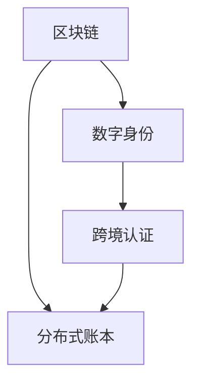
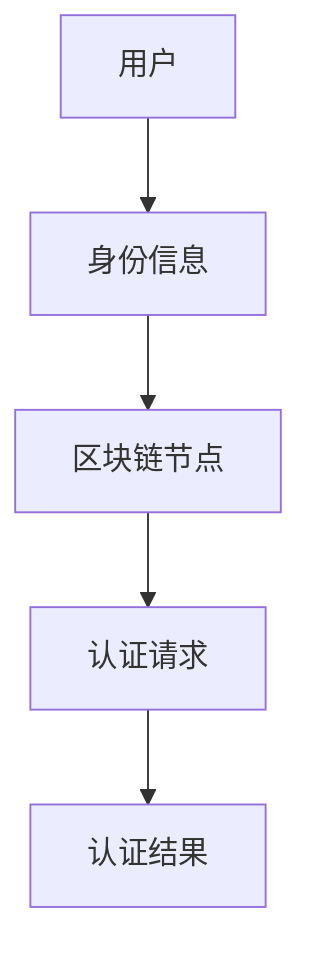
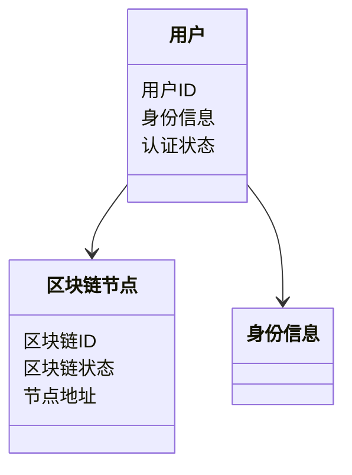
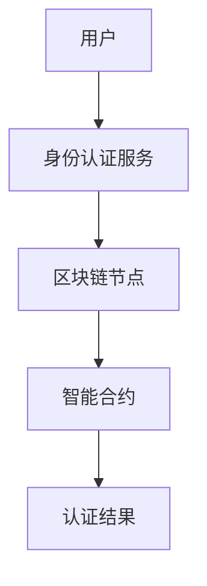
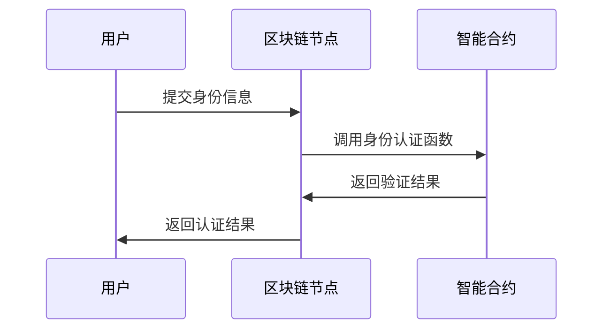

                 


# 如何评估企业的区块链数字身份跨境认证应用

> 关键词：区块链，数字身份，跨境认证，身份认证，分布式账本

> 摘要：随着全球化进程的加快和数字技术的飞速发展，企业的跨境身份认证需求日益增长。区块链技术凭借其分布式、去中心化、不可篡改的特性，为数字身份认证提供了全新的解决方案。本文将从技术原理、系统设计、应用场景等多个维度，详细阐述如何评估企业区块链数字身份跨境认证应用的可行性、安全性、合规性及效率。

---

## 第一部分：区块链数字身份跨境认证应用概述

### 第1章：区块链数字身份跨境认证的背景与问题

#### 1.1 问题背景
- **1.1.1 当前企业身份认证面临的挑战**  
  - 传统身份认证方式依赖中心化机构，存在数据孤岛、信任成本高、隐私泄露风险等问题。
- **1.1.2 跨境认证的复杂性与痛点**  
  - 不同国家或地区的身份认证标准不统一，互操作性差。
  - 数据跨境传输涉及复杂的法律和合规问题。
- **1.1.3 区块链技术如何解决这些问题**  
  - 提供去中心化的身份认证机制，降低信任成本。
  - 实现数据的分布式存储和共享，提高互操作性。

#### 1.2 问题描述
- **1.2.1 跨境身份认证的核心需求**  
  - 实现跨国界的身份信息共享与认证。
  - 确保数据隐私与安全。
- **1.2.2 当前技术方案的局限性**  
  - 中心化机构的信任风险。
  - 跨境数据传输的法律障碍。
- **1.2.3 区块链技术的应用潜力**  
  - 支持去中心化身份认证，实现多方信任。
  - 提供可扩展的跨境数据共享解决方案。

#### 1.3 问题解决
- **1.3.1 区块链技术的核心优势**  
  - 分布式账本：确保数据一致性和完整性。
  - 加密签名：保障数据隐私与安全。
- **1.3.2 跨境认证的实现路径**  
  - 构建跨链身份认证机制。
  - 制定统一的身份认证标准。
- **1.3.3 标准化与合规性问题**  
  - 制定符合国际标准的身份认证协议。
  - 确保数据传输符合各国法律法规。

#### 1.4 边界与外延
- **1.4.1 区块链数字身份的定义域**  
  - 聚焦于企业级身份认证。
  - 不涵盖个人隐私保护的全部领域。
- **1.4.2 跨境认证的边界条件**  
  - 仅针对企业身份认证，不包括个人身份认证。
  - 仅处理数据跨境传输的技术问题，不涉及政治或法律争议。
- **1.4.3 相关技术的外延影响**  
  - 区块链技术在供应链、金融等领域的应用。
  - 跨境数据共享对数字经济的影响。

#### 1.5 概念结构与核心要素
- **1.5.1 核心概念的层次分解**  
  - 核心概念：区块链、数字身份、跨境认证。
  - 关联概念：分布式账本、加密签名、智能合约。
- **1.5.2 核心要素的对比分析**
  | 要素 | 特性 | 说明 |
  |------|------|------|
  | 区块链 | 去中心化 | 数据由多方共同维护，无单点故障。 |
  | 数字身份 | 唯一性 | 每个身份具有唯一标识符。 |
  | 跨境认证 | 互操作性 | 支持不同国家/地区身份认证标准的互联互通。 |
- **1.5.3 概念结构的可视化展示**


---

## 第二部分：区块链数字身份的核心概念与联系

### 第2章：区块链数字身份的核心概念与联系

#### 2.1 核心概念原理
- **2.1.1 区块链技术的基本原理**  
  区块链通过分布式账本、共识机制和加密技术，实现数据的不可篡改性和可追溯性。
- **2.1.2 数字身份的定义与实现**  
  数字身份是通过区块链技术生成的唯一标识符，结合公钥加密技术，确保身份信息的安全性。
- **2.1.3 跨境认证的实现机制**  
  跨境认证通过区块链网络中的智能合约，实现跨国界的身份信息验证。

#### 2.2 核心概念属性对比
- **2.2.1 区块链技术的属性特征**  
  - 分布式：数据由多个节点共同维护。
  - 去中心化：无单一控制机构。
  - 不可篡改：数据一旦写入区块链，无法被修改。
- **2.2.2 数字身份的属性特征**  
  - 唯一性：每个数字身份具有唯一标识符。
  - 安全性：通过加密技术保护隐私。
  - 可验证性：支持第三方验证身份信息。
- **2.2.3 跨境认证的属性特征**  
  - 互操作性：支持不同系统之间的身份认证。
  - 实时性：认证过程快速高效。
  - 合规性：符合各国法律法规要求。

#### 2.3 ER实体关系图


---

## 第三部分：区块链数字身份的算法原理

### 第3章：区块链数字身份的算法原理

#### 3.1 共识机制的实现
- **3.1.1 共识机制的核心算法**  
  - 常见的共识机制包括POW（工作量证明）、POS（权益证明）、DPOS（ delegated proof of stake）等。
- **3.1.2 跨境认证中的共识机制**  
  通过多链或跨链技术，实现不同区块链网络之间的共识。
- **3.1.3 共识机制的优化**  
  采用分片技术或侧链技术，提升共识效率。

#### 3.2 数字签名与身份认证
- **3.2.1 数字签名的原理**  
  - 使用公钥加密技术，确保数据的完整性和真实性。
  - 签名过程：用私钥对数据进行加密签名。
  - 验签过程：用公钥验证签名的有效性。
- **3.2.2 身份认证的流程**  
  1. 用户提交身份信息。
  2. 区块链节点对身份信息进行签名。
  3. 其他节点验证签名的有效性。
- **3.2.3 安全性分析**  
  - 私钥泄露的风险。
  - 公钥的安全存储与传输。

#### 3.3 数学模型与公式
- **3.3.1 哈希函数**  
  $$H(x) = \text{hash}(x)$$  
  - 哈希函数用于生成数据的指纹，确保数据的唯一性和完整性。
- **3.3.2 数字签名**  
  $$S = \text{Sign}(x, K)$$  
  - $K$为私钥，$\text{Sign}$为签名函数。
- **3.3.3 签名验证**  
  $$V = \text{Verify}(S, x, K)$$  
  - $V$为验证结果，$K$为公钥。

#### 3.4 代码实现
```python
import hashlib

def compute_hash(data):
    return hashlib.sha256(data.encode()).hexdigest()

def generate_signature(private_key, data):
    # 使用私钥对数据进行签名
    return private_key.sign(data, '')

def verify_signature(public_key, signature, data):
    # 使用公钥验证签名
    return public_key.verify(data, signature)
```

---

## 第四部分：系统分析与架构设计

### 第4章：系统分析与架构设计

#### 4.1 问题场景介绍
- **4.1.1 跨境身份认证的典型场景**  
  - 用户在跨国企业中进行身份认证。
  - 跨境支付、供应链管理中的身份验证。
- **4.1.2 系统需求分析**  
  - 支持多语言、多时区的用户身份认证。
  - 实现跨境数据的安全共享与传输。
- **4.1.3 场景中的挑战与解决方案**  
  - 跨境数据传输的法律合规性。
  - 不同国家/地区身份认证标准的统一。

#### 4.2 系统功能设计
- **4.2.1 领域模型**  


- **4.2.2 系统架构设计**  


- **4.2.3 接口设计与交互**  


---

## 第五部分：项目实战

### 第5章：项目实战

#### 5.1 环境安装
- 安装Python和必要的区块链框架（如Ethereum、Hyperledger）。
- 安装相关开发工具（如Solidity、Ganache）。

#### 5.2 核心代码实现
```python
from web3 import Web3, HTTPProvider
from eth_account import Account

# 初始化区块链节点
web3 = Web3(HTTPProvider('http://localhost:8545'))

# 用户提交身份信息
user_identity = {
    'name': 'Alice',
    'country': 'China',
    'id_number': '123456'
}

# 使用私钥签名
private_key = '0x123...'
signed_identity = Account.from privateKey(private_key).signTransaction(user_identity)

# 智能合约调用
contract_address = '0x123...'
contract = web3.eth.contract(contract_address, abi=abi)
tx_hash = contract.functions.authenticate(signed_identity).transact()

# 等待交易确认
receipt = web3.eth.waitForTransactionReceipt(tx_hash)
```

#### 5.3 代码解读与分析
- **5.3.1 用户身份信息的提交与签名**  
  用户提交身份信息后，使用私钥对其进行签名，确保数据的完整性和真实性。
- **5.3.2 智能合约的调用**  
  通过智能合约实现身份认证，确保数据在区块链网络中的可验证性。
- **5.3.3 认证结果的返回**  
  智能合约验证签名后，返回认证结果，用户获得认证状态。

#### 5.4 实际案例分析
- **5.4.1 跨境支付中的身份认证**  
  用户在跨国支付中提交身份信息，通过区块链技术实现快速认证。
- **5.4.2 供应链管理中的身份验证**  
  供应商在跨国供应链中提交身份信息，通过区块链技术实现可追溯性。

#### 5.5 项目小结
- 通过区块链技术实现企业级身份认证，提升数据安全性和互操作性。
- 需要解决跨国数据传输的法律合规问题。

---

## 第六部分：总结与展望

### 第6章：总结与展望

#### 6.1 最佳实践
- **6.1.1 标准化与合规性**  
  制定统一的身份认证标准，确保跨国数据共享的合规性。
- **6.1.2 安全性与隐私保护**  
  加强私钥管理和加密技术，确保数据隐私。
- **6.1.3 可扩展性与性能优化**  
  采用分片技术或侧链技术，提升系统性能。

#### 6.2 小结
- 区块链技术为企业的跨境身份认证提供了全新的解决方案。
- 通过去中心化和分布式账本，实现了数据的安全共享与互操作性。

#### 6.3 注意事项
- 注意跨国数据传输的法律风险。
- 确保私钥的安全存储与管理。
- 定期更新和优化系统架构。

#### 6.4 拓展阅读
- 区块链技术在金融领域的应用。
- 跨境数据共享的国际标准制定。

---

## 作者：AI天才研究院/AI Genius Institute & 禅与计算机程序设计艺术 /Zen And The Art of Computer Programming

