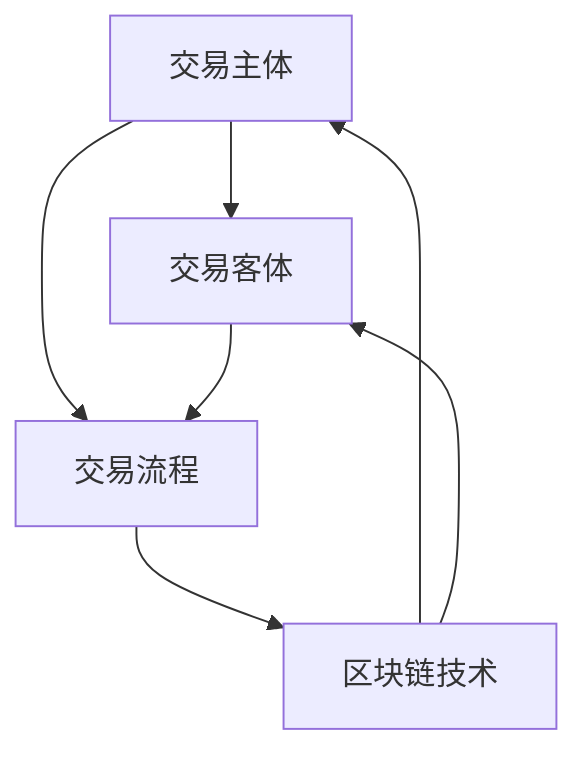
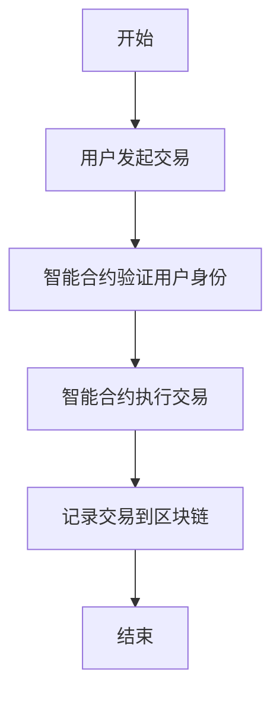
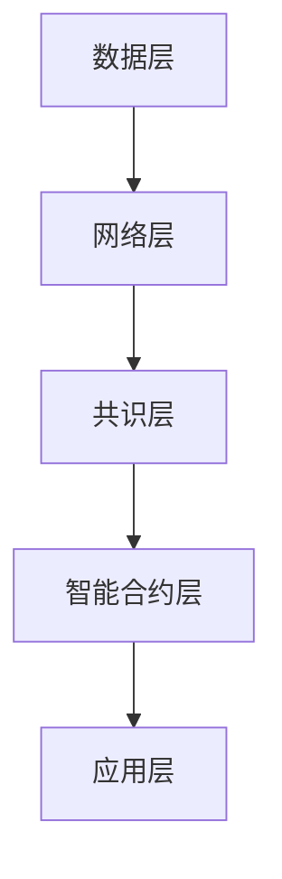
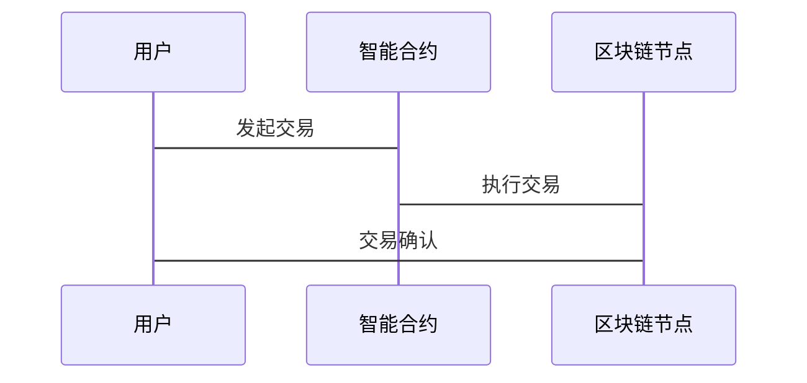

                 


# 如何评估企业的区块链碳信用交易平台

> 关键词：区块链，碳信用交易，平台评估，智能合约，去中心化

> 摘要：本文旨在通过详细分析区块链技术在碳信用交易中的应用，探讨如何评估企业的区块链碳信用交易平台。文章从背景介绍、核心概念、算法原理、系统架构设计、项目实战等方面进行深入剖析，结合实际案例和代码实现，为读者提供全面的评估方法和实践指南。

---

# 第1章: 区块链碳信用交易平台概述

## 1.1 区块链碳信用交易的背景与意义

### 1.1.1 碳信用交易的起源与发展

碳信用交易起源于《京都议定书》和《巴黎协定》等国际气候协议，旨在通过市场机制减少温室气体排放。企业通过购买碳信用额度（Carbon credits）来抵消自身排放，从而实现碳中和目标。区块链技术的引入，解决了传统碳信用交易中的信任缺失、透明度低和效率低的问题。

### 1.1.2 区块链技术如何赋能碳信用交易

区块链的去中心化特性确保了碳信用交易的透明性和不可篡改性，智能合约自动执行交易条款，降低了中介成本，提高了交易效率。此外，区块链技术能够实现碳信用的全生命周期管理，从生成、交易到注销，每一步都可追溯。

### 1.1.3 区块链碳信用交易的全球应用现状

目前，全球已有多个区块链碳信用交易平台上线，例如VChain、EcoToken等。这些平台通过区块链技术实现了碳信用的高效流通和监管，为全球碳中和目标提供了技术支持。

## 1.2 区块链碳信用交易平台的核心概念

### 1.2.1 碳信用的基本定义与属性

碳信用是一种许可权证书，允许持有者排放一定量的二氧化碳。其核心属性包括唯一性、可转让性和可追踪性。通过区块链技术，碳信用的每一步交易均可被记录和验证。

### 1.2.2 区块链技术在碳信用交易中的作用

区块链通过去中心化、智能合约和加密技术，确保了碳信用交易的安全性、透明性和高效性。智能合约自动执行交易条件，减少了人为干预和信任成本。

### 1.2.3 平台的生态系统与参与方

区块链碳信用交易平台的生态系统包括政府机构、企业、个人、碳项目开发方、监管机构等多方参与者。平台通过智能合约实现多方协作，确保交易的公平性和合规性。

## 1.3 区块链碳信用交易的边界与外延

### 1.3.1 交易的边界范围

区块链碳信用交易的边界包括碳信用的生成、交易、结算和注销。平台需确保这些环节的安全性和合规性，同时与其他系统（如政府监管系统）对接。

### 1.3.2 平台的外延功能

平台外延功能包括数据分析、风险管理、智能合约定制、用户身份认证等。这些功能为平台的可持续发展提供了支持。

### 1.3.3 与其他区块链应用的关联

区块链技术在供应链金融、智能合约等领域也有广泛应用。碳信用交易平台与其他区块链应用在技术、标准和监管方面存在关联，需进行协同设计和优化。

## 1.4 本章小结

本章通过介绍碳信用交易的背景、区块链技术的作用以及平台的核心概念，为后续章节奠定了基础。接下来将深入分析区块链碳信用交易平台的核心要素和算法原理。

---

# 第2章: 区块链碳信用交易平台的核心要素

## 2.1 碳信用交易的核心要素分析

### 2.1.1 交易主体

交易主体包括买方（企业或个人）和卖方（碳项目开发方或政府）。区块链平台需对交易双方进行身份认证，确保交易的合法性。

### 2.1.2 交易客体

碳信用是交易的主要客体，其核心属性包括唯一标识、数量、来源和状态。区块链技术确保了碳信用的唯一性和可追溯性。

### 2.1.3 交易流程

碳信用交易流程包括需求匹配、交易撮合、智能合约执行和交易结算。每一步骤均需通过区块链技术实现透明化和自动化。

## 2.2 区块链技术的核心要素

### 2.2.1 区块链的去中心化特性

去中心化确保了数据的安全性和不可篡改性，避免了单点故障和数据被篡改的风险。

### 2.2.2 区块链的不可篡改性

区块链通过共识机制和加密算法，确保了交易记录的不可篡改性和可追溯性。

### 2.2.3 区块链的智能合约功能

智能合约自动执行交易条款，减少了人为干预，提高了交易效率和透明度。

## 2.3 平台功能的核心要素

### 2.3.1 资产登记与发行

平台需对碳信用进行登记、审核和发行，确保资产的合法性和唯一性。

### 2.3.2 交易撮合与结算

平台通过智能合约撮合交易，并自动执行结算流程，确保交易的及时性和安全性。

### 2.3.3 信息披露与监管

平台需提供实时数据查询和监管接口，确保交易的透明性和合规性。

## 2.4 核心要素的关联分析

### 2.4.1 要素之间的关系图

以下为碳信用交易核心要素的关系图：



### 2.4.2 要素对平台整体性能的影响

核心要素的优化直接影响平台的交易效率、安全性、用户体验和合规性。例如，智能合约的优化可显著提高交易速度和降低错误率。

### 2.4.3 要素对交易效率的优化

通过区块链技术和智能合约的应用，碳信用交易的效率得到显著提升，交易时间从数天缩短至几分钟，交易成本大幅降低。

## 2.5 本章小结

本章详细分析了碳信用交易和区块链技术的核心要素及其相互关系，为后续的算法设计和系统架构奠定了基础。

---

# 第3章: 区块链碳信用交易平台的核心原理

## 3.1 区块链技术在碳信用交易中的应用原理

### 3.1.1 区块链的基本工作原理

区块链通过去中心化的分布式账本、共识机制、加密算法和智能合约实现数据的安全性和可靠性。

### 3.1.2 区块链在碳信用交易中的具体应用

区块链用于碳信用的生成、登记、交易和结算，确保每一步骤的透明和可追溯。

### 3.1.3 区块链如何确保交易的透明性与安全性

通过区块链的去中心化特性和加密算法，确保交易数据的安全性和不可篡改性，提升交易的透明度。

## 3.2 智能合约在碳信用交易中的应用

### 3.2.1 智能合约的定义与特点

智能合约是区块链上的自动执行程序，能够根据预设条件自动触发相应的操作，具有自动性、不可篡改性和透明性等特点。

### 3.2.2 智能合约在碳信用交易中的具体实现

智能合约用于执行交易条款，例如自动扣除买方的碳信用额度，并将资金支付给卖方。以下是智能合约的实现代码示例：

```solidity
// SPDX-License-Identifier: MIT
pragma solidity ^0.8.0;

contract CarbonCredit {
    mapping(address => uint256) public balances;

    function transfer(address recipient, uint256 amount) external {
        require(balances[msg.sender] >= amount, "Insufficient balance");
        balances[recipient] += amount;
        balances[msg.sender] -= amount;
    }
}
```

### 3.2.3 智能合约的优势与挑战

优势：自动化执行、减少人为干预、提高效率。挑战：代码漏洞风险、智能合约的法律合规性、性能瓶颈。

## 3.3 平台功能实现的核心算法原理

### 3.3.1 算法概述

平台采用分布式账本技术和智能合约算法，实现碳信用的登记、交易和结算。

### 3.3.2 算法流程图

以下为碳信用交易的算法流程图：



### 3.3.3 算法的数学模型与公式

交易成功的条件为：用户身份验证成功且智能合约执行成功。

$$
\text{交易成功} = \text{身份验证通过} \land \text{智能合约执行成功}
$$

## 3.4 本章小结

本章详细讲解了区块链技术和智能合约在碳信用交易中的应用原理，为后续的系统设计提供了理论基础。

---

# 第4章: 区块链碳信用交易平台的系统架构设计

## 4.1 系统功能设计

### 4.1.1 用户功能模块

用户功能模块包括用户注册、登录、浏览碳信用、发起交易等。

### 4.1.2 管理功能模块

管理功能模块包括碳信用审核、用户管理、交易监管等。

### 4.1.3 交易功能模块

交易功能模块包括交易撮合、智能合约执行、交易结算等。

## 4.2 系统架构设计

### 4.2.1 分层架构设计

平台采用分层架构，包括数据层、网络层、共识层、智能合约层和应用层。

### 4.2.2 微服务架构设计

平台采用微服务架构，包括用户服务、交易服务、智能合约服务、区块链服务等。

### 4.2.3 系统架构图

以下为系统的分层架构图：



## 4.3 系统接口设计

### 4.3.1 用户接口

用户接口包括API接口和Web界面，用于用户发起交易和查询信息。

### 4.3.2 区块链接口

区块链接口用于与区块链网络交互，包括智能合约部署、交易记录等。

## 4.4 系统交互流程

### 4.4.1 交易交互流程

以下为交易交互流程的序列图：



## 4.5 本章小结

本章详细设计了系统的架构和接口，为后续的项目实现奠定了基础。

---

# 第5章: 项目实战与案例分析

## 5.1 项目环境安装

### 5.1.1 安装以太坊节点

使用Geth或Parity等工具安装以太坊节点。

### 5.1.2 安装智能合约开发环境

安装Solidity编译器、Node.js和相关开发工具。

## 5.2 系统核心实现

### 5.2.1 智能合约实现

以下是碳信用智能合约的实现代码：

```solidity
// SPDX-License-Identifier: MIT
pragma solidity ^0.8.0;

contract CarbonCredit {
    mapping(address => uint256) public balances;

    function transfer(address recipient, uint256 amount) external {
        require(balances[msg.sender] >= amount, "Insufficient balance");
        balances[recipient] += amount;
        balances[msg.sender] -= amount;
        emit Transfer(msg.sender, recipient, amount);
    }

    event Transfer(address indexed from, address indexed to, uint256 amount);
}
```

### 5.2.2 平台功能实现

实现用户注册、交易撮合、交易结算等功能。

## 5.3 代码应用解读与分析

### 5.3.1 智能合约的运行机制

智能合约通过区块链网络进行部署和执行，确保交易的透明性和自动化。

### 5.3.2 平台的运行流程

用户发起交易请求，平台通过智能合约撮合交易并执行结算。

## 5.4 案例分析与详细讲解

### 5.4.1 实际案例分析

以某企业购买碳信用额度为例，分析平台的运行流程和智能合约的执行过程。

### 5.4.2 案例的详细讲解

从需求分析、系统设计、实现到测试，详细讲解案例的每一步。

## 5.5 本章小结

本章通过项目实战和案例分析，验证了平台的可行性和实用性。

---

# 第6章: 最佳实践与总结

## 6.1 最佳实践

### 6.1.1 技术选型建议

选择合适的区块链平台和技术栈，确保系统的性能和安全性。

### 6.1.2 平台的合规性建议

确保平台符合相关法律法规和行业标准。

### 6.1.3 平台的安全性建议

加强智能合约的安全审计和漏洞修复，确保系统的安全性。

## 6.2 小结

本文从背景介绍、核心概念、算法原理、系统架构设计到项目实战，全面分析了区块链碳信用交易平台的评估方法和实现方案。

## 6.3 注意事项

在实际应用中，需注意智能合约的法律合规性、性能瓶颈和用户体验优化等问题。

## 6.4 拓展阅读

推荐相关领域的书籍和资源，供读者深入学习。

---

# 作者：AI天才研究院/AI Genius Institute & 禅与计算机程序设计艺术 /Zen And The Art of Computer Programming

