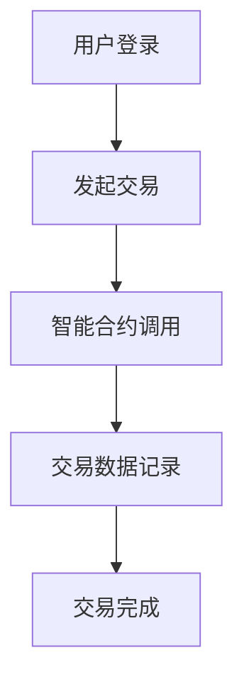
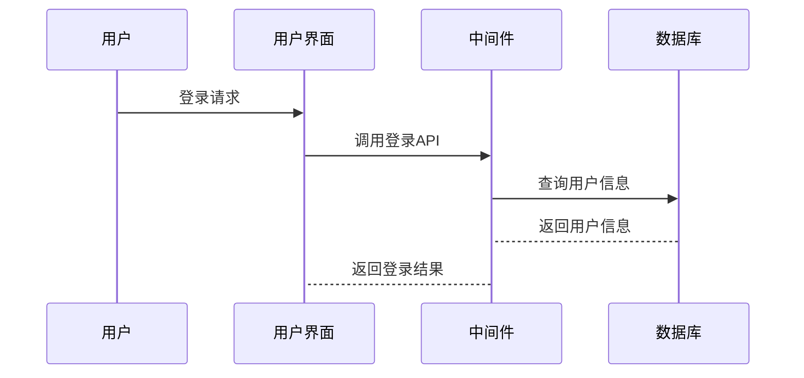

                 


# 如何评估企业的区块链能源交易平台

## 关键词：区块链，能源交易，智能合约，共识机制，去中心化

## 摘要：  
区块链技术的引入为能源交易带来了革命性的变化，通过智能合约和去中心化架构，区块链能源交易平台能够实现透明、高效、安全的交易流程。本文将从背景介绍、核心概念、技术原理、系统分析、项目实战等多方面，详细探讨如何评估企业中的区块链能源交易平台，包括系统功能设计、架构设计、接口设计和交互设计等内容。

---

## 第一部分：区块链能源交易平台概述

### 第1章：区块链能源交易平台的背景与概念

#### 1.1 区块链技术与能源交易的结合

- **1.1.1 区块链技术的基本概念**  
  区块链是一种去中心化的分布式账本技术，通过密码学和共识机制确保数据的安全性和不可篡改性。区块链的核心特点包括去中心化、透明性、不可篡改性和可追溯性。

- **1.1.2 区块链在能源交易中的应用价值**  
  区块链技术可以解决能源交易中的信任问题，通过智能合约实现自动化的交易流程，降低中间成本，提高交易效率。

#### 1.2 区块链能源交易平台的定义与特点

- **1.2.1 区块链能源交易平台的定义**  
  区块链能源交易平台是指基于区块链技术，用于能源（如电力、天然气等）的买卖双方进行交易的平台，通过智能合约实现交易的自动化和透明化。

- **1.2.2 区块链能源交易平台的核心特点**  
  - **去中心化**：交易数据存储在区块链上，没有单一的中心机构控制交易流程。  
  - **透明性**：所有交易记录公开透明，用户可以随时查询交易详情。  
  - **安全性**：通过区块链的加密技术和共识机制，确保交易数据的安全性。  
  - **高效性**：智能合约自动执行交易，减少人工干预，提高交易效率。

- **1.2.3 区块链能源交易平台与传统能源交易的区别**  
  传统能源交易依赖于中心化的机构（如银行或交易所）进行交易撮合和结算，而区块链能源交易平台通过去中心化的方式实现交易的自动化和透明化，减少了中间成本和时间。

### 第2章：区块链能源交易平台的核心概念与联系

#### 2.1 区块链能源交易平台的核心要素

- **2.1.1 区块链节点**  
  区块链节点是区块链网络中的参与方，负责存储和验证交易数据。每个节点都有一个唯一的节点ID和节点地址。

- **2.1.2 智能合约**  
  智能合约是区块链上的自动执行程序，用于定义交易的规则和流程。智能合约可以在区块链上部署，并根据预设的条件自动执行交易。

- **2.1.3 交易用户**  
  交易用户是区块链能源交易平台的参与者，包括买方和卖方。用户可以通过区块链节点连接到平台，并通过智能合约发起和完成交易。

- **2.1.4 交易数据**  
  交易数据是区块链上的记录，包括交易ID、买方ID、卖方ID、交易电量和交易时间等信息。

#### 2.2 核心概念的ER实体关系图

```mermaid
er
    actor 用户 {
        id 用户ID
        用户名
        密码
        邮箱
    }
    actor 节点 {
        id 节点ID
        节点地址
        节点类型
    }
    actor 智能合约 {
        合约地址
        合约代码
        合约状态
    }
    actor 交易数据 {
        交易ID
        买方ID
        卖方ID
        交易电量
        交易时间
    }
    用户 --> 节点: 连接节点
    用户 --> 智能合约: 调用合约
    用户 --> 交易数据: 发起交易
    节点 --> 智能合约: 部署合约
    节点 --> 交易数据: 记录交易
```

---

## 第二部分：区块链能源交易平台的评估方法

### 第3章：区块链能源交易平台的评估指标

#### 3.1 评估区块链能源交易平台的核心指标

- **功能性**  
  - 系统是否支持智能合约的自动执行。  
  - 系统是否支持多种能源类型的交易（如电力、天然气）。  
  - 系统是否支持用户身份验证和权限管理。

- **性能**  
  - 系统的交易处理速度（TPS）。  
  - 系统的响应时间。  
  - 系统的吞吐量。

- **安全性**  
  - 系统是否采用加密技术保护用户隐私。  
  - 系统是否采用共识机制确保数据的安全性。  
  - 系统是否支持漏洞修复和升级。

- **用户体验**  
  - 系统的界面是否友好。  
  - 系统的操作是否简单易用。  
  - 系统的交易记录是否清晰可查。

#### 3.2 评估流程与步骤

- **需求分析**  
  确定评估目标和范围，明确评估的指标和标准。

- **实施测试**  
  根据评估指标设计测试用例，进行功能测试、性能测试、安全测试和用户体验测试。

- **结果分析**  
  对测试结果进行分析，找出系统的优势和不足，提出改进建议。

### 第4章：区块链能源交易平台的系统分析与架构设计

#### 4.1 系统功能设计

- **功能模块划分**  
  - 用户模块：用户注册、登录、身份验证。  
  - 节点模块：节点连接、节点管理。  
  - 智能合约模块：智能合约部署、合约调用。  
  - 交易模块：交易发起、交易确认、交易记录。

- **系统功能流程图**



#### 4.2 系统架构设计

- **分层架构设计**  
  - 数据层：存储交易数据和用户数据。  
  - 业务逻辑层：实现智能合约的调用和交易逻辑的处理。  
  - 应用层：提供用户界面和API接口。

- **系统架构图**


#### 4.3 接口设计与交互设计

- **API接口设计**  
  - `/api/login`：用户登录接口。  
  - `/api/register`：用户注册接口。  
  - `/api/trade`：发起交易接口。

- **交互流程图**



---

## 第五部分：项目实战与案例分析

### 第5章：区块链能源交易平台的实战部署

#### 5.1 环境安装与配置

- **安装区块链环境**  
  - 安装以太坊节点（Geth）。  
  - 配置区块链网络参数。

- **安装智能合约开发环境**  
  - 安装Solidity编译器。  
  - 配置以太坊钱包（如MetaMask）。

#### 5.2 核心代码实现

- **智能合约代码实现**

```solidity
// SPDX-License-Identifier: MIT
pragma solidity ^0.8.0;

contract EnergyTrade {
    struct Transaction {
        address buyer;
        address seller;
        uint256 amount;
        uint256 timestamp;
    }

    event TradeCompleted(address indexed buyer, address indexed seller, uint256 amount);

    function initiateTrade(address buyer, address seller, uint256 amount) public {
        emit TradeCompleted(buyer, seller, amount);
    }
}
```

- **交易功能实现**

```javascript
const EnergyTrade = require('./EnergyTrade.js');
const tradeContract = new EnergyTrade(web3.currentProvider);

async function initiateTrade(buyer, seller, amount) {
    try {
        const result = await tradeContract.initiateTrade(buyer, seller, amount);
        console.log('Trade initiated:', result);
    } catch (error) {
        console.error('Error initiating trade:', error);
    }
}
```

#### 5.3 案例分析与解读

- **案例背景**  
  某企业希望通过区块链技术实现电力交易的自动化和透明化，希望通过智能合约自动执行交易流程。

- **案例实现步骤**  
  1. 部署区块链网络。  
  2. 编写智能合约代码并部署到区块链上。  
  3. 用户通过智能合约发起交易请求。  
  4. 智能合约自动执行交易，并记录交易数据。

- **案例结果分析**  
  通过区块链技术，企业实现了电力交易的自动化，减少了人工干预，提高了交易效率，同时确保了交易数据的安全性和透明性。

---

## 第六部分：评估方法论与优化建议

### 第6章：区块链能源交易平台的评估方法论

#### 6.1 评估指标体系

- **功能性评估**  
  - 系统是否支持智能合约的自动执行。  
  - 系统是否支持多种能源类型的交易。

- **性能评估**  
  - 系统的交易处理速度（TPS）。  
  - 系统的响应时间。

- **安全性评估**  
  - 系统是否采用加密技术保护用户隐私。  
  - 系统是否采用共识机制确保数据的安全性。

- **用户体验评估**  
  - 系统的界面是否友好。  
  - 系统的操作是否简单易用。

#### 6.2 优化建议

- **技术优化**  
  - 优化智能合约的执行效率。  
  - 优化区块链网络的性能，提高交易速度。

- **业务优化**  
  - 提供多种能源交易类型，满足不同用户的需求。  
  - 提供个性化的用户界面，提升用户体验。

---

## 第七部分：总结与展望

### 第7章：总结与未来展望

#### 7.1 总结

区块链能源交易平台通过智能合约和去中心化技术，实现了能源交易的自动化和透明化。本文从背景介绍、核心概念、技术原理、系统分析、项目实战等多个方面，详细探讨了如何评估企业中的区块链能源交易平台，包括系统功能设计、架构设计、接口设计和交互设计等内容。

#### 7.2 未来展望

随着区块链技术的不断发展，区块链能源交易平台将更加智能化和高效化。未来，可以通过引入人工智能技术，进一步优化交易流程，提高交易效率。同时，随着5G和物联网技术的发展，区块链能源交易平台将实现更加实时化的能源交易，为能源行业带来更多的创新和变革。

---

## 作者：AI天才研究院/AI Genius Institute & 禅与计算机程序设计艺术 /Zen And The Art of Computer Programming

---

**本文内容来源于区块链能源交易平台领域的最新研究，旨在为企业技术架构师、CTO和行业专家提供深入的技术分析和实践指导。**

