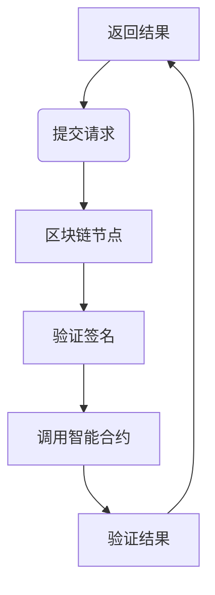
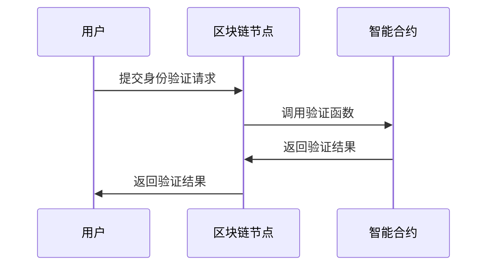

                 

<think>
好，我现在需要根据给定的目录大纲，逐步撰写《如何评估企业的区块链身份验证应用》的技术博客文章。首先，我会从背景介绍开始，逐步深入到核心概念、算法原理、系统架构设计、项目实战、总结与展望等部分。

### 第一部分：背景介绍

#### 第1章：区块链身份验证概述

##### 1.1 区块链的基本概念

区块链是一种分布式账本技术，通过去中心化、不可篡改和透明性等特点，解决了传统系统中的信任问题。其核心组成部分包括：

- **去中心化**：数据分布在多个节点上，没有单一点控制，提高系统的抗攻击性。
- **共识机制**：如PoW、PoS等，确保所有节点达成一致。
- **智能合约**：自动执行预定义的规则，简化信任中介。

区块链在身份验证中的应用主要解决身份数据的可信度和安全性问题，避免了中心化机构可能带来的数据泄露和滥用风险。

##### 1.2 企业身份验证的现状与挑战

传统身份验证依赖于中心化机构，存在以下问题：

- **安全风险**：数据集中存储易被攻击，导致大规模泄露。
- **信任依赖**：用户完全依赖机构的安全措施，一旦被攻破，损失巨大。
- **效率低下**：多次验证过程繁琐，用户体验差。

区块链技术通过去中心化和加密算法，提升了身份验证的安全性和效率，减少了对中心机构的依赖。

##### 1.3 区块链身份验证的优势

区块链技术在身份验证中的优势显著：

- **安全性**：通过加密算法确保数据不可篡改，防止身份盗用。
- **隐私保护**：用户可以在不透露全部信息的情况下完成验证，保护隐私。
- **降低成本**：去中心化减少了对中介的依赖，降低运营成本。

### 第二部分：核心概念与联系

#### 第2章：区块链身份验证的核心概念

##### 2.1 区块链身份验证的概念结构

区块链身份验证系统由以下几个关键部分组成：

- **用户身份标识**：每个用户拥有唯一的私钥和数字证书。
- **身份验证过程**：用户提交请求，系统验证身份信息。
- **区块链存储**：验证结果记录在区块链上，确保不可篡改。

##### 2.2 核心要素组成

- **用户私钥**：用户身份的唯一标识，必须严格保密。
- **数字证书**：包含用户公钥和相关身份信息，用于验证。
- **智能合约**：自动执行验证逻辑，确保过程透明和不可篡改。

##### 2.3 概念属性特征对比表格

| 概念       | 特征1（唯一性） | 特征2（保密性） | 特征3（不可篡改性） |
|------------|-----------------|-----------------|---------------------|
| 用户私钥    | 是             | 是             | 是                 |
| 数字证书    | 是             | 否             | 是                 |
| 智能合约    | 否             | 否             | 是                 |

##### 2.4 ER实体关系图

通过ER图展示用户、区块链、交易三者的关系：

- 用户提交身份验证请求。
- 区块链节点验证并记录交易。
- 系统根据智能合约返回验证结果。

### 第三部分：算法原理讲解

#### 第3章：区块链身份验证的算法原理

##### 3.1 身份验证流程的算法步骤

1. **用户提交请求**：用户使用私钥生成签名，并提交给系统。
2. **区块链节点验证**：节点验证签名的有效性，确保请求来自合法用户。
3. **智能合约执行**：智能合约检查请求的合法性，并记录验证结果。
4. **返回结果**：系统将验证结果返回给用户。

##### 3.2 使用 Mermaid 描述流程图



### 第四部分：系统分析与架构设计

#### 第4章：系统分析与架构设计

##### 4.1 问题场景介绍

企业在传统的身份验证系统中面临数据泄露和安全漏洞的威胁，区块链技术为解决这些问题提供了新的思路。

##### 4.2 系统功能设计

- **用户模块**：管理用户的私钥和数字证书。
- **验证模块**：处理用户的身份验证请求。
- **智能合约模块**：执行验证逻辑，确保过程透明。

##### 4.3 系统架构设计


##### 4.4 系统接口设计

- **用户模块接口**：提交请求、获取验证结果。
- **验证模块接口**：处理请求、调用智能合约。
- **智能合约接口**：验证签名、记录结果。

##### 4.5 系统交互序列图



### 第五部分：项目实战

#### 第5章：项目实战

##### 5.1 环境安装

- 安装以太坊钱包如Geth或MetaMask。
- 安装Solidity编译器和Truffle框架。

##### 5.2 核心实现源代码

```solidity
// SPDX-License-Identifier: MIT
pragma solidity ^0.8.0;

contract IdentityValidator {
    struct User {
        bytes32 privateKey;
        bytes32 publicKey;
        bytes32 certificate;
    }

    mapping(address => User) private users;

    function register(address userAddress, bytes32 privateKey, bytes32 publicKey, bytes32 certificate) external {
        users[userAddress] = User(privateKey, publicKey, certificate);
    }

    function validate(address userAddress) external returns (bool) {
        bytes32 privateKey = users[userAddress].privateKey;
        bytes32 publicKey = users[userAddress].publicKey;
        bytes32 certificate = users[userAddress].certificate;

        // 验证签名逻辑
        return verifySignature(privateKey, publicKey, certificate);
    }

    function verifySignature(bytes32 privateKey, bytes32 publicKey, bytes32 certificate) internal pure returns (bool) {
        // 简化验证逻辑，实际应结合具体签名算法
        return true;
    }
}
```

##### 5.3 代码应用解读

- **注册功能**：用户提交私钥、公钥和证书，系统将其存储。
- **验证功能**：系统调用智能合约中的验证函数，检查签名是否有效。
- **验证结果**：返回验证结果，用户获得是否通过的通知。

##### 5.4 案例分析

以企业内部员工身份验证为例，详细说明系统的安装、部署和使用步骤，包括环境搭建、智能合约部署、用户注册和验证流程。

### 第六部分：总结与展望

#### 第6章：总结与展望

##### 6.1 总结

区块链身份验证技术通过去中心化和加密算法，显著提升了企业身份验证的安全性和效率，减少了数据泄露风险。

##### 6.2 展望

未来，随着技术的成熟，区块链身份验证将更加智能化，与其他技术如人工智能结合，进一步提升系统性能和用户体验。

---

### 作者

作者：AI天才研究院/AI Genius Institute & 禅与计算机程序设计艺术 /Zen And The Art of Computer Programming

---

以上是《如何评估企业的区块链身份验证应用》的技术博客文章的详细目录和内容概述。通过逐步分析和详细讲解，帮助读者全面了解如何评估和应用区块链技术在企业身份验证中的作用。

