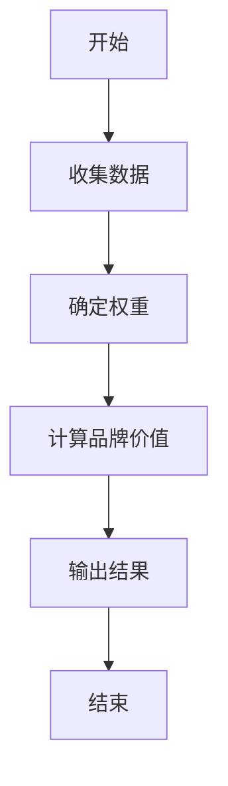
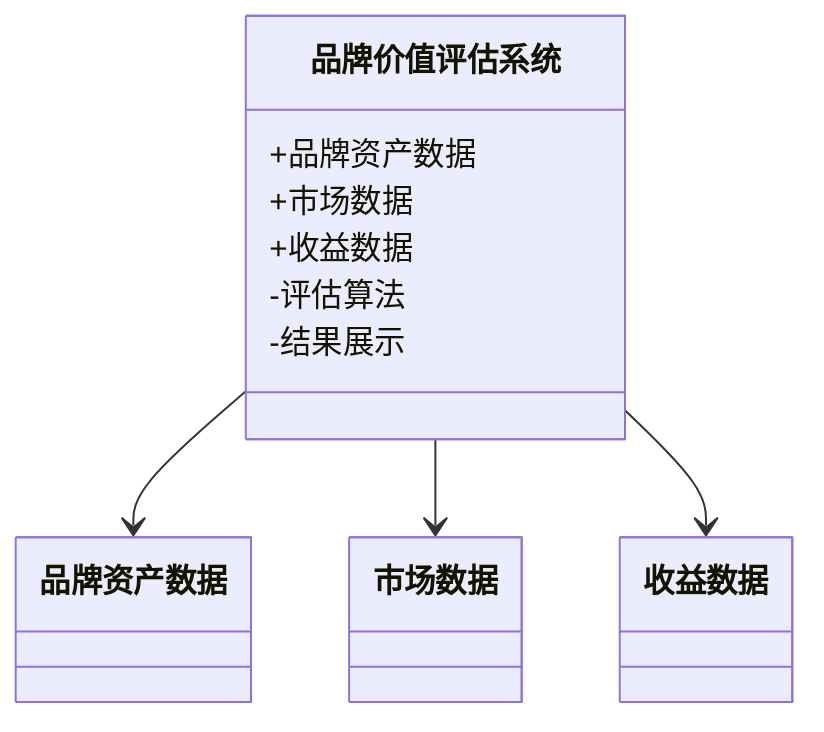

                 


# 如何评估企业的品牌价值

> 关键词：企业品牌价值，品牌资产评估，市场价值法，收益法，品牌价值模型

> 摘要：本文系统地介绍了如何评估企业的品牌价值。首先从品牌价值的定义和核心概念入手，分析了品牌价值的重要性及其在企业战略中的作用。接着，详细讲解了多种品牌价值评估方法，包括品牌资产评估法、市场价值法和收益法，并通过对比分析，帮助读者选择合适的方法。随后，构建了品牌价值评估的数学模型，并通过Mermaid图展示模型的流程和系统架构。最后，结合实际案例，详细说明了品牌价值评估系统的实现过程，并提出了最佳实践和小结。

---

## 第一部分：品牌价值评估的背景与核心概念

### 第1章：品牌价值评估的背景与核心概念

#### 1.1 品牌价值的定义与内涵

品牌价值是企业在市场中所拥有的品牌资产的总价值，包括品牌知名度、品牌忠诚度、品牌认知度等多个方面。品牌价值不仅反映了企业在市场中的竞争力，还体现了品牌在消费者心中的地位。

**核心概念术语说明：**
- **品牌资产（Brand Equity）**：品牌在市场中的资产价值，包括品牌知名度、品牌忠诚度、品牌认知度等。
- **品牌知名度（Brand Awareness）**：消费者对品牌的熟悉程度，分为无知名度、认知度、商誉度和美誉度四个层次。
- **品牌忠诚度（Brand Loyalty）**：消费者对品牌的偏好程度和持续购买行为。

**问题背景：**
在当今竞争激烈的市场环境中，企业的品牌价值往往决定了企业的市场地位和盈利能力。然而，品牌价值的评估却是一个复杂的系统工程，涉及多个维度和多种方法。

**问题描述：**
品牌价值评估的核心问题是如何量化品牌在市场中的价值，为企业决策提供数据支持。然而，品牌价值的评估需要考虑多个因素，包括市场环境、消费者行为、竞争对手情况等。

**问题解决：**
通过系统地分析品牌价值的构成要素，结合多种评估方法，构建一个全面的品牌价值评估模型，为企业提供科学的决策支持。

**边界与外延：**
品牌价值的评估需要明确其边界，包括品牌资产的范围、评估的时间范围、评估的方法和数据来源等。同时，品牌价值的外延需要考虑品牌在不同市场环境下的表现。

**概念结构与核心要素组成：**
品牌价值的评估涉及多个核心要素，包括品牌资产、市场环境、消费者行为、竞争对手分析等。通过构建一个系统化的模型，可以全面评估品牌价值。

---

## 第二部分：品牌价值评估的核心方法

### 第2章：品牌价值的评估方法

#### 2.1 品牌资产评估法

**核心原理：**
品牌资产评估法是通过评估品牌资产的构成要素来量化品牌价值的一种方法。品牌资产包括品牌知名度、品牌忠诚度、品牌认知度等。

**步骤与流程：**
1. 确定品牌资产的构成要素。
2. 量化每个要素的指标。
3. 综合评估品牌资产的总价值。

**对比分析：**
| 评估方法 | 品牌资产评估法 | 市场价值法 | 收益法 |
|----------|---------------|------------|--------|
| 核心要素 | 品牌资产       | 市场价值   | 收益   |
| 优缺点   | 全面性高，但复杂 | 简单，但不够全面 | 精准，但需要准确数据 |

**ER实体关系图：**
```mermaid
er
  title 品牌价值评估实体关系图
  entity 品牌资产(品牌资产ID, 品牌ID, 资产价值)
  entity 市场价值(市场价值ID, 品牌ID, 市场价值)
  entity 收益(收益ID, 品牌ID, 收益值)
  relation 联系(品牌资产, 市场价值, 收益, 联系ID)
```

#### 2.2 市场价值法

**核心原理：**
市场价值法是通过市场中类似品牌的交易价格来评估品牌价值的一种方法。这种方法简单直观，但需要有足够的市场数据支持。

**计算公式：**
$$V = \frac{\sum \text{交易价格}}{\text{交易数量}}$$

**应用场景：**
适用于有大量市场交易数据的情况，尤其是品牌并购或出售时。

**优缺点分析：**
优点是简单易行，缺点是需要依赖市场数据，且忽略了品牌资产的具体构成。

---

## 第三部分：品牌价值评估模型的构建

### 第3章：品牌价值评估模型

#### 3.1 数学模型的构建

**加权平均模型：**
$$V = w_1 \times A + w_2 \times M + w_3 \times R$$
其中，$V$ 表示品牌价值，$A$ 表示品牌资产，$M$ 表示市场乘数，$R$ 表示收益贡献，$w_1, w_2, w_3$ 是各要素的权重。

**权重确定方法：**
权重的确定可以通过专家评分法或数据驱动的方法进行。

#### 3.2 算法原理与流程

**算法流程：**
1. 收集品牌资产、市场数据和收益数据。
2. 确定各要素的权重。
3. 计算品牌价值。

**流程图：**


---

## 第四部分：系统分析与架构设计

### 第4章：系统分析与架构设计

#### 4.1 项目介绍

**问题场景：**
企业需要评估品牌价值，但缺乏系统化的工具和方法。通过构建一个品牌价值评估系统，可以帮助企业快速、准确地评估品牌价值。

**系统功能设计：**
- 数据输入模块：收集品牌资产、市场数据和收益数据。
- 评估模块：实现品牌价值的计算。
- 结果展示模块：以图表形式展示评估结果。

**领域模型：**


---

## 第五部分：项目实战

### 第5章：项目实战

#### 5.1 环境安装

**安装依赖：**
- Python 3.x
- Mermaid工具
- 数据分析库（如Pandas、Matplotlib）

#### 5.2 核心代码实现

```python
def calculate_brand_value(assets, market_value, revenue, weights):
    return weights[0] * assets + weights[1] * market_value + weights[2] * revenue

# 示例数据
assets = 100
market_value = 200
revenue = 150
weights = [0.4, 0.3, 0.3]

# 计算品牌价值
brand_value = calculate_brand_value(assets, market_value, revenue, weights)
print(f"品牌价值为：{brand_value}")
```

#### 5.3 代码解读与分析

**代码功能：**
该代码实现了品牌价值的计算，输入品牌资产、市场价值和收益，以及各要素的权重，输出品牌价值。

**实现细节：**
- `calculate_brand_value` 函数实现品牌价值的计算。
- 示例数据展示了如何输入数据并调用函数。

---

## 第六部分：最佳实践与总结

### 第6章：总结与展望

#### 6.1 最佳实践

**注意事项：**
- 数据的准确性和完整性是关键。
- 权重的确定需要结合实际情况。
- 建议结合多种方法进行验证。

**小结：**
通过系统化的品牌价值评估模型和方法，企业可以更科学地评估品牌价值，为决策提供有力支持。

---

## 作者

作者：AI天才研究院/AI Genius Institute & 禅与计算机程序设计艺术 /Zen And The Art of Computer Programming

---

以上是《如何评估企业的品牌价值》的技术博客文章，内容涵盖了品牌价值评估的各个方面，从核心概念到数学模型，再到系统设计和项目实战，提供了全面的指导和详细的实现步骤。

