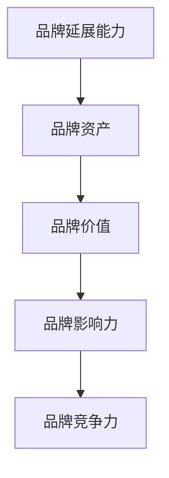
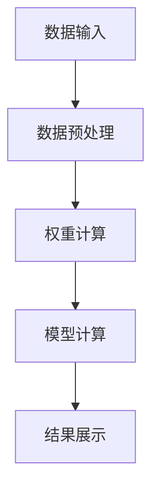
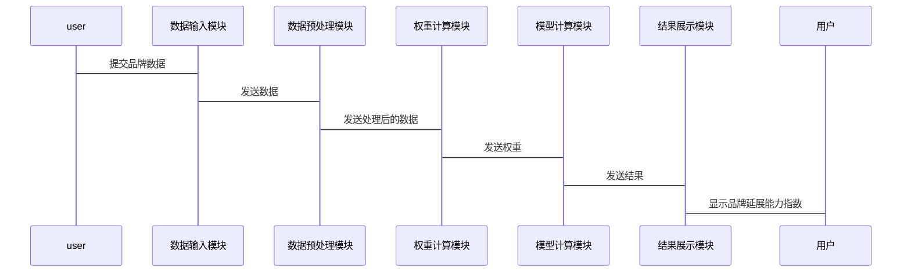

                 


# 如何评估企业的品牌延展能力

## 关键词：品牌延展能力，品牌价值，市场竞争力，品牌资产，品牌管理

## 摘要：  
本文详细探讨了如何评估企业的品牌延展能力。品牌延展能力是指企业在不改变核心品牌价值的前提下，扩展其产品线、市场覆盖范围或品牌影响力的能力。本文从核心概念、评估模型、算法原理、系统架构设计、项目实战等多个维度展开分析，结合实际案例和代码实现，为企业提供一套科学的品牌延展能力评估体系。

---

# 第一部分: 企业品牌延展能力评估背景与核心概念

## 第1章: 企业品牌延展能力的背景与问题背景

### 1.1 什么是品牌延展能力
#### 1.1.1 品牌延展能力的定义  
品牌延展能力是指企业在保持核心品牌价值的同时，通过创新、并购、合作等方式，将品牌扩展到新的产品类别、市场区域或用户群体的能力。它是企业实现可持续增长和市场扩张的重要手段。

#### 1.1.2 品牌延展能力的核心要素  
- **品牌知名度**：品牌在目标市场中的认知程度。  
- **品牌美誉度**：品牌在用户心中的良好形象。  
- **品牌联想**：用户对品牌的联想和记忆。  
- **市场适应性**：品牌在不同市场环境中的适应能力。  

#### 1.1.3 品牌延展能力的边界与外延  
品牌延展能力的边界在于不改变品牌的核心价值，但可以扩展到新的市场、产品或用户群体。其外延包括品牌创新、品牌合作、品牌并购等多种形式。

### 1.2 企业品牌延展能力的重要性
#### 1.2.1 品牌延展能力对企业战略的意义  
品牌延展能力是企业战略的重要组成部分，决定了企业是否能够通过多元化发展实现长期增长。

#### 1.2.2 品牌延展能力与企业市场竞争力的关系  
品牌延展能力越强，企业的市场竞争力越强，能够更好地应对市场竞争和变化。

#### 1.2.3 品牌延展能力对品牌资产的影响  
品牌延展能力直接影响品牌资产的价值，包括品牌知名度、美誉度和用户忠诚度。

---

## 第2章: 企业品牌延展能力的核心概念与联系

### 2.1 核心概念原理
#### 2.1.1 品牌延展能力的理论基础  
品牌延展能力的理论基础包括品牌管理、市场扩展和企业战略管理。

#### 2.1.2 品牌延展能力的关键驱动因素  
- 品牌知名度  
- 品牌美誉度  
- 市场需求  
- 竞争环境  

#### 2.1.3 品牌延展能力与品牌价值的关系  
品牌延展能力是品牌价值的重要组成部分，直接影响品牌价值的提升。

### 2.2 核心概念对比分析
#### 2.2.1 品牌延展能力与品牌忠诚度的对比  
品牌延展能力关注品牌的扩展性，而品牌忠诚度关注用户对品牌的忠诚度。

#### 2.2.2 品牌延展能力与品牌知名度的对比  
品牌延展能力关注品牌的扩展能力，而品牌知名度关注品牌的认知度。

#### 2.2.3 品牌延展能力与品牌创新力的对比  
品牌延展能力关注品牌的扩展性，而品牌创新力关注品牌的创新能力。

### 2.3 实体关系图


---

# 第二部分: 企业品牌延展能力评估模型与算法

## 第3章: 企业品牌延展能力评估模型

### 3.1 评估模型的设计思路
#### 3.1.1 模型目标  
评估品牌延展能力的指数，帮助企业制定品牌扩展策略。

#### 3.1.2 模型输入  
- 品牌知名度（权重：0.4）  
- 品牌美誉度（权重：0.3）  
- 市场需求（权重：0.2）  
- 竞争环境（权重：0.1）  

#### 3.1.3 模型输出  
- 品牌延展能力指数  

### 3.2 评估模型的数学公式
#### 3.2.1 品牌延展能力指数公式  
$$ \text{品牌延展能力指数} = 0.4x_1 + 0.3x_2 + 0.2x_3 + 0.1x_4 $$  
其中，$x_1$ 表示品牌知名度评分，$x_2$ 表示品牌美誉度评分，$x_3$ 表示市场需求评分，$x_4$ 表示竞争环境评分。

#### 3.2.2 品牌延展能力与品牌价值的关系公式  
$$ \text{品牌价值} = f(\text{品牌延展能力}, \text{品牌忠诚度}, \text{品牌知名度}) $$

---

## 第4章: 算法原理与实现

### 4.1 算法原理
#### 4.1.1 基于权重的综合评价法  
通过给各个因素分配权重，综合计算品牌延展能力指数。

#### 4.1.2 基于因子分析的模型构建  
使用因子分析法提取品牌延展能力的核心因子。

#### 4.1.3 基于层次分析法（AHP）的权重分配  
通过层次分析法确定各个因素的权重。

### 4.2 算法实现步骤
#### 4.2.1 数据收集与预处理  
收集品牌知名度、美誉度、市场需求和竞争环境的数据。

#### 4.2.2 权重分配  
使用层次分析法确定各个因素的权重。

#### 4.2.3 模型计算  
根据权重和评分，计算品牌延展能力指数。

#### 4.2.4 模型验证  
通过实际案例验证模型的准确性。

---

## 第5章: 系统分析与架构设计方案

### 5.1 问题场景介绍  
企业需要评估品牌延展能力，以便制定品牌扩展策略。

### 5.2 系统功能设计  
- 数据输入模块  
- 权重计算模块  
- 模型计算模块  
- 结果展示模块  

### 5.3 系统架构设计  


### 5.4 系统接口设计  
- 数据接口：RESTful API  
- 计算接口：Python函数  

### 5.5 系统交互流程  


---

## 第6章: 项目实战

### 6.1 环境安装  
- 安装Python  
- 安装相关库（如pandas、numpy、scipy）  

### 6.2 核心代码实现
```python
import pandas as pd
from sklearn.decomposition import FactorAnalysis

# 数据输入
data = pd.DataFrame({
    '品牌': ['A', 'B', 'C', 'D'],
    '品牌知名度': [0.8, 0.7, 0.9, 0.6],
    '品牌美誉度': [0.9, 0.8, 0.7, 0.8],
    '市场需求': [0.7, 0.6, 0.8, 0.5],
    '竞争环境': [0.3, 0.4, 0.2, 0.5]
})

# 权重计算（层次分析法）
weights = [0.4, 0.3, 0.2, 0.1]

# 模型计算
data['品牌延展能力指数'] = data.apply(lambda x: sum(weights[i] * x[i] for i in range(4)), axis=1)

# 结果展示
print(data)
```

### 6.3 案例分析
以某品牌为例，计算其品牌延展能力指数，并分析其市场扩展潜力。

### 6.4 项目小结  
总结项目实现过程，提出改进建议。

---

# 第三部分: 总结与展望

## 第7章: 总结与最佳实践

### 7.1 最佳实践 tips  
- 定期评估品牌延展能力  
- 根据市场变化调整权重  
- 结合实际案例进行验证  

### 7.2 小结  
本文从理论到实践，全面分析了如何评估企业的品牌延展能力，并通过代码实现和案例分析，为企业提供了实用的评估方法。

### 7.3 注意事项  
- 数据的准确性和完整性  
- 权重的合理分配  
- 模型的适用性和可扩展性  

### 7.4 拓展阅读  
- 品牌管理相关书籍  
- 市场分析相关文献  

---

# 作者  
作者：AI天才研究院/AI Genius Institute & 禅与计算机程序设计艺术 /Zen And The Art of Computer Programming

