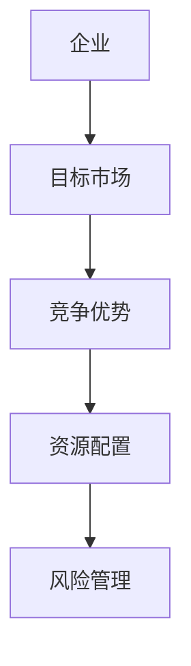
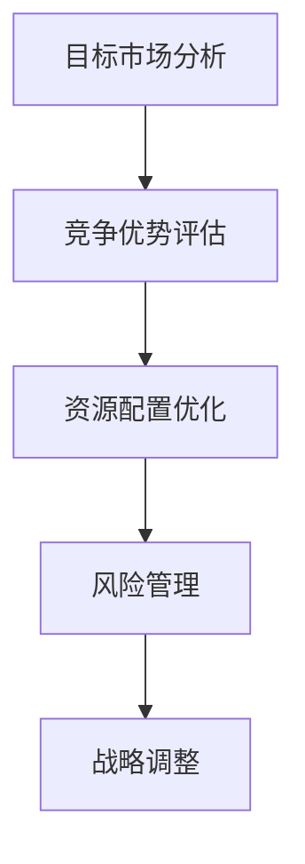

                 

# 如何评估企业的国际化战略

> **关键词**：企业国际化战略、评估方法、风险管理、市场分析、竞争优势、战略调整、实施监控  
> **摘要**：国际化战略是企业在全球化背景下实现可持续发展的重要手段。本文从核心概念、评估方法、风险管理、实施监控等方面，详细阐述了如何科学评估和优化企业的国际化战略。通过系统分析和实际案例，帮助企业在复杂的国际环境中制定切实可行的战略规划，提升国际市场竞争力。

---

## 第一部分：企业国际化战略的背景与核心概念

### 第1章：国际化战略的定义与背景

#### 1.1 什么是企业国际化战略
企业国际化战略是指企业在全球化市场中，通过跨国家运营、资源配置和市场拓展，实现全球竞争优势的战略选择。它不仅仅是将产品或服务出口到海外市场，而是通过跨国经营、文化融合和全球资源配置，构建全球化业务生态。

**核心要素**：
- **目标市场**：明确国际化的目标市场，包括地理、经济、文化和法律环境的分析。
- **竞争优势**：识别企业在目标市场的核心竞争力，包括成本、质量、品牌和技术优势。
- **资源配置**：在全球范围内优化资源配置，包括人才、资金和技术。
- **风险管理**：识别和应对国际化过程中的政治、经济、法律和文化风险。

#### 1.2 企业国际化战略的背景
随着全球经济一体化的加速，企业国际化战略已经成为企业实现增长和竞争优势的重要手段。以下是从背景、重要性、机会和挑战三方面进行详细阐述：

**背景**：
- 全球化分工与合作的深化，企业需要在全球范围内配置资源。
- 区域经济一体化（如欧盟、RCEP）为企业提供了更广阔的市场空间。
- 数字化转型推动企业国际化，互联网和信息技术降低了跨国运营的成本。

**重要性**：
- 提升企业的市场占有率和品牌影响力。
- 优化资源配置，降低生产成本。
- 拓展新的增长点，分散市场风险。

**机会和挑战**：
- **机会**：新兴市场的需求增长、技术共享和全球产业链整合。
- **挑战**：国际市场竞争加剧、法律法规复杂、文化差异和地缘政治风险。

---

### 第2章：国际化战略的核心概念与联系

#### 2.1 核心概念原理
国际化战略的核心在于通过全球资源配置和跨文化管理，实现企业的可持续发展。以下是从概念原理、属性特征和实体关系图三个维度进行详细分析：

**概念原理**：
- 国际化战略是企业在全球范围内实现价值最大化的过程。
- 它不仅涉及市场拓展，还包括组织结构、文化管理和风险管理的重构。

**属性特征对比表**：

| 特性       | 国内战略           | 国际化战略         |
|------------|--------------------|--------------------|
| 市场范围     | 本地市场           | 全球市场           |
| 竞争分析     | 本地竞争对手       | 全球竞争对手       |
| 风险因素     | 政策、经济         | 政治、经济、文化、法律 |
| 资源配置     | 本地资源配置       | 全球资源配置       |

**实体关系图（Mermaid流程图）**：

---

## 第二部分：国际化战略的评估方法与工具

### 第3章：国际化战略的评估方法与工具

#### 3.1 评估方法概述
企业国际化战略的评估需要结合定量和定性分析方法，以下从SWOT分析法、PEST分析法和竞争对手分析法三个方面展开：

**SWOT分析法**：
- **优势（Strengths）**：企业在目标市场的核心竞争力，如品牌、技术、成本优势。
- **劣势（Weaknesses）**：企业在国际化过程中可能面临的内部问题，如管理能力不足。
- **机会（Opportunities）**：目标市场的发展潜力和增长空间。
- **威胁（Threats）**：国际市场竞争、政策变化和经济波动等外部风险。

**PEST分析法**：
- **政治因素（Political）**：目标市场的政治稳定性、贸易政策和税收政策。
- **经济因素（Economic）**：经济周期、通货膨胀和汇率波动。
- **社会因素（Social）**：文化差异、消费者偏好和人口结构。
- **技术因素（Technological）**：技术创新、技术壁垒和知识产权保护。

**竞争对手分析法**：
- 通过分析竞争对手的市场地位、产品策略和竞争优势，明确企业在目标市场的定位。

#### 3.2 工具与模型
**国际化战略评估模型（Mermaid流程图）**：

**数学模型与公式**：
企业在目标市场的市场潜力可以表示为：
$$ \text{市场潜力} = \text{市场规模} \times \text{增长潜力} \times \text{竞争强度} $$

---

## 第三部分：国际化战略的风险管理与应对

### 第4章：国际化战略的风险管理与应对

#### 4.1 风险识别与评估
企业在国际化过程中可能面临以下风险：
- **政治风险**：政策变化、贸易壁垒和地缘政治冲突。
- **经济风险**：汇率波动、通货膨胀和经济衰退。
- **法律风险**：国际法律差异、税收政策和知识产权保护。
- **文化风险**：文化差异、消费者偏好和员工管理。

**风险评估模型**：
$$ \text{风险评分} = \sum (\text{风险因素} \times \text{权重}) $$

#### 4.2 风险应对策略
- **风险规避**：通过市场调研和政策分析，避免进入高风险市场。
- **风险转移**：通过保险、合资企业和合作伙伴分担风险。
- **风险缓解**：通过优化供应链、提高产品质量和加强风险管理能力降低风险。

---

## 第四部分：国际化战略的实施与监控

### 第5章：国际化战略的实施与监控

#### 5.1 实施计划制定
**目标分解与任务分配**：
- 将国际化战略分解为具体目标，如市场进入、产品推广和团队建设。
- 根据团队能力分配任务，明确责任人和时间节点。

**项目管理方法**：
- 使用敏捷开发或瀑布模型进行项目管理，确保按时完成目标。

**关键里程碑设定**：
- 明确每个阶段的关键里程碑，如市场进入、产品上市和业绩达标。

#### 5.2 监控与调整
**监控指标与KPI设定**：
- 收入增长率、市场份额、利润率和客户满意度。
- 使用KPI dashboard进行实时监控和分析。

**定期评估与反馈**：
- 每季度进行战略评估，根据市场反馈和内部数据调整战略。

**战略调整与优化**：
- 根据评估结果优化市场策略、产品定位和资源配置。

---

## 第五部分：案例分析与实际应用

### 第6章：案例分析与实际应用

#### 6.1 案例分析
**案例一：某科技公司国际化战略调整**
- **背景**：公司计划进入东南亚市场，但面临文化差异和竞争加剧的问题。
- **评估**：通过SWOT分析发现，公司在技术上有优势，但品牌知名度和渠道资源不足。
- **调整策略**：通过与本地企业合作，加大品牌推广力度，优化产品定价策略。

**案例二：某制造企业全球化布局**
- **背景**：公司通过跨国并购和本地化生产降低成本。
- **评估**：通过PEST分析发现，目标市场存在政策风险和经济不确定性。
- **应对措施**：建立风险管理团队，制定应急预案。

---

## 第六部分：应对挑战与未来趋势

### 第7章：应对挑战与未来趋势

#### 7.1 应对挑战
**国际化战略中的挑战**：
- **文化差异**：需要通过跨文化培训和本地化管理解决。
- **法律差异**：通过法律咨询和合规管理应对。
- **地缘政治风险**：通过多元化布局和风险对冲降低风险。

#### 7.2 未来趋势
**国际化战略的未来趋势**：
- **数字化转型**：通过大数据、人工智能和区块链技术优化国际化战略。
- **可持续发展**：绿色生产和社会责任将成为国际化战略的重要组成部分。
- **生态系统建设**：构建全球合作伙伴生态系统，实现协同创新。

---

## 第七部分：总结与建议

### 第8章：总结与建议

#### 8.1 总结
国际化战略是企业在全球化竞争中实现可持续发展的关键。通过科学的评估方法、有效的风险管理、合理的资源配置和持续的战略调整，企业可以在全球市场中获得竞争优势。

#### 8.2 建议
- **持续学习**：关注国际市场的动态和政策变化，及时调整战略。
- **加强合作**：与跨国企业和国际组织合作，共享资源和经验。
- **注重创新**：通过技术创新和管理创新应对国际市场的挑战。

---

## 作者简介

作者：AI天才研究院/AI Genius Institute & 禅与计算机程序设计艺术 /Zen And The Art of Computer Programming

---

通过以上结构，文章内容涵盖了企业国际化战略的评估方法、风险管理、实施监控和未来趋势等方面，确保内容全面且具有实际指导意义。

