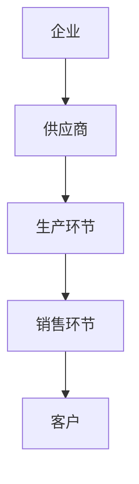
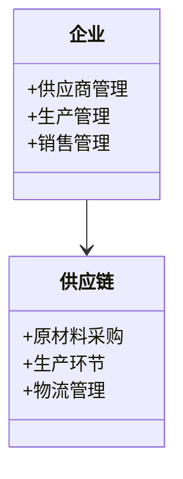
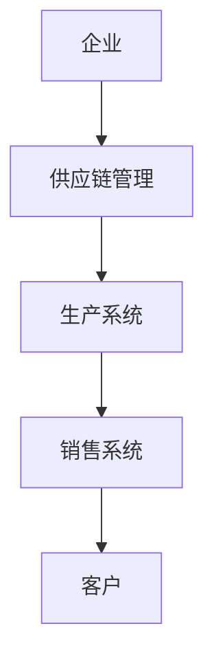

                 

# 如何评估企业的垂直整合价值

---

## 关键词：
垂直整合，企业价值，供应链管理，成本分析，协同效应，风险管理，系统架构

---

## 摘要：
垂直整合是企业优化价值链的重要策略，通过整合从原材料到最终产品的整个生产链，企业可以提升效率、降低成本并增强竞争力。本文详细分析了垂直整合的核心概念、评估方法、系统架构设计及实际案例，为企业提供全面的指导。

---

## 第一部分：企业垂直整合的背景与概念

### 第1章：什么是垂直整合

#### 1.1 垂直整合的定义与核心概念
- **垂直整合的定义**：企业整合从原材料采购到产品销售的整个产业链，以优化资源分配和控制关键环节。
- **核心要素**：涵盖供应链管理、生产流程优化、销售网络整合等。
- **类型与特点**：
  - 前向整合：向下游扩展，控制分销和零售环节。
  - 后向整合：向上游扩展，控制供应商和生产环节。
  - 水平整合：横向扩展，扩大生产规模。

#### 1.2 企业为何选择垂直整合
- **提高效率与控制力**：通过内部化关键环节，减少对外部供应商的依赖。
- **降低供应链风险**：减少外部波动对企业的直接影响。
- **获取竞争优势**：通过整合优化资源，提升整体竞争力。

---

## 第二部分：垂直整合的价值链分析

### 第2章：垂直整合的价值链分析

#### 2.1 价值链的基本概念
- **价值链定义**：企业创造价值的系列活动，包括研发、生产、销售等。
- **构成要素**：原材料采购、生产制造、物流配送、市场营销、售后服务等。
- **优化目标**：通过整合优化各环节，提升整体价值。

#### 2.2 垂直整合对价值链的影响
- **优化价值链**：通过内部化关键环节，减少中间环节的浪费。
- **降低成本**：通过规模效应和内部协同，降低采购和生产成本。
- **提升质量**：整合后能够更好地控制产品质量，确保一致性。

#### 2.3 垂直整合的核心概念与联系
- **实体关系图**：

- **类型对比表**：
| 类型       | 描述                         |
|------------|------------------------------|
| 前向整合   | 向下游延伸，控制销售环节     |
| 后向整合   | 向上游延伸，控制供应环节     |
| 水平整合   | 扩大生产规模，提高效率       |

---

## 第三部分：垂直整合的评估方法

### 第3章：垂直整合的评估方法

#### 3.1 成本分析法
- **整合前的成本分析**：评估当前供应链的成本结构，识别浪费和低效环节。
- **整合后的成本优化**：通过内部化关键环节，降低采购、物流和管理成本。
- **成本优化率计算**：
$$ \text{成本优化率} = \frac{\text{整合前成本} - \text{整合后成本}}{\text{整合前成本}} \times 100\% $$

#### 3.2 协同效应评估
- **协同效应的定义**：整合后各环节之间的协作产生的额外价值。
- **协同效应计算公式**：
$$ \text{协同效应} = \text{整合后的收益} - \text{整合前的收益} $$

#### 3.3 风险评估法
- **风险分类**：包括市场风险、运营风险和财务风险。
- **风险评估步骤**：识别潜在风险，评估其影响，制定应对策略。
- **风险控制策略**：建立应急预案，分散风险，保持灵活性。

---

## 第四部分：垂直整合的系统架构设计

### 第4章：系统架构设计

#### 4.1 系统功能设计
- **领域模型设计**：

- **系统架构图**：

- **系统接口设计**：定义企业内部各系统之间的接口，确保数据流畅传输。

---

## 第五部分：项目实战与总结

### 第5章：项目实战

#### 5.1 案例分析：制造业垂直整合
- **背景**：某制造企业通过整合供应链和生产环节，提升效率和降低成本。
- **实施步骤**：
  1. 评估现有供应链。
  2. 内部化关键生产环节。
  3. 优化物流和销售网络。
- **效果分析**：成本降低15%，生产效率提升20%，产品质量显著提高。

#### 5.2 总结与最佳实践
- **总结**：垂直整合能够有效优化企业价值链，提升整体竞争力。
- **最佳实践**：
  - 逐步推进整合，避免一次性大规模投入。
  - 建立灵活的组织结构，适应变化。
  - 持续监控和优化整合效果。

---

## 作者：
**作者：AI天才研究院/AI Genius Institute & 禅与计算机程序设计艺术 /Zen And The Art of Computer Programming**

---

通过以上结构，文章详细分析了垂直整合的各个方面，结合理论和实际案例，为企业提供切实可行的指导。

