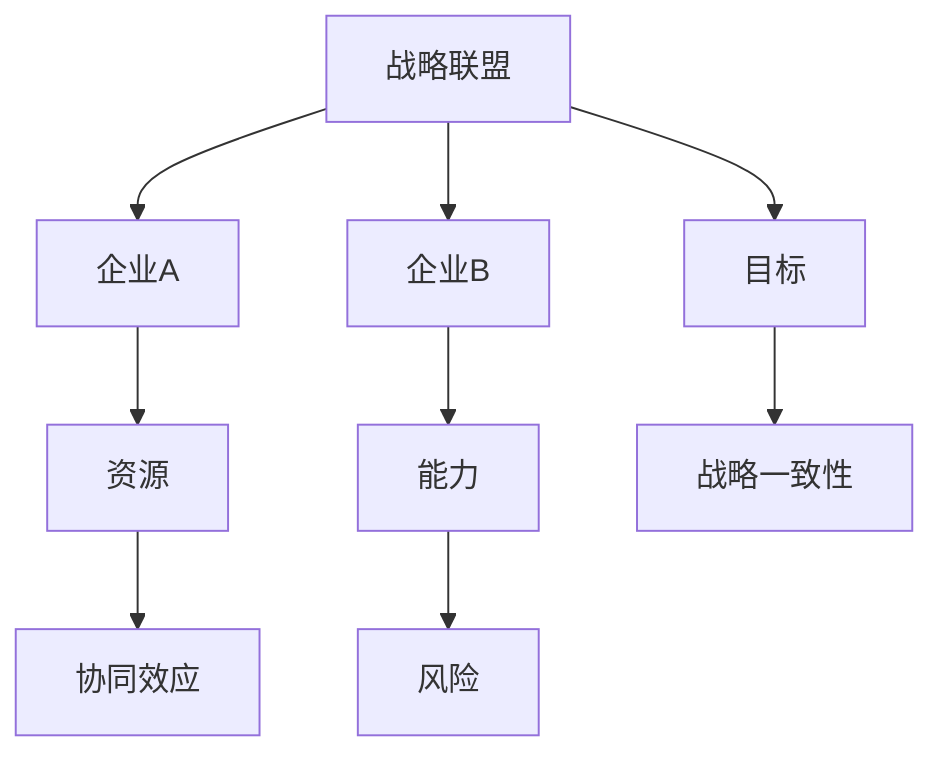
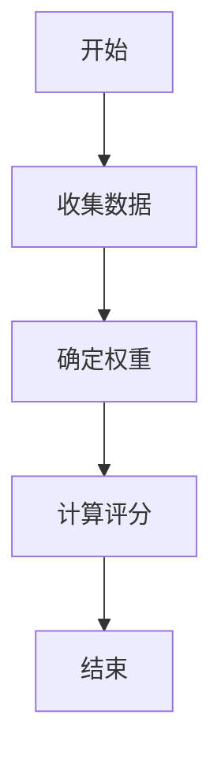
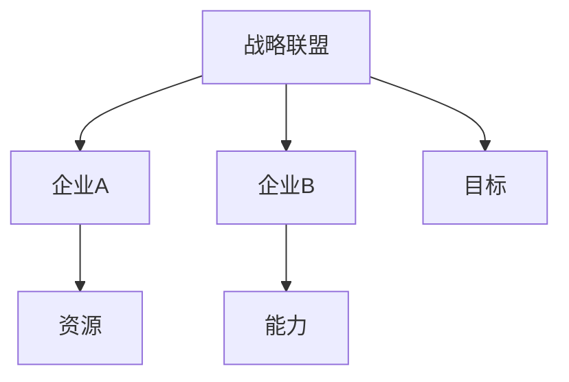
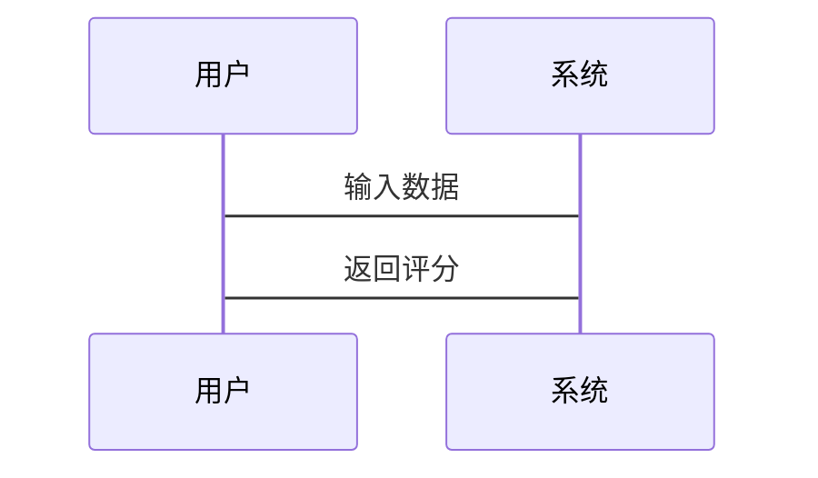

                 


# 如何评估企业的战略联盟价值

## 关键词：战略联盟，价值评估，企业合作，风险管理，协同效应，模型构建

## 摘要：本文详细介绍了如何系统性地评估企业的战略联盟价值。通过背景分析、核心概念、算法原理、数学模型、系统架构设计、项目实战以及最佳实践等多维度的讲解，帮助读者掌握战略联盟价值评估的方法和技巧。文章结合实际案例，深入剖析了评估过程中可能遇到的挑战，并提供了有效的解决方案和优化建议。

---

# 第1章：战略联盟价值评估的背景与问题描述

## 1.1 战略联盟的基本概念

### 1.1.1 战略联盟的定义与特征

战略联盟是指两个或多个企业之间为了实现共同目标而形成的正式合作。其核心特征包括：

- **长期性**：合作期限较长，通常跨越多个项目周期。
- **互惠性**：双方资源共享，优势互补。
- **灵活性**：合作形式多样，可根据市场变化调整。

### 1.1.2 战略联盟的形成背景

- **资源短缺**：单个企业难以独立获取所需资源。
- **竞争加剧**：行业竞争日益激烈，合作成为必然选择。
- **技术创新**：技术复杂性增加，需要多方协作。

### 1.1.3 战略联盟的价值评估意义

- **优化资源配置**：通过评估明确合作是否带来价值。
- **降低合作风险**：提前识别潜在问题，规避损失。
- **提升竞争力**：通过合作增强企业的市场地位。

## 1.2 问题背景与问题描述

### 1.2.1 企业合作中的常见问题

- **目标不一致**：合作双方的战略目标存在冲突。
- **资源分配不均**：资源分配不合理，导致效率低下。
- **信任缺失**：合作双方缺乏信任，影响合作效果。

### 1.2.2 战略联盟价值评估的必要性

- **决策支持**：为企业的合作决策提供数据支持。
- **风险控制**：提前识别和规避潜在风险。
- **持续优化**：通过评估不断优化合作模式。

### 1.2.3 价值评估的目标与范围

- **目标**：量化战略联盟带来的价值，为后续合作提供依据。
- **范围**：涵盖财务、战略、风险等多个维度。

## 1.3 问题解决思路与方法

### 1.3.1 价值评估的基本思路

- **数据收集**：收集合作双方的资源、能力、目标等信息。
- **模型构建**：选择合适的评估模型进行分析。
- **结果解读**：根据评估结果调整合作策略。

### 1.3.2 价值评估的关键步骤

1. 确定评估目标。
2. 收集相关数据。
3. 选择评估模型。
4. 进行评估计算。
5. 解读评估结果。

### 1.3.3 价值评估的边界与外延

- **边界**：仅限于评估合作双方的价值贡献。
- **外延**：可扩展至合作后的长期影响。

## 1.4 战略联盟价值的核心要素

### 1.4.1 联盟的资源与能力

- **资源**：资金、技术、市场等。
- **能力**：研发能力、生产能力等。

### 1.4.2 联盟的目标与战略一致性

- **目标一致性**：合作双方目标是否一致。
- **战略协同**：合作是否符合双方的长期战略。

### 1.4.3 联盟的风险与不确定性

- **市场风险**：市场需求变化带来的风险。
- **运营风险**：合作过程中可能出现的运营问题。

## 1.5 本章小结

本章从战略联盟的基本概念出发，分析了其价值评估的必要性，并提出了系统性的评估思路和方法。

---

# 第2章：战略联盟价值评估的核心概念与联系

## 2.1 战略联盟价值评估模型

### 2.1.1 模型的基本原理

战略联盟价值评估模型通过量化合作双方的资源、能力、目标等因素，计算出合作带来的总体价值。

### 2.1.2 模型的输入与输出

- **输入**：合作双方的资源、能力、目标。
- **输出**：合作的总体价值评分。

### 2.1.3 模型的适用范围

适用于企业间的长期合作评估。

## 2.2 战略联盟价值评估的关键维度

### 2.2.1 财务价值维度

- **收入贡献**：合作带来的收入增加。
- **成本节约**：合作带来的成本降低。

### 2.2.2 战略协同维度

- **资源共享**：资源的充分利用程度。
- **能力互补**：合作双方的能力互补程度。

### 2.2.3 风险与收益维度

- **风险评估**：合作过程中可能的风险。
- **收益预测**：合作带来的预期收益。

## 2.3 模型对比与选择

### 2.3.1 不同模型的对比分析

| 模型名称       | 优点                     | 缺点                     |
|----------------|--------------------------|--------------------------|
| 加权评分法     | 简单易懂                 | 主观性较强               |
| AHP层次分析法  | 结果客观                 | 计算复杂                 |

### 2.3.2 模型选择的依据

- **数据可得性**：数据是否容易获取。
- **计算复杂度**：模型的计算是否复杂。
- **适用性**：模型是否适用于具体场景。

### 2.3.3 模型优化的方向

- **数据优化**：提高数据的准确性。
- **算法优化**：改进模型的计算效率。

## 2.4 战略联盟价值评估的ER实体关系图



---

# 第3章：战略联盟价值评估的算法原理

## 3.1 算法概述

### 3.1.1 算法的基本思路

加权评分法通过为每个评估维度分配权重，计算合作的价值评分。

### 3.1.2 算法的输入与输出

- **输入**：合作双方的资源、能力、目标。
- **输出**：合作的价值评分。

### 3.1.3 算法的优缺点

- **优点**：简单易懂，计算效率高。
- **缺点**：结果可能受主观因素影响。

## 3.2 算法实现步骤

### 3.2.1 数据收集与处理

收集合作双方的资源、能力、目标等数据。

### 3.2.2 模型训练与优化

选择合适的模型并进行参数调整。

### 3.2.3 结果分析与解释

解读评估结果并提出优化建议。

## 3.3 算法的数学模型与公式

### 3.3.1 战略联盟价值的计算公式

$$ V = \sum_{i=1}^{n} w_i \cdot x_i $$

其中，\( V \) 表示合作的价值评分，\( w_i \) 表示第 \( i \) 个维度的权重，\( x_i \) 表示第 \( i \) 个维度的评分。

### 3.3.2 加权评分法的流程图



## 3.4 算法的Python实现

```python
def calculate_value评分(资源, 能力, 目标, 权重):
    return sum(权重[i] * 资源[i] + 权重[i] * 能力[i] + 权重[i] * 目标[i] for i in range(len(权重)))

资源 = [0.8, 0.7, 0.9]
能力 = [0.6, 0.8, 0.7]
目标 = [0.7, 0.8, 0.6]
权重 = [0.3, 0.4, 0.3]

value评分 = calculate_value评分(资源, 能力, 目标, 权重)
print("合作价值评分：", value评分)
```

---

# 第4章：战略联盟价值评估的数学模型

## 4.1 模型的建立与分析

### 4.1.1 模型的数学表达式

$$ V = \sum_{i=1}^{n} w_i \cdot x_i $$

其中，\( V \) 表示合作价值，\( w_i \) 表示权重，\( x_i \) 表示各维度评分。

### 4.1.2 模型的权重分配

| 维度         | 权重 |
|--------------|------|
| 资源         | 0.3  |
| 能力         | 0.4  |
| 目标一致性    | 0.3  |

## 4.2 模型的验证与优化

### 4.2.1 模型的验证方法

- **数据验证**：检查数据的准确性。
- **结果验证**：通过实际案例验证模型的有效性。

### 4.2.2 模型的优化方向

- **权重调整**：根据实际情况调整权重。
- **维度扩展**：增加更多评估维度。

---

# 第5章：战略联盟价值评估的系统分析与架构设计

## 5.1 系统分析

### 5.1.1 问题场景介绍

以科技公司与制造企业的合作为例，分析其战略联盟价值。

### 5.1.2 系统功能设计

- **数据输入模块**：输入合作双方的资源、能力、目标。
- **评估模块**：计算合作价值评分。
- **结果输出模块**：输出评估结果。

### 5.1.3 领域模型类图



## 5.2 系统架构设计

### 5.2.1 系统架构图


### 5.2.2 系统接口设计

- **输入接口**：接收合作双方的资源、能力、目标。
- **输出接口**：输出合作价值评分。

### 5.2.3 系统交互序列图



---

# 第6章：战略联盟价值评估的项目实战

## 6.1 项目环境与工具安装

### 6.1.1 环境要求

- Python 3.6+
- Jupyter Notebook
- 必要的库（如numpy、pandas）

## 6.2 系统核心实现

### 6.2.1 核心代码实现

```python
import numpy as np
import pandas as pd

def calculate_value评分(资源, 能力, 目标, 权重):
    return sum(权重[i] * (资源[i] + 能力[i] + 目标[i]) for i in range(len(权重)))

资源 = [0.8, 0.7, 0.9]
能力 = [0.6, 0.8, 0.7]
目标 = [0.7, 0.8, 0.6]
权重 = [0.3, 0.4, 0.3]

value评分 = calculate_value评分(资源, 能力, 目标, 权重)
print("合作价值评分：", value评分)
```

### 6.2.2 代码功能解读

- **calculate_value评分函数**：计算合作价值评分。
- **数据输入**：资源、能力、目标、权重。
- **结果输出**：合作价值评分。

## 6.3 实际案例分析

### 6.3.1 案例介绍

以科技公司与制造企业的合作为例，评估其战略联盟价值。

### 6.3.2 案例分析

- **资源**：科技公司提供技术，制造企业提供生产设施。
- **能力**：科技公司擅长研发，制造企业擅长生产。
- **目标**：共同开发新产品。

## 6.4 项目小结

本章通过实际案例，详细讲解了战略联盟价值评估的项目实施过程，从环境搭建到代码实现，再到结果解读。

---

# 第7章：战略联盟价值评估的最佳实践与注意事项

## 7.1 最佳实践

### 7.1.1 数据收集

- 确保数据的准确性和完整性。

### 7.1.2 模型选择

- 根据实际情况选择合适的模型。

### 7.1.3 团队协作

- 建立有效的沟通机制，确保合作顺利。

## 7.2 注意事项

### 7.2.1 数据偏差

- 注意数据偏差可能影响评估结果。

### 7.2.2 模型局限

- 模型有一定的局限性，需结合实际情况进行调整。

### 7.2.3 风险管理

- 重视合作中的风险管理。

## 7.3 未来研究方向

- **模型优化**：进一步优化评估模型。
- **数据挖掘**：利用大数据技术提高评估精度。

## 7.4 本章小结

总结了战略联盟价值评估的最佳实践和注意事项，为后续研究提供了方向。

---

# 作者：AI天才研究院/AI Genius Institute & 禅与计算机程序设计艺术 /Zen And The Art of Computer Programming

