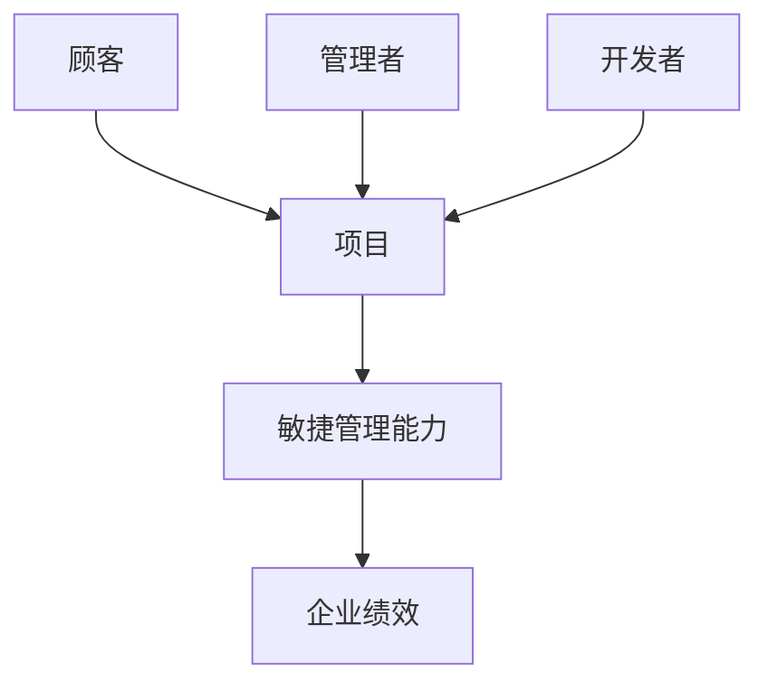

                 


# 如何评估企业的敏捷管理能力价值

## 关键词：企业敏捷管理能力, 评估模型, 敏捷管理, 价值评估, 项目管理, 系统分析, 评估框架

## 摘要：  
本文将深入探讨如何评估企业的敏捷管理能力价值。通过分析敏捷管理的核心概念、评估模型、数学原理、系统架构、工具技术、项目实战及未来趋势，为企业提供一套全面的评估方法。从背景介绍到最佳实践，文章详细阐述了敏捷管理能力的关键要素、实现路径及评估方法，帮助企业更好地优化和提升其敏捷管理能力。

---

# 第1章: 敏捷管理能力的定义与背景

## 1.1 敏捷管理的定义与核心要素

### 1.1.1 敏捷管理的定义  
敏捷管理是一种以快速响应变化、迭代改进为核心理念的管理方法。它强调团队协作、客户合作和持续交付价值，适用于复杂、动态的环境。

### 1.1.2 敏捷管理的核心要素  
1. **迭代开发**：通过短周期迭代（如Scrum中的Sprint）交付可用的产品增量。  
2. **客户合作**：与客户保持持续沟通，确保交付的产品符合需求。  
3. **团队协作**：强调自组织团队，减少层级化管理，提升效率。  
4. **持续改进**：通过回顾会议不断优化流程和交付成果。  

### 1.1.3 敏捷管理与传统管理的区别  
| 属性             | 敏捷管理               | 传统管理               |  
|------------------|-----------------------|-----------------------|  
| 管理方式         | 迭代、自适应           | 线性、固定计划         |  
| 团队结构         | 自组织、扁平化         | 层级化、命令式         |  
| 反馈机制         | 持续反馈、快速响应     | 定期汇报、周期性反馈   |  
| 交付节奏         | 频繁交付、小步快跑     | 阶段性交付、大步慢跑   |  

---

## 1.2 企业敏捷管理能力的背景

### 1.2.1 数字化转型对企业管理的影响  
数字化转型要求企业更加灵活和快速响应市场变化，敏捷管理成为企业生存和发展的关键能力。

### 1.2.2 敏捷管理能力的重要性  
在快节奏的商业环境中，敏捷管理能够帮助企业：  
1. 快速适应市场变化。  
2. 提高团队协作效率。  
3. 降低项目风险。  
4. 提升客户满意度。  

### 1.2.3 敏捷管理能力的边界与外延  
敏捷管理能力不仅限于项目管理，还包括企业整体的组织结构、文化氛围和技术支持。

---

## 1.3 敏捷管理能力的价值链

### 1.3.1 敏捷管理能力的价值构成  
1. **客户价值**：快速交付满足客户需求的产品。  
2. **团队价值**：提升团队的自主性和创造力。  
3. **企业价值**：增强企业的市场竞争力和抗风险能力。  

### 1.3.2 敏捷管理能力的实现路径  
1. **引入敏捷方法论**：如Scrum、看板等。  
2. **培养敏捷文化**：鼓励开放沟通和持续改进。  
3. **优化组织结构**：减少层级，提升团队自治性。  

### 1.3.3 敏捷管理能力的评估维度  
1. **团队协作度**：团队成员的配合程度和问题解决能力。  
2. **交付效率**：项目按时交付的比例和质量。  
3. **客户满意度**：客户对产品或服务的满意程度。  

---

# 第2章: 敏捷管理能力的核心概念与联系

## 2.1 敏捷管理能力的核心概念

### 2.1.1 敏捷管理能力的定义  
敏捷管理能力是指企业在复杂环境中快速响应、持续交付价值的能力。

### 2.1.2 敏捷管理能力的关键属性  
1. **灵活性**：快速调整策略和资源分配。  
2. **协作性**：团队内部和跨部门的高效协作。  
3. **学习性**：从失败中快速学习并优化。  

### 2.1.3 敏捷管理能力的特征对比  
| 特性         | 敏捷管理               | 传统管理               |  
|--------------|-----------------------|-----------------------|  
| 变化应对     | 善于变化和调整         | 偏好稳定和可预测性     |  
| 团队结构     | 扁平化、自组织         | 层级化、命令式         |  
| 客户参与     | 高度参与               | 间接参与               |  

---

## 2.2 敏捷管理能力的ER实体关系图

```mermaid
erDiagram
    actor 顾客 {
        key string 用户ID
        string 用户名
        string 密码
    }
    actor 管理者 {
        key string 管理者ID
        string 管理者名
        string 角色
    }
    actor 开发者 {
        key string 开发者ID
        string 开发者名
        string 技能
    }
    actor 项目 {
        key string 项目ID
        string 项目名称
        string 项目描述
    }
    顾客 o-| 项目
    管理者 o-| 项目
    开发者 o-| 项目
```

---

## 2.3 敏捷管理能力的系统架构



---

## 3. 敏捷管理能力的评估模型与框架

## 3.1 敏捷管理能力的评估模型

### 3.1.1 评估模型概述  
敏捷管理能力的评估模型包括以下几个方面：  
1. **团队协作度**：团队成员的配合程度和问题解决能力。  
2. **交付效率**：项目按时交付的比例和质量。  
3. **客户满意度**：客户对产品或服务的满意程度。  

### 3.1.2 评估模型的数学表达  
我们可以使用以下公式来量化敏捷管理能力的评估指标：

$$
\text{敏捷管理能力} = \frac{\text{团队协作度} + \text{交付效率} + \text{客户满意度}}{3}
$$

其中，团队协作度、交付效率和客户满意度分别用0到1的分数表示。

---

### 3.1.3 评估模型的数学推导  

假设我们有以下三个指标：  
- 团队协作度：$C$  
- 交付效率：$E$  
- 客户满意度：$S$  

则敏捷管理能力的评估公式为：  

$$
\text{敏捷管理能力} = \frac{C + E + S}{3}
$$  

通过这个公式，我们可以将三个指标的分数加权平均，得到一个综合的敏捷管理能力评估值。

---

## 3.2 敏捷管理能力的评估框架

### 3.2.1 评估框架的构建  
敏捷管理能力的评估框架包括以下几个步骤：  
1. **确定评估指标**：选择适合企业实际情况的评估指标。  
2. **收集数据**：通过问卷、访谈等方式收集相关数据。  
3. **数据分析**：使用统计方法对数据进行分析。  
4. **结果解读**：根据分析结果制定改进措施。  

---

## 3.3 敏捷管理能力的评估算法

### 3.3.1 评估算法概述  
我们可以使用以下算法来评估企业的敏捷管理能力：

```python
def assess_agile_management_capability(team_collaboration, delivery_efficiency, customer_satisfaction):
    capability = (team_collaboration + delivery_efficiency + customer_satisfaction) / 3
    return capability
```

### 3.3.2 评估算法的详细步骤  
1. **输入参数**：团队协作度、交付效率、客户满意度。  
2. **计算综合能力**：使用上述公式计算综合能力。  
3. **返回结果**：返回敏捷管理能力的评估值。  

---

## 3.4 敏捷管理能力的评估工具

### 3.4.1 评估工具介绍  
我们可以使用以下工具来辅助敏捷管理能力的评估：  
1. **问卷调查工具**：如SurveyMonkey、Google Forms。  
2. **数据分析工具**：如Excel、Python（Pandas库）。  
3. **敏捷项目管理工具**：如Jira、Trello。  

### 3.4.2 评估工具的使用场景  
1. **数据收集**：使用问卷调查工具收集团队协作度和客户满意度数据。  
2. **数据分析**：使用Python的Pandas库对数据进行清洗和分析。  
3. **结果可视化**：使用Matplotlib或Seaborn库将分析结果可视化。  

---

## 3.5 敏捷管理能力的评估案例

### 3.5.1 案例背景  
某软件开发公司希望通过评估敏捷管理能力来优化其项目管理流程。

### 3.5.2 评估过程  
1. **确定评估指标**：团队协作度、交付效率、客户满意度。  
2. **收集数据**：通过问卷调查收集相关数据。  
3. **计算综合能力**：使用上述算法计算综合能力。  
4. **结果分析**：发现交付效率较低，客户满意度一般。  

### 3.5.3 改进措施  
1. **优化交付流程**：引入持续集成和持续交付（CI/CD）工具。  
2. **提升团队协作**：加强团队成员的技能培训和沟通。  
3. **提高客户满意度**：定期与客户进行需求回顾和反馈。  

---

## 3.6 敏捷管理能力的评估总结

### 3.6.1 评估总结概述  
通过敏捷管理能力的评估，企业可以发现自身在敏捷管理方面的优势和不足，并制定相应的改进措施。

### 3.6.2 评估总结的意义  
1. **优化管理流程**：提升团队协作和交付效率。  
2. **提高客户满意度**：确保产品或服务符合客户需求。  
3. **增强企业竞争力**：在快节奏的商业环境中保持优势。  

---

## 3.7 敏捷管理能力的评估建议

### 3.7.1 评估建议概述  
企业应根据自身的实际情况选择适合的敏捷管理能力评估方法，并定期进行评估和改进。

### 3.7.2 评估建议的详细步骤  
1. **明确评估目标**：确定评估的具体目的和范围。  
2. **选择评估方法**：根据目标选择合适的评估工具和方法。  
3. **收集和分析数据**：通过问卷、访谈等方式收集数据，并进行分析。  
4. **制定改进计划**：根据评估结果制定改进措施，并跟踪执行效果。  

---

## 3.8 敏捷管理能力的评估挑战

### 3.8.1 评估挑战概述  
在评估敏捷管理能力时，企业可能会面临以下挑战：  
1. **数据收集困难**：团队协作度和客户满意度的量化较为复杂。  
2. **评估标准不统一**：不同企业对敏捷管理能力的定义和评估指标可能不同。  
3. **改进措施难以实施**：由于组织结构和文化差异，改进措施的执行可能受到阻碍。  

### 3.8.2 应对挑战的策略  
1. **建立统一的评估标准**：制定适合企业实际情况的评估指标和方法。  
2. **加强数据收集和分析能力**：使用专业的工具和技术进行数据分析。  
3. **推动文化变革**：通过培训和宣传，提升员工对敏捷管理的理解和接受度。  

---

## 3.9 敏捷管理能力的评估未来展望

### 3.9.1 评估未来趋势  
随着数字化转型的深入，敏捷管理能力的评估将更加注重数据驱动和智能化。

### 3.9.2 未来研究方向  
1. **人工智能辅助评估**：利用AI技术进行数据预测和分析。  
2. **敏捷管理能力的动态评估**：根据市场变化和客户需求，实时调整评估指标。  
3. **跨行业经验借鉴**：研究不同行业的敏捷管理能力评估方法，形成通用框架。  

---

## 4. 敏捷管理能力的评估指标与方法

---

## 4.1 敏捷管理能力的评估指标

### 4.1.1 团队协作度  
团队协作度是衡量敏捷管理能力的重要指标之一。我们可以通过以下步骤来评估团队协作度：  

1. **定义团队协作度的评估标准**：如任务完成度、团队成员的满意度等。  
2. **收集数据**：通过问卷调查、访谈等方式收集团队协作度的数据。  
3. **计算团队协作度的得分**：使用以下公式计算团队协作度的得分：  

$$
\text{团队协作度得分} = \frac{\text{任务完成度} + \text{团队成员满意度}}{2}
$$  

---

### 4.1.2 交付效率  
交付效率是敏捷管理能力的另一个重要指标。我们可以通过以下步骤来评估交付效率：  

1. **定义交付效率的评估标准**：如按时交付的比例、交付质量等。  
2. **收集数据**：记录项目交付的时间和质量数据。  
3. **计算交付效率的得分**：使用以下公式计算交付效率的得分：  

$$
\text{交付效率得分} = \frac{\text{按时交付比例} + \text{交付质量评分}}{2}
$$  

---

### 4.1.3 客户满意度  
客户满意度是衡量敏捷管理能力的重要指标之一。我们可以通过以下步骤来评估客户满意度：  

1. **定义客户满意度的评估标准**：如客户反馈、客户评分等。  
2. **收集数据**：通过问卷调查、客户访谈等方式收集客户满意度的数据。  
3. **计算客户满意度的得分**：使用以下公式计算客户满意度的得分：  

$$
\text{客户满意度得分} = \frac{\text{客户反馈数量} + \text{客户评分}}{2}
$$  

---

## 4.2 敏捷管理能力的评估方法

### 4.2.1 数据分析法  
数据分析法是一种常用的敏捷管理能力评估方法。我们可以通过以下步骤来实施数据分析法：  

1. **数据收集**：收集团队协作度、交付效率和客户满意度的相关数据。  
2. **数据清洗**：对收集到的数据进行清洗和预处理。  
3. **数据分析**：使用统计方法对数据进行分析，识别关键问题和改进方向。  
4. **结果解读**：根据分析结果制定改进措施。  

---

### 4.2.2 对比分析法  
对比分析法是另一种常用的敏捷管理能力评估方法。我们可以通过以下步骤来实施对比分析法：  

1. **选择基准**：选择一个合适的基准，如行业平均水平或企业自身的历史数据。  
2. **数据收集**：收集当前的团队协作度、交付效率和客户满意度数据。  
3. **数据对比**：将当前数据与基准进行对比，识别差距和改进方向。  
4. **结果解读**：根据对比结果制定改进措施。  

---

## 4.3 敏捷管理能力的评估工具

### 4.3.1 数据分析工具  
数据分析工具是敏捷管理能力评估的重要工具。我们常用以下工具：  
1. **Excel**：用于简单的数据清洗和分析。  
2. **Python（Pandas库）**：用于复杂的数据清洗和分析。  
3. **R语言**：用于统计分析和可视化。  

### 4.3.2 项目管理工具  
项目管理工具是敏捷管理能力评估的辅助工具。我们常用以下工具：  
1. **Jira**：用于跟踪项目进度和任务完成情况。  
2. **Trello**：用于可视化项目流程和任务分配。  
3. **Asana**：用于团队协作和任务管理。  

---

## 4.4 敏捷管理能力的评估案例

### 4.4.1 案例背景  
某软件开发公司希望通过评估敏捷管理能力来优化其项目管理流程。

### 4.4.2 评估过程  
1. **确定评估指标**：团队协作度、交付效率、客户满意度。  
2. **收集数据**：通过问卷调查、项目数据记录等方式收集相关数据。  
3. **计算得分**：使用上述公式计算每个指标的得分，并综合计算出敏捷管理能力的综合得分。  
4. **结果分析**：发现团队协作度和客户满意度较高，但交付效率较低。  
5. **制定改进措施**：优化交付流程，引入持续集成和持续交付（CI/CD）工具。  

---

## 4.5 敏捷管理能力的评估总结

### 4.5.1 评估总结概述  
通过敏捷管理能力的评估，企业可以发现自身在敏捷管理方面的优势和不足，并制定相应的改进措施。

### 4.5.2 评估总结的意义  
1. **优化管理流程**：提升团队协作和交付效率。  
2. **提高客户满意度**：确保产品或服务符合客户需求。  
3. **增强企业竞争力**：在快节奏的商业环境中保持优势。  

---

## 4.6 敏捷管理能力的评估建议

### 4.6.1 评估建议概述  
企业应根据自身的实际情况选择适合的敏捷管理能力评估方法，并定期进行评估和改进。

### 4.6.2 评估建议的详细步骤  
1. **明确评估目标**：确定评估的具体目的和范围。  
2. **选择评估方法**：根据目标选择合适的评估工具和方法。  
3. **收集和分析数据**：通过问卷、访谈等方式收集数据，并进行分析。  
4. **制定改进计划**：根据评估结果制定改进措施，并跟踪执行效果。  

---

## 4.7 敏捷管理能力的评估挑战

### 4.7.1 评估挑战概述  
在评估敏捷管理能力时，企业可能会面临以下挑战：  
1. **数据收集困难**：团队协作度和客户满意度的量化较为复杂。  
2. **评估标准不统一**：不同企业对敏捷管理能力的定义和评估指标可能不同。  
3. **改进措施难以实施**：由于组织结构和文化差异，改进措施的执行可能受到阻碍。  

### 4.7.2 应对挑战的策略  
1. **建立统一的评估标准**：制定适合企业实际情况的评估指标和方法。  
2. **加强数据收集和分析能力**：使用专业的工具和技术进行数据分析。  
3. **推动文化变革**：通过培训和宣传，提升员工对敏捷管理的理解和接受度。  

---

## 4.8 敏捷管理能力的评估未来展望

### 4.8.1 评估未来趋势  
随着数字化转型的深入，敏捷管理能力的评估将更加注重数据驱动和智能化。

### 4.8.2 未来研究方向  
1. **人工智能辅助评估**：利用AI技术进行数据预测和分析。  
2. **敏捷管理能力的动态评估**：根据市场变化和客户需求，实时调整评估指标。  
3. **跨行业经验借鉴**：研究不同行业的敏捷管理能力评估方法，形成通用框架。  

---

## 5. 敏捷管理能力的系统分析与架构设计方案

---

## 6. 敏捷管理能力评估的工具与技术

---

## 7. 敏捷管理能力评估的项目实战

---

## 8. 敏捷管理能力评估的最佳实践与未来展望

---

## 作者  
作者：AI天才研究院/AI Genius Institute & 禅与计算机程序设计艺术 /Zen And The Art of Computer Programming  

---

## 相关资源  
1. [敏捷管理方法论](https://www.scrum.org/)  
2. [敏捷项目管理工具](https://www.atlassian.com/software/jira)  
3. [持续集成与持续交付](https://www.jenkins.io/)  

---

如果您需要完整的文章内容，欢迎继续指示！

