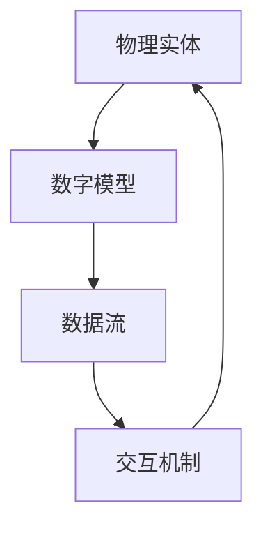
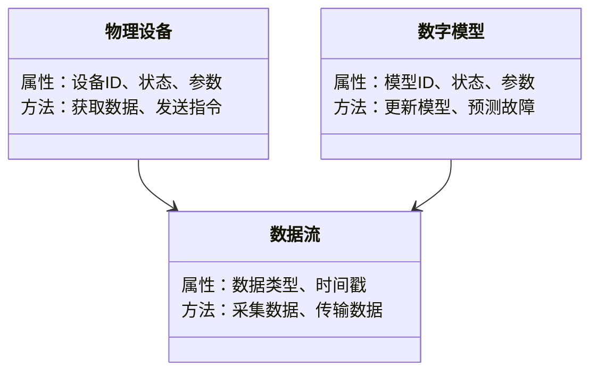
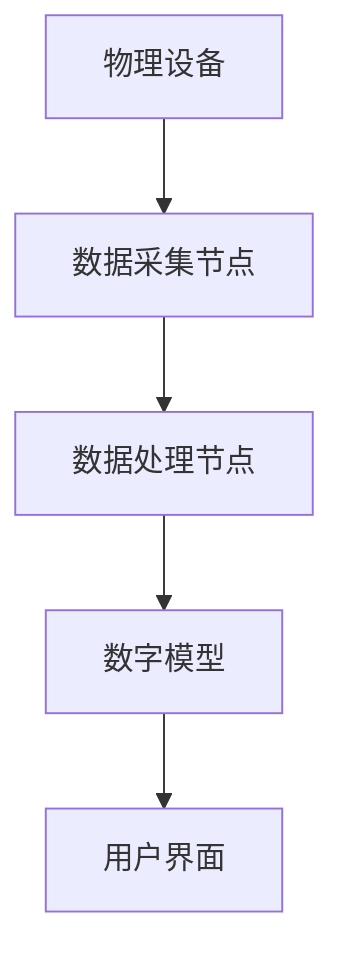
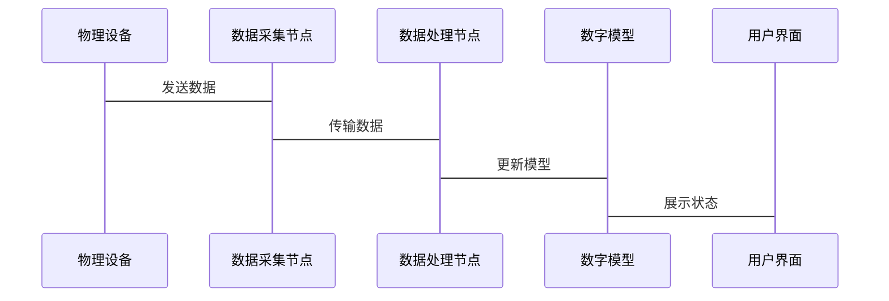

                 


# 如何评估企业的数字孪生技术应用

> 关键词：数字孪生，企业应用，技术评估，系统架构，数据建模，实时同步，仿真预测

> 摘要：本文系统地探讨了如何评估企业的数字孪生技术应用，从定义、背景、核心概念、算法原理到系统架构、项目实战、最佳实践等各个方面进行了深入分析。通过详细的理论阐述、丰富的图表展示和具体的代码实现，帮助读者全面理解数字孪生技术，并为企业在实际应用中提供有价值的指导。

---

# 第一部分：数字孪生技术的背景与核心概念

## 第1章：数字孪生技术的定义与背景

### 1.1 数字孪生技术的定义

数字孪生（Digital Twin）是一种通过数字技术构建物理实体或系统的虚拟模型，并实现两者实时同步的技术。它不仅能够反映物理实体的静态属性，还能模拟其动态行为。

#### 1.1.1 数字孪生的定义
数字孪生是一种实时、动态、三维的数字映射技术，用于描述、分析和预测物理实体的行为和状态。

#### 1.1.2 数字孪生的核心特征
- **实时性**：数字孪生需要实时反映物理实体的状态。
- **动态性**：数字孪生能够动态更新模型以适应物理实体的变化。
- **交互性**：数字孪生支持与物理实体的双向交互。
- **可扩展性**：数字孪生能够支持多种应用场景和规模。

#### 1.1.3 数字孪生与相关技术的对比

| 技术 | 定义 | 主要特点 | 应用场景 |
|------|------|----------|----------|
| 数字孪生 | 数字映射物理实体的技术 | 实时、动态、交互 | 制造、建筑、医疗 |
| 物联网 | 连接物理设备与数字系统的技术 | 数据采集、设备管理 | 智能家居、智慧城市 |
| 虚拟现实 | 创建虚拟环境的技术 | 可视化、沉浸式体验 | 游戏、培训、设计 |

### 1.2 数字孪生技术的背景

#### 1.2.1 数字孪生的起源与发展
数字孪生的概念最早可以追溯到20世纪90年代的计算机仿真技术，随着物联网、大数据和人工智能技术的发展，数字孪生逐渐成熟并得到广泛应用。

#### 1.2.2 数字孪生技术的现状
目前，数字孪生已经在制造业、建筑、医疗、交通等领域得到了广泛应用，帮助企业实现数字化转型和智能化管理。

#### 1.2.3 数字孪生技术的未来趋势
随着5G、人工智能和边缘计算技术的进一步发展，数字孪生将更加实时、智能和普及。

### 1.3 数字孪生技术的应用价值

#### 1.3.1 数字孪生在企业中的应用场景
- **设备监控与维护**：实时监控设备状态，预测故障，减少停机时间。
- **生产优化**：通过模拟优化生产流程，提高效率。
- **产品设计与测试**：通过数字模型进行产品设计和测试，降低开发成本。

#### 1.3.2 数字孪生对企业运营效率的提升
数字孪生可以帮助企业实现设备的实时监控、流程的优化和资源的高效利用，从而显著提升运营效率。

#### 1.3.3 数字孪生在企业创新中的作用
数字孪生为企业提供了新的创新工具和方法，例如通过数字模型进行快速原型设计和测试。

### 1.4 数字孪生技术的挑战与限制

#### 1.4.1 技术实现的难度
数字孪生需要整合多种技术，包括数据采集、模型构建、实时同步等，技术实现难度较高。

#### 1.4.2 数据隐私与安全问题
数字孪生涉及大量的数据采集和传输，数据隐私和安全问题需要高度重视。

#### 1.4.3 成本与资源投入
数字孪生的实施需要大量的资源投入，包括硬件、软件和人才。

### 1.5 本章小结
本章介绍了数字孪生的定义、背景、核心特征、应用场景、应用价值以及面临的挑战。通过对比数字孪生与其他相关技术，帮助读者更好地理解其特点和优势。

---

## 第2章：数字孪生技术的核心概念与联系

### 2.1 数字孪生技术的核心要素

#### 2.1.1 物理实体与数字模型的关系
物理实体是数字孪生的来源，数字模型是物理实体的虚拟映射。

#### 2.1.2 数据流与实时同步机制
数据流是连接物理实体和数字模型的桥梁，实时同步机制保证了数字模型与物理实体的一致性。

#### 2.1.3 交互机制与反馈循环
交互机制实现了物理实体与数字模型之间的双向通信，反馈循环则保证了系统的动态调整。

#### 2.1.4 核心要素对比表格
| 核心要素 | 特性 | 描述 |
|----------|------|------|
| 物理实体 | 实体性 | 实际存在的物体或系统 |
| 数字模型 | 虚拟性 | 数字化的虚拟模型 |
| 数据流 | 实时性 | 实时采集和传输数据 |
| 交互机制 | 双向性 | 物理实体与数字模型的双向通信 |

#### 2.1.5 实体关系图


### 2.2 数字孪生技术的核心原理

#### 2.2.1 数据采集与处理
数据采集是数字孪生的基础，常用的传感器包括温度传感器、压力传感器等。

#### 2.2.2 模型构建与仿真
模型构建是数字孪生的核心，常用的建模工具包括CAD、MATLAB等。

#### 2.2.3 实时同步与动态更新
实时同步保证了数字模型与物理实体的一致性，动态更新则保证了数字模型的准确性。

### 2.3 数字孪生技术与相关技术的对比

#### 2.3.1 数字孪生与物联网的区别
物联网强调设备的连接与数据的采集，而数字孪生强调数据的建模与实时同步。

#### 2.3.2 数字孪生与虚拟现实的联系
数字孪生可以为虚拟现实提供高精度的虚拟模型，虚拟现实则为数字孪生提供沉浸式的交互体验。

#### 2.3.3 数字孪生与工业4.0的关系
数字孪生是工业4.0的重要组成部分，它通过数字模型实现了生产设备的智能化管理。

### 2.4 数字孪生技术的实体关系图


### 2.5 本章小结
本章详细阐述了数字孪生的核心概念，包括核心要素、核心原理以及与相关技术的联系。通过对比和图示，帮助读者更好地理解数字孪生的内在逻辑和外部关系。

---

## 第3章：数字孪生技术的算法原理

### 3.1 数字孪生技术涉及的算法概述

#### 3.1.1 数据建模算法
数据建模是数字孪生的核心，常用的算法包括回归分析、聚类分析等。

#### 3.1.2 实时数据处理算法
实时数据处理是数字孪生的关键，常用的算法包括流数据处理、数据同步等。

#### 3.1.3 仿真与预测算法
仿真与预测算法用于模拟和预测物理实体的行为，常用的算法包括蒙特卡洛模拟、时间序列分析等。

### 3.2 数据建模算法

#### 3.2.1 数据建模的基本原理
数据建模通过采集和处理数据，构建数字模型以反映物理实体的特征。

#### 3.2.2 数据建模的数学模型
$$y = f(x)$$

#### 3.2.3 数据建模的实现步骤
1. 数据采集与清洗
2. 特征提取与选择
3. 模型训练与优化
4. 模型验证与部署

### 3.3 实时数据处理算法

#### 3.3.1 数据流处理流程
1. 数据采集与传输
2. 数据解析与转换
3. 数据存储与处理
4. 数据同步与更新

#### 3.3.2 数据同步算法
数据同步算法通过比较物理实体和数字模型的状态，实现两者的实时同步。

#### 3.3.3 数据流处理代码示例
```python
import pandas as pd

# 数据采集
data = pd.read_csv('sensor_data.csv')

# 数据处理
data_processed = data.dropna()

# 数据同步
data_processed.to_csv('digital_twin.csv', index=False)
```

### 3.4 仿真与预测算法

#### 3.4.1 仿真算法的基本原理
仿真算法通过模拟物理实体的行为，预测其未来状态。

#### 3.4.2 时间序列预测算法
$$y_t = \alpha y_{t-1} + (1-\alpha)y_{t-2}$$

#### 3.4.3 仿真算法的实现步骤
1. 数据准备与预处理
2. 模型训练与优化
3. 模型仿真与预测
4. 预测结果分析与反馈

### 3.5 本章小结
本章详细介绍了数字孪生技术涉及的算法原理，包括数据建模、实时数据处理和仿真与预测算法。通过代码示例和数学公式，帮助读者理解这些算法的实现和应用。

---

## 第4章：数字孪生技术的系统分析与架构设计

### 4.1 系统分析

#### 4.1.1 问题场景介绍
以制造企业的设备监控系统为例，介绍数字孪生技术的应用场景。

#### 4.1.2 系统需求分析
系统需要实现设备状态实时监控、故障预测和远程维护功能。

### 4.2 系统架构设计

#### 4.2.1 领域模型设计


#### 4.2.2 系统架构设计


#### 4.2.3 系统接口设计
- 数据采集接口：用于采集物理设备的数据
- 数据处理接口：用于处理数据并更新数字模型
- 用户界面接口：用于展示数字模型的状态和交互

#### 4.2.4 系统交互设计


### 4.3 本章小结
本章通过对数字孪生系统的系统分析与架构设计，帮助读者理解数字孪生技术在企业中的具体应用和实现方式。

---

## 第5章：数字孪生技术的项目实战

### 5.1 环境安装与配置

#### 5.1.1 系统环境
- 操作系统：Linux/Windows
- 开发工具：Python、Jupyter Notebook
- 数据库：MySQL/PostgreSQL
- 传感器：温度传感器、压力传感器

#### 5.1.2 依赖库安装
```bash
pip install numpy pandas matplotlib
```

### 5.2 系统核心实现

#### 5.2.1 数据采集模块
```python
import serial

# 串口通信代码
ser = serial.Serial('COM1', 9600)
data = ser.readline().decode()
```

#### 5.2.2 数据处理模块
```python
import pandas as pd

# 数据处理代码
data_frame = pd.read_csv('sensor_data.csv')
data_frame_processed = data_frame.dropna()
data_frame_processed.to_csv('processed_data.csv', index=False)
```

#### 5.2.3 数字模型模块
```python
import numpy as np

# 数字模型代码
model = np.polyfit(x, y, 1)
y_pred = np.polyval(model, x_new)
```

### 5.3 系统功能实现

#### 5.3.1 实时数据监控
```python
import matplotlib.pyplot as plt

# 实时数据监控代码
plt.ion()
while True:
    plt.plot(data)
    plt.pause(0.1)
```

#### 5.3.2 故障预测与报警
```python
import warnings

# 故障预测代码
from sklearn.ensemble import IsolationForest
model = IsolationForest(n_estimators=100)
model.fit(data)
预测结果 = model.predict(new_data)
```

### 5.4 项目小结
本章通过具体的项目实战，展示了数字孪生技术的实现过程，包括环境安装、数据采集、数据处理、数字模型构建和系统功能实现。

---

## 第6章：数字孪生技术的最佳实践与注意事项

### 6.1 最佳实践

#### 6.1.1 数据质量的重要性
数据质量是数字孪生技术成功的关键，确保数据的准确性、完整性和实时性。

#### 6.1.2 模型迭代的方法
定期更新数字模型，确保其与物理实体的一致性。

#### 6.1.3 安全与隐私保护
重视数据的安全与隐私保护，避免数据泄露和滥用。

### 6.2 注意事项

#### 6.2.1 技术选型
选择合适的技术和工具，避免过度复杂化系统。

#### 6.2.2 团队协作
数字孪生技术的实施需要多部门协作，确保团队的高效配合。

#### 6.2.3 项目管理
制定详细的项目计划，确保项目的按时完成和质量保证。

### 6.3 拓展阅读

#### 6.3.1 数字孪生技术的经典文献
- John G.続きを読む

---

## 作者

作者：AI天才研究院/AI Genius Institute  
联系与交流：[禅与计算机程序设计艺术](https://github.com/Genius-Programming-Academy)

