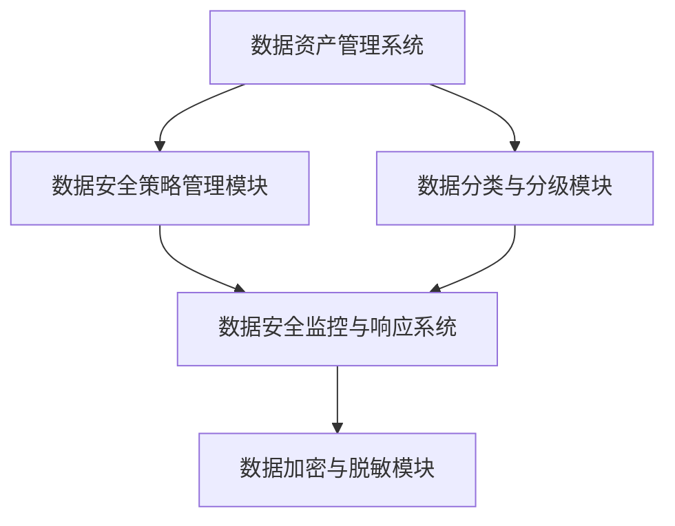

                 


# 如何评估企业的数据安全能力

## 关键词：数据安全能力、数据分类、安全威胁模型、安全能力框架、数据加密、访问控制、数据脱敏

## 摘要：  
随着数字化转型的加速，企业数据安全能力的评估变得至关重要。本文从数据安全能力的核心概念出发，详细探讨了数据安全能力的评估方法、技术实现、系统架构设计以及实际案例分析。通过系统化的分析和具体实施步骤的讲解，本文为读者提供了从理论到实践的全面指导，帮助企业在复杂的数字化环境中提升数据安全能力。

---

## 第一部分：数据安全能力评估的背景与基础

### 第1章：数据安全能力评估的背景与重要性

#### 1.1 数据安全的基本概念

- **1.1.1 数据的定义与分类**  
  数据是企业在运营过程中产生的各种信息资产，通常可以分为结构化数据、半结构化数据和非结构化数据。数据分类是数据安全管理的基础，常见的分类方式包括敏感性分类（如机密、重要、公开）和业务相关性分类（如财务数据、用户数据）。  
  - **结构化数据**：例如数据库中的字段，具有明确的格式和结构。  
  - **半结构化数据**：例如JSON、XML格式的数据，具有一定的结构但不如结构化数据严格。  
  - **非结构化数据**：例如文本文件、图像、视频等，没有固定的结构。  

- **1.1.2 数据安全的核心目标**  
  数据安全的核心目标是保护数据的机密性、完整性和可用性（CIA三原则）。  
  - **机密性**：确保只有授权人员能够访问敏感数据。  
  - **完整性**：确保数据在存储和传输过程中不会被篡改或损坏。  
  - **可用性**：确保数据在需要时可以被合法用户访问。  

- **1.1.3 数据安全的法律与合规要求**  
  随着数据保护法规的日益严格，企业需要遵守诸如《通用数据保护条例》（GDPR）、《加州消费者隐私法》（CCPA）等法规，确保数据处理的合法性。

#### 1.2 企业数据安全面临的挑战

- **1.2.1 数据泄露的现状与趋势**  
  数据泄露事件频发，攻击者利用技术漏洞或社会工程学手段获取敏感数据。近年来，勒索软件、钓鱼攻击和内部员工泄密是主要的攻击方式。  

- **1.2.2 数据滥用与隐私保护的问题**  
  数据滥用不仅指未经授权的数据访问，还包括未经授权的数据使用。隐私保护是数据安全的重要组成部分，尤其是在处理个人数据时，必须严格遵守相关法律法规。  

- **1.2.3 数据安全技术的演进与挑战**  
  随着技术的发展，数据安全技术也在不断演进，但新的技术手段也带来了新的挑战。例如，人工智能和机器学习技术的应用虽然可以提高数据安全水平，但也可能被攻击者利用进行高级持续性威胁（APT）攻击。

#### 1.3 数据安全能力评估的意义

- **1.3.1 评估对企业数据安全的重要性**  
  数据安全能力评估是企业全面了解自身数据安全现状的重要手段，能够帮助企业识别数据管理中的薄弱环节，制定有效的改进措施。  

- **1.3.2 评估在企业风险管理中的作用**  
  数据安全能力评估可以帮助企业在风险管理框架中明确数据安全风险的优先级，制定合理的风险缓解策略。  

- **1.3.3 评估在数据驱动决策中的价值**  
  数据安全能力评估不仅是技术性的检查，更是企业数据驱动决策的重要支撑。通过评估，企业可以确保数据在使用过程中的安全性和合规性，为数据分析和决策提供可靠的基础。

---

## 第二部分：数据安全能力评估的核心概念

### 第2章：数据安全能力的核心要素

#### 2.1 数据安全能力的定义与构成

- **2.1.1 数据安全能力的定义**  
  数据安全能力是指企业在数据生命周期的各个阶段（采集、存储、处理、传输、共享、销毁）中，保护数据安全、确保数据完整性和可用性的综合能力。  

- **2.1.2 数据安全能力的构成要素**  
  数据安全能力由以下几个核心要素构成：  
  - 数据分类与分级：根据数据的敏感性和重要性进行分类和分级管理。  
  - 数据访问控制：基于角色的访问控制（RBAC）和最小权限原则。  
  - 数据加密与脱敏：确保数据在存储和传输过程中的机密性和完整性。  
  - 数据安全监控与响应：实时监控数据安全事件并快速响应。  

- **2.1.3 数据安全能力的评估维度**  
  数据安全能力的评估可以从以下几个维度进行：  
  - 数据管理能力：数据分类、存储和处理的规范性。  
  - 技术能力：数据加密、访问控制等技术手段的实现程度。  
  - 管理能力：数据安全政策、流程和人员管理的完善程度。  

#### 2.2 数据安全能力与企业业务的关系

- **2.2.1 数据安全能力对企业业务的影响**  
  数据是企业业务的核心资产，数据安全能力直接影响企业的业务连续性、声誉和财务状况。  

- **2.2.2 数据安全能力在企业战略中的地位**  
  数据安全能力是企业数字化转型的重要支撑，是企业战略规划中不可或缺的一部分。  

- **2.2.3 数据安全能力与企业核心竞争力的关系**  
  数据安全能力不仅是企业合规性要求，更是企业核心竞争力的重要组成部分。通过提升数据安全能力，企业可以增强客户信任，降低数据泄露风险，从而在竞争中获得优势。

#### 2.3 数据安全能力评估的边界与外延

- **2.3.1 数据安全能力评估的边界**  
  数据安全能力评估的边界包括企业的内部数据和外部数据，但通常不包括第三方服务提供商的数据。  

- **2.3.2 数据安全能力评估的外延**  
  数据安全能力评估的外延可以扩展到供应链安全、数据共享安全等方面，形成更广泛的企业安全体系。  

- **2.3.3 数据安全能力与其他安全能力的关系**  
  数据安全能力与其他安全能力（如网络安全、应用安全）密切相关，共同构成企业整体安全能力的基础。

---

## 第三部分：数据安全能力评估的方法论

### 第3章：数据安全能力评估的框架与步骤

#### 3.1 数据安全能力评估的框架

- **3.1.1 数据安全能力评估的总体框架**  
  数据安全能力评估的总体框架包括以下几个方面：  
  - 数据资产识别与分类：明确企业的数据资产，并按照敏感性和重要性进行分类。  
  - 数据安全政策与流程：检查企业的数据安全政策、流程和操作规范是否符合法规要求。  
  - 技术手段评估：评估企业的技术手段（如加密、访问控制）是否能够有效保护数据安全。  
  - 安全事件响应：评估企业在发生数据安全事件时的响应能力和恢复能力。  

- **3.1.2 数据安全能力评估的实施步骤**  
  数据安全能力评估的实施步骤包括：  
  1. 明确评估目标与范围。  
  2. 收集相关数据与信息。  
  3. 分析与评估数据安全能力。  
  4. 提出改进建议与实施计划。  

- **3.1.3 数据安全能力评估的关键成功因素**  
  成功的数据安全能力评估需要企业的高层重视、相关部门的配合以及专业的技术支持。  

#### 3.2 数据安全能力评估的具体步骤

- **3.2.1 明确评估目标与范围**  
  评估目标是明确为什么要进行数据安全能力评估，例如合规性检查、风险评估或提升数据安全水平。评估范围需要明确企业的哪些数据资产需要评估，以及评估的深度和广度。  

- **3.2.2 收集相关数据与信息**  
  收集与数据安全相关的政策、流程、技术手段、安全事件记录等信息，为评估提供基础数据支持。  

- **3.2.3 分析与评估数据安全能力**  
  根据收集的数据，分析企业的数据安全能力，识别存在的问题和不足。  

- **3.2.4 提出改进建议与实施计划**  
  根据评估结果，提出针对性的改进建议，并制定实施计划，确保评估结果能够转化为实际的安全提升措施。

---

## 第四部分：数据安全能力评估的技术实现

### 第4章：数据安全能力评估的技术手段

#### 4.1 数据分类与分级技术

- **4.1.1 数据分类的实现**  
  数据分类可以通过自动化工具或手动方式实现，常见的分类方法包括基于数据类型、敏感性、业务重要性等维度的分类。  

- **4.1.2 数据分级的实现**  
  数据分级通常是基于数据的敏感性和业务价值进行的，分级结果可以用于制定访问控制策略和数据保护措施。

#### 4.2 数据访问控制技术

- **4.2.1 基于角色的访问控制（RBAC）**  
  RBAC是一种常用的数据访问控制模型，通过角色和权限的分配，确保用户只能访问与其角色相关的数据。  

- **4.2.2 最小权限原则**  
  最小权限原则要求用户仅拥有完成其工作所需的最小权限，从而降低数据泄露风险。

#### 4.3 数据加密与脱敏技术

- **4.3.1 数据加密技术**  
  数据加密包括对称加密和非对称加密，常用于数据的存储和传输过程中的保护。  
  - 对称加密：如AES算法，适用于数据量大、加密速度快的场景。  
  - 非对称加密：如RSA算法，适用于数字签名和公钥交换的场景。  

- **4.3.2 数据脱敏技术**  
  数据脱敏是通过对数据进行匿名化处理，确保在开发、测试等场景中使用的数据不会泄露真实信息。  

#### 4.4 数据安全监控与响应技术

- **4.4.1 数据安全监控**  
  数据安全监控通常通过安全信息和事件管理系统（SIEM）实现，实时监控数据访问行为和网络流量，识别异常行为。  

- **4.4.2 数据安全事件响应**  
  数据安全事件响应包括制定应急响应计划、快速隔离受感染的系统、修复漏洞等步骤，确保数据安全事件的影响降到最低。

---

## 第五部分：数据安全能力评估的系统架构设计

### 第5章：数据安全能力评估的系统架构

#### 5.1 系统功能设计

- **5.1.1 数据资产管理系统**  
  数据资产管理系统用于识别、分类和管理企业数据资产，支持数据生命周期的全阶段管理。  

- **5.1.2 数据安全策略管理模块**  
  数据安全策略管理模块用于制定和管理数据安全策略，包括访问控制策略、加密策略等。  

- **5.1.3 数据安全监控与响应系统**  
  数据安全监控与响应系统实时监控数据安全事件，提供告警和响应功能，确保数据安全事件能够快速被发现和处理。

#### 5.2 系统架构设计

- **5.2.1 系统架构图**  
  下面是一个数据安全能力评估系统的架构图，展示了各个模块之间的关系：



#### 5.3 系统接口设计

- **5.3.1 数据资产管理系统接口**  
  数据资产管理系统通过API接口与其他系统（如数据库管理系统）进行交互，获取数据资产信息。  

- **5.3.2 数据安全策略管理模块接口**  
  数据安全策略管理模块通过API接口与数据资产管理系统和数据安全监控与响应系统进行交互，确保数据安全策略的统一管理和执行。

#### 5.4 系统交互流程

- **5.4.1 数据安全事件响应流程**  
  当数据安全监控系统检测到异常访问行为时，会触发告警，并通过API接口通知数据安全策略管理模块，执行相应的应急响应措施。

---

## 第六部分：数据安全能力评估的项目实战

### 第6章：数据安全能力评估的实战案例

#### 6.1 项目背景介绍

- **6.1.1 项目目标**  
  本项目旨在帮助企业全面评估其数据安全能力，识别数据管理中的薄弱环节，并制定改进计划。  

- **6.1.2 项目范围**  
  项目范围包括企业的核心业务系统，涉及财务数据、用户数据和供应链数据。  

#### 6.2 核心代码实现

- **6.2.1 数据分类与分级代码示例**  
  下面是一个简单的数据分类与分级的Python代码示例：

```python
# 数据分类与分级代码示例
def classify_data(data_type, sensitivity):
    if sensitivity == "high":
        return "机密"
    elif sensitivity == "medium":
        return "重要"
    else:
        return "公开"

# 示例数据
data_types = ["财务数据", "用户数据", "供应链数据"]
sensitivities = ["high", "medium", "low"]

for dt, s in zip(data_types, sensitivities):
    print(f"{dt} 的分类为：{classify_data(dt, s)}")
```

- **6.2.2 数据访问控制代码示例**  
  下面是一个基于角色的访问控制（RBAC）的Python代码示例：

```python
# RBAC 实现代码示例
class Role:
    def __init__(self, name, permissions):
        self.name = name
        self.permissions = permissions

class User:
    def __init__(self, username, roles):
        self.username = username
        self.roles = roles

    def has_permission(self, permission):
        for role in self.roles:
            if permission in role.permissions:
                return True
        return False

# 示例角色和用户
admin_role = Role("admin", ["read", "write", "delete"])
user_role = Role("user", ["read"])
user = User("user1", [admin_role])
print(user.has_permission("write"))  # 输出：True
```

#### 6.3 项目小结

- **6.3.1 项目成果**  
  通过本项目，企业成功识别了数据管理中的薄弱环节，制定了改进计划，并提升了整体数据安全能力。  

- **6.3.2 项目经验**  
  项目实施过程中，我们发现数据分类与分级是数据安全管理的基础，而数据访问控制是实现数据安全的重要手段。  

- **6.3.3 项目启示**  
  数据安全能力评估需要企业内外部的协同合作，同时需要结合企业的实际情况制定个性化的评估方案。

---

## 第七部分：总结与展望

### 第7章：数据安全能力评估的总结与展望

#### 7.1 总结

- **7.1.1 数据安全能力评估的核心要点**  
  数据安全能力评估是企业在数字化转型中必须重视的一项工作，需要从数据分类、技术实现、管理流程等多个方面进行全面评估。  

- **7.1.2 数据安全能力评估的未来发展趋势**  
  随着人工智能和大数据技术的发展，数据安全能力评估将更加智能化和自动化，能够实时监控和响应数据安全事件。

#### 7.2 展望

- **7.2.1 数据安全能力评估的未来挑战**  
  随着数据量的不断增加和数据分布的日益复杂，数据安全能力评估将面临更大的挑战，需要企业不断优化评估方法和技术手段。  

- **7.2.2 数据安全能力评估的未来机遇**  
  随着技术的进步和法规的完善，数据安全能力评估将为企业提供更多的工具和方法，帮助企业更好地保护数据安全。

---

## 作者信息

作者：AI天才研究院/AI Genius Institute & 禅与计算机程序设计艺术 /Zen And The Art of Computer Programming

