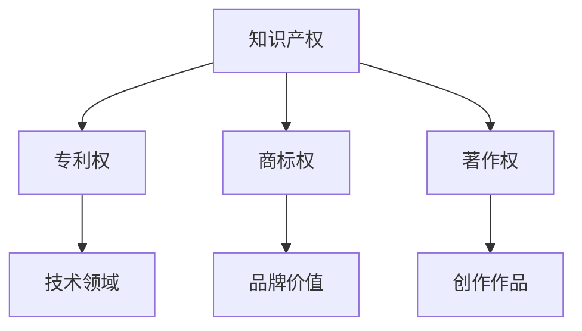
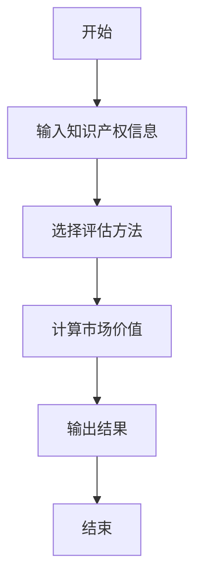
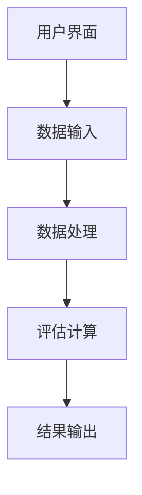

                 


# 如何评估企业的知识产权价值

> 关键词：知识产权评估、企业价值、技术评估、法律保护、市场价值

> 摘要：知识产权是企业在市场竞争中的核心资产之一，其价值评估对企业的发展战略、融资和并购具有重要意义。本文从知识产权的基本概念、评估方法、系统架构设计、实际案例分析等方面，详细探讨如何科学、系统地评估企业的知识产权价值。通过本文的学习，读者将能够掌握知识产权评估的核心原理、数学模型和实际操作方法，从而为企业决策提供有力支持。

---

# 第一部分: 企业知识产权价值评估的背景与核心概念

## 第1章: 知识产权的基本概念与重要性

### 1.1 知识产权的基本概念

#### 1.1.1 知识产权的定义与范围
知识产权（Intellectual Property, IP）是指人们在智力活动中创造的成果，通常包括专利权、商标权、著作权、商业秘密等。这些成果具有法律保护的独占性，能够在市场上为企业带来经济价值。

- 专利权：保护发明的实用性，包括发明的保护期限、地域性等。
- 商标权：保护企业的品牌标识，用于区分商品或服务的来源。
- 著作权：保护文学、艺术和科学作品的创作者的权益。
- 商业秘密：保护企业的核心技术或经营信息，未经公开的秘密信息。

#### 1.1.2 知识产权的法律保护体系
知识产权的保护体系由法律、政策和国际条约共同构成。各国的知识产权法律体系通常包括专利法、商标法、版权法等，确保知识产权的合法性和有效性。

#### 1.1.3 知识产权在企业中的地位与作用
知识产权是企业的核心资产之一，尤其在技术驱动的行业中，知识产权的价值直接关系到企业的市场竞争力和长期盈利能力。例如，一家拥有大量发明专利的科技企业，其知识产权的价值可能占据企业总价值的绝大部分。

---

### 1.2 企业知识产权价值评估的背景与意义

#### 1.2.1 当前经济环境下的知识产权价值凸显
在全球化和技术驱动的经济环境中，知识产权的价值越来越受到重视。特别是在科技行业，技术创新的速度和频率使得知识产权的价值评估变得尤为重要。

#### 1.2.2 知识产权评估对企业竞争力的影响
知识产权是企业技术创新的核心成果，其价值直接影响企业的市场地位和竞争优势。例如，一项具有广泛市场需求的发明专利，可能为企业带来巨大的市场价值和收益。

#### 1.2.3 知识产权评估在融资与并购中的作用
知识产权的价值评估是企业融资和并购的重要依据。投资者和并购方通常会要求对企业的知识产权进行详细评估，以确定其市场价值和潜在收益。

---

## 第2章: 知识产权价值评估的核心要素

### 2.1 知识产权的类型与特征

#### 2.1.1 知识产权的类型
知识产权的类型多种多样，每种类型都有其独特的特点和评估方法：

- 专利权：技术领域的保护，通常具有较高的技术门槛和市场价值。
- 商标权：品牌标识的保护，通常与企业的品牌价值密切相关。
- 著作权：艺术作品、软件代码等的保护，通常具有较强的原创性和市场影响力。
- 商业秘密：核心技术或经营信息的保护，通常具有较强的保密性和难以复制性。

#### 2.1.2 不同类型知识产权的特征对比
以下是不同类型知识产权的特征对比：

| 知识产权类型 | 技术门槛 | 市场价值 | 保护期限 | 竞争优势 |
|--------------|----------|----------|-----------|----------|
| 专利权      | 高       | 高       | 有限      | 强        |
| 商标权      | 低       | 中       | 无限      | 强        |
| 著作权      | 中       | 中       | 有限      | 弱        |
| 商业秘密    | 高       | 高       | 无限      | 强        |

#### 2.1.3 知识产权的生命周期与价值波动
知识产权的生命周期通常包括创造、保护、运用和终止几个阶段。其市场价值会随着生命周期的变化而波动。例如，一项专利的市场价值可能在保护期内达到峰值，而在保护期结束后逐渐下降。

---

### 2.2 知识产权价值评估的关键因素

#### 2.2.1 技术创新性与市场竞争力
技术创新性是知识产权价值的核心因素之一。一项具有较高技术创新性的知识产权通常具有更强的市场竞争力和更高的经济价值。

#### 2.2.2 法律保护的完善程度
知识产权的法律保护越完善，其市场价值越高。例如，一项具有广泛法律保护的专利权通常比缺乏保护的商业秘密更具市场价值。

#### 2.2.3 市场需求与经济价值
知识产权的市场需求和经济价值是其价值评估的重要依据。例如，一项能够满足市场需求的发明专利通常具有较高的经济价值。

---

### 2.3 知识产权价值评估的边界与外延

#### 2.3.1 评估范围的界定
知识产权价值评估的范围通常包括其法律保护范围、市场应用范围和技术覆盖范围。例如，一项发明专利的评估范围可能包括其技术领域、保护地域和市场应用领域。

#### 2.3.2 评估中的假设与限制条件
知识产权价值评估通常需要假设其合法性和有效性。如果知识产权存在法律纠纷或技术缺陷，其价值可能大幅下降。

#### 2.3.3 与企业整体价值的关系
知识产权是企业整体价值的重要组成部分，但并非全部。企业的整体价值通常还包括其他资产和资源的价值。

---

## 第3章: 知识产权价值评估的核心概念与联系

### 3.1 知识产权价值评估的原理

#### 3.1.1 知识产权价值的形成机制
知识产权的价值通常由其技术创新性、市场竞争力和法律保护等因素共同决定。例如，一项具有高技术创新性和强市场竞争力的专利权通常具有较高的经济价值。

#### 3.1.2 价值评估的基本框架
知识产权价值评估的基本框架包括以下几个步骤：
1. 确定知识产权的类型和特征。
2. 评估知识产权的技术创新性和市场竞争力。
3. 评估知识产权的法律保护和市场需求。
4. 综合评估知识产权的市场价值。

#### 3.1.3 评估方法的选择与应用
根据知识产权的类型和特征，选择合适的评估方法。例如，对于专利权，通常采用收益法或市场法进行评估。

---

### 3.2 核心概念的属性特征对比

#### 3.2.1 不同类型知识产权的评估指标对比
以下是不同类型知识产权的评估指标对比：

| 知识产权类型 | 技术创新性 | 市场需求 | 法律保护 | 经济价值 |
|--------------|------------|----------|----------|----------|
| 专利权      | 高         | 高       | 强        | 高       |
| 商标权      | 中         | 中       | 强        | 中       |
| 著作权      | 中         | 中       | 强        | 中       |
| 商业秘密    | 高         | 高       | 强        | 高       |

#### 3.2.2 评估指标的权重分配
知识产权价值评估的指标权重通常根据具体情况进行调整。例如，对于技术驱动型企业，技术创新性的权重可能更高。

#### 3.2.3 评估模型的适用场景
不同的评估模型适用于不同的知识产权类型和评估场景。例如，收益法适用于具有明确市场收益的专利权，而市场法适用于具有类似市场案例的商标权。

---

### 3.3 知识产权价值评估的ER实体关系图



---

# 第二部分: 知识产权价值评估的算法与数学模型

## 第4章: 知识产权价值评估的算法原理

### 4.1 评估方法概述

#### 4.1.1 定性评估方法
定性评估方法通常基于专家经验和行业标准，评估知识产权的法律保护、技术创新性和市场竞争力等因素。

#### 4.1.2 定量评估方法
定量评估方法通常基于数学模型和市场数据，评估知识产权的市场价值。例如，收益法、市场法和成本法。

#### 4.1.3 综合评估方法
综合评估方法结合定性和定量评估方法，综合考虑知识产权的多种因素，得出其市场价值。

---

### 4.2 收益法的数学模型

#### 4.2.1 收益法的原理
收益法通过预测知识产权的未来收益，计算其当前价值。其数学模型如下：

$$ V = \frac{R}{r} $$

其中：
- \( V \) 表示知识产权的市场价值
- \( R \) 表示知识产权的未来收益
- \( r \) 表示折现率

#### 4.2.2 收益法的应用步骤
1. 预测知识产权的未来收益。
2. 确定合适的折现率。
3. 计算知识产权的市场价值。

---

### 4.3 市场法的数学模型

#### 4.3.1 市场法的原理
市场法通过比较类似知识产权的市场交易价格，评估知识产权的市场价值。其数学模型如下：

$$ V = \alpha \cdot P + \beta $$

其中：
- \( V \) 表示知识产权的市场价值
- \( P \) 表示可比交易的市场价
- \( \alpha \) 和 \( \beta \) 为调整系数

#### 4.3.2 市场法的应用步骤
1. 收集类似知识产权的市场交易数据。
2. 确定调整系数。
3. 计算知识产权的市场价值。

---

### 4.4 成本法的数学模型

#### 4.4.1 成本法的原理
成本法通过估算知识产权的开发成本，计算其市场价值。其数学模型如下：

$$ V = C \cdot (1 + r) $$

其中：
- \( V \) 表示知识产权的市场价值
- \( C \) 表示开发成本
- \( r \) 表示成本利润率

#### 4.4.2 成本法的应用步骤
1. 估算知识产权的开发成本。
2. 确定成本利润率。
3. 计算知识产权的市场价值。

---

## 第5章: 知识产权价值评估的系统架构设计

### 5.1 系统功能设计

#### 5.1.1 系统功能模块
知识产权价值评估系统通常包括以下几个功能模块：
1. 数据输入模块：输入知识产权的基本信息和市场数据。
2. 评估方法选择模块：选择合适的评估方法。
3. 计算模块：计算知识产权的市场价值。
4. 结果输出模块：输出评估结果。

#### 5.1.2 系统功能流程图


---

### 5.2 系统架构设计

#### 5.2.1 系统架构图


#### 5.2.2 系统接口设计
知识产权价值评估系统的接口设计通常包括以下几个部分：
1. 数据输入接口：接收知识产权的基本信息和市场数据。
2. 评估方法接口：选择合适的评估方法。
3. 结果输出接口：输出评估结果。

---

## 第6章: 知识产权价值评估的项目实战

### 6.1 实际案例分析

#### 6.1.1 案例背景
某科技公司拥有一项发明专利，用于制造高性能芯片。该专利的市场价值需要进行评估。

#### 6.1.2 案例分析
1. 确定专利权的类型和特征。
2. 预测专利权的未来收益。
3. 确定合适的折现率。
4. 计算专利权的市场价值。

---

### 6.2 系统核心实现源代码

#### 6.2.1 系统实现代码
```python
def calculate_value(method, R, r):
    if method == '收益法':
        return R / r
    elif method == '市场法':
        return alpha * R + beta
    elif method == '成本法':
        return C * (1 + r)
```

#### 6.2.2 代码应用解读
上述代码实现了三种评估方法的计算功能。用户可以根据具体需求选择合适的评估方法，并输入相应的参数进行计算。

---

## 第7章: 知识产权价值评估的最佳实践与小结

### 7.1 最佳实践 tips

#### 7.1.1 知识产权评估的关键点
- 确保知识产权的合法性和有效性。
- 合理选择评估方法。
- 综合考虑知识产权的技术创新性和市场竞争力。

#### 7.1.2 系统实现的注意事项
- 确保数据的准确性和完整性。
- 合理设计系统功能模块。
- 定期更新评估模型和参数。

---

### 7.2 小结

知识产权是企业的核心资产之一，其价值评估对企业的发展战略、融资和并购具有重要意义。本文从知识产权的基本概念、评估方法、系统架构设计和实际案例分析等方面，详细探讨了如何科学、系统地评估企业的知识产权价值。通过本文的学习，读者将能够掌握知识产权评估的核心原理、数学模型和实际操作方法，从而为企业决策提供有力支持。

---

## 作者简介

作者：AI天才研究院/AI Genius Institute & 禅与计算机程序设计艺术/Zen And The Art of Computer Programming

---

**本文由AI天才研究院（AI Genius Institute）和“禅与计算机程序设计艺术”（Zen And The Art of Computer Programming）联合撰写，转载请注明出处。**

