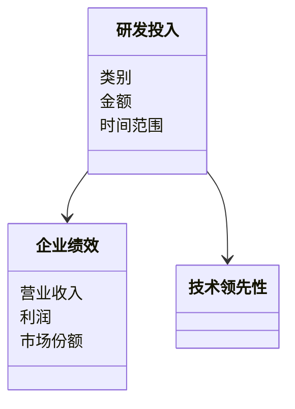
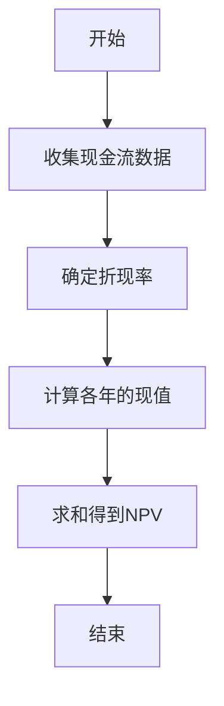
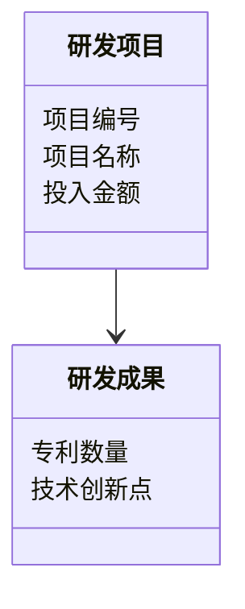
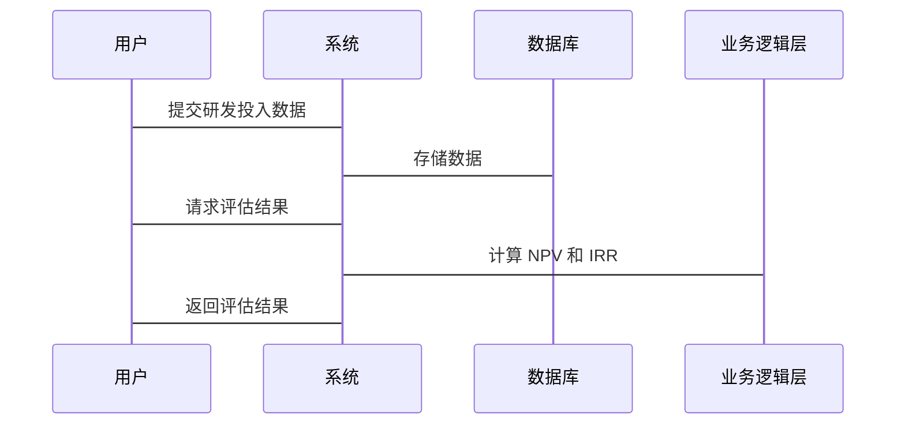

                 


# 如何评估企业的研发投入价值

> 关键词：企业研发投入、价值评估、研发管理、投资分析、创新绩效

> 摘要：企业的研发投入是推动创新和增长的关键因素，但如何评估其价值却是一个复杂的挑战。本文将从定义与背景、评估方法、数学模型、系统架构设计、项目实战、风险管理等多个维度，全面解析企业研发投入价值评估的核心要素和具体实施步骤，帮助读者掌握科学的评估方法。

---

## 第一部分: 企业研发投入价值评估的背景与定义

### 第1章: 企业研发投入的定义与背景

#### 1.1 投资背景
##### 1.1.1 企业研发投入的定义
企业的研发投入是指企业在研发活动中投入的资源，包括资金、人力、时间和技术等。这些资源用于开发新产品、改进现有产品、优化生产流程或探索新技术。

##### 1.1.2 研发投入的类型与特点
研发投入可以分为以下几种类型：
- **基础研究**：旨在探索未知领域，通常具有较高的不确定性。
- **应用研究**：针对特定问题进行研究，目标明确。
- **产品开发**：直接为产品商业化服务，周期较短。
- **技术转移**：将研究成果转化为实际应用的过程。

##### 1.1.3 研发投入与企业价值的关系
研发投入是企业创新的核心驱动力，直接影响企业的市场竞争力和长期增长潜力。合理的研发投入能够提升企业的技术壁垒，增强客户满意度，并在市场竞争中占据优势地位。

#### 1.2 问题背景
##### 1.2.1 企业研发投入的价值评估难点
- 研发投入的成果往往具有滞后性，难以在短期内见效。
- 研发项目的失败率较高，部分投入可能无法带来预期收益。
- 不同行业的研发投入特点和评估标准差异较大。

##### 1.2.2 研发投入与企业绩效的关联性
研发投入与企业绩效之间的关系可以通过以下公式表示：

$$绩效 = f(研发投入, 效率, 竞争环境)$$

其中，$f$ 表示企业将研发投入转化为绩效的能力，受到效率和竞争环境的影响。

##### 1.2.3 研发投入的边界与外延
- **边界**：研发投入仅限于企业的研发活动，不包括其他类型的支出。
- **外延**：研发投入的成果可以延伸到企业的其他业务领域，例如市场推广和售后服务。

#### 1.3 核心概念与联系
##### 1.3.1 核心概念原理
研发投入的核心在于通过创新活动为企业创造价值，这种价值可以通过市场表现、技术领先性和财务收益等多个维度进行衡量。

##### 1.3.2 概念属性特征对比表格
| 概念         | 属性         | 特征                           |
|--------------|--------------|--------------------------------|
| 研发投入     | 资源投入     | 资金、人力、时间                |
|              | 目标         | 创新、改进、商业化              |
|              | 风险         | 高风险、不确定性                |
| 企业绩效     | 财务表现     | 营业收入、利润                  |
|              | 市场表现     | 市场份额、品牌影响力             |
|              | 技术领先性   | 技术专利、创新能力               |

##### 1.3.3 ER实体关系图架构
```mermaid
er
  %%{init: 'EntityDiagram'}%%
  entity 研发投入 {
    类别：String
    金额：Numeric
    时间范围：Date
  }
  entity 企业绩效 {
    营业收入：Numeric
    利润：Numeric
    市场份额：Numeric
  }
  研发投入 --> 企业绩效 : 通过研发投入提升企业绩效
```

---

## 第2章: 研发投入价值评估的核心要素

### 2.1 核心要素组成
#### 2.1.1 研发投入的领域模型


#### 2.1.2 价值评估的关键指标
- 投资回报率（ROI）
- 净现值（NPV）
- 内部收益率（IRR）

#### 2.1.3 评估模型的输入与输出
- **输入**：研发投入金额、时间范围、预期收益
- **输出**：投资价值评估、风险分析、建议优化方向

---

## 第3章: 研发投入价值评估的算法原理

### 3.1 算法原理讲解
#### 3.1.1 评估模型的数学模型
净现值（NPV）的计算公式如下：

$$ NPV = \sum_{t=0}^{n} \frac{C_t}{(1 + r)^t} $$

其中，$C_t$ 是第 $t$ 年的现金流，$r$ 是折现率，$n$ 是项目周期。

#### 3.1.2 算法实现代码
```python
def calculate_npv(cash_flows, discount_rate):
    npv = 0
    for t, cash_flow in enumerate(cash_flows):
        npv += cash_flow / (1 + discount_rate) ** t
    return npv
```

#### 3.1.3 算法的实现步骤
1. 收集各年的现金流数据。
2. 确定折现率。
3. 计算各年的现值，并求和得到净现值。

### 3.2 算法实现
#### 3.2.1 算法流程图（Mermaid）


---

## 第4章: 研发投入价值评估的数学模型

### 4.1 数学模型与公式
#### 4.1.1 净现值（NPV）公式
$$ NPV = \sum_{t=0}^{n} \frac{C_t}{(1 + r)^t} $$

#### 4.1.2 内部收益率（IRR）公式
IRR 是使 NPV 等于零的折现率，可以通过试算法或牛顿迭代法求解。

#### 4.1.3 投资回收期（Payback Period）公式
$$ Payback\ Period = \sum_{t=0}^{n} \frac{C_t}{(1 + r)^t} $$

---

## 第5章: 研发投入价值评估的系统架构设计

### 5.1 问题场景介绍
企业的研发投入价值评估系统需要整合多个数据源，包括财务数据、项目管理数据和市场数据。

### 5.2 系统功能设计
#### 5.2.1 领域模型


#### 5.2.2 系统架构设计


#### 5.2.3 系统接口设计
- 数据接口：从财务系统导入研发投入数据。
- 分析接口：调用评估算法计算 NPV 和 IRR。

#### 5.2.4 系统交互设计


---

## 第6章: 项目实战

### 6.1 环境安装
安装必要的开发工具和库，例如 Python、NumPy、Matplotlib。

### 6.2 系统核心实现源代码
```python
import numpy as np

def calculate_irr(cash_flows):
    try:
        irr = np.irr(cash_flows)
        return irr
    except:
        return None
```

### 6.3 代码应用解读与分析
- 该代码使用 NumPy 的 `irr` 函数计算内部收益率，适用于等额年金的情况。

### 6.4 实际案例分析
假设某企业的研发投入为 1000 万元，第一年现金流为 -1000 万元，第二年现金流为 1500 万元。计算其 IRR：

$$ IRR = \text{calculate\_irr}([-1000, 1500]) $$

---

## 第7章: 风险管理

### 7.1 评估过程中的风险
- 数据偏差：研发投入数据的不准确可能导致评估结果的偏差。
- 模型假设不合理：假设与实际情况不符会影响评估结果。

### 7.2 风险应对措施
- 数据清洗：对研发投入数据进行验证和清洗。
- 模型优化：根据实际情况调整评估模型的参数。

---

## 第8章: 最佳实践与小结

### 8.1 最佳实践
- 定期回顾和优化评估模型。
- 建立反馈机制，收集研发投入的实际效果数据。

### 8.2 小结
企业的研发投入价值评估是一个复杂但关键的过程。通过科学的评估方法和系统的实施，企业可以更好地优化研发投入，提升创新能力和市场竞争力。

---

## 附录

### 附录A: 工具推荐
- Python 和相关库（NumPy、Pandas）
- 数据可视化工具（Matplotlib、Seaborn）
- 项目管理工具（JIRA、Trello）

### 附录B: 术语表
- 净现值（NPV）
- 内部收益率（IRR）
- 投资回收期（Payback Period）

### 附录C: 参考文献
- 《企业研发投入评估方法研究》，某某出版社，2023年。
- 《财务分析与投资决策》，某某出版社，2022年。

---

作者：AI天才研究院 & 禅与计算机程序设计艺术

