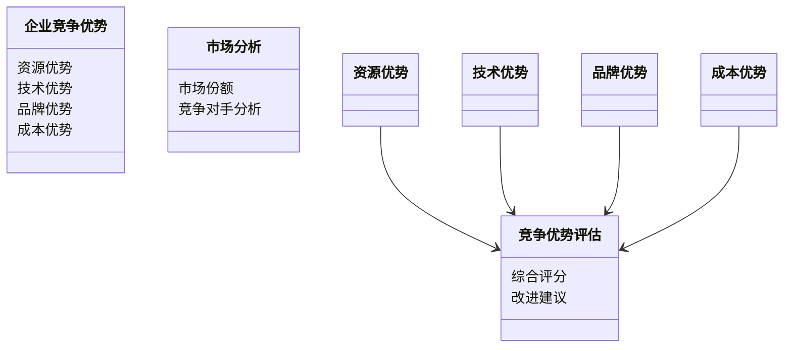

                 


# 如何评估企业的竞争优势

---

## 关键词：企业竞争优势、战略评估、市场分析、系统架构、竞争优势模型、SWOT分析、定量分析

---

## 摘要：  
本文旨在为企业提供一套系统的方法来评估其竞争优势。通过分析企业内部资源、外部环境、市场地位及竞争对手，结合定量分析工具和系统架构设计，帮助企业识别核心竞争力，优化资源配置，制定有效战略。本文内容涵盖竞争优势的核心概念、分析框架、数学模型、系统架构、项目实战及工具方法总结，为读者提供全面而深入的指导。

---

## 第一部分：竞争优势的核心概念与理论基础

### 第1章：竞争优势的定义与内涵

#### 1.1 什么是竞争优势
- **定义**：竞争优势是指企业在市场上相对于竞争对手的独特优势，能够使其在市场中获得更高的市场份额、利润率或增长潜力。
- **重要性**：竞争优势是企业生存和发展的基石，决定了企业的市场地位和长期盈利能力。
- **与企业绩效的关系**：竞争优势强的企业通常能够更好地应对市场变化，抓住机遇，抵御风险。

#### 1.2 竞争优势的类型
- **资源优势**：企业拥有的独特资源，如专利技术、优质原材料或独特的人才。
- **技术优势**：企业在技术开发、创新或应用方面的领先地位。
- **品牌优势**：强大的品牌认知度和品牌忠诚度。
- **成本优势**：在生产或运营成本上的显著优势，能够降低价格或提高利润。

#### 1.3 竞争优势的核心要素
- **资源分配**：资源的有效配置是竞争优势的基础。
- **组织能力**：组织的效率和执行力是竞争优势的关键。
- **战略定位**：明确的战略定位帮助企业聚焦核心优势。

#### 1.4 竞争优势的边界与外延
- **边界**：竞争优势并非无限制，需结合行业特点和市场环境。
- **外延**：竞争优势不仅限于内部资源，还包括外部合作伙伴和生态系统。

#### 1.5 本章小结  
竞争优势是企业立足市场的关键，理解其核心要素和类型是评估的第一步。

---

### 第2章：竞争优势的分析维度

#### 2.1 市场分析维度
- **市场份额**：企业在市场上的销售占比。
- **市场增长潜力**：市场未来的发展空间。
- **竞争密度**：市场上竞争对手的数量和实力。

#### 2.2 竞争对手分析
- **竞争对手的优势**：识别竞争对手的核心竞争力。
- **竞争对手的劣势**：发现竞争对手的不足之处。
- **竞争对手的战略**：分析竞争对手的战略布局。

#### 2.3 行业环境分析
- **行业生命周期**：行业处于成长期还是成熟期。
- **行业竞争结构**：市场的集中度和竞争程度。

#### 2.4 本章小结  
通过市场和竞争对手分析，企业可以更清晰地定位自身竞争优势。

---

## 第二部分：竞争优势的分析框架

### 第3章：PESTEL分析框架

#### 3.1 PESTEL分析法
- **P（政治因素）**：政府政策对企业的影响。
- **E（经济因素）**：经济环境的变化对企业的影响。
- **S（社会因素）**：社会文化对企业的影响。
- **T（技术因素）**：技术进步对企业的影响。
- **E（环境因素）**：环境保护对企业的影响。
- **L（法律因素）**：法律法规对企业的影响。

#### 3.2 企业竞争优势的外部环境分析
- **案例分析**：以某行业为例，使用PESTEL分析框架进行环境扫描。

---

## 第三部分：竞争优势的数学模型与定量分析方法

### 第4章：竞争优势的定量分析模型

#### 4.1 财务指标分析
- **ROE（净资产收益率）**：$$ROE = \frac{净利润}{股东权益}$$
- **ROS（资产周转率）**：$$ROS = \frac{净利润}{总资产}$$
- **市场份额模型**：$$市场份额 = \frac{企业的销售量}{市场的总销售量}$$

#### 4.2 市场份额分析
- **市场份额增长**：分析市场份额的变化趋势。
- **竞争对手市场份额**：比较竞争对手的市场份额变化。

#### 4.3 竞争优势评分模型
- **评分标准**：根据多个维度对企业进行评分，总分越高，竞争优势越强。

#### 4.4 本章小结  
通过定量分析，企业可以更准确地评估自身竞争优势。

---

## 第四部分：系统分析与架构设计

### 第5章：系统分析与竞争优势架构设计

#### 5.1 问题场景介绍
- **目标**：分析企业的竞争优势，优化资源配置。
- **范围**：涵盖研发、生产、营销等模块。

#### 5.2 系统功能设计（领域模型）


#### 5.3 系统架构设计


#### 5.4 本章小结  
通过系统架构设计，企业可以更好地整合资源，优化竞争优势。

---

## 第五部分：项目实战

### 第6章：项目实战

#### 6.1 环境安装
- **工具安装**：安装必要的分析工具，如Excel、Python、数据分析包（pandas、numpy）。
- **数据准备**：收集企业的财务数据、市场份额数据、竞争对手信息。

#### 6.2 核心实现
```python
import pandas as pd
import numpy as np

# 示例：计算市场份额
def calculate_market_share(company_sales, total_market_sales):
    return company_sales / total_market_sales

# 示例：计算ROE
def calculate_roe(net_profit, equity):
    return net_profit / equity

# 示例：竞争优势评分
def calculate_competitive_advantage_score(roa, ros, market_share):
    return (roa + ros + market_share) / 3

# 数据示例
data = {
    'company_sales': [100, 200, 150],
    'total_market_sales': [500, 600, 700],
    'net_profit': [50, 70, 60],
    'equity': [200, 300, 250]
}

df = pd.DataFrame(data)

# 计算市场份额
df['market_share'] = df.apply(lambda x: calculate_market_share(x['company_sales'], x['total_market_sales']), axis=1)
# 计算ROE
df['roe'] = df.apply(lambda x: calculate_roe(x['net_profit'], x['equity']), axis=1)
# 计算竞争优势评分
df['competitive_advantage_score'] = df.apply(lambda x: calculate_competitive_advantage_score(x['roe'], x['roe'], x['market_share']), axis=1)

print(df)
```

#### 6.3 案例分析
- **行业选择**：选择一个具体行业（如科技行业）。
- **步骤分析**：
  1. 收集行业数据。
  2. 应用PESTEL分析框架。
  3. 计算市场份额和竞争优势评分。
  4. 给出改进建议。

#### 6.4 本章小结  
通过项目实战，读者可以掌握竞争优势评估的实际操作方法。

---

## 第六部分：工具与方法总结

### 第7章：工具与方法总结

#### 7.1 常用工具对比
| 工具名称 | 适用场景 | 优点 | 缺点 |
|----------|-----------|------|------|
| PESTEL   | 宏观环境分析 | 全面性 | 操作复杂 |
| SWOT     | 内部外部分析 | 简单直观 | 精度较低 |
| 波特五力模型 | 行业竞争分析 | 深度分析 | 数据依赖性强 |

#### 7.2 最佳实践
- **数据收集**：确保数据的准确性和全面性。
- **工具选择**：根据具体情况选择合适的工具。
- **团队协作**：竞争优势评估需要多部门协作。

#### 7.3 本章小结  
选择合适的工具和方法是竞争优势评估成功的关键。

---

## 第七部分：总结与展望

### 第8章：总结与展望

#### 8.1 总结
竞争优势评估是企业战略管理的核心内容，通过系统的方法和工具，企业可以更清晰地识别和优化自身竞争优势。

#### 8.2 未来展望
随着数字化转型的深入，竞争优势评估将更加依赖数据和技术。未来，企业需要结合人工智能和大数据分析，动态评估竞争优势，以应对快速变化的市场环境。

---

## 作者：AI天才研究院/AI Genius Institute & 禅与计算机程序设计艺术 /Zen And The Art of Computer Programming

---

希望这篇文章能为您提供清晰的思路和实用的方法，帮助您有效评估企业的竞争优势！

