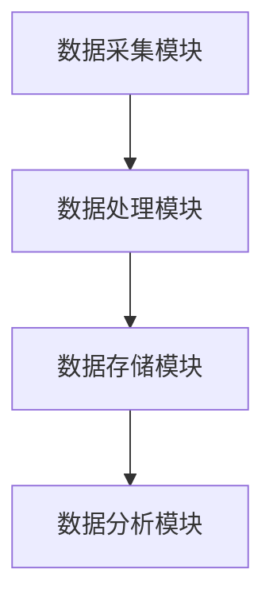
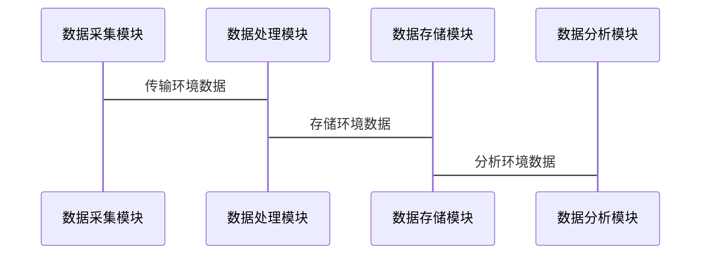

                 


# 如何评估企业的量子传感器环境监测应用

## 关键词：量子传感器, 环境监测, 企业应用, 系统架构, 数学模型

## 摘要：量子传感器在环境监测中的应用为企业提供了高精度、高灵敏度的数据采集能力，本文从背景、原理、算法、系统架构、项目实战等多方面详细分析了如何评估量子传感器在企业环境监测中的应用，为企业技术决策者提供实用的评估方法和参考框架。

---

# 如何评估企业的量子传感器环境监测应用

## 第1章：量子传感器环境监测应用的背景与概述

### 1.1 量子传感器的基本概念

#### 1.1.1 量子传感器的定义与基本原理
量子传感器是一种基于量子力学原理设计的传感器，能够以极高的精度测量环境中的物理量，如磁场、电场、温度、压力等。其核心原理是利用量子系统的特性，如量子叠加和量子纠缠，来实现对物理量的高精度测量。

#### 1.1.2 量子传感器与经典传感器的对比
- **灵敏度**：量子传感器的灵敏度远高于经典传感器，能够检测到极微弱的信号。
- **精度**：量子传感器在测量精度上具有显著优势，特别是在极端环境下表现更加出色。
- **抗干扰能力**：量子传感器能够更好地抵抗环境噪声的干扰，保证测量的准确性。

#### 1.1.3 量子传感器在环境监测中的应用潜力
量子传感器在环境监测中的应用潜力主要体现在以下几个方面：
1. **高精度测量**：能够实现对环境参数的高精度测量，如磁场、温度、压力等。
2. **实时监测**：能够实时采集环境数据，为企业的环境监测提供及时的反馈。
3. **复杂环境适应性**：能够在复杂环境中稳定工作，适应多种环境条件。

### 1.2 环境监测的基本概念

#### 1.2.1 环境监测的定义与范围
环境监测是指对环境中的物理、化学和生物参数进行测量和分析的过程，旨在了解环境的状态及其变化趋势。环境监测的范围包括空气、水、土壤等多个方面。

#### 1.2.2 环境监测的主要技术手段
环境监测的主要技术手段包括：
1. **传统传感器**：如温度传感器、压力传感器等。
2. **光学传感器**：如红外传感器、激光传感器等。
3. **量子传感器**：如基于量子纠缠的磁场传感器、温度传感器等。

#### 1.2.3 企业环境监测的重要性与挑战
企业环境监测的重要性体现在以下几个方面：
1. **合规性**：企业需要遵守国家和地方的环境法规，确保环境监测数据的准确性。
2. **成本控制**：通过环境监测，企业可以优化生产过程，降低资源消耗和环境污染。
3. **风险管理**：环境监测能够帮助企业及时发现潜在的环境风险，避免事故的发生。

企业环境监测的挑战主要体现在：
1. **数据精度**：如何保证环境监测数据的高精度和可靠性。
2. **数据处理**：如何高效处理海量环境监测数据，并提取有价值的信息。
3. **技术成本**：量子传感器等高端技术的应用可能带来较高的技术成本。

### 1.3 量子传感器在企业环境监测中的应用背景

#### 1.3.1 企业环境监测的现状与痛点
- **现状**：企业环境监测主要依赖传统的传感器技术，虽然能够满足基本的监测需求，但在精度和灵敏度方面存在一定的局限性。
- **痛点**：传统传感器在复杂环境下的表现不佳，无法满足企业对高精度环境监测的需求。

#### 1.3.2 量子传感器的优势与潜在价值
- **优势**：量子传感器具有高灵敏度、高精度、抗干扰能力强等优点，能够在复杂环境中稳定工作。
- **潜在价值**：量子传感器的应用能够提高企业的环境监测能力，帮助企业更好地应对环境法规，降低环境风险。

#### 1.3.3 量子传感器在企业环境监测中的应用前景
- **前景**：随着量子传感器技术的不断发展，其在企业环境监测中的应用前景广阔。未来，量子传感器将广泛应用于工业生产、环境保护等领域。

---

## 第2章：量子传感器环境监测应用的核心概念与原理

### 2.1 量子传感器的核心原理

#### 2.1.1 量子力学基础
量子力学是研究微观粒子运动规律的科学，其基本原理包括波函数、量子叠加、量子纠缠等。这些原理是量子传感器设计的基础。

#### 2.1.2 量子传感器的工作原理
量子传感器通过测量量子系统的某些特性来实现对环境参数的测量。例如，利用量子纠缠的特性，可以实现对磁场的高精度测量。

#### 2.1.3 量子传感器的关键技术
量子传感器的关键技术包括：
1. **量子态制备**：如何制备合适的量子态。
2. **量子测量**：如何对量子态进行测量。
3. **数据处理**：如何处理测量数据，提取有用的信息。

### 2.2 量子传感器的核心特性

#### 2.2.1 高灵敏度与高精度
量子传感器的高灵敏度和高精度是其最大的优势之一。通过量子叠加和量子纠缠的特性，量子传感器能够实现对环境参数的高精度测量。

#### 2.2.2 高分辨率与快速响应
量子传感器具有高分辨率和快速响应的特性，能够在短时间内完成对环境参数的测量，并提供高分辨率的测量结果。

#### 2.2.3 适应复杂环境的能力
量子传感器能够适应复杂环境，具有较强的抗干扰能力，能够在恶劣环境下稳定工作。

### 2.3 量子传感器与经典传感器的对比分析

#### 2.3.1 比较维度与指标
- **灵敏度**：量子传感器的灵敏度远高于经典传感器。
- **精度**：量子传感器的精度更高。
- **响应时间**：量子传感器的响应时间更短。

#### 2.3.2 量子传感器的核心优势
- **高精度**：量子传感器能够实现对环境参数的高精度测量。
- **抗干扰能力强**：量子传感器能够更好地抵抗环境噪声的干扰。
- **适应性广**：量子传感器能够适应多种复杂环境。

---

## 第3章：量子传感器环境监测应用的算法原理

### 3.1 量子传感器数据处理的算法原理

#### 3.1.1 量子叠加原理
量子叠加原理是量子传感器数据处理的基础之一。通过量子叠加，可以实现对多个可能状态的并行处理。

#### 3.1.2 量子纠缠原理
量子纠缠是量子传感器数据处理的另一个重要原理。通过量子纠缠，可以实现对量子系统的高效测量。

#### 3.1.3 量子传感器的数据处理流程
1. **量子态制备**：制备合适的量子态。
2. **量子测量**：对量子态进行测量。
3. **数据处理**：对测量结果进行处理，提取有用的信息。

### 3.2 量子传感器数学模型

#### 3.2.1 量子叠加的数学表达
量子叠加的数学表达式如下：
$$
\psi = \alpha |0\rangle + \beta |1\rangle
$$
其中，$\alpha$ 和 $\beta$ 是复数，满足 $|\alpha|^2 + |\beta|^2 = 1$。

#### 3.2.2 量子纠缠的数学表达
量子纠缠的数学表达式如下：
$$
\psi = \frac{1}{\sqrt{2}} (|0\rangle |1\rangle + |1\rangle |0\rangle)
$$

#### 3.2.3 量子传感器的数据处理算法
量子传感器的数据处理算法包括：
1. **量子傅里叶变换**：用于信号处理。
2. **量子测量**：用于数据测量。
3. **量子纠错码**：用于数据纠错。

### 3.3 量子传感器环境监测应用的案例分析

#### 3.3.1 环境磁场监测案例
- **案例背景**：某企业需要监测环境磁场的变化。
- **解决方案**：使用量子传感器测量磁场，利用量子纠缠的特性实现高精度测量。
- **结果分析**：通过量子传感器，企业能够实现对环境磁场的高精度监测。

#### 3.3.2 环境温度监测案例
- **案例背景**：某企业需要监测环境温度的变化。
- **解决方案**：使用量子传感器测量温度，利用量子叠加的特性实现高精度测量。
- **结果分析**：通过量子传感器，企业能够实现对环境温度的高精度监测。

---

## 第4章：量子传感器环境监测应用的系统架构与设计

### 4.1 系统架构设计

#### 4.1.1 系统功能模块
量子传感器环境监测系统的功能模块包括：
1. **数据采集模块**：负责采集环境数据。
2. **数据处理模块**：负责处理环境数据。
3. **数据存储模块**：负责存储环境数据。
4. **数据分析模块**：负责分析环境数据。

#### 4.1.2 系统架构图


### 4.2 系统功能设计

#### 4.2.1 数据采集模块
数据采集模块负责从量子传感器中获取环境数据，并将其传输到数据处理模块。

#### 4.2.2 数据处理模块
数据处理模块负责对环境数据进行处理，包括数据清洗、数据转换等。

#### 4.2.3 数据存储模块
数据存储模块负责将处理后的环境数据存储到数据库中，供后续分析使用。

#### 4.2.4 数据分析模块
数据分析模块负责对存储的环境数据进行分析，提取有价值的信息，并生成报告。

### 4.3 系统接口设计

#### 4.3.1 数据采集模块接口
数据采集模块需要与量子传感器进行通信，获取环境数据。

#### 4.3.2 数据处理模块接口
数据处理模块需要与数据采集模块和数据存储模块进行通信，处理环境数据。

#### 4.3.3 数据存储模块接口
数据存储模块需要与数据处理模块和数据分析模块进行通信，存储环境数据。

### 4.4 系统交互流程

#### 4.4.1 交互流程图


---

## 第5章：量子传感器环境监测应用的项目实战

### 5.1 环境监测系统安装与配置

#### 5.1.1 系统环境安装
- **硬件安装**：安装量子传感器硬件。
- **软件安装**：安装量子传感器数据采集软件。

#### 5.1.2 系统配置
- **数据采集模块配置**：配置量子传感器的参数。
- **数据处理模块配置**：配置数据处理模块的参数。

### 5.2 系统核心代码实现

#### 5.2.1 数据采集模块代码
```python
def collect_data():
    # 收集环境数据
    data = sensor.read()
    return data
```

#### 5.2.2 数据处理模块代码
```python
def process_data(data):
    # 处理环境数据
    processed_data = data_processor.process(data)
    return processed_data
```

#### 5.2.3 数据存储模块代码
```python
def store_data(processed_data):
    # 存储环境数据
    database.store(processed_data)
```

#### 5.2.4 数据分析模块代码
```python
def analyze_data():
    # 分析环境数据
    report = analyzer.analyze()
    return report
```

### 5.3 环境监测案例分析

#### 5.3.1 环境磁场监测案例
- **案例背景**：某企业需要监测环境磁场的变化。
- **解决方案**：使用量子传感器测量磁场，利用量子纠缠的特性实现高精度测量。
- **结果分析**：通过量子传感器，企业能够实现对环境磁场的高精度监测。

#### 5.3.2 环境温度监测案例
- **案例背景**：某企业需要监测环境温度的变化。
- **解决方案**：使用量子传感器测量温度，利用量子叠加的特性实现高精度测量。
- **结果分析**：通过量子传感器，企业能够实现对环境温度的高精度监测。

### 5.4 项目总结与优化建议

#### 5.4.1 项目总结
- **项目成果**：实现了基于量子传感器的环境监测系统。
- **项目经验**：量子传感器在环境监测中的应用具有显著优势。

#### 5.4.2 优化建议
- **技术优化**：进一步优化量子传感器的灵敏度和精度。
- **系统优化**：进一步优化系统的数据处理能力和响应速度。

---

## 第6章：量子传感器环境监测应用的最佳实践与未来展望

### 6.1 最佳实践

#### 6.1.1 系统设计最佳实践
- **模块化设计**：将系统设计为模块化结构，便于后续优化和维护。
- **容错设计**：设计容错机制，确保系统的稳定性和可靠性。

#### 6.1.2 系统部署最佳实践
- **环境选择**：选择合适的环境部署量子传感器。
- **系统维护**：定期维护系统，确保系统的正常运行。

### 6.2 小结与注意事项

#### 6.2.1 小结
- **小结**：量子传感器在企业环境监测中的应用具有显著优势，能够提高企业的环境监测能力。

#### 6.2.2 注意事项
- **技术选型**：在选择量子传感器时，需要综合考虑技术的成熟度、成本等因素。
- **系统维护**：需要定期维护系统，确保系统的正常运行。

### 6.3 未来展望

#### 6.3.1 量子传感器技术的发展方向
- **高精度测量**：进一步提高量子传感器的测量精度。
- **多功能集成**：进一步集成多种功能，实现多功能的环境监测。

#### 6.3.2 企业环境监测的未来趋势
- **智能化监测**：通过人工智能技术，实现环境监测的智能化。
- **实时监测**：进一步提高环境监测的实时性。

---

## 作者信息

作者：AI天才研究院/AI Genius Institute & 禅与计算机程序设计艺术 /Zen And The Art of Computer Programming

---

以上是《如何评估企业的量子传感器环境监测应用》的完整目录和文章内容。文章从背景、原理、算法、系统架构、项目实战等多方面详细分析了如何评估量子传感器在企业环境监测中的应用，为企业技术决策者提供实用的评估方法和参考框架。

