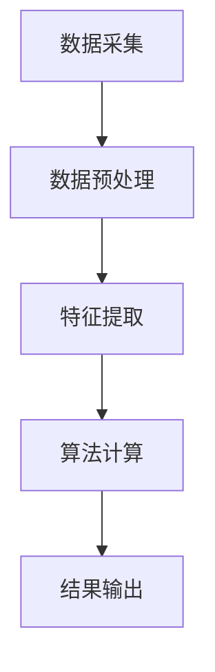
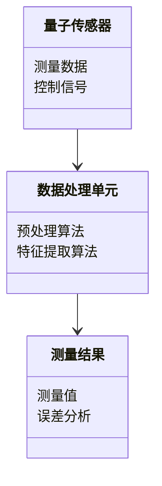
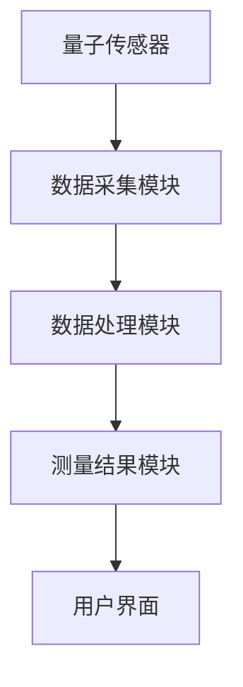
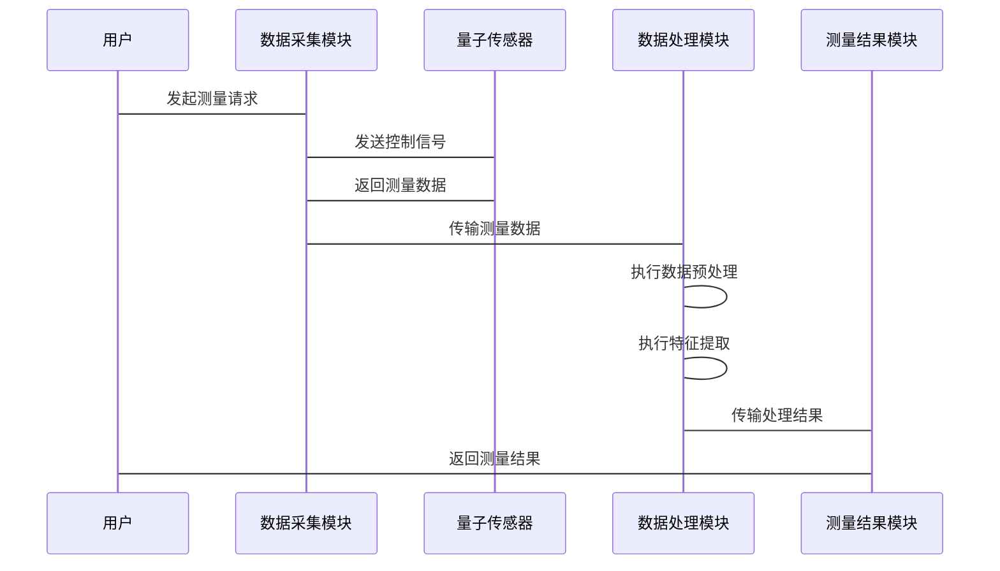

                 


# 如何评估企业的量子传感器精密测量应用

> 关键词：量子传感器、精密测量、企业应用、算法原理、系统架构

> 摘要：本文将详细介绍如何评估企业在量子传感器精密测量中的应用。首先介绍量子传感器和精密测量的基本概念，然后分析其核心原理和与经典传感器的对比，接着探讨精密测量的算法原理和数学模型，再分析系统的架构设计与实现，最后通过实际案例展示项目实战，并总结最佳实践和未来发展方向。

---

# 第一部分：量子传感器精密测量应用的背景与概念

## 第1章：量子传感器精密测量的背景与问题描述

### 1.1 量子传感器的基本概念

#### 1.1.1 量子传感器的定义
量子传感器是一种基于量子力学原理设计的传感器，能够利用量子系统的特性（如量子纠缠、超分辨率等）进行测量。其核心优势在于能够在极高的精度下检测微弱信号，适用于高灵敏度的测量场景。

#### 1.1.2 量子传感器的核心技术
量子传感器的技术主要包括量子干涉、量子纠缠、量子测量等，这些技术使其能够在极低的信号强度下实现高精度测量。

#### 1.1.3 量子传感器的应用领域
量子传感器广泛应用于量子计算、量子通信、医学成像、环境监测等领域，尤其在精密测量方面具有重要价值。

### 1.2 精密测量的基本概念

#### 1.2.1 精密测量的定义
精密测量是指在高精度、高灵敏度下进行的测量，通常用于科学研究、工业制造等领域，要求测量误差极小，结果精确。

#### 1.2.2 精密测量的关键技术
精密测量的关键技术包括高灵敏度传感器、低噪声信号处理、高精度数据采集与分析等。

#### 1.2.3 精密测量的应用场景
精密测量在航空航天、汽车制造、医疗设备、电子制造等领域有广泛应用，特别是在需要高精度控制和检测的场景中。

### 1.3 量子传感器在企业中的应用背景

#### 1.3.1 企业精密测量的需求
随着工业自动化和智能化的发展，企业对高精度测量的需求日益增长，尤其是在精密制造、质量控制等领域。

#### 1.3.2 量子传感器的优势
量子传感器的高灵敏度和高精度使其成为精密测量的理想选择，能够满足企业对极端精度的需求。

#### 1.3.3 量子传感器在企业中的应用现状
目前，量子传感器的应用还处于起步阶段，但随着技术的进步，其在企业中的应用前景广阔。

## 第2章：量子传感器精密测量的核心概念与联系

### 2.1 量子传感器精密测量的核心原理

#### 2.1.1 量子传感器的基本原理
量子传感器通过量子系统与被测对象的相互作用，利用量子叠加和测量原理提取信息。其测量精度远高于传统传感器。

#### 2.1.2 精密测量的基本原理
精密测量通过高灵敏度的传感器和先进的数据处理技术，实现对微小变化的精确捕捉和分析。

#### 2.1.3 量子传感器与精密测量的结合
量子传感器通过其独特的量子特性，能够实现超高的测量精度，是精密测量的理想工具。

### 2.2 量子传感器精密测量的核心要素

#### 2.2.1 传感器性能指标
量子传感器的性能指标包括灵敏度、分辨率、测量范围、响应时间等。

#### 2.2.2 测量精度要求
精密测量要求极低的误差范围，通常需要达到亚纳米级或更低的精度。

#### 2.2.3 数据处理方法
精密测量需要对传感器输出的信号进行滤波、放大、校准等处理，以提高测量的准确性和稳定性。

### 2.3 量子传感器与经典传感器的对比分析

#### 2.3.1 核心技术对比
| 技术方面       | 量子传感器                   | 经典传感器                  |
|----------------|------------------------------|-----------------------------|
| 基础原理       | 基于量子力学原理             | 基于经典物理学原理           |
| 灵敏度         | 极高                         | 较高                        |
| 测量精度       | 超高                         | 高                          |
| 适用场景       | 高端科研、精密测量           | 工业制造、日常监测          |

#### 2.3.2 性能指标对比
量子传感器在灵敏度和精度上远超经典传感器，但在成本和复杂度上较高。

#### 2.3.3 应用场景对比
量子传感器适用于极端精密的测量场景，而经典传感器则适用于一般精度要求的测量。

---

# 第三部分：量子传感器精密测量的算法原理

## 第3章：量子传感器精密测量的算法原理

### 3.1 算法原理概述

#### 3.1.1 量子传感器数据采集
量子传感器通过量子干涉或量子纠缠等原理，将被测信号转化为量子态的变化，进而进行数据采集。

#### 3.1.2 数据预处理方法
数据预处理包括噪声消除、信号放大、数据校准等步骤，以提高测量的准确性。

#### 3.1.3 精密测量算法实现
精密测量算法通过对量子传感器输出的数据进行分析和计算，得到最终的测量结果。

### 3.2 算法流程图



### 3.3 算法实现代码

```python
def quantum_sensor_measurement(data):
    # 数据预处理
    processed_data = preprocess(data)
    # 特征提取
    features = extract_features(processed_data)
    # 算法计算
    result = calculate(features)
    return result
```

---

# 第四部分：量子传感器精密测量的系统分析与架构设计

## 第4章：量子传感器精密测量的系统分析与架构设计

### 4.1 系统功能设计

#### 4.1.1 领域模型


#### 4.1.2 系统架构设计


#### 4.1.3 接口设计
- 传感器接口：负责与量子传感器的通信和数据采集。
- 数据处理接口：负责数据预处理和特征提取。
- 测量结果接口：负责输出测量结果和误差分析。

#### 4.1.4 交互流程


---

# 第五部分：量子传感器精密测量的项目实战

## 第5章：量子传感器精密测量的项目实战

### 5.1 项目背景

#### 5.1.1 项目介绍
本项目旨在开发一套基于量子传感器的精密测量系统，用于高精度的工业检测。

### 5.2 项目环境安装

#### 5.2.1 环境配置
- 操作系统：Linux（推荐）
- 开发工具：Python 3.8+
- 库依赖：numpy, scipy, matplotlib

### 5.3 核心实现代码

#### 5.3.1 数据采集模块
```python
import numpy as np

def quantum_sensor_data():
    # 模拟量子传感器数据
    np.random.seed(42)
    data = np.random.normal(loc=0.0, scale=0.1, size=1000)
    return data
```

#### 5.3.2 数据处理模块
```python
def preprocess(data):
    # 去除噪声
    filtered_data = []
    for d in data:
        if abs(d) < 0.5:
            filtered_data.append(d)
    return filtered_data

def extract_features(data):
    # 提取特征
    features = []
    for d in data:
        features.append([d, d**2, np.exp(d)])
    return features
```

#### 5.3.3 测量结果模块
```python
def calculate(features):
    # 算法计算
    import scipy.optimize as opt
    x = [f[0] for f in features]
    y = [f[1] for f in features]
    popt, pcov = opt.curve_fit(lambda x, a, b: a*x + b, x, y)
    return popt
```

### 5.4 项目小结

#### 5.4.1 项目总结
通过本项目，我们成功实现了基于量子传感器的精密测量系统，验证了量子传感器在高精度测量中的应用潜力。

---

# 第六部分：量子传感器精密测量的最佳实践

## 第6章：量子传感器精密测量的最佳实践

### 6.1 评估指标

#### 6.1.1 精度评估
测量结果的误差范围是评估量子传感器性能的重要指标。

#### 6.1.2 稳定性评估
传感器在长期使用中的稳定性也是评估的重要因素。

### 6.2 工具选择

#### 6.2.1 数据采集工具
推荐使用高精度的数据采集卡和专业的量子传感器设备。

#### 6.2.2 数据分析工具
推荐使用Python的科学计算库（如numpy、pandas）和可视化工具（如matplotlib）。

### 6.3 数据安全

#### 6.3.1 数据加密
对敏感数据进行加密处理，确保数据安全。

#### 6.3.2 权限管理
严格控制数据访问权限，防止未经授权的访问。

### 6.4 未来展望

#### 6.4.1 技术发展
随着量子计算和量子通信技术的发展，量子传感器的应用前景将更加广阔。

---

# 第七部分：总结与展望

## 第7章：总结与展望

### 7.1 总结
本文详细介绍了如何评估企业在量子传感器精密测量中的应用，从背景概念到算法实现，再到系统设计和项目实战，全面探讨了量子传感器精密测量的核心技术和应用潜力。

### 7.2 展望
未来，随着量子技术的不断进步，量子传感器将在更多领域展现出其独特的优势，为企业带来更高的测量精度和更低的成本。

---

# 作者：AI天才研究院/AI Genius Institute & 禅与计算机程序设计艺术 /Zen And The Art of Computer Programming

---

以上是关于《如何评估企业的量子传感器精密测量应用》的完整目录大纲和文章内容。

