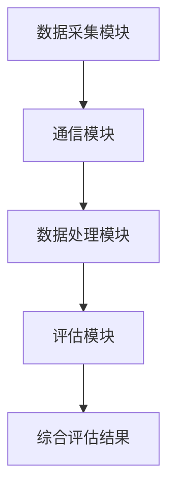
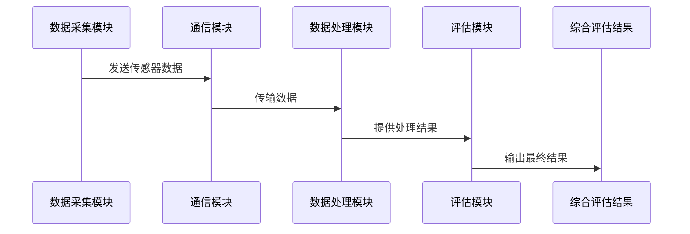

                 

# 如何评估企业的量子传感器网络应用

> 关键词：量子传感器、量子网络、传感器网络、企业应用、技术评估

> 摘要：本文将详细探讨如何评估企业的量子传感器网络应用。首先，我们将介绍量子传感器网络的基本概念和核心原理，然后分析评估的关键指标和方法论。通过系统分析和架构设计，我们将深入探讨评估系统的实现细节。最后，通过实际案例分析，我们将展示如何在企业中应用这些评估方法，并总结最佳实践和未来发展方向。

---

## 第一部分: 量子传感器网络应用概述

### 第1章: 量子传感器网络的背景与概念

#### 1.1 量子传感器网络的背景

##### 1.1.1 量子技术的发展与现状
- 量子技术是近年来发展迅速的前沿领域，涵盖量子计算、量子通信和量子传感。
- 当前，量子传感技术在材料科学、医学成像和环境监测等领域展现出巨大潜力。
- 量子传感器的高灵敏度和精确性使其成为下一代传感器技术的核心。

##### 1.1.2 传感器网络的演进历程
- 传感器网络从传统传感器发展到物联网传感器，再到量子传感器，经历了多次技术革新。
- 传感器网络的演进主要体现在感知能力的增强和数据处理效率的提升。

##### 1.1.3 量子传感器网络的定义与特点
- 量子传感器网络是结合量子传感技术和传统传感器网络的新型架构。
- 其特点包括高灵敏度、抗干扰能力强、数据传输安全性高等。

#### 1.2 量子传感器网络的核心概念

##### 1.2.1 量子传感器的基本原理
- 量子传感器利用量子纠缠和叠加效应进行精确测量。
- 典型应用包括量子陀螺仪和量子加速度计。

##### 1.2.2 量子通信与量子传感的关系
- 量子通信为量子传感器提供安全的数据传输通道。
- 量子传感依赖于量子通信的高安全性。

##### 1.2.3 量子传感器网络的系统架构
- 包括量子传感器节点、量子通信链路和数据处理中心。
- 通过量子通信实现传感器节点之间的高效协同。

#### 1.3 量子传感器网络的应用场景

##### 1.3.1 量子传感在国防领域的应用
- 军事侦察、目标识别和战场监测等领域。
- 提供高精度的环境感知能力。

##### 1.3.2 量子传感在民用领域的应用
- 环境监测、医疗诊断和智能交通系统。
- 例如，量子传感器可以用于地震预测和医疗成像。

##### 1.3.3 量子传感在工业领域的应用
- 工厂自动化、设备状态监测和质量控制。
- 提供高精度的生产过程监控能力。

#### 1.4 量子传感器网络的评估意义

##### 1.4.1 评估的重要性与必要性
- 评估量子传感器网络的性能是确保其可靠性和有效性的关键。
- 通过评估可以优化系统架构和参数设置。

##### 1.4.2 评估指标的初步探讨
- 灵敏度、精度、稳定性、响应时间等是主要评估指标。
- 不同应用场景需要不同的评估重点。

##### 1.4.3 评估方法的初步框架
- 包括实验室测试、现场测试和模拟测试三种方法。
- 综合评估指标和权重确定最终评估结果。

#### 1.5 本章小结
- 介绍了量子传感器网络的背景和核心概念。
- 探讨了其在各个领域的应用场景。
- 强调了评估的重要性和初步框架。

---

## 第二部分: 量子传感器网络的核心原理

### 第2章: 量子传感器网络的核心原理

#### 2.1 量子传感器的基本原理

##### 2.1.1 量子传感器的工作原理
- 利用量子力学的基本原理进行信号检测和处理。
- 例如，基于原子干涉的量子传感器。

##### 2.1.2 量子传感器的关键技术
- 量子纠缠技术、量子叠加技术和量子测量技术。

##### 2.1.3 量子传感器的性能指标
- 包括灵敏度、分辨率、动态范围等。

#### 2.2 量子通信的基本原理

##### 2.2.1 量子通信的定义与特点
- 利用量子态进行信息传输。
- 具有不可克隆性和安全性。

##### 2.2.2 量子通信的核心技术
- 量子密钥分发(QKD)和量子隐形传态。
- 通过光纤或自由空间进行量子通信。

##### 2.2.3 量子通信的安全性优势
- 抗量子计算攻击。
- 数据传输过程中无法被窃取。

#### 2.3 量子传感器网络的系统架构

##### 2.3.1 量子传感器网络的组成结构
- 包括传感器节点、通信节点和数据处理节点。
- 各节点之间通过量子通信实现互联。

##### 2.3.2 量子传感器网络的通信协议
- 定义了传感器节点之间的通信规则。
- 包括数据传输、数据加密和数据校验机制。

##### 2.3.3 量子传感器网络的拓扑结构
- 星型拓扑、链式拓扑和网状拓扑。
- 根据应用场景选择合适的拓扑结构。

#### 2.4 量子传感器网络的核心算法

##### 2.4.1 量子传感器数据处理算法
- 数据融合算法和异常检测算法。
- 通过算法优化传感器数据的处理效率。

##### 2.4.2 量子通信协议的实现算法
- 量子密钥分发协议和量子隐形传态协议。
- 算法实现需要高度精确的量子操作。

##### 2.4.3 量子传感器网络的优化算法
- 网络能耗优化算法和数据传输效率优化算法。
- 通过算法优化提升整体网络性能。

#### 2.5 本章小结
- 详细介绍了量子传感器和量子通信的基本原理。
- 探讨了量子传感器网络的系统架构和核心算法。
- 为后续评估提供了理论基础。

---

## 第三部分: 量子传感器网络的评估指标与方法论

### 第3章: 量子传感器网络的评估指标与方法论

#### 3.1 量子传感器网络的评估指标

##### 3.1.1 灵敏度与精度
- 传感器对微小变化的敏感程度。
- 数据测量的准确性。

##### 3.1.2 稳定性与可靠性
- 传感器在不同环境下的稳定表现。
- 网络在长期运行中的可靠性。

##### 3.1.3 响应时间与延迟
- 传感器对信号的响应速度。
- 网络数据传输的延迟时间。

##### 3.1.4 通信带宽与数据传输效率
- 网络通信的带宽利用率。
- 数据传输过程中的效率损失。

##### 3.1.5 能耗与环境适应性
- 传感器和网络的能耗水平。
- 网络在不同环境条件下的适应能力。

#### 3.2 量子传感器网络的评估方法

##### 3.2.1 实验室测试方法
- 在受控环境中测试传感器的性能指标。
- 包括灵敏度、精度和稳定性测试。

##### 3.2.2 现场测试方法
- 在实际应用场景中测试网络性能。
- 包括通信带宽、响应时间和能耗测试。

##### 3.2.3 模拟测试方法
- 使用仿真软件模拟网络运行环境。
- 通过模拟数据评估网络性能。

##### 3.2.4 综合评估方法
- 结合多种测试方法进行综合评估。
- 根据权重分配计算整体评估结果。

#### 3.3 评估指标的权重分配

##### 3.3.1 权重计算方法
- 根据应用场景需求确定各指标的权重。
- 例如，军事应用中稳定性权重较高。

##### 3.3.2 指标权重的调整
- 根据实际测试结果动态调整权重。
- 通过反馈机制优化评估结果。

#### 3.4 评估结果的分析与优化

##### 3.4.1 数据分析方法
- 使用统计学方法分析测试数据。
- 例如，均值、方差和相关性分析。

##### 3.4.2 性能优化策略
- 根据评估结果优化传感器参数。
- 例如，调整传感器灵敏度或通信带宽。

#### 3.5 本章小结
- 列举了量子传感器网络的主要评估指标。
- 探讨了多种评估方法及其适用场景。
- 强调了权重分配和数据分析的重要性。

---

## 第四部分: 系统分析与架构设计

### 第4章: 系统分析与架构设计

#### 4.1 评估系统的总体架构

##### 4.1.1 系统组成模块
- 数据采集模块、通信模块、数据处理模块和评估模块。
- 各模块协同工作完成整体评估。

##### 4.1.2 系统功能模块设计
- 数据采集模块负责收集传感器数据。
- 通信模块负责数据传输和加密。
- 数据处理模块负责数据分析和处理。
- 评估模块负责综合评估结果。

##### 4.1.3 系统交互流程
- 传感器数据 -> 数据采集模块 -> 通信模块 -> 数据处理模块 -> 评估模块 -> 综合评估结果。

#### 4.2 评估系统的详细设计

##### 4.2.1 数据采集模块设计
- 使用量子传感器进行数据采集。
- 支持多种数据格式和采集频率。

##### 4.2.2 通信模块设计
- 实现量子通信协议的数据传输。
- 提供数据加密和解密功能。

##### 4.2.3 数据处理模块设计
- 数据预处理、特征提取和模型训练。
- 使用机器学习算法优化数据处理效率。

##### 4.2.4 评估模块设计
- 综合评估指标和权重计算最终结果。
- 提供可视化报告和优化建议。

#### 4.3 系统架构图

#### 4.4 系统接口设计

##### 4.4.1 数据采集接口
- 支持多种传感器类型和数据格式。
- 提供API接口供其他模块调用。

##### 4.4.2 通信接口
- 支持多种通信协议，如光纤通信和无线通信。
- 提供加密和解密功能。

##### 4.4.3 数据处理接口
- 支持多种数据处理算法，如特征提取和模型训练。
- 提供API接口供评估模块调用。

#### 4.5 系统交互流程图

#### 4.6 本章小结
- 详细设计了评估系统的总体架构和功能模块。
- 通过系统架构图和交互流程图展示了各模块之间的关系。
- 为后续的系统实现提供了清晰的设计蓝图。

---

## 第五部分: 项目实战

### 第5章: 项目实战

#### 5.1 实战背景

##### 5.1.1 项目背景介绍
- 某企业计划部署量子传感器网络进行环境监测。
- 需要评估传感器网络的性能和可靠性。

##### 5.1.2 项目目标
- 评估量子传感器网络的灵敏度、精度和稳定性。
- 优化网络架构和通信协议。

#### 5.2 实战实施步骤

##### 5.2.1 环境搭建
- 部署量子传感器节点和通信设备。
- 配置数据采集模块、通信模块和数据处理模块。

##### 5.2.2 数据采集与处理
- 收集传感器数据并进行预处理。
- 使用机器学习算法优化数据处理效率。

##### 5.2.3 网络通信测试
- 测试通信带宽和数据传输延迟。
- 优化通信协议提高传输效率。

##### 5.2.4 综合评估
- 根据评估指标计算综合得分。
- 提出优化建议和改进措施。

#### 5.3 实战结果分析

##### 5.3.1 数据分析结果
- 传感器灵敏度达到预期目标。
- 数据传输延迟低于设定值。

##### 5.3.2 优化建议
- 建议调整传感器灵敏度以提高精度。
- 建议优化通信协议以降低延迟。

#### 5.4 实战经验总结

##### 5.4.1 实战中的问题与解决
- 数据采集过程中出现的干扰问题及解决方案。
- 通信模块中的加密算法优化经验。

##### 5.4.2 实战中的最佳实践
- 强调系统架构设计的重要性。
- 建议在实际应用中动态调整评估指标权重。

#### 5.5 本章小结
- 展示了量子传感器网络评估的实际应用案例。
- 总结了实战中的经验教训和最佳实践。
- 为后续项目提供了宝贵的参考经验。

---

## 第六部分: 最佳实践与小结

### 第6章: 最佳实践与小结

#### 6.1 评估中的注意事项

##### 6.1.1 系统架构设计
- 确保系统架构的可扩展性和灵活性。
- 根据应用场景选择合适的拓扑结构。

##### 6.1.2 数据处理与分析
- 使用高效的算法优化数据处理效率。
- 定期更新评估模型以适应变化的需求。

##### 6.1.3 网络安全性
- 强化量子通信的安全性措施。
- 定期进行安全漏洞检测和修复。

#### 6.2 未来发展趋势

##### 6.2.1 量子传感器技术的进步
- 新型量子传感器的开发和应用。
- 提高传感器的灵敏度和稳定性。

##### 6.2.2 网络架构的优化
- 探索新的网络拓扑结构。
- 提高网络的数据传输效率和安全性。

##### 6.2.3 人工智能的结合
- 将人工智能技术应用于量子传感器网络的评估和优化。
- 提高系统的智能化水平。

#### 6.3 本章小结
- 总结了量子传感器网络评估中的注意事项。
- 探讨了未来技术发展的主要方向。
- 强调了持续学习和实践的重要性。

---

## 作者

作者：AI天才研究院/AI Genius Institute & 禅与计算机程序设计艺术 /Zen And The Art of Computer Programming

---

通过以上详细的内容，我们全面探讨了如何评估企业的量子传感器网络应用。从基本概念到系统架构，再到实际案例分析，本文为读者提供了全面的视角和深入的分析。希望本文能为企业在量子传感器网络的应用和评估中提供有价值的参考和指导。

