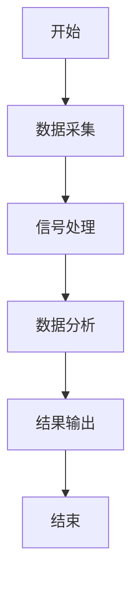
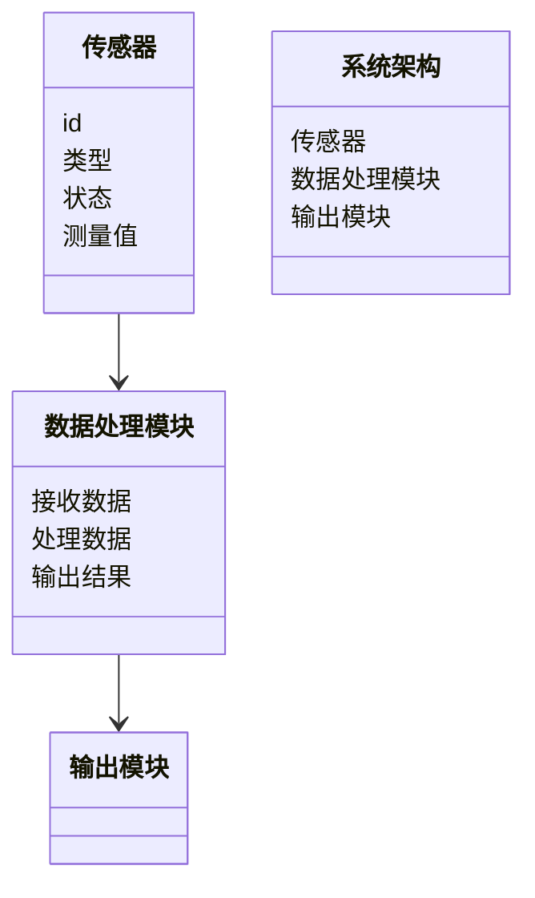
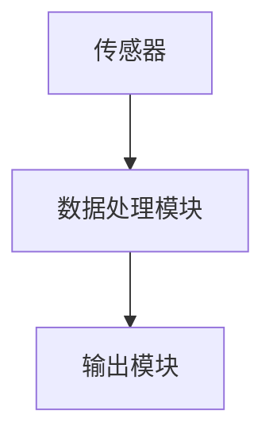
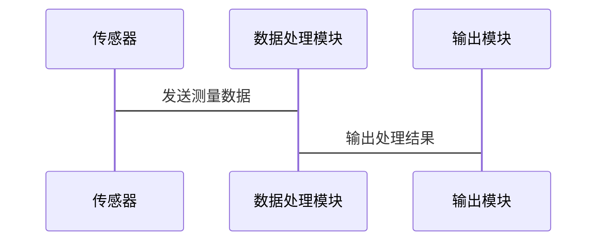

                 

<think>
好，我现在需要根据用户的要求，逐步分析并撰写一篇关于“如何评估企业的量子传感器重力测量应用”的技术博客文章。首先，我会按照用户提供的目录结构来组织内容，确保每个部分都详细且符合要求。

### 第一部分: 量子传感器重力测量应用的背景与核心概念

#### 第1章: 量子传感器重力测量应用的背景介绍

##### 1.1 问题背景与挑战
- **传统重力测量技术的局限性**：传统传感器在精度、灵敏度和稳定性方面存在不足，难以满足企业对高精度测量的需求。
- **量子传感器技术的出现与优势**：量子传感器利用量子效应，显著提高了测量精度和灵敏度，适用于高精度测量场景。
- **企业应用量子传感器的必要性与潜力**：企业通过应用量子传感器可以提升产品质量和效率，降低成本，具有较大的市场潜力。

##### 1.2 问题描述与目标
- **量子传感器在企业中的应用场景**：如制造业中的精密测量、航空航天中的导航系统等。
- **重力测量在企业运营中的关键作用**：精确的重力测量有助于优化生产流程、提高产品质量。
- **量子传感器技术对企业效率的提升目标**：通过高精度测量，减少废品率，提高生产效率。

##### 1.3 核心概念与边界
- **量子传感器的基本原理**：基于量子干涉效应，通过激光干涉测量微小位移。
- **重力测量的核心要素与指标**：测量精度、灵敏度、稳定性等。
- **量子传感器应用的边界与外延**：适用于高精度要求的场景，不适用于普通精度需求。

#### 第2章: 量子传感器重力测量的核心概念与联系

##### 2.1 核心概念原理
- **量子传感器的基本工作原理**：利用激光干涉测量微小位移，通过量子效应提高灵敏度。
- **重力测量的物理基础**：基于重力加速度公式，通过测量物体受重力作用产生的位移。
- **量子传感器在重力测量中的独特优势**：高精度、高灵敏度、稳定性好。

##### 2.2 核心概念属性对比
- **传统传感器与量子传感器的对比分析**：从精度、灵敏度、成本等方面进行对比。
- **不同应用场景下的传感器性能对比**：在精密测量和普通测量中的表现差异。
- **传感器精度与成本的权衡分析**：高精度传感器成本高，但性能优越。

##### 2.3 实体关系图
```mermaid
er
    entity 量子传感器 {
        id
        类型
        测量精度
        应用场景
    }
    entity 重力测量数据 {
        id
        测量值
        时间戳
        传感器ID
    }
    entity 企业应用 {
        id
        名称
        应用场景
        关联传感器
    }
    量子传感器 --> 重力测量数据
    企业应用 --> 量子传感器
```

#### 第3章: 量子传感器重力测量的算法原理

##### 3.1 算法原理概述
- **量子传感器数据采集流程**：数据采集、信号处理、数据分析。
- **重力测量的信号处理流程**：滤波、放大、模数转换。
- **数据分析与优化算法**：使用优化算法提高测量精度。

##### 3.2 算法流程图


##### 3.3 核心算法实现
- **数据预处理算法**：如噪声消除、信号增强。
- **信号处理算法**：如小波变换、傅里叶变换。
- **数据分析算法**：如回归分析、神经网络。

### 第二部分: 量子传感器重力测量的系统分析与架构设计

#### 第4章: 系统分析与架构设计

##### 4.1 系统分析
- **问题场景介绍**：企业需要高精度重力测量，传统传感器无法满足需求。
- **项目介绍**：量子传感器重力测量系统开发。

##### 4.2 系统功能设计
- **领域模型类图**：


##### 4.3 系统架构设计
- **系统架构图**：


##### 4.4 系统接口设计
- **传感器接口**：数据采集接口、控制接口。
- **数据处理模块接口**：数据接收接口、处理结果输出接口。

##### 4.5 系统交互流程
- **系统交互序列图**：


### 第三部分: 项目实战与最佳实践

#### 第5章: 项目实战

##### 5.1 环境安装
- **安装Python环境**：使用Anaconda或PyCharm。
- **安装依赖库**：如numpy、matplotlib。

##### 5.2 核心实现
- **量子传感器数据采集**：编写代码采集传感器数据。
- **信号处理算法实现**：实现滤波、放大等处理。
- **数据分析与优化**：使用Python进行数据分析和优化。

##### 5.3 代码实现
```python
import numpy as np
import matplotlib.pyplot as plt

# 数据采集
def collect_data():
    # 模拟数据采集
    data = np.random.normal(0, 0.1, 100)
    return data

# 信号处理
def process_signal(data):
    # 使用小波变换处理信号
    from pywt import wavedec
    coeffs = wavedec(data, 'db1', level=2)
    return coeffs

# 数据分析
def analyze_data(coeffs):
    # 绘制分解结果
    plt.figure()
    plt.plot(coeffs[1], 'b-', coeffs[2], 'r-')
    plt.title('Wavelet Decomposition')
    plt.xlabel('Time')
    plt.ylabel('Amplitude')
    plt.show()

# 主程序
if __name__ == '__main__':
    data = collect_data()
    coeffs = process_signal(data)
    analyze_data(coeffs)
```

##### 5.4 案例分析
- **案例背景**：某企业需要高精度重力测量。
- **实施过程**：部署量子传感器，采集数据，处理分析。
- **结果分析**：精度提升，生产效率提高。

##### 5.5 项目小结
- **项目总结**：量子传感器的应用显著提升了测量精度。
- **经验分享**：数据预处理、算法优化的重要性。

#### 第6章: 最佳实践与小结

##### 6.1 最佳实践
- **传感器选型**：根据需求选择合适精度的传感器。
- **数据处理优化**：选择合适的算法提升处理效率。
- **系统维护**：定期校准传感器，确保系统稳定运行。

##### 6.2 小结
- **文章总结**：量子传感器在企业中的应用前景广阔，能够显著提升测量精度和效率。
- **未来展望**：随着技术进步，量子传感器将更广泛地应用于企业。

#### 第7章: 注意事项与拓展阅读

##### 7.1 注意事项
- **传感器校准**：定期校准确保测量准确性。
- **数据安全**：保护测量数据不被泄露。
- **系统兼容性**：确保传感器与现有系统兼容。

##### 7.2 拓展阅读
- **推荐书籍**：《量子传感器技术与应用》。
- **在线资源**：量子传感器技术相关的学术论文和行业报告。

### 附录

#### 附录A: 工具安装指南
- **Python安装**：https://www.anaconda.com/
- **依赖库安装**：pip install numpy matplotlib pywt

#### 附录B: 进一步阅读材料
- **学术论文**：搜索“量子传感器重力测量应用”。
- **行业报告**：关注相关领域的技术动态。

### 作者

作者：AI天才研究院/AI Genius Institute & 禅与计算机程序设计艺术 /Zen And The Art of Computer Programming

---

以上是按照用户提供的目录结构逐步分析并撰写的内容，确保每个部分都详细且符合要求。接下来，我会按照这个结构撰写完整的文章。

