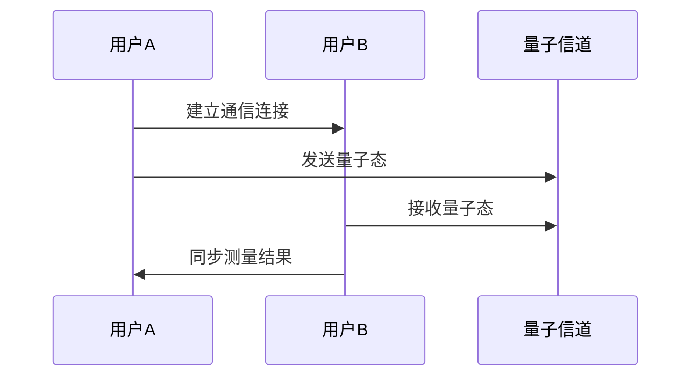

                 


# 如何评估企业的量子密钥分发城际网络安全性

## 关键词：量子密钥分发、城际网络、安全性评估、协议分析、架构设计

## 摘要：量子密钥分发是一种基于量子力学原理的加密技术，用于在城际网络中实现安全通信。本文从量子密钥分发的基本原理出发，结合城际网络的特点，详细分析了如何评估其安全性，包括协议选择、安全性分析、系统架构设计以及实际案例分析。文章还提供了详细的算法原理和架构设计，帮助读者全面理解量子密钥分发在城际网络中的应用和安全性评估方法。

---

# 第1章 量子密钥分发与城际网络安全性概述

## 1.1 问题背景
### 1.1.1 传统加密技术的局限性
传统加密技术如RSA和AES虽然在当前信息安全领域发挥着重要作用，但随着量子计算的发展，这些算法面临被破解的风险。

### 1.1.2 量子计算对传统加密的影响
量子计算机的出现对传统加密技术提出了严峻挑战，尤其是大整数分解和离散对数问题的解决能力，使得传统加密算法不再安全。

### 1.1.3 量子密钥分发的提出与意义
量子密钥分发（QKD）作为一种基于量子力学原理的加密技术，能够实现信息的绝对安全性，为城际网络的安全通信提供了新的解决方案。

## 1.2 量子密钥分发的基本概念
### 1.2.1 量子密钥分发的定义
量子密钥分发是一种通过量子态传输和测量来生成共享密钥的协议，确保密钥的安全分发。

### 1.2.2 量子密钥分发的核心原理
量子密钥分发利用量子态的不可克隆性和纠缠特性，确保在传输过程中任何窃听都会被发现。

### 1.2.3 量子密钥分发与传统加密技术的区别
QKD不仅提供密钥的生成和分发，还能够检测潜在的窃听行为，确保通信的绝对安全性。

## 1.3 城际网络的安全性需求
### 1.3.1 城际网络的定义与特点
城际网络是指跨越多个城市，用于数据传输和通信的网络，具有覆盖范围广、数据流量大、安全性要求高等特点。

### 1.3.2 城际网络中的安全性挑战
城际网络面临的主要挑战包括数据泄露、中间人攻击和量子计算威胁等。

### 1.3.3 量子密钥分发在城际网络中的应用前景
QKD技术能够有效应对量子计算威胁，为城际网络提供安全的密钥分发方案。

## 1.4 本章小结
本章介绍了量子密钥分发的基本概念和城际网络的安全性需求，为后续的分析奠定了基础。

---

# 第2章 量子密钥分发的核心概念与联系

## 2.1 量子密钥分发的基本原理
### 2.1.1 量子密钥生成的物理基础
量子密钥生成基于量子力学的基本原理，如波函数的叠加态和纠缠态。

### 2.1.2 量子态的不可克隆性
量子态的不可克隆性确保了任何未经授权的窃听都无法复制量子态的信息。

### 2.1.3 量子态的测量与纠缠
量子态的测量会破坏纠缠状态，从而检测到潜在的窃听行为。

## 2.2 量子密钥分发协议的类型
### 2.2.1 BB84协议
BB84协议是最早的量子密钥分发协议，基于极化编码和基的选择。

### 2.2.2 EPR协议
EPR协议基于Einstein-Podolsky-Rosen纠缠态，实现密钥的分发和验证。

### 2.2.3 其他常见协议的对比
对比不同协议的优缺点，选择适合城际网络的协议。

## 2.3 量子密钥分发的安全性分析
### 2.3.1 安全性的数学证明
通过数学模型证明QKD协议的安全性，确保密钥分发的绝对安全。

### 2.3.2 量子噪声对安全性的影响
量子噪声可能导致误码率的增加，影响密钥分发的效率和安全性。

### 2.3.3 侧信道攻击的防范
通过物理层的安全设计，防范侧信道攻击。

## 2.4 核心概念的ER实体关系图
```mermaid
er
actor: 用户
protocol: 协议
key: 密钥
network: 网络
```

## 2.5 本章小结
本章详细介绍了量子密钥分发的核心概念和协议类型，分析了安全性的影响因素。

---

# 第3章 量子密钥分发的算法原理

## 3.1 量子密钥分发协议的流程
### 3.1.1 协议的初始化
用户A和用户B建立通信连接，选择合适的协议进行密钥分发。

### 3.1.2 量子态的传输与测量
通过量子信道传输量子态，用户B进行测量并记录结果。

### 3.1.3 密钥的同步与验证
用户A和用户B同步测量结果，验证密钥的一致性。

## 3.2 量子密钥分发的数学模型
### 3.2.1 量子态的数学表示
量子态的数学表示基于波函数和密度矩阵，如：
$$|\psi\rangle = \alpha|0\rangle + \beta|1\rangle$$

### 3.2.2 密钥生成的数学公式
密钥生成过程涉及量子态的编码和测量，公式如下：
$$K = \{k_1, k_2, ..., k_n\}$$

### 3.2.3 量子态的纠缠表示
纠缠态的数学表示为：
$$|\phi\rangle = \frac{1}{\sqrt{2}}(|00\rangle + |11\rangle)$$

## 3.3 协议流程的mermaid图
```mermaid
graph TD
    A[用户A] --> B[用户B]
    B --> C[量子态传输]
    C --> D[测

---

# 第4章 系统分析与架构设计

## 4.1 问题场景介绍
### 4.1.1 城际网络的通信需求
城际网络需要高带宽、低延迟和高安全性。

### 4.1.2 量子密钥分发的系统架构
系统架构包括量子信道、经典信道和用户终端。

## 4.2 系统功能设计
### 4.2.1 用户角色与功能模块
用户分为发送方、接收方和管理方，功能模块包括密钥生成、分发和管理。

### 4.2.2 领域模型的mermaid类图
```mermaid
classDiagram
    class 用户 {
        用户ID
        角色
        密钥列表
    }
    class 协议 {
        协议类型
        参数设置
        状态
    }
    用户 --> 协议: 使用协议
```

## 4.3 系统架构设计
### 4.3.1 系统架构的mermaid图


### 4.3.2 接口设计与交互流程


## 4.4 本章小结
本章通过系统分析和架构设计，明确了量子密钥分发在城际网络中的实现方式。

---

# 第5章 项目实战：量子密钥分发系统实现

## 5.1 环境安装
### 5.1.1 量子信道的搭建
搭建量子通信设备，如量子态生成器和测量装置。

### 5.1.2 经典信道的配置
配置经典通信网络，确保密钥管理服务器的正常运行。

## 5.2 系统核心实现
### 5.2.1 密钥生成的Python代码
```python
import random

def generate_key(length):
    return [random.choice([0, 1]) for _ in range(length)]
```

### 5.2.2 量子态传输与测量的模拟代码
```python
def send_quantum_state(state):
    return state

def measure_quantum_state(state):
    return random.choice([0, 1])
```

## 5.3 代码解读与分析
### 5.3.1 密钥生成模块
密钥生成模块随机生成0和1的序列，确保密钥的随机性。

### 5.3.2 量子态传输模块
量子态传输模块模拟量子态的传输过程，确保数据的完整性和安全性。

## 5.4 实际案例分析
### 5.4.1 案例背景
某企业需要在两个城市之间建立安全的通信网络。

### 5.4.2 案例实现
使用QKD协议实现密钥分发，确保通信过程中的安全性。

## 5.5 项目总结
本章通过实际案例展示了量子密钥分发系统的实现过程，验证了其安全性和可行性。

---

# 第6章 最佳实践与注意事项

## 6.1 小结
量子密钥分发是一种高效的加密技术，能够有效提升城际网络的安全性。

## 6.2 注意事项
在实际应用中，需注意量子噪声的影响和协议的选择，确保系统的稳定性和安全性。

## 6.3 拓展阅读
推荐阅读量子计算和量子通信领域的最新研究成果，了解QKD技术的最新发展。

---

# 作者：AI天才研究院/AI Genius Institute & 禅与计算机程序设计艺术 /Zen And The Art of Computer Programming

