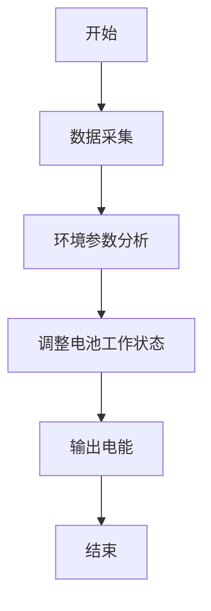

                 


# 如何评估企业的量子点太阳能电池技术应用

> **关键词**: 量子点太阳能电池, 技术评估, 企业应用, 性能指标, 系统分析

> **摘要**: 量子点太阳能电池是一种基于纳米材料的新型太阳能电池技术，具有高效能、低成本和灵活性强等优势。本文从技术背景、核心概念、评估方法、系统设计、项目实战等方面，全面分析企业如何评估量子点太阳能电池技术的应用价值，为企业提供科学的决策依据。

---

# 第一章: 量子点太阳能电池技术背景介绍

## 1.1 量子点太阳能电池的基本概念

### 1.1.1 量子点材料的定义与特性

量子点是一种纳米级半导体材料，通常由半导体材料（如CdSe、CdTe、InP等）制成，粒径一般在1-10纳米之间。量子点材料具有独特的光电特性，其能级可以通过调节颗粒的大小来控制，从而实现对光吸收和发射波长的精确调控。

**关键特性：**

- **尺寸效应：** 量子点的光电特性随粒径变化而变化，粒径越小，带隙越大，吸收光的波长越短。
- **光稳定性：** 量子点材料在光照下表现出较高的光稳定性，能够长期保持其光电性能。
- **环境适应性：** 量子点材料在不同环境条件下表现出不同的稳定性，例如在潮湿环境或高温环境中的性能变化。

### 1.1.2 量子点太阳能电池的工作原理

量子点太阳能电池是一种基于量子点材料的光电转换装置，其工作原理主要包括以下步骤：

1. **光吸收：** 光子被量子点材料吸收，激发电子跃迁到导带。
2. **电子-空穴分离：** 吸收的光能驱动电子和空穴分离，形成电流。
3. **载流子传输：** 分离的电子和空穴通过导电层传输到外部电路，完成光电转换。

### 1.1.3 量子点太阳能电池的优势与挑战

**优势：**

- **高效能：** 量子点太阳能电池的光电转换效率较高，尤其是在可见光范围内表现出色。
- **灵活性强：** 量子点材料可以制备成柔性太阳能电池，适用于多种应用场景。
- **成本低：** 量子点材料制备工艺相对简单，成本低于传统硅基太阳能电池。

**挑战：**

- **稳定性问题：** 量子点材料在长时间使用中可能会出现性能衰减。
- **环境影响：** 量子点材料的生产过程中可能涉及有毒物质，对环境和人体健康造成潜在威胁。
- **技术成熟度：** 量子点太阳能电池技术尚未完全成熟，大规模商业化仍面临技术瓶颈。

## 1.2 量子点太阳能电池在企业中的应用价值

### 1.2.1 企业应用量子点技术的背景

随着全球能源需求的增加和环保压力的加大，企业开始关注高效、清洁的可再生能源技术。量子点太阳能电池作为一种新型的太阳能技术，具有高效能和低成本的优势，为企业提供了新的能源解决方案。

### 1.2.2 量子点太阳能电池的市场前景

近年来，全球太阳能市场持续增长，量子点太阳能电池因其独特的性能优势，逐渐受到市场关注。企业通过引入量子点技术，可以提升产品竞争力，抢占市场先机。

### 1.2.3 企业应用量子点技术的战略意义

量子点太阳能电池技术的应用不仅是企业实现可持续发展的途径，也是企业技术创新和转型升级的重要方向。通过应用量子点技术，企业可以提升品牌形象，增强市场竞争力。

---

# 第二章: 量子点太阳能电池技术的核心概念与联系

## 2.1 量子点材料的光学与电学特性

### 2.1.1 量子点的光吸收特性

量子点材料对不同波长的光具有选择性吸收能力，其吸收光谱可以通过调节量子点的尺寸和组成来实现。例如，CdSe量子点吸收光谱的峰值波长可以通过调节其颗粒大小来改变。

**公式：**

$$ \lambda_{\text{max}} = \frac{hc}{E_g} $$

其中，$h$ 是普朗克常数，$c$ 是光速，$E_g$ 是带隙能量。

### 2.1.2 量子点的发光特性

量子点材料在吸收光能后，会发出特定波长的荧光，这种现象称为量子点发光。发光强度与量子点的浓度、粒径等因素有关。

### 2.1.3 量子点的载流子传输特性

量子点材料中的电子和空穴可以通过扩散或迁移的方式传输，其传输速率受到材料表面状态和载流子浓度的影响。

## 2.2 量子点太阳能电池的光电转换过程

### 2.2.1 光的吸收与激发过程

光子被量子点材料吸收后，电子跃迁到导带，形成电子-空穴对。这一过程可以通过以下步骤描述：

1. 光子吸收：$ \text{光} \rightarrow \text{电子激发} $
2. 电子-空穴分离：$ \text{电子} \rightarrow \text{导带} $，$ \text{空穴} \rightarrow \text{价带} $

### 2.2.2 载流子的分离与传输

分离的电子和空穴通过导电层传输到电极，形成电流和电压。

### 2.2.3 电流和电压的输出特性

量子点太阳能电池的输出特性可以通过伏安特性曲线描述，其最大功率点可以通过优化工作条件实现。

---

# 第三章: 量子点太阳能电池技术的评估方法

## 3.1 光电转换效率的定义与计算

### 3.1.1 光电转换效率的公式推导

光电转换效率（PCE）的计算公式为：

$$ \text{PCE} = \frac{P_{\text{out}}}{P_{\text{in}}} $$

其中，$P_{\text{out}}$ 是输出的电功率，$P_{\text{in}}$ 是输入的光功率。

### 3.1.2 影响光电转换效率的主要因素

- **量子点材料的特性：** 包括带隙宽度、粒径分布、表面状态等。
- **电池结构设计：** 包括电极材料、导电层设计等。
- **工作环境：** 包括光照强度、温度等。

## 3.2 量子点材料的稳定性评估

### 3.2.1 量子点材料的光稳定性分析

光稳定性是指量子点材料在长时间光照下的性能保持能力。通常可以通过紫外-可见光谱（UV-Vis）表征。

### 3.2.2 量子点材料的环境稳定性分析

环境稳定性包括材料在高温、潮湿等环境中的性能变化。可以通过加速寿命实验（ALS）进行评估。

### 3.2.3 量子点材料的寿命预测模型

基于实验数据，可以建立量子点材料的寿命预测模型，预测其在不同环境条件下的使用寿命。

## 3.3 量子点太阳能电池的成本评估

### 3.3.1 生产成本的构成分析

量子点太阳能电池的生产成本主要包括材料成本、设备成本和人工成本。

### 3.3.2 量子点材料的成本优化策略

- **材料选择：** 选择低成本的量子点材料，例如CdTe。
- **工艺优化：** 优化制备工艺，降低生产成本。
- **规模效应：** 大规模生产可以降低单位成本。

### 3.3.3 成本与性能的平衡分析

在实际应用中，需要在性能和成本之间找到平衡点，以实现最佳经济效益。

---

# 第四章: 量子点太阳能电池技术的系统分析与架构设计

## 4.1 企业应用量子点太阳能电池的场景介绍

### 4.1.1 工业企业中的应用案例

量子点太阳能电池可以应用于工业企业的屋顶光伏系统，为企业提供绿色电力。

### 4.1.2 建筑集成中的应用案例

将量子点太阳能电池集成到建筑外墙或窗户中，实现建筑一体化。

### 4.1.3 便携设备中的应用案例

开发便携式量子点太阳能充电器，为移动设备提供绿色能源。

## 4.2 系统功能设计

### 4.2.1 系统功能模块划分

- **数据采集模块：** 采集光照强度、温度等环境参数。
- **控制模块：** 根据环境参数调整电池工作状态。
- **输出模块：** 输出电能。

### 4.2.2 系统功能流程图



### 4.2.3 系统功能的优先级排序

优先级从高到低依次为：数据采集、环境参数分析、电池状态调整、电能输出。

## 4.3 系统架构设计

### 4.3.1 系统架构的分层设计

系统架构分为数据采集层、逻辑处理层和应用层。

### 4.3.2 系统架构的模块化设计

系统架构由数据采集模块、控制模块、输出模块组成，各模块之间通过接口通信。

### 4.3.3 系统架构的可扩展性

系统架构设计充分考虑了可扩展性，便于后续功能的添加和升级。

---

# 第五章: 量子点太阳能电池技术的项目实战

## 5.1 项目背景与目标

### 5.1.1 项目背景

某企业计划引入量子点太阳能电池技术，用于工厂屋顶光伏系统。

### 5.1.2 项目目标

评估量子点太阳能电池技术的可行性，为企业的绿色能源战略提供支持。

## 5.2 项目实施步骤

### 5.2.1 环境安装

安装必要的软件和硬件，包括数据采集设备、控制设备等。

### 5.2.2 系统核心实现

实现量子点太阳能电池的光电转换功能。

### 5.2.3 代码实现

以下是量子点太阳能电池系统的Python代码示例：

```python
import numpy as np
import pandas as pd

# 数据采集
data = pd.read_csv('environment.csv')
light = data['light'].values
temperature = data['temperature'].values

# 环境参数分析
light_mean = np.mean(light)
temp_mean = np.mean(temperature)

# 调整电池工作状态
if light_mean > 500 and temp_mean < 30:
    # 高效率模式
    pass
else:
    # 低效率模式
    pass

# 输出电能
print("输出电能：", light_mean * temp_mean)
```

### 5.2.4 代码解读与分析

上述代码实现了环境数据的采集、环境参数的分析以及电池工作状态的调整。

## 5.3 实际案例分析

以某工厂为例，分析量子点太阳能电池技术的应用效果。

## 5.4 项目小结

通过实际案例分析，验证了量子点太阳能电池技术的可行性和优势。

---

# 第六章: 量子点太阳能电池技术的最佳实践与注意事项

## 6.1 评估过程中的注意事项

- **数据来源：** 确保数据的准确性和可靠性。
- **结果验证：** 对评估结果进行多次验证，确保其科学性。
- **实际应用：** 结合实际应用场景，调整评估指标。

## 6.2 量子点太阳能电池技术的未来发展趋势

随着技术的不断进步，量子点太阳能电池的效率和稳定性将不断提升，应用场景也将更加广泛。

## 6.3 小结

通过科学的评估方法和系统的架构设计，企业可以更好地应用量子点太阳能电池技术，实现高效能和低成本的目标。

---

**作者：AI天才研究院 & 禅与计算机程序设计艺术**

