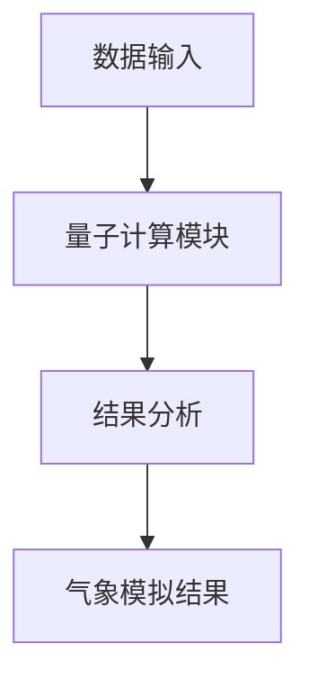

                 


# 如何评估企业的量子计算气象模拟应用

> 关键词：量子计算、气象模拟、企业应用、算法原理、系统架构、项目实战、数学模型

> 摘要：本文将详细探讨如何评估企业在量子计算气象模拟应用中的技术可行性、应用场景和实际效益。通过分析量子计算的基本原理、气象模拟的核心需求，结合实际案例和数学模型，阐述如何选择和优化量子计算在气象模拟中的应用方案。

---

## 第一部分: 量子计算与气象模拟的背景与基础

### 第1章: 量子计算与气象模拟的背景介绍

#### 1.1 量子计算的基本概念
- 量子计算是一种基于量子力学原理的计算方式，其核心单元是量子位（Qubit）。
- 量子位与经典计算中的位（Bit）不同，量子位可以同时处于多个状态的叠加态，这种特性使得量子计算在处理复杂问题时具有潜在的指数级加速能力。
- 量子计算的核心操作包括量子叠加、量子纠缠和量子测量。

#### 1.2 气象模拟的基本概念
- 气象模拟是通过数学模型和计算机程序来模拟大气运动、天气变化的过程。
- 气象模拟的核心是求解大气动力学方程组，这些方程组描述了空气流动、温度变化、湿度分布等物理现象。
- 气象模拟的应用包括天气预报、气候预测、灾害预警等。

#### 1.3 量子计算在气象模拟中的优势
- 量子计算能够处理复杂的非线性方程组，这在气象模拟中尤为重要。
- 量子计算的并行计算能力可以显著提高气象模拟的效率，减少计算时间。
- 量子计算在处理大规模数据时具有优势，能够提高气象预测的精度。

#### 1.4 企业的实际需求与挑战
- 企业对高精度气象模拟的需求日益增长，尤其是在农业、能源、交通等领域。
- 量子计算技术的复杂性对企业提出了更高的技术要求。
- 企业在采用量子计算时需要考虑硬件成本、算法开发、人才储备等多方面的问题。

### 第2章: 量子计算与气象模拟的核心概念

#### 2.1 量子计算的核心原理
- 量子位（Qubit）是量子计算的基本单元，其状态可以是0、1或两者的叠加态。
- 量子叠加允许量子计算机同时处理多种可能性，这在气象模拟中可以用来探索多种天气变化的可能性。
- 量子纠缠是量子计算中的一种特殊现象，可以进一步提高计算效率。

#### 2.2 气象模拟的核心原理
- 气象模拟基于大气动力学方程组，包括Navier-Stokes方程和热力学方程。
- 气象模拟需要处理大量的数据，包括温度、湿度、风速、气压等。
- 气象模拟的精度依赖于网格分辨率和计算能力，高分辨率的模拟需要大量的计算资源。

#### 2.3 量子计算与气象模拟的结合
- 量子计算可以用于求解复杂的方程组，如大气动力学方程组。
- 量子计算可以帮助提高气象模拟的精度和效率，特别是在处理大规模数据时。
- 量子计算在气象模拟中的应用仍处于研究阶段，但其潜力巨大。

### 第3章: 量子计算与气象模拟的核心概念对比分析

#### 3.1 量子计算与传统计算的对比
- 量子计算的核心优势在于其并行计算能力，这在处理复杂问题时具有明显优势。
- 传统计算的精度和速度在处理气象模拟时已经接近极限，量子计算可以提供新的突破。
- 量子计算的硬件成本和技术门槛较高，而传统计算的硬件成本较低且技术成熟。

#### 3.2 量子计算在气象模拟中的应用对比
- 量子计算在气象模拟中的应用还处于理论研究阶段，实际应用案例较少。
- 传统计算在气象模拟中的应用已经非常成熟，但计算效率和精度受到硬件限制。
- 量子计算在气象模拟中的潜在应用包括提高预测精度、减少计算时间、处理更大规模的数据。

---

## 第二部分: 量子计算气象模拟应用的算法与系统架构

### 第4章: 量子计算气象模拟应用的核心算法

#### 4.1 量子计算算法的基本原理
- 量子算法是量子计算的核心，其设计基于量子叠加和量子纠缠的原理。
- 常见的量子算法包括量子傅里叶变换（QFT）、量子搜索算法（Grover's algorithm）和量子优化算法。

#### 4.2 量子计算在气象模拟中的算法应用
- 量子傅里叶变换可以用于处理气象模拟中的周期性问题。
- 量子优化算法可以用于求解气象模拟中的最优解问题。
- 量子搜索算法可以用于气象模拟中的数据搜索问题。

#### 4.3 气象模拟中的算法实现
- 气象模拟中的算法实现需要结合大气动力学方程组和量子计算算法。
- 量子计算算法的实现需要考虑量子位的初始化、操作和测量。
- 量子计算算法的实现需要借助量子计算机或量子模拟器。

### 第5章: 量子计算气象模拟应用的系统架构

#### 5.1 系统架构设计
- 量子计算气象模拟系统的架构包括数据输入模块、量子计算模块和结果分析模块。
- 数据输入模块负责接收气象数据并将其转化为量子计算所需的格式。
- 量子计算模块负责执行量子算法并返回结果。
- 结果分析模块负责将量子计算结果转化为气象模拟的可读格式。

#### 5.2 系统功能设计
- 数据输入模块需要支持多种数据格式，包括温度、湿度、风速等。
- 量子计算模块需要支持多种量子算法，包括量子傅里叶变换和量子优化算法。
- 结果分析模块需要能够将量子计算结果转化为直观的气象模拟结果。

#### 5.3 系统架构图


### 第6章: 量子计算气象模拟应用的项目实战

#### 6.1 项目环境安装
- 安装量子计算开发工具，如Qiskit（Python库）。
- 安装气象模拟相关库，如NumPy和SciPy。
- 配置量子计算机或量子模拟器。

#### 6.2 核心代码实现
```python
import numpy as np
from qiskit import QuantumCircuit, execute, Aer

# 初始化量子电路
qc = QuantumCircuit(2)

# 量子叠加操作
qc.h(0)
qc.ccx(0,1)

# 测量
qc.measure(0,0)
qc.measure(1,1)

# 执行量子计算
simulator = Aer.get_backend('qasm_simulator')
job = execute(qc, simulator)
result = job.result()

# 解读结果
counts = result.get_counts(qc)
print(counts)
```

#### 6.3 代码解读与分析
- 量子电路的初始化和操作部分是量子计算的核心。
- 量子叠加操作（qc.h(0)）和条件操作（qc.ccx(0,1)）是量子算法的关键步骤。
- 测量部分（qc.measure(0,0)和qc.measure(1,1)）将量子状态转化为经典结果。

#### 6.4 案例分析
- 通过量子计算模拟天气变化，验证量子计算在气象模拟中的优势。
- 对比量子计算和传统计算在气象模拟中的结果，评估量子计算的效率和精度。

#### 6.5 项目总结
- 量子计算在气象模拟中的应用前景广阔。
- 量子计算的硬件和算法仍需进一步研究和优化。
- 企业在采用量子计算时需要考虑多方面的因素，包括成本、技术门槛和人才储备。

---

## 第三部分: 量子计算气象模拟应用的最佳实践与总结

### 第7章: 最佳实践与注意事项

#### 7.1 评估量子计算的应用可行性
- 企业需要评估自身的计算需求和量子计算的能力。
- 企业需要考虑量子计算的成本和硬件要求。
- 企业需要储备量子计算相关的人才。

#### 7.2 系统设计中的注意事项
- 系统设计需要考虑数据输入、量子计算和结果分析的协调。
- 系统设计需要考虑量子算法的适用性和效率。
- 系统设计需要考虑量子计算的可扩展性和可维护性。

#### 7.3 量子计算的未来发展
- 量子计算技术仍处于快速发展阶段，未来将有更多的应用场景。
- 量子计算与人工智能的结合将推动气象模拟的进步。
- 量子计算的标准化和开源化将是未来的重要方向。

### 第8章: 小结与展望

- 量子计算在气象模拟中的应用具有巨大的潜力。
- 企业需要综合考虑技术可行性、经济成本和实际需求。
- 量子计算的应用需要多学科的合作和长期的研究。

---

## 作者

作者：AI天才研究院/AI Genius Institute & 禅与计算机程序设计艺术 /Zen And The Art of Computer Programming

---

感谢您的阅读！如需进一步探讨或合作，请随时联系！

