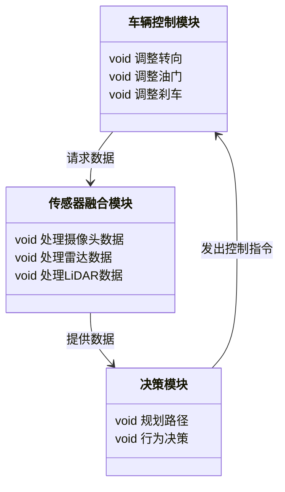
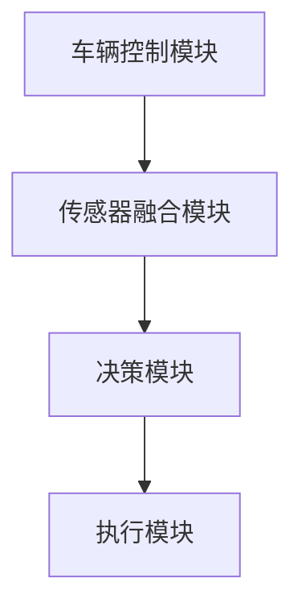

                 


# 如何评估企业的高级驾驶辅助系统

**关键词**：高级驾驶辅助系统（ADAS）、评估标准、传感器技术、算法原理、系统架构设计

**摘要**：本文将详细探讨如何评估企业的高级驾驶辅助系统（ADAS）。通过分析ADAS的核心概念、功能实现、评估标准、技术原理和系统架构，结合实际案例和最佳实践，为读者提供全面的评估方法和工具。

---

# 第1章: 高级驾驶辅助系统（ADAS）背景介绍

## 1.1 ADAS的核心概念

### 1.1.1 高级驾驶辅助系统的定义
高级驾驶辅助系统（Advanced Driver-Assisting Systems，ADAS）是一种利用传感器、摄像头、雷达和计算机技术来辅助驾驶员进行车辆控制和决策的系统。其目标是提高驾驶安全性、舒适性和效率。

### 1.1.2 ADAS的核心功能与作用
- **车道保持辅助（LKA）**：确保车辆保持在车道内。
- **自适应巡航控制（ACC）**：自动调整车速以保持与前车的安全距离。
- **自动紧急制动（AEB）**：在检测到潜在碰撞风险时自动刹车。
- **盲点监测（BSD）**：检测车辆盲区内的物体或车辆。
- **前方碰撞预警（FCW）**：提醒驾驶员注意前方潜在的碰撞风险。

### 1.1.3 ADAS的边界与外延
ADAS并非完全自动驾驶系统，而是辅助驾驶员的工具。其边界包括传感器输入、算法处理和执行机构，外延则涉及车辆通信、用户界面和法规 compliance。

### 1.1.4 ADAS的概念结构与核心要素组成
ADAS由以下几个核心要素组成：
1. **传感器**：摄像头、雷达、激光雷达（LiDAR）、超声波传感器等。
2. **数据处理单元**：计算机视觉、传感器融合算法。
3. **决策算法**：路径规划、行为决策。
4. **执行机构**：转向、加速和刹车系统。

## 1.2 ADAS的发展背景与现状

### 1.2.1 智能驾驶技术的发展历程
- 从早期的机械辅助到现代的电子辅助系统。
- 随着人工智能和传感器技术的进步，ADAS的功能逐渐增强。

### 1.2.2 ADAS在汽车行业的应用现状
- 大部分高端车型已经配备了基本的ADAS功能。
- 各国政府和企业正在推动更高级的ADAS功能开发。

### 1.2.3 ADAS的未来发展趋势
- 更高的自动化水平。
- 更广泛的应用场景，如公共交通和物流。
- 更强的系统集成和智能化。

## 1.3 ADAS的关键技术与实现原理

### 1.3.1 传感器技术
- **摄像头**：用于视觉识别和物体检测。
- **雷达**：用于测距和速度测量。
- **激光雷达**：提供高精度的三维环境感知。

### 1.3.2 数据处理与算法
- **计算机视觉**：目标检测、图像识别。
- **传感器融合**：将来自不同传感器的数据进行融合，提高系统的准确性和可靠性。

### 1.3.3 系统集成与优化
- 系统架构设计：模块化设计，确保各模块高效协同。
- 性能优化：降低系统延迟，提高响应速度。

## 1.4 ADAS的应用领域与场景

### 1.4.1 典型应用场景分析
- 城市道路：复杂的交通环境。
- 高速公路：单一车道的长距离驾驶。
- 停车场：低速、多障碍物的环境。

### 1.4.2 不同场景下的系统需求差异
- 城市道路需要更强的环境感知和决策能力。
- 高速公路需要更高的定位精度和稳定性。

### 1.4.3 ADAS对驾驶体验的提升作用
- 减少驾驶疲劳。
- 提高安全性。
- 增强驾驶舒适性。

## 1.5 本章小结
本章介绍了ADAS的核心概念、发展历程、关键技术及其在不同场景中的应用。理解这些内容对于后续的系统评估至关重要。

---

# 第2章: ADAS的核心功能与实现

## 2.1 ADAS的核心功能模块

### 2.1.1 车道保持辅助（LKA）
- **实现原理**：通过摄像头检测车道线，计算车辆偏移量并调整方向盘。
- **算法流程**：
  1. 摄像头采集图像。
  2. 图像处理提取车道线。
  3. 计算偏移量并调整转向。

### 2.1.2 自适应巡航控制（ACC）
- **实现原理**：通过雷达测距，计算与前车的安全距离并自动调整车速。
- **算法流程**：
  1. 雷达测距。
  2. 确定目标速度。
  3. 调整油门或刹车。

### 2.1.3 自动紧急制动（AEB）
- **实现原理**：通过传感器检测潜在碰撞风险并自动刹车。
- **算法流程**：
  1. 传感器检测前方障碍物。
  2. 判断是否需要紧急制动。
  3. 启动刹车系统。

### 2.1.4 盲点监测（BSD）
- **实现原理**：通过雷达检测盲区内的车辆。
- **算法流程**：
  1. 雷达扫描盲区。
  2. 检测是否存在目标。
  3. 提醒驾驶员或自动调整。

### 2.1.5 前方碰撞预警（FCW）
- **实现原理**：通过摄像头或雷达检测前方障碍物。
- **算法流程**：
  1. 传感器检测前方障碍物。
  2. 计算碰撞风险。
  3. 提醒驾驶员。

## 2.2 ADAS功能实现的关键技术

### 2.2.1 传感器融合技术
- **实现原理**：将来自不同传感器的数据进行融合，提高系统的准确性和可靠性。
- **算法流程**：
  1. 采集多源传感器数据。
  2. 数据预处理。
  3. 融合处理，得到最终结果。

### 2.2.2 视觉识别算法
- **实现原理**：通过计算机视觉技术识别图像中的物体和场景。
- **算法流程**：
  1. 图像采集。
  2. 图像处理（如边缘检测、特征提取）。
  3. 目标识别和分类。

### 2.2.3 智能决策算法
- **实现原理**：基于传感器数据和环境信息，进行路径规划和决策。
- **算法流程**：
  1. 采集环境数据。
  2. 确定目标和约束。
  3. 规划路径并执行。

### 2.2.4 系统集成与优化
- **实现原理**：将各个功能模块集成到一个系统中，并进行优化。
- **优化方法**：降低系统延迟，提高系统的稳定性和可靠性。

## 2.3 ADAS功能实现的数学模型与算法

### 2.3.1 传感器数据融合模型
- **卡尔曼滤波**：
  $$x_{k+1} = x_k + w_k$$
  $$y_{k+1} = x_{k+1} + v_k$$

### 2.3.2 视觉识别算法的数学基础
- **目标检测**：使用卷积神经网络（CNN）进行特征提取和分类。
- **图像分割**：使用全卷积网络（FCN）进行像素级分类。

### 2.3.3 决策算法的数学模型
- **路径规划**：基于Dijkstra算法或A*算法进行最短路径规划。
- **行为决策**：基于概率模型进行风险评估和决策选择。

## 2.4 本章小结
本章详细介绍了ADAS的核心功能模块及其实现技术，包括传感器融合、视觉识别和智能决策算法等。

---

# 第3章: ADAS系统评估标准与方法

## 3.1 ADAS系统评估的核心指标

### 3.1.1 系统响应时间
- **定义**：从传感器检测到系统执行的时间间隔。
- **计算公式**：
  $$响应时间 = \text{系统处理时间} + \text{执行时间}$$

### 3.1.2 系统准确率与误报率
- **准确率**：正确识别的数量占总测试数量的比例。
  $$准确率 = \frac{正确识别的数量}{总测试数量}$$
- **误报率**：错误触发的数量占总测试数量的比例。

### 3.1.3 系统可靠性与稳定性
- **可靠性**：系统在不同环境和条件下的稳定性和一致性。
- **稳定性**：系统在长期运行中的性能保持能力。

### 3.1.4 系统兼容性与扩展性
- **兼容性**：与不同车型和硬件的兼容性。
- **扩展性**：支持未来功能扩展和升级的能力。

## 3.2 ADAS系统评估的国际标准

### 3.2.1 ISO标准
- **ISO 21480**：自动驾驶系统安全标准。
- **ISO 21481**：车辆自动驾驶功能分类。

### 3.2.2 SOTERIA标准
- **SOTERIA**：专注于自动驾驶系统的安全性评估和认证。

### 3.2.3 其他相关标准
- **UN R155/156**：联合国车辆法规，适用于自动驾驶系统。

## 3.3 ADAS系统评估的测试方法

### 3.3.1 实验室测试
- **环境模拟**：在实验室中模拟不同交通场景。
- **数据采集**：记录系统的响应和性能。

### 3.3.2 实路测试
- **实际道路测试**：在真实道路上测试系统在不同条件下的表现。
- **数据采集与分析**：分析系统在实际环境中的表现。

### 3.3.3 模拟器测试
- **虚拟环境测试**：使用模拟器进行系统测试。
- **数据生成**：生成大量测试数据用于系统训练和优化。

## 3.4 ADAS系统评估的数学模型与公式

### 3.4.1 系统准确率计算公式
$$准确率 = \frac{正确识别的数量}{总测试数量}$$

### 3.4.2 系统响应时间计算公式
$$响应时间 = \text{系统处理时间} + \text{执行时间}$$

## 3.5 本章小结
本章详细介绍了ADAS系统评估的核心指标、国际标准和测试方法，为后续的系统设计和优化提供了理论依据。

---

# 第4章: ADAS系统架构设计与优化

## 4.1 系统架构设计

### 4.1.1 系统功能模块
- **传感器模块**：负责数据采集。
- **数据处理模块**：负责数据融合和处理。
- **决策模块**：负责路径规划和行为决策。
- **执行模块**：负责系统执行。

### 4.1.2 系统功能分配
- **传感器模块**：摄像头、雷达、激光雷达。
- **数据处理模块**：计算机视觉、传感器融合。
- **决策模块**：路径规划、行为决策。
- **执行模块**：转向、加速、刹车。

### 4.1.3 系统接口设计
- **传感器接口**：与摄像头、雷达等传感器连接。
- **决策接口**：与车辆控制系统连接。
- **用户界面**：与驾驶员交互的界面。

## 4.2 系统架构设计的数学模型

### 4.2.1 领域模型（类图）


### 4.2.2 系统架构图


## 4.3 系统优化

### 4.3.1 系统延迟优化
- **减少处理时间**：优化算法复杂度。
- **并行处理**：利用多核处理器提高处理效率。

### 4.3.2 系统稳定性优化
- **冗余设计**：增加冗余传感器和处理模块。
- **故障容错**：设计容错机制，确保系统稳定。

## 4.4 本章小结
本章详细介绍了ADAS系统架构设计与优化，包括功能模块划分、接口设计和系统优化策略。

---

# 第5章: ADAS系统项目实战

## 5.1 项目环境搭建

### 5.1.1 开发工具安装
- **代码编辑器**：Visual Studio、IntelliJ IDEA。
- **调试工具**：GDB、Valgrind。
- **模拟器**：CARLA、Gazebo。

### 5.1.2 开发环境配置
- **操作系统**：Ubuntu、Windows。
- **开发框架**：ROS（Robot Operating System）、OpenCV。

## 5.2 系统核心实现

### 5.2.1 传感器数据处理
```python
import cv2
import numpy as np

# 图像处理
def process_image(image):
    gray = cv2.cvtColor(image, cv2.COLOR_BGR2GRAY)
    edges = cv2.Canny(gray, 50, 150)
    return edges

# 传感器数据融合
def fuse_data(sensor_data):
    fused_data = {}
    fused_data['camera'] = process_image(sensor_data['camera'])
    fused_data['radar'] = sensor_data['radar']
    return fused_data
```

### 5.2.2 决策算法实现
```python
import numpy as np

# 路径规划算法
def plan_path(map_data):
    start = map_data['start']
    end = map_data['end']
    obstacles = map_data['obstacles']
    
    # 使用A*算法进行路径规划
    path = []
    visited = set()
    queue = [start]
    
    while queue:
        current = queue.pop(0)
        if current == end:
            break
        for neighbor in get_neighbors(current):
            if neighbor not in visited:
                visited.add(neighbor)
                queue.append(neighbor)
                path.append(neighbor)
    return path

# 行为决策算法
def make_decision(state):
    if state['collision-risk'] > 0.9:
        return 'brake'
    elif state['speed'] < target_speed:
        return 'accelerate'
    else:
        return 'continue'
```

### 5.2.3 系统集成与测试
- **单元测试**：测试各个功能模块的独立性。
- **集成测试**：测试系统整体的协调性和稳定性。
- **性能测试**：测试系统在高负载情况下的表现。

## 5.3 项目案例分析

### 5.3.1 案例背景
- **项目目标**：开发一个车道保持辅助系统（LKA）。

### 5.3.2 案例分析
- **问题描述**：车辆在高速公路上行驶时容易偏离车道。
- **解决方案**：通过摄像头检测车道线，调整方向盘使车辆保持在车道内。

### 5.3.3 实施步骤
1. **需求分析**：明确系统功能和性能要求。
2. **传感器选型**：选择适合的摄像头和处理器。
3. **算法开发**：开发车道检测算法。
4. **系统集成**：将算法集成到车辆控制系统中。
5. **测试与优化**：测试系统性能并进行优化。

## 5.4 本章小结
本章通过一个实际项目案例，详细介绍了ADAS系统的开发过程，包括环境搭建、核心实现和测试优化。

---

# 第6章: ADAS系统最佳实践与未来展望

## 6.1 最佳实践

### 6.1.1 系统设计
- **模块化设计**：确保各模块独立且易于维护。
- **容错设计**：设计冗余和容错机制，确保系统稳定性。

### 6.1.2 开发流程
- **敏捷开发**：采用敏捷开发模式，快速迭代和优化。
- **版本控制**：使用版本控制系统（如Git）管理代码。

### 6.1.3 测试策略
- **单元测试**：测试各功能模块的独立性。
- **集成测试**：测试系统整体的协调性和稳定性。
- **性能测试**：测试系统在高负载情况下的表现。

## 6.2 小结
- **总结**：ADAS系统的评估和优化需要综合考虑传感器技术、算法实现和系统架构设计。
- **注意事项**：在实际开发中，需要关注系统的可靠性和稳定性，确保驾驶员的安全。

## 6.3 未来展望

### 6.3.1 技术趋势
- **深度学习**：在视觉识别和决策算法中应用更广泛。
- **边缘计算**：在车辆端进行实时数据处理，减少云端依赖。

### 6.3.2 市场前景
- **自动驾驶**：ADAS技术是实现完全自动驾驶的基础。
- **共享出行**：ADAS技术在共享出行中的应用将更加广泛。

## 6.4 拓展阅读
- **相关书籍**：《自动驾驶：模型预测控制与优化》。
- **技术博客**：查阅技术博客和论坛，获取最新的技术动态。

---

# 作者信息

作者：AI天才研究院/AI Genius Institute & 禅与计算机程序设计艺术 /Zen And The Art of Computer Programming

---

通过以上目录和内容的规划，您可以根据实际需求逐步撰写每一章的具体内容，确保文章逻辑清晰、结构紧凑、简单易懂。

