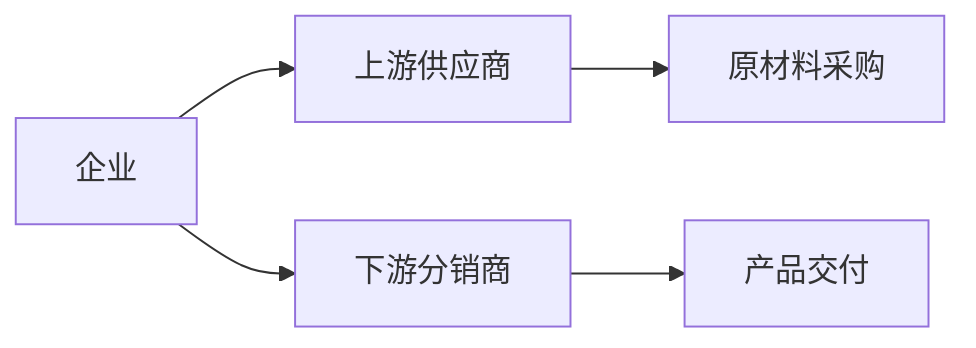
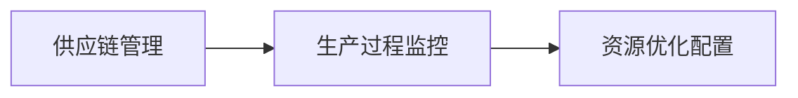
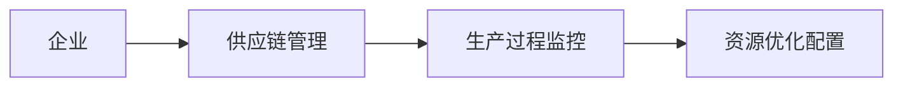

                 


# 如何识别企业的垂直整合优势

## 关键词：垂直整合、企业优势、系统分析、项目实战、案例分析

## 摘要：垂直整合是指企业通过整合供应链上下游资源，优化资源配置，提升企业竞争力的过程。本文将从垂直整合的核心概念、优势识别方法、系统分析与架构设计、项目实战等方面，详细分析如何识别和利用企业的垂直整合优势。

---

## 第一部分：垂直整合的核心概念

### 第1章：垂直整合的核心概念

#### 1.1 垂直整合的定义与背景

**1.1.1 什么是垂直整合**

垂直整合是指企业通过整合其供应链的上游和下游资源，从原材料采购到产品生产、分销，最终交付给消费者的整个过程。这种整合可以帮助企业更好地控制生产成本、提高产品质量，并增强市场竞争力。

**1.1.2 垂直整合的背景与演变**

随着全球化和市场竞争的加剧，企业需要通过优化供应链来提升效率和降低成本。垂直整合作为一种重要的战略手段，帮助企业减少对外部供应商的依赖，增强自身的抗风险能力。

**1.1.3 垂直整合的边界与外延**

垂直整合的边界通常包括企业的生产过程、供应链管理和分销渠道。外延则涉及企业如何通过技术手段优化整合过程，例如使用ERP系统进行供应链管理。

**核心概念结构图**



---

#### 1.2 垂直整合的类型与特点

**1.2.1 前向整合与后向整合的对比**

- **前向整合**：企业整合下游分销渠道，例如直接管理销售渠道。
- **后向整合**：企业整合上游供应商，例如自建原材料生产基地。

**1.2.2 垂直整合的核心特征**

- 控制力强：企业对整个供应链有更强的控制能力。
- 效率高：通过整合资源，减少中间环节，提高效率。
- 成本优化：通过规模效应降低成本。

**1.2.3 垂直整合与水平整合的区别**

- **水平整合**：在同一生产环节中并购或合作，扩大生产规模。
- **垂直整合**：在供应链的不同环节中进行整合，优化资源分配。

---

#### 1.3 垂直整合的优势与劣势

**1.3.1 垂直整合的主要优势**

- 提高供应链的稳定性。
- 降低外部风险。
- 提高成本效益。

**1.3.2 垂直整合的潜在劣势**

- 投资大，风险高。
- 管理复杂度增加。
- 可能导致市场进入壁垒。

**优势与劣势对比表**

| 优势               | 劣势               |
|--------------------|--------------------|
| 提高供应链稳定性     | 投资大             |
| 降低外部风险         | 管理复杂度增加     |
| 提高成本效益         | 市场进入壁垒增加   |

---

## 第二部分：垂直整合优势的识别方法

### 第2章：垂直整合优势的理论分析

#### 2.1 垂直整合优势的分析模型

**2.1.1 垂直整合优势的构成要素**

- 资源控制力。
- 成本结构。
- 市场响应速度。

**2.1.2 垂直整合优势的评估维度**

- 经济效益。
- 竞争优势。
- 管理复杂度。

**2.1.3 垂直整合优势的数学模型**

经济收益模型：
$$ \text{经济收益} = \text{成本降低} \times \text{产量} - \text{投资成本} $$

---

#### 2.2 垂直整合优势的识别方法

**2.2.1 基于成本的分析方法**

通过分析整合前后成本的变化，评估垂直整合的经济效益。

**2.2.2 基于风险的分析方法**

评估垂直整合对供应链稳定性和抗风险能力的影响。

**2.2.3 基于市场竞争力的分析方法**

通过比较整合前后市场竞争力的变化，判断垂直整合的优势。

---

#### 2.3 垂直整合优势的案例分析

**2.3.1 行业案例分析**

以某汽车制造企业为例，分析其通过垂直整合上游零部件供应商，降低生产成本并提高产品质量的过程。

**2.3.2 企业案例分析**

以某电子产品公司为例，分析其通过整合下游分销渠道，提高市场占有率的经验。

**2.3.3 案例总结与启示**

总结案例中的成功经验，并提出在实际操作中需要注意的关键点。

---

## 第三部分：垂直整合优势的系统分析

### 第3章：垂直整合系统的架构设计

#### 3.1 系统分析与设计方法

**3.1.1 系统分析的步骤与方法**

1. 明确需求。
2. 进行可行性分析。
3. 设计系统架构。

**3.1.2 系统设计的原则与框架**

- 分层设计。
- 模块化设计。
- 高内聚低耦合。

**系统功能模块**



---

#### 3.2 垂直整合系统的功能模块

**3.2.1 供应链管理模块**

- 原材料采购管理。
- 供应商绩效评估。

**3.2.2 生产过程监控模块**

- 生产计划制定。
- 质量控制。

**3.2.3 资源优化配置模块**

- 成本控制。
- 资源分配。

---

#### 3.3 垂直整合系统的架构图

**3.3.1 系统架构的Mermaid图**



---

## 第四部分：垂直整合优势的项目实战

### 第4章：垂直整合项目的实施与优化

#### 4.1 项目环境与工具安装

**4.1.1 开发环境的配置**

- 操作系统：Linux/Windows。
- 开发工具：IDE（如IntelliJ IDEA）。

**4.1.2 必要工具的安装与配置**

- 数据库：MySQL。
- 项目管理工具：JIRA。

---

#### 4.2 项目核心代码实现

**4.2.1 供应链管理模块的实现**

```python
# 供应链管理模块代码示例
class Supplier:
    def __init__(self, name, location):
        self.name = name
        self.location = location

    def get_materials(self, material):
        return f"{self.name} 供应 {material}"
```

---

#### 4.2.2 生产过程监控模块的实现

```python
# 生产过程监控模块代码示例
class ProductionProcess:
    def __init__(self, process_name):
        self.process_name = process_name

    def monitor_quality(self, quality_check):
        return f"{self.process_name} 的质量检查结果为 {quality_check}"
```

---

#### 4.3 项目实战案例分析

**4.3.1 案例分析**

以某制造企业为例，分析其如何通过垂直整合优化供应链，并提高生产效率。

**4.3.2 项目小结**

总结项目实施的经验，并提出改进建议。

---

## 第五部分：总结与展望

### 5.1 总结

通过本文的分析，我们可以看出，垂直整合是企业优化供应链、提高竞争力的重要手段。识别和利用垂直整合优势，需要从理论分析、系统设计到项目实战等多个方面进行综合考虑。

### 5.2 展望

未来，随着技术的进步，企业可以通过更智能化的系统进一步优化垂直整合的优势，例如利用人工智能和大数据分析来优化供应链管理。

---

## 作者：AI天才研究院/AI Genius Institute & 禅与计算机程序设计艺术 /Zen And The Art of Computer Programming

