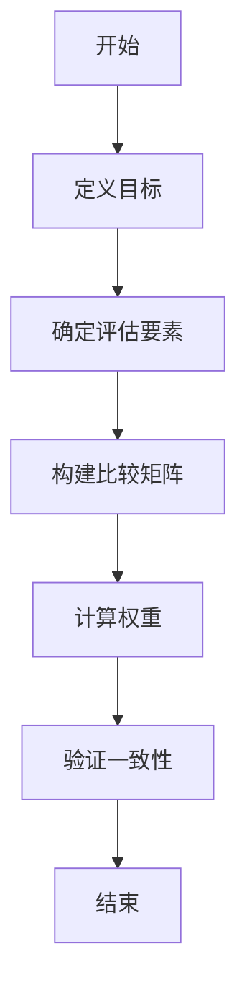
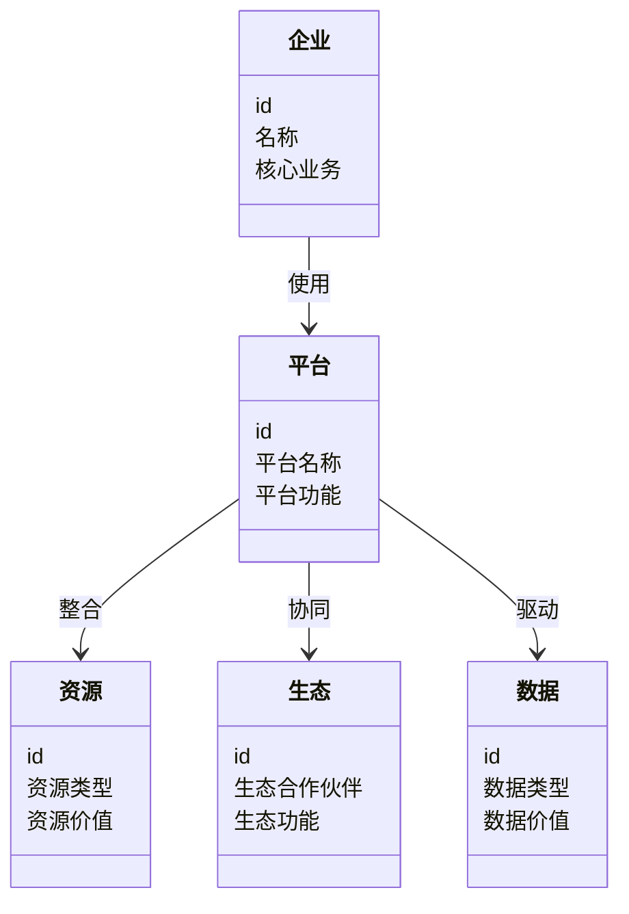

                 


# 如何识别企业的平台战略优势

## 关键词
平台战略，企业优势，资源聚合，生态系统，数据驱动，战略评估，竞争力

## 摘要
本文将详细探讨如何识别企业的平台战略优势，通过分析平台战略的核心概念、评估模型、系统架构设计以及实际案例，帮助读者理解如何构建和优化企业平台战略。文章从背景介绍、核心概念、算法原理、系统分析、项目实战到最佳实践，全面解析企业平台战略的优势及其在数字化转型中的重要作用。

---

# 第一部分: 企业平台战略优势的背景与概念

## 第1章: 平台战略的定义与优势

### 1.1 平台战略的定义
#### 1.1.1 平台战略的定义与内涵
平台战略是一种通过构建数字化平台，整合内外部资源，形成生态系统，从而实现价值创造和竞争优势的战略模式。与传统的线性价值链模式不同，平台战略强调开放性、协作性和数据驱动，能够快速响应市场变化，创造新的价值点。

#### 1.1.2 平台与传统业务模式的区别
| 特性                | 传统业务模式              | 平台战略                |
|---------------------|--------------------------|-------------------------|
| 资源整合方式         | 封闭、单一                | 开放、多元                |
| 价值创造方式         | 线性价值链                | 网络化、生态化            |
| 扩展性               | 有限                      | 高度可扩展                |
| 数据利用方式         | 数据孤岛                  | 数据共享、深度分析        |

#### 1.1.3 平台战略的核心优势
- **资源聚合**：通过平台整合多方资源，形成协同效应。
- **生态协同**：构建开放生态系统，促进多方利益相关者合作。
- **数据驱动**：利用数据进行精准决策，提升效率。

---

## 第2章: 平台战略的核心概念与联系

### 2.1 平台战略的核心要素
#### 2.1.1 资源聚合
平台通过整合技术、数据、人才等资源，形成强大的资源池，为生态参与者提供支持。

#### 2.1.2 生态协同
平台连接供应商、客户、合作伙伴等多方，形成协同效应，推动创新。

#### 2.1.3 数据驱动
通过数据的采集、分析和应用，优化决策，提升平台的智能化水平。

### 2.2 平台战略与企业能力的关系
- **资源分配**：平台战略优化资源配置，提升企业的运营效率。
- **能力提升**：通过生态协同，增强企业的核心竞争力。
- **核心竞争力**：数据驱动的决策能力成为企业差异化的核心优势。

### 2.3 平台战略的ER实体关系图
```mermaid
er
    entity(企业) {
        id
        名称
        核心业务
    }
    entity(平台) {
        id
        平台名称
        平台功能
    }
    entity(资源) {
        id
        资源类型
        资源价值
    }
    entity(生态) {
        id
        生态合作伙伴
        生态功能
    }
    entity(数据) {
        id
        数据类型
        数据价值
    }
```

---

# 第二部分: 平台战略优势的算法原理

## 第3章: 平台战略评估模型

### 3.1 评估模型的核心算法
#### 3.1.1 层次分析法（AHP）
- 通过权重分配，评估各个战略要素的重要性。
- **公式**：
  $$
  w_i = \frac{\sum_{j=1}^{n} a_{ij}}{\sum_{i=1}^{n} \sum_{j=1}^{n} a_{ij}}
  $$
  其中，$w_i$ 表示第 $i$ 个要素的权重。

#### 3.1.2 算法流程图


### 3.2 数学模型与公式
- **比较矩阵**：
  $$
  A = \begin{bmatrix}
  1 & a_{12} & a_{13} \\
  a_{21} & 1 & a_{23} \\
  a_{31} & a_{32} & 1
  \end{bmatrix}
  $$
- **权重计算**：
  $$
  w_i = \frac{\sum_{j=1}^{n} a_{ij}}{\sum_{i=1}^{n} \sum_{j=1}^{n} a_{ij}}
  $$

---

# 第三部分: 系统分析与架构设计

## 第4章: 系统功能设计

### 4.1 问题场景介绍
以互联网平台为例，设计一个资源聚合、生态协同和数据驱动的平台系统。

### 4.2 系统功能设计
#### 4.2.1 领域模型


### 4.3 系统架构设计


---

# 第四部分: 项目实战

## 第5章: 平台战略优势的识别与构建

### 5.1 项目介绍
以互联网平台为例，设计一个资源聚合、生态协同和数据驱动的平台系统。

### 5.2 核心代码实现
#### 5.2.1 环境安装
- 安装Python、Flask框架。

#### 5.2.2 核心代码
```python
class Platform:
    def __init__(self, name, resources, partners):
        self.name = name
        self.resources = resources
        self.partners = partners

    def add_resource(self, resource):
        self.resources.append(resource)

    def add_partner(self, partner):
        self.partners.append(partner)

# 示例
platform = Platform("互联网平台", ["数据", "技术", "人才"], ["供应商", "客户"])
platform.add_resource("算法")
platform.add_partner("开发者")
```

---

# 第五部分: 最佳实践与总结

## 第6章: 平台战略优势的总结与展望

### 6.1 最佳实践
- **资源聚合**：定期评估资源利用率，优化配置。
- **生态协同**：建立合作伙伴关系，促进协同发展。
- **数据驱动**：持续优化数据采集和分析能力。

### 6.2 小结
平台战略是企业数字化转型的重要驱动力。通过资源聚合、生态协同和数据驱动，企业能够构建竞争优势，实现可持续发展。

### 6.3 注意事项
- 平台战略的成功需要企业内部的协同和外部生态的建设。
- 数据隐私和安全问题需要高度重视。

### 6.4 拓展阅读
- 《平台经济：数字化时代的商业模式创新》
- 《数据驱动的商业决策》

---

# 作者
作者：AI天才研究院/AI Genius Institute  
作者：禅与计算机程序设计艺术/Zen And The Art of Computer Programming

