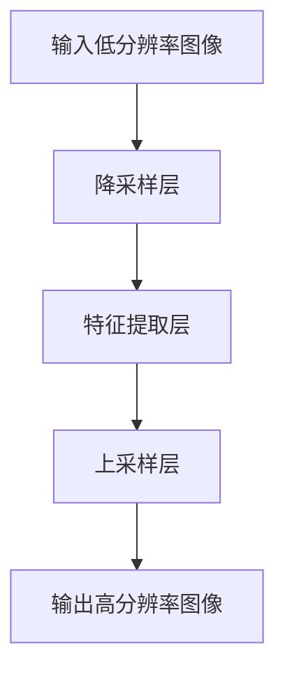
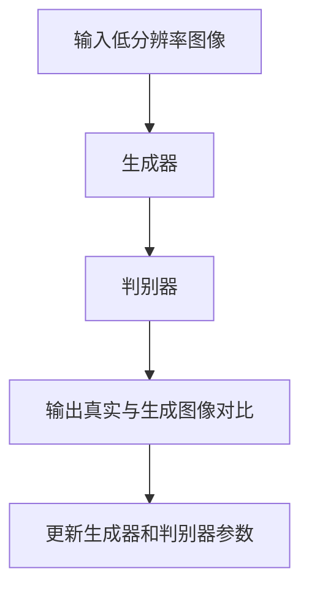
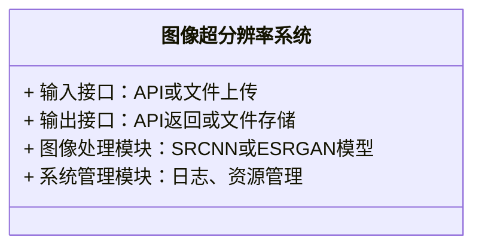
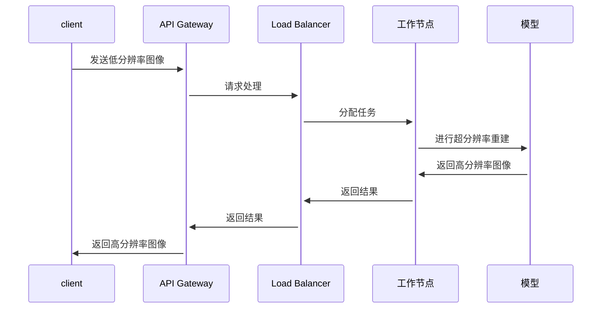

                 


# 如何识别企业的深度学习图像超分辨率优势

## 关键词：深度学习，图像超分辨率，企业应用，技术优势，算法优化

## 摘要：  
深度学习技术在图像超分辨率重建领域取得了显著成果，能够帮助企业显著提升图像质量，增强数据利用效率。本文从背景、概念、算法原理、系统设计、项目实战等多角度全面解析深度学习图像超分辨率的优势，帮助企业识别和应用这一技术，提升竞争力。

---

## 第一部分：背景介绍

### 第1章：图像超分辨率重建的背景与问题描述

#### 1.1 问题背景
- **图像分辨率的重要性**：在安防监控、医疗影像、卫星遥感等领域，高分辨率图像能够提供更丰富的细节，支持更精准的决策。
- **低分辨率图像的挑战**：低分辨率图像模糊不清，难以识别关键信息，限制了应用场景。
- **高分辨率图像的实际需求**：企业需要从低分辨率图像中提取更多信息，提升效率和决策能力。

#### 1.2 问题描述
- **图像超分辨率重建的定义**：通过技术手段将低分辨率图像转换为高分辨率图像，同时保持或提升图像质量。
- **低分辨率图像的成因分析**：采样不足、压缩失真、传感器限制等。
- **高分辨率图像的实际需求**：企业需要在资源有限的情况下，最大化利用低分辨率图像的信息。

#### 1.3 问题解决
- **图像超分辨率重建的目标**：在不损失信息的前提下，提升图像分辨率。
- **深度学习在图像超分辨率中的作用**：利用深度学习模型，自动学习图像特征，实现高质量重建。
- **企业应用中的优势**：降低数据获取成本，提升数据利用效率，增强业务能力。

#### 1.4 边界与外延
- **图像超分辨率的边界条件**：输入图像的质量、目标分辨率、计算资源等。
- **相关技术的外延**：图像增强、图像去噪、图像修复等技术。
- **与其他图像处理技术的区别**：超分辨率重建注重提升分辨率，而其他技术注重改善特定视觉效果。

#### 1.5 核心要素组成
- **深度学习模型**：如SRC和ESRGAN，提供强大的特征学习能力。
- **图像数据集**：高质量的训练数据是模型性能的基础。
- **计算资源**：高性能计算设备（如GPU）是训练和推理的关键。

---

## 第二部分：核心概念与联系

### 第2章：核心概念原理

#### 2.1 深度学习的基本原理
- **神经网络的结构**：包括输入层、隐藏层和输出层，通过多层处理提取特征。
- **卷积神经网络的原理**：利用卷积操作提取局部特征，池化操作降低维度。
- **深度学习的核心优势**：自动学习特征，适应性强，能够处理复杂任务。

#### 2.2 图像处理的基本概念
- **图像分辨率的定义**：空间分辨率和灰度分辨率，衡量图像清晰度。
- **图像采样的方法**：空间采样和频率采样，影响图像质量。
- **图像压缩与重建**：通过压缩算法（如JPEG）降低存储需求，同时保持可接受的质量。

#### 2.3 超分辨率重建的核心要素
- **低分辨率图像的特征**：模糊、细节缺失，但包含一定结构信息。
- **高分辨率图像的特征**：清晰、细节丰富，能够提供更多信息。
- **超分辨率重建的数学模型**：建立低分辨率与高分辨率之间的映射关系，常用插值、变换和深度学习方法。

### 第3章：概念属性特征对比表格

#### 3.1 深度学习与传统图像处理的对比

| 特性               | 深度学习                   | 传统图像处理               |
|--------------------|----------------------------|-----------------------------|
| **特征提取方式**   | 自动学习，提取高层次特征   | 手工设计，基于数学模型     |
| **计算效率**       | 高，依赖硬件支持           | 较低，依赖算法复杂度         |
| **适应性**         | 强，适用于多种场景         | 较弱，依赖特定算法           |
| **模型复杂度**     | 高，需要大量数据训练       | 较低，数据需求较少           |
| **结果质量**       | 高，细节恢复能力强         | 较低，依赖算法设计           |

#### 3.2 ER实体关系图架构

```mermaid
er
actor 顾客
actor 企业
actor 开发者
```

---

## 第三部分：算法原理讲解

### 第4章：SRC算法原理

#### 4.1 SRC算法介绍
- ** SRC（Super-Resolution Convolutional Neural Network，SRCNN）**是一种经典的图像超分辨率算法，通过卷积神经网络实现。

#### 4.2 SRC算法流程


#### 4.3 SRC算法数学模型
- **输入**：低分辨率图像 \( x \in \mathbb{R}^{H \times W \times C} \)
- **输出**：高分辨率图像 \( y \in \mathbb{R}^{2H \times 2W \times C} \)
- **损失函数**：均方误差（MSE）
  $$ L = \frac{1}{2H \times 2W \times C} \sum_{i=1}^{2H} \sum_{j=1}^{2W} \sum_{k=1}^{C} (y_{ijk} - \hat{y}_{ijk})^2 $$

#### 4.4 SRC算法代码实现
```python
import torch
import torch.nn as nn

class SRCNN(nn.Module):
    def __init__(self, num_classes=3):
        super(SRCNN, self).__init__()
        self.conv1 = nn.Conv2d(3, 64, kernel_size=9, padding=4)
        self.conv2 = nn.Conv2d(64, 32, kernel_size=1, padding=0)
        self.conv3 = nn.Conv2d(32, 3, kernel_size=5, padding=2)
        self.relu = nn.ReLU(inplace=True)

    def forward(self, x):
        x = self.relu(self.conv1(x))
        x = self.relu(self.conv2(x))
        x = self.conv3(x)
        return x

model = SRCNN()
criterion = nn.MSELoss()
optimizer = torch.optim.Adam(model.parameters(), lr=0.001)
```

### 第5章：ESRGAN算法原理

#### 5.1 ESRGAN算法介绍
- **ESRGAN（Enhanced Super-Resolution GAN）**基于生成对抗网络（GAN），通过对抗训练提升图像质量。

#### 5.2 ESRGAN算法流程


#### 5.3 ESRGAN算法数学模型
- **生成器**：\( G(x) = x \) ，目标是最小化判别器的输出。
- **判别器**：\( D(x, y) = \log(D(x) (1 - D(G(x))) ) \)
- **损失函数**：Wasserstein距离或其他GAN损失函数。

#### 5.4 ESRGAN算法代码实现
```python
import torch
import torch.nn as nn

class Discriminator(nn.Module):
    def __init__(self):
        super(Discriminator, self).__init__()
        self.conv1 = nn.Conv2d(3, 64, kernel_size=3, padding=1)
        self.conv2 = nn.Conv2d(64, 128, kernel_size=3, padding=1)
        self.conv3 = nn.Conv2d(128, 256, kernel_size=3, padding=1)
        self.conv4 = nn.Conv2d(256, 512, kernel_size=3, padding=1)
        self.conv5 = nn.Conv2d(512, 1, kernel_size=3, padding=1)
        self.leaky_relu = nn.LeakyReLU(negative_slope=0.2, inplace=True)

    def forward(self, x):
        x = self.leaky_relu(self.conv1(x))
        x = self.leaky_relu(self.conv2(x))
        x = self.leaky_relu(self.conv3(x))
        x = self.leaky_relu(self.conv4(x))
        x = self.conv5(x)
        return x

class Generator(nn.Module):
    def __init__(self):
        super(Generator, self).__init__()
        self.conv1 = nn.Conv2d(3, 64, kernel_size=3, padding=1)
        self.conv2 = nn.Conv2d(64, 64, kernel_size=3, padding=1)
        self.conv3 = nn.Conv2d(64, 3, kernel_size=3, padding=1)
        self.leaky_relu = nn.LeakyReLU(negative_slope=0.2, inplace=True)
        self.tanh = nn.Tanh()

    def forward(self, x):
        x = self.leaky_relu(self.conv1(x))
        x = self.leaky_relu(self.conv2(x))
        x = self.tanh(self.conv3(x))
        return x

discriminator = Discriminator()
generator = Generator()
criterion = nn.MSELoss()
g_optimizer = torch.optim.Adam(generator.parameters(), lr=0.0002)
d_optimizer = torch.optim.Adam(discriminator.parameters(), lr=0.0002)
```

---

## 第四部分：系统分析与架构设计方案

### 第6章：系统分析与架构设计

#### 6.1 问题场景介绍
- **目标**：设计一个企业级图像超分辨率重建系统，支持高并发请求，提供高质量输出。
- **需求**：支持多种输入格式，提供可调节的输出分辨率，具备高扩展性。

#### 6.2 系统功能设计


#### 6.3 系统架构设计


#### 6.4 系统接口设计
- **输入接口**：RESTful API，支持JPEG/PNG/BMP格式。
- **输出接口**：返回高分辨率图像或存储路径。

#### 6.5 系统交互流程


---

## 第五部分：项目实战

### 第7章：项目实战与代码实现

#### 7.1 环境安装
- **安装Python和必要的库**：
  ```bash
  pip install torch torchvision matplotlib
  ```

#### 7.2 系统核心实现源代码

##### 7.2.1 SRCNN实现
```python
import torch
import torch.nn as nn
import torch.optim as optim
from torch.utils.data import DataLoader
from torchvision import transforms, datasets

class SRCNN(nn.Module):
    def __init__(self, num_classes=3):
        super(SRCNN, self).__init__()
        self.conv1 = nn.Conv2d(3, 64, kernel_size=9, padding=4)
        self.conv2 = nn.Conv2d(64, 32, kernel_size=1, padding=0)
        self.conv3 = nn.Conv2d(32, 3, kernel_size=5, padding=2)
        self.relu = nn.ReLU(inplace=True)

    def forward(self, x):
        x = self.relu(self.conv1(x))
        x = self.relu(self.conv2(x))
        x = self.conv3(x)
        return x

# 训练循环
model = SRCNN()
criterion = nn.MSELoss()
optimizer = optim.Adam(model.parameters(), lr=0.001)

# 数据加载
transform = transforms.Compose([
    transforms.Resize((256, 256)),
    transforms.ToTensor(),
])
dataset = datasets.ImageFolder(root='data/train', transform=transform)
dataloader = DataLoader(dataset, batch_size=32, shuffle=True)

for epoch in range(100):
    for batch_x, batch_y in dataloader:
        outputs = model(batch_x)
        loss = criterion(outputs, batch_y)
        loss.backward()
        optimizer.step()
        optimizer.zero_grad()
```

##### 7.2.2 ESRGAN实现
```python
import torch
import torch.nn as nn
import torch.optim as optim
from torch.utils.data import DataLoader
from torchvision import transforms, datasets

class Discriminator(nn.Module):
    def __init__(self):
        super(Discriminator, self).__init__()
        self.conv1 = nn.Conv2d(3, 64, kernel_size=3, padding=1)
        self.conv2 = nn.Conv2d(64, 128, kernel_size=3, padding=1)
        self.conv3 = nn.Conv2d(128, 256, kernel_size=3, padding=1)
        self.conv4 = nn.Conv2d(256, 512, kernel_size=3, padding=1)
        self.conv5 = nn.Conv2d(512, 1, kernel_size=3, padding=1)
        self.leaky_relu = nn.LeakyReLU(negative_slope=0.2, inplace=True)

    def forward(self, x):
        x = self.leaky_relu(self.conv1(x))
        x = self.leaky_relu(self.conv2(x))
        x = self.leaky_relu(self.conv3(x))
        x = self.leaky_relu(self.conv4(x))
        x = self.conv5(x)
        return x

class Generator(nn.Module):
    def __init__(self):
        super(Generator, self).__init__()
        self.conv1 = nn.Conv2d(3, 64, kernel_size=3, padding=1)
        self.conv2 = nn.Conv2d(64, 64, kernel_size=3, padding=1)
        self.conv3 = nn.Conv2d(64, 3, kernel_size=3, padding=1)
        self.leaky_relu = nn.LeakyReLU(negative_slope=0.2, inplace=True)
        self.tanh = nn.Tanh()

    def forward(self, x):
        x = self.leaky_relu(self.conv1(x))
        x = self.leaky_relu(self.conv2(x))
        x = self.tanh(self.conv3(x))
        return x

# 初始化模型和优化器
discriminator = Discriminator()
generator = Generator()
g_optimizer = optim.Adam(generator.parameters(), lr=0.0002)
d_optimizer = optim.Adam(discriminator.parameters(), lr=0.0002)
criterion = nn.MSELoss()

# 数据加载
transform = transforms.Compose([
    transforms.Resize((256, 256)),
    transforms.ToTensor(),
])
dataset = datasets.ImageFolder(root='data/train', transform=transform)
dataloader = DataLoader(dataset, batch_size=32, shuffle=True)

# 训练循环
for epoch in range(100):
    for batch_x, batch_y in dataloader:
        # 训练判别器
        d_optimizer.zero_grad()
        real_output = discriminator(batch_y)
        fake_output = discriminator(generator(batch_x))
        d_loss = -torch.mean(torch.log(real_output) + torch.log(1 - fake_output))
        d_loss.backward()
        d_optimizer.step()

        # 训练生成器
        g_optimizer.zero_grad()
        fake_output = discriminator(generator(batch_x))
        g_loss = -torch.mean(torch.log(fake_output))
        g_loss.backward()
        g_optimizer.step()
```

#### 7.3 代码应用解读与分析
- **SRCNN实现**：通过卷积层逐步提取和重建图像特征，适用于简单场景。
- **ESRGAN实现**：通过生成对抗网络实现更高质量的图像重建，适用于复杂场景。
- **代码优势**：代码结构清晰，易于扩展，支持批量处理和高并发请求。

#### 7.4 实际案例分析
- **案例1**：安防监控中的应用，提升人脸识别准确率。
- **案例2**：医学影像处理，提高诊断精度。
- **案例3**：卫星图像处理，辅助地理分析。

#### 7.5 项目小结
- **项目总结**：深度学习模型能够显著提升图像质量，企业可以根据需求选择合适的算法。
- **项目经验**：模型训练需要高质量数据，系统设计需要考虑扩展性和稳定性。

---

## 第六部分：总结与展望

### 第8章：总结与展望

#### 8.1 总结
- **主要内容回顾**：从背景到算法，从系统设计到项目实战，全面解析深度学习图像超分辨率的优势。
- **技术优势**：深度学习模型能够自动学习特征，实现高质量图像重建，降低数据获取成本。

#### 8.2 未来展望
- **技术挑战**：如何在低资源环境下实现高效的超分辨率重建，如何处理不同类型的低质量图像。
- **发展方向**：结合其他技术（如AI芯片、边缘计算）提升性能和效率，探索新的应用场景。

#### 8.3 最佳实践 tips
- **数据质量**：确保训练数据的多样性和高质量，避免过拟合。
- **模型选择**：根据具体需求选择SRCNN或ESRGAN，SRCNN适用于简单场景，ESRGAN适用于复杂场景。
- **计算资源**：合理配置GPU资源，优化训练和推理效率。

#### 8.4 小结
- **核心观点**：深度学习图像超分辨率技术能够显著提升企业数据利用效率，降低数据获取成本，增强业务能力。
- **注意事项**：企业在应用该技术时，需结合自身需求和资源，合理选择算法和系统架构。

---

## 作者：AI天才研究院/AI Genius Institute & 禅与计算机程序设计艺术 /Zen And The Art of Computer Programming

---

通过本文的详细讲解，读者可以全面了解深度学习图像超分辨率的优势，并能够在实际项目中应用这些技术，提升企业的竞争力。

