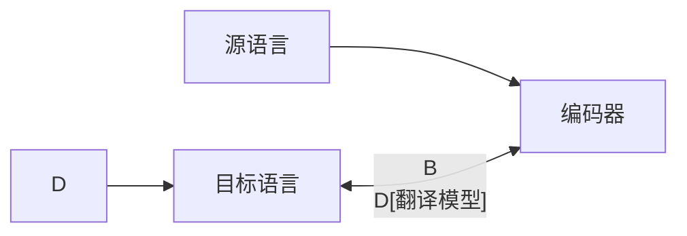
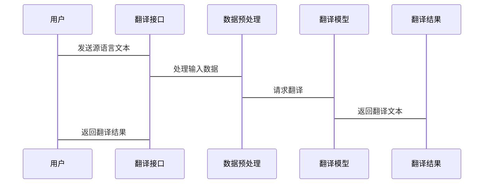

                 


# 如何识别企业的深度学习多语言翻译技术优势

**关键词**：深度学习，多语言翻译，神经机器翻译，企业技术优势，人工智能

**摘要**：本文将详细分析如何识别企业的深度学习多语言翻译技术优势。从背景介绍到核心概念，从算法原理到系统架构，再到项目实战和最佳实践，我们将一步步深入探讨这一技术的核心要素及其在企业中的应用。通过本文，读者将能够全面理解深度学习多语言翻译技术的优势，并掌握如何在企业中有效识别和应用这些优势。

---

# 第一部分: 深度学习多语言翻译技术的背景与核心概念

## 第1章: 问题背景与描述

### 1.1 问题背景

#### 1.1.1 全球化背景下的多语言翻译需求

在当前全球化背景下，企业面临着越来越复杂的多语言翻译需求。随着国际化进程的加快，企业需要与不同语言背景的客户、合作伙伴以及国际市场进行高效沟通。传统的翻译技术往往依赖于规则和词典，难以应对复杂的语言表达和语境理解，尤其是在处理多种语言时，效率和准确性往往无法满足企业需求。

#### 1.1.2 企业级翻译技术的挑战与痛点

企业级翻译技术的实现面临着诸多挑战。首先，不同语言之间的语法结构差异较大，翻译系统需要能够处理复杂的语言规则。其次，企业可能需要支持数十种甚至上百种语言的翻译，这对翻译系统的计算能力、数据处理能力和算法优化提出了更高的要求。此外，传统翻译技术往往依赖于固定的词典和规则，难以应对语言的多样性和动态变化。

#### 1.1.3 深度学习技术如何解决传统翻译问题

深度学习技术的出现为解决传统翻译技术的局限性提供了新的可能性。神经机器翻译（Neural Machine Translation, NMT）通过构建复杂的深度学习模型，能够自动学习语言之间的映射关系，从而实现更准确和自然的翻译效果。深度学习技术能够处理大规模的数据，提取语言中的深层特征，从而在翻译质量、效率和可扩展性方面都优于传统方法。

### 1.2 问题描述

#### 1.2.1 企业翻译技术的核心目标

企业翻译技术的核心目标是实现高效、准确、可扩展的多语言翻译能力。通过翻译技术，企业可以降低跨语言沟通的成本，提高业务效率，提升客户体验，并在国际市场上更具竞争力。

#### 1.2.2 多语言翻译的复杂性与多样性

多语言翻译的复杂性主要体现在以下方面：不同语言的语法结构差异、语言间的文化差异、语言的语境差异等。此外，企业可能需要处理大量的多语言数据，包括文本、语音、图像等多种形式，这对翻译技术的多样性和适应性提出了更高的要求。

#### 1.2.3 深度学习在翻译技术中的应用潜力

深度学习技术在翻译技术中的应用潜力主要体现在以下几个方面：首先，深度学习可以通过大规模数据训练，实现对语言的自动学习和理解；其次，深度学习模型能够捕捉语言中的深层特征，提高翻译的准确性和自然度；最后，深度学习技术可以通过并行计算和分布式训练，提高翻译的效率和可扩展性。

### 1.3 问题解决与边界

#### 1.3.1 深度学习技术如何实现翻译优势

深度学习技术通过构建复杂的神经网络模型，能够实现对语言的自动学习和理解。神经机器翻译模型（如Transformer模型）通过编码器-解码器结构和注意力机制，能够捕捉语言中的深层特征，从而实现高质量的翻译效果。

#### 1.3.2 技术边界与适用场景

深度学习翻译技术的应用边界主要体现在以下方面：首先，深度学习模型的性能依赖于训练数据的质量和数量；其次，深度学习模型的计算资源需求较高，可能需要高性能的计算设备；最后，深度学习技术在处理非常小语种或数据量较小的语言时，效果可能不如主流语言。

#### 1.3.3 企业翻译技术的可扩展性与可维护性

深度学习翻译技术在企业中的应用需要考虑其可扩展性和可维护性。企业需要构建灵活的翻译系统，能够快速添加新的语言和优化现有模型。同时，企业还需要建立有效的监控和维护机制，确保翻译系统的稳定性和准确性。

### 1.4 概念结构与核心要素

#### 1.4.1 深度学习翻译技术的核心要素

深度学习翻译技术的核心要素包括以下几点：大规模训练数据、深度学习模型（如Transformer）、注意力机制、并行计算能力等。

#### 1.4.2 多语言翻译的实体关系分析

在多语言翻译系统中，主要的实体包括：源语言、目标语言、翻译模型、训练数据、翻译结果等。这些实体之间的关系可以通过以下方式描述：源语言和目标语言是翻译的输入和输出；翻译模型是实现翻译的核心组件；训练数据是模型优化的基础；翻译结果是模型输出的最终目标。

#### 1.4.3 技术实现的边界与外延

技术实现的边界主要体现在：翻译系统的性能受到计算资源的限制，翻译结果的质量依赖于模型的训练数据和算法优化。外延方面，深度学习翻译技术可以与其他技术（如自然语言处理、语音识别等）结合，形成更复杂的多模态翻译系统。

---

## 第2章: 核心概念与联系

### 2.1 深度学习与多语言翻译技术的原理

#### 2.1.1 神经机器翻译的基本原理

神经机器翻译（NMT）是一种基于深度学习的翻译技术。其基本原理是通过构建编码器和解码器，将源语言的输入序列映射为目标语言的输出序列。编码器负责将源语言的文本转化为一个连续的向量表示，解码器则根据编码器输出的向量生成目标语言的文本。

#### 2.1.2 深度学习模型的核心特点

深度学习模型在翻译技术中的核心特点包括：自适应性、上下文感知能力、并行计算能力等。模型能够自动学习语言的特征和规律，能够处理复杂的语言结构和语境信息。

#### 2.1.3 多语言翻译技术的实现机制

多语言翻译技术的实现机制主要依赖于以下几点：多语言模型的训练、语言识别与切换、跨语言特征提取等。通过训练一个多语言模型，系统可以在不同的语言对之间实现翻译，而无需为每对语言单独训练模型。

### 2.2 核心概念对比分析

#### 2.2.1 多语言翻译技术的对比表格

| 技术特点      | 基于规则的传统翻译 | 统计机器翻译 | 神经机器翻译 |
|---------------|------------------|--------------|--------------|
| 翻译质量      | 较低             | 中等          | 较高          |
| 训练数据需求  | 依赖词典         | 需要语料库    | 需要大规模数据|
| 计算复杂度    | 低               | 中            | 高            |
| 灵活性        | 低               | 中            | 高            |

#### 2.2.2 深度学习模型的性能对比

| 模型类型      | 基于LSTM的NMT | 基于Transformer的NMT | 基于混合模型的NMT |
|---------------|---------------|---------------------|------------------|
| 吐词速度      | 较慢          | 较快                | 较快              |
| 上下文处理能力| 有限          | 强                  | 较强              |
| 翻译质量      | 中等          | 高                  | 高                |

#### 2.2.3 传统翻译技术与深度学习技术的优劣势分析

- **传统翻译技术优势**：实现简单，计算资源需求低，适合小规模应用。
- **传统翻译技术劣势**：翻译质量受限于词典和规则，难以应对复杂的语言表达和语境。
- **深度学习翻译技术优势**：翻译质量高，能够处理复杂的语言结构，可扩展性强。
- **深度学习翻译技术劣势**：计算资源需求高，训练数据依赖性强，模型优化复杂。

### 2.3 实体关系图



---

## 第3章: 神经机器翻译模型

### 3.1 模型原理

#### 3.1.1 编码器-解码器结构

编码器负责将源语言的输入序列转化为一个连续的向量表示，解码器则根据编码器输出的向量生成目标语言的文本。编码器和解码器通常采用相同的结构，如LSTM或Transformer。

#### 3.1.2 注意力机制的引入

注意力机制通过引入权重分布，使得模型在生成目标语言的每个词时，能够关注源语言输入中的不同位置。注意力机制的引入显著提高了翻译的准确性和自然度。

#### 3.1.3 Transformer模型的数学表达式

$$\text{Transformer}(x) = \text{LayerNorm}(f(\text{Layer}(x)))$$

其中，$f$表示多头注意力机制，$\text{Layer}$表示前馈网络。

### 3.2 模型流程图


### 3.3 Python实现示例

```python
import torch

class TransformerModel(torch.nn.Module):
    def __init__(self, encoder_layer, decoder_layer):
        super(TransformerModel, self).__init__()
        self.encoder = encoder_layer
        self.decoder = decoder_layer

    def forward(self, src, tgt):
        encoded = self.encoder(src)
        decoded = self.decoder(tgt, encoded)
        return decoded
```

---

## 第4章: 系统分析与架构设计

### 4.1 问题场景介绍

企业需要构建一个多语言翻译系统，支持多种语言的实时翻译，满足国际化业务需求。系统需要具备高可用性、可扩展性和可维护性。

### 4.2 系统功能设计

#### 4.2.1 数据预处理模块

数据预处理模块负责对输入的源语言文本进行清洗和格式化处理，确保输入数据的格式符合模型要求。

#### 4.2.2 模型训练模块

模型训练模块负责对多语言翻译模型进行训练，优化模型参数，提高翻译质量。

#### 4.2.3 翻译接口模块

翻译接口模块提供RESTful API，供企业内部系统调用，实现多语言翻译功能。

### 4.3 系统架构设计


### 4.4 系统交互设计



---

## 第5章: 项目实战

### 5.1 环境安装

```bash
pip install torch transformers
```

### 5.2 核心代码实现

```python
from transformers import AutoTokenizer, AutoModelForSeq2Seq

tokenizer = AutoTokenizer.from_pretrained("facebook/m2m-large-4m")
model = AutoModelForSeq2Seq.from_pretrained("facebook/m2m-large-4m")

def translate(text):
    inputs = tokenizer(text, return_tensors="pt")
    outputs = model.generate(**inputs)
    return tokenizer.decode(outputs[0], skip_special_tokens=True)
```

### 5.3 代码解读与分析

- **代码功能**：上述代码实现了多语言翻译功能，支持多种语言的自动识别和翻译。
- **关键点**：使用预训练的多语言模型，自动处理输入文本的格式化和模型推理。

### 5.4 实际案例分析

通过实际案例分析，我们可以看到深度学习多语言翻译技术在企业中的应用优势。例如，一家跨国公司可以通过该技术实现客户支持的多语言响应，显著提高客户满意度和业务效率。

### 5.5 项目小结

通过本章节的实战，读者可以掌握深度学习多语言翻译技术的基本实现方法，并了解其在企业中的实际应用。

---

## 第6章: 最佳实践

### 6.1 小结

本文详细分析了如何识别企业的深度学习多语言翻译技术优势，从背景介绍到核心概念，从算法原理到系统架构，再到项目实战和最佳实践，为读者提供了全面的技术解读。

### 6.2 注意事项

- 深度学习翻译技术的性能依赖于训练数据的质量和数量。
- 企业需要根据自身需求选择合适的翻译模型和架构。
- 翻译系统的维护和优化需要持续投入。

### 6.3 拓展阅读

- 推荐读者进一步阅读《Neural Machine Translation》（《神经机器翻译》）的相关文献。
- 关注深度学习在自然语言处理领域的最新进展，如大语言模型（LLM）的应用。

---

# 作者：AI天才研究院/AI Genius Institute & 禅与计算机程序设计艺术 /Zen And The Art of Computer Programming

---

通过本文的详细分析，读者可以全面理解深度学习多语言翻译技术的优势，并掌握如何在企业中有效识别和应用这些优势。希望本文能够为企业的技术决策和实践提供有价值的参考。

